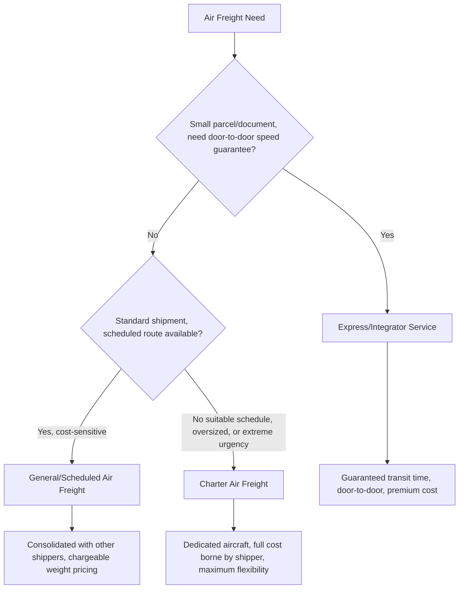

## General, Charter, and Express Air Freight Services

### Overview

Air cargo is delivered through three principal service models — general (scheduled) air freight, chartered aircraft, and express/integrator services — each suited to different combinations of shipment size, urgency, routing flexibility, and cost sensitivity. Understanding these service categories is essential for selecting the right air freight solution for a given shipment profile.

### General (Scheduled) Air Freight

**Key Points**

- **Definition**: cargo booked on regularly scheduled flights — either belly cargo space on passenger aircraft or capacity on scheduled dedicated freighter services — operating on fixed routes and timetables published in advance.
- **Booking mechanism**: typically booked through freight forwarders, who consolidate multiple shippers' cargo and manage airline capacity relationships, though larger shippers may book directly with airline cargo divisions.
- **Documentation**: governed by a standard **Air Waybill (AWB)** — either a Master AWB (issued by the airline to the forwarder) or a House AWB (issued by the forwarder to the individual shipper), mirroring the master/house bill of lading structure in ocean freight.
- **Rate structure**: priced by chargeable weight (the greater of actual weight or volumetric/dimensional weight), often with rate breaks at standard weight thresholds (e.g., +45kg, +100kg, +300kg rates), incentivizing shippers to consolidate to reach favorable pricing tiers.
- **Predictability trade-off**: general air freight offers cost efficiency and routine reliability but is subject to available capacity and schedule — cargo may be "rolled" (bumped to a later flight) if a scheduled flight is oversold, particularly during peak demand periods.

### Charter Air Freight

- **Definition**: an entire aircraft (or a guaranteed block of capacity on one) is chartered exclusively for a specific shipper's cargo, rather than sharing space with other shippers' freight on a scheduled service.
- **Use cases**: extremely time-critical shipments, oversized/outsized cargo that cannot fit standard scheduled aircraft configurations, emergency relief and disaster response logistics, high-value or sensitive cargo requiring dedicated security, and situations where no suitable scheduled service exists for the required route or timing.
- **Routing flexibility**: unlike scheduled service, a charter can fly directly between the specific origin and destination airports the shipper needs, without intermediate stops dictated by a published route network — valuable when no direct scheduled service exists between the required city pair.
- **Cost profile**: substantially more expensive per shipment than scheduled service, since the shipper bears the full cost of the aircraft regardless of how much of its capacity is actually utilized, making charters economical primarily when urgency, cargo characteristics, or the value of the shipment justify the premium.
- **Specialized aircraft matching**: charter arrangements allow matching aircraft type to cargo requirements — for example, chartering an aircraft with a nose-loading door for oversized project cargo components that cannot fit through a standard side cargo door.

### Express/Integrator Services

- **Definition**: door-to-door delivery services operated by integrators (companies combining their own aircraft, ground transport, and sorting hub infrastructure under a single operational umbrella) offering guaranteed transit time commitments (e.g., next-day, two-day international delivery).
- **Key differentiator from general air freight**: integrators control the entire logistics chain — pickup, air transport, customs clearance, and final-mile delivery — rather than handing cargo off between multiple independent parties, enabling tighter transit time guarantees and simplified tracking.
- **Typical shipment profile**: express services are generally optimized for smaller parcels and documents rather than large freight shipments, though integrators increasingly offer freight-scale services for larger time-critical shipments as well.
- **Premium pricing structure**: express services command the highest per-kilogram cost among air freight options, reflecting the guaranteed speed and door-to-door service level, though the pricing model differs from general air freight's chargeable-weight tiers, often incorporating zone-based or destination-specific flat-rate structures.

### Diagram: Service Model Selection Logic

### Diagram: Cost, Speed, and Flexibility Comparison

<svg xmlns="http://www.w3.org/2000/svg" viewBox="0 0 660 300" font-family="sans-serif">
<text x="330" y="25" text-anchor="middle" font-size="16" font-weight="bold">Air Freight Service Models Compared (svg_diagram)</text>
<line x1="80" y1="260" x2="580" y2="260" stroke="#333" stroke-width="1.5" />
<line x1="80" y1="260" x2="80" y2="60" stroke="#333" stroke-width="1.5" />
<text x="330" y="285" text-anchor="middle" font-size="10">Cost per Shipment →</text>
<text x="35" y="160" text-anchor="middle" font-size="10" transform="rotate(-90 35 160)">Routing Flexibility →</text>
<circle cx="180" cy="220" r="10" fill="#0066cc" />
<text x="180" y="245" text-anchor="middle" font-size="10" font-weight="bold">General/Scheduled</text>
<circle cx="330" cy="150" r="10" fill="#cc6600" />
<text x="330" y="135" text-anchor="middle" font-size="10" font-weight="bold">Express/Integrator</text>
<circle cx="500" cy="90" r="10" fill="#009966" />
<text x="500" y="75" text-anchor="middle" font-size="10" font-weight="bold">Charter</text>
</svg>

### Comparative Reference Table

| Factor | General/Scheduled | Charter | Express/Integrator |
| --- | --- | --- | --- |
| Aircraft sharing | Shared with other shippers | Exclusive/dedicated | Integrator's own network |
| Route flexibility | Fixed published routes | Any origin/destination pair | Integrator's hub network |
| Typical cost per kg | Moderate | Highest (full aircraft cost) | High (premium door-to-door) |
| Schedule certainty | Subject to capacity/rolling risk | Guaranteed dedicated departure | Guaranteed transit time SLA |
| Documentation | Master/House AWB | Charter agreement + AWB | Integrator's own waybill/tracking |
| Typical shipment size | Small to large freight | Any size, especially oversized | Parcels, documents, urgent freight |
| Booking party | Forwarder or direct with airline | Directly with charter broker/operator | Directly with integrator |

### Example: Selecting a Service Model

A pharmaceutical company needs to ship 2,000 kg of temperature-sensitive vaccine doses from a manufacturing site with no scheduled cargo service to an emergency distribution point during a public health response, on an extremely tight timeline with no acceptable delay tolerance. Given the combination of an unusual origin airport, extreme urgency, and cold-chain criticality, a **charter** is the appropriate choice — allowing direct routing between the exact required airports without dependency on scheduled flight availability or consolidation risk.

By contrast, a routine monthly shipment of moderate-value electronics components between two major cities with frequent scheduled air cargo service would typically use **general/scheduled air freight** via a forwarder, since cost efficiency matters more than absolute speed and reliable scheduled capacity exists for the route.

A business needing to send urgent legal documents and a small parcel of replacement parts to a client overseas by the next business day would use an **express/integrator service**, valuing the guaranteed door-to-door transit time commitment over cost optimization for the small shipment size involved.

### Conclusion

General, charter, and express air freight services represent distinct points on the trade-off between cost, routing flexibility, and speed guarantee. General/scheduled service offers cost-efficient routine capacity through consolidated booking; charter service provides maximum flexibility and dedicated capacity at premium cost for urgent or unusual shipments; and express/integrator service delivers guaranteed door-to-door transit times through vertically integrated networks, primarily for smaller time-critical shipments. Selecting the appropriate model requires weighing shipment size, urgency, routing requirements, and cost sensitivity — a decision framework that connects directly to the broader mode selection analysis comparing air freight against ocean and multimodal alternatives.

**Related Topics**

- Air Cargo Market Structure
- Air Waybills and Air Cargo Documentation
- Choosing Between Ocean, Air, and Multimodal Transport
- Cold Chain Logistics for Pharmaceutical and Perishable Air Freight
- Break Bulk and Project Cargo (Charter Aircraft for Oversized Cargo)
- Ocean Freight Rate Structures and Surcharges