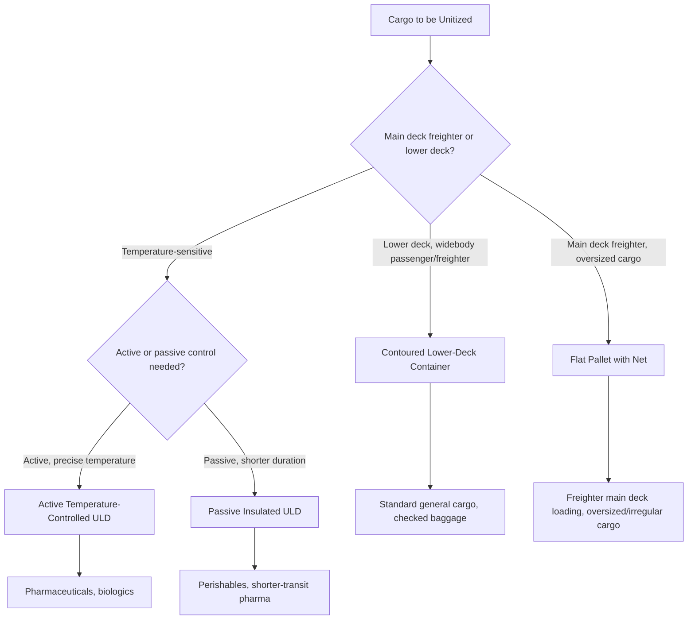

## Unit Load Devices and Aircraft Cargo Configurations

### Overview

Unit Load Devices (ULDs) are standardized containers and pallets used to consolidate air cargo into unitized loads matched to aircraft cargo hold geometry, playing a role analogous to shipping containers in ocean freight but shaped specifically around the curved fuselage constraints of commercial aircraft. Understanding ULD types and aircraft cargo configurations is essential to air freight planning, since incorrect ULD selection can result in cargo that physically cannot be loaded on a given aircraft type.

### Why ULDs Exist

**Key Points**

- **Loading efficiency**: unitizing cargo into standardized containers/pallets before loading dramatically reduces aircraft ground time compared to loading individual pieces of cargo directly into the hold — a critical factor given the high cost of aircraft ground time.
- **Fuselage-shaped design**: unlike ocean containers (uniform rectangular boxes), many ULDs have contoured shapes matching the curvature of an aircraft's fuselage/cargo hold, maximizing usable volume within the aircraft's cylindrical body.
- **IATA standardization**: ULD types, dimensions, and identification codes are standardized by IATA (International Air Transport Association), enabling interoperability across airlines and airports globally.

### ULD Categories

**Containers (AKE, AKH, and similar coded types)**

- Fully enclosed units with rigid or semi-rigid walls, used for both cargo and, in a specific configuration, checked baggage.
- The most common lower-deck container type used on widebody aircraft is contoured to fit the curved lower cargo hold.
- Protects cargo from weather and provides a degree of security during ground handling and transport between aircraft and terminal.

**Pallets (with nets)**

- Flat aluminum platforms onto which cargo is built up and secured using a cargo net rather than enclosed walls.
- Used primarily on the main deck of freighter aircraft or for oversized cargo that doesn't fit standard container dimensions.
- Require careful load building and net securing to withstand the g-forces of flight (particularly the forward restraint required for potential rapid deceleration).

**Specialized ULDs**

- **Temperature-controlled ULDs (active and passive)**: containers with integrated refrigeration/heating systems (active) or high-performance insulation and phase-change materials (passive) for pharmaceutical and perishable cargo requiring cold chain integrity.
- **Lower deck pallets**: smaller pallets designed for the more constrained lower cargo hold space on passenger aircraft.

### Diagram: ULD Types and Aircraft Fit

### Diagram: Aircraft Cargo Hold Cross-Section

<svg xmlns="http://www.w3.org/2000/svg" viewBox="0 0 640 320" font-family="sans-serif">
<text x="320" y="25" text-anchor="middle" font-size="16" font-weight="bold">Widebody Aircraft Cargo Hold Configuration (svg_diagram)</text>
<ellipse cx="320" cy="180" rx="260" ry="120" fill="none" stroke="#333" stroke-width="2" />
<line x1="70" y1="180" x2="570" y2="180" stroke="#999" stroke-width="1" stroke-dasharray="4,3" />
<rect x="100" y="90" width="440" height="70" fill="#0066cc" opacity="0.15" stroke="#0066cc" stroke-width="1.5" />
<text x="320" y="130" text-anchor="middle" font-size="11" font-weight="bold">Main Deck: Passengers (or Freighter Main Deck Cargo)</text>
<path d="M 90 190 Q 320 260 550 190 L 550 220 Q 320 280 90 220 Z" fill="#cc6600" opacity="0.2" stroke="#cc6600" stroke-width="1.5" />
<text x="320" y="215" text-anchor="middle" font-size="10" font-weight="bold">Lower Deck Cargo Hold</text>
<text x="320" y="230" text-anchor="middle" font-size="9">Contoured ULDs (AKE-type containers)</text>
<rect x="150" y="195" width="35" height="20" fill="none" stroke="#cc6600" stroke-width="1" />
<rect x="200" y="197" width="35" height="20" fill="none" stroke="#cc6600" stroke-width="1" />
<rect x="250" y="199" width="35" height="20" fill="none" stroke="#cc6600" stroke-width="1" />
<rect x="380" y="199" width="35" height="20" fill="none" stroke="#cc6600" stroke-width="1" />
<rect x="430" y="197" width="35" height="20" fill="none" stroke="#cc6600" stroke-width="1" />
</svg>

### Aircraft Configuration Types

| Configuration | Description | Cargo Implication |
| --- | --- | --- |
| **Passenger (belly-only cargo)** | Standard passenger aircraft; cargo limited to lower deck holds | Constrained volume, shares space with passenger baggage |
| **Combi** | Passenger aircraft with a portion of the main deck configured for cargo alongside passenger seating | Increased cargo capacity vs. belly-only, less than full freighter |
| **Freighter (full cargo)** | No passenger seating; entire main deck and lower deck configured for cargo | Maximum cargo capacity, main deck accepts pallets and large ULDs |
| **Preighter (converted passenger-to-freighter)** | Passenger aircraft converted to freighter configuration, often for older airframes nearing passenger retirement | Cost-effective added freighter capacity, though often less efficient than purpose-built freighters |

### Weight and Balance Considerations

$$\text{Chargeable Weight} = \max(\text{Actual Gross Weight}, \text{Volumetric Weight})$$

$$\text{Volumetric Weight (kg)} = \frac{\text{Length} \times \text{Width} \times \text{Height (cm)}}{6000}$$

- **Volumetric (dimensional) weight**: air freight pricing accounts for the fact that low-density cargo occupies valuable aircraft volume without corresponding weight, so carriers charge based on whichever is greater between actual weight and calculated volumetric weight — using the standard IATA volumetric divisor of 6000 for air freight (as opposed to different divisors sometimes used in express/parcel contexts).
- **Center of gravity management**: ULD placement within the aircraft must be carefully planned to maintain the aircraft's center of gravity within safe operating limits — a critical flight safety constraint that load planners must satisfy alongside simple volume/weight capacity.
- **ULD build-up weight limits**: each ULD type has a maximum gross weight rating that must not be exceeded regardless of available volume, since exceeding it risks structural failure of the ULD itself during ground handling or flight.

### Ground Handling and ULD Logistics

- **ULD ownership and pooling**: ULDs are typically owned or leased by airlines (or third-party ULD leasing/pooling companies) and must be tracked, repositioned, and returned across the global network — an added logistics layer specific to air cargo not present in ocean container shipping's more consolidated per-carrier fleet.
- **Build-up and break-down**: cargo is "built up" into ULDs at a forwarder's or airline's ground facility before flight, and "broken down" (unloaded from ULDs) at destination — a process requiring trained personnel and proper securing techniques to prevent cargo shift during transit.
- **ULD tracking**: RFID and barcode tracking of ULDs has become increasingly standard, allowing airlines and ground handlers to monitor ULD location and utilization across complex global networks.

### Example: ULD Selection in Practice

A pharmaceutical shipper needs to send temperature-sensitive vaccine doses from Brussels to Nairobi via a combination carrier's widebody passenger aircraft. Given the lower deck cargo hold constraints and the need for cold chain integrity throughout the multi-hour flight, the forwarder selects an **active temperature-controlled ULD** sized to fit the aircraft's lower deck contour, pre-conditioned to the required temperature range before loading, with continuous temperature monitoring throughout transit. This contrasts with a shipment of garment samples on the same route, which would use a standard contoured lower-deck container with no temperature control, optimized purely for volume efficiency and loading speed.

### Conclusion

Unit Load Devices and aircraft cargo configurations form the physical infrastructure layer connecting air cargo planning to actual aircraft capacity — contoured containers and flat pallets each serve distinct roles depending on aircraft deck location and cargo characteristics, while configuration types (belly-only, combi, freighter) determine the total cargo volume available on a given route. Correct ULD selection directly affects loading efficiency, cargo protection, and in the case of temperature-sensitive goods, cold chain integrity, making this a foundational operational consideration underlying the service model and documentation topics covered elsewhere in this chapter.

**Related Topics**

- General, Charter, and Express Air Freight Services
- Air Cargo Market Structure
- Cold Chain Logistics for Pharmaceutical and Perishable Air Freight
- Air Waybills and Air Cargo Documentation
- Container Types and Specifications (Ocean Freight Comparison)
- Volumetric Weight and Chargeable Weight Calculations