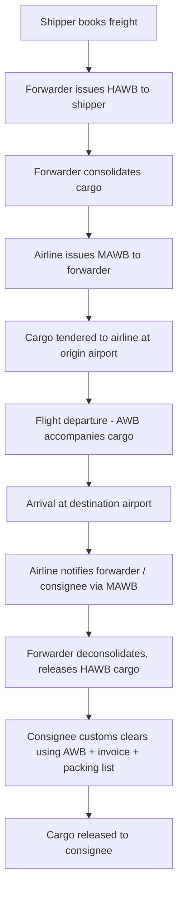

## Air Waybills and Air Freight Documentation

### Overview

The Air Waybill (AWB) is the contract of carriage and primary transport document used in air freight. Unlike an ocean Bill of Lading, an AWB is **not a document of title** and is **not negotiable** — it cannot be issued "to order" or endorsed to transfer ownership of the goods. It serves as a receipt for goods, evidence of the contract of carriage, and a freight bill, but possession of the AWB does not entitle the holder to claim the goods; goods are released to the named consignee.

### Types of Air Waybills

**Master Air Waybill (MAWB)**

- Issued by the airline (or its agent) to the freight forwarder/consolidator
- Covers the entire consolidated shipment as a single unit from origin airport to destination airport
- The forwarder is listed as both shipper (on some formats) and consignee at destination, acting as the intermediary

**House Air Waybill (HAWB)**

- Issued by the freight forwarder to each individual shipper within a consolidation
- Covers that specific shipper's cargo from origin to final consignee
- References the associated MAWB number
- The forwarder acts as the "carrier" from the individual shipper's perspective, even though the actual airline never sees the HAWB

**Direct AWB**

- Issued directly by the airline to the shipper with no consolidation involved
- Used for full shipments booked directly with a carrier, bypassing a forwarder's consolidation service

### AWB Numbering Structure

An AWB number is 11 digits, formatted as `XXX-XXXXXXXX`:

- First 3 digits: airline prefix code (issued by IATA), identifying the carrier (e.g., `020` = Lufthansa, `125` = British Airways, `176` = Emirates)
- Remaining 8 digits: serial number, where the last digit is a check digit calculated as the remainder of the first 7 digits divided by 7

$$\text{check digit} = (\text{first 7 digits}) \bmod 7$$

This check digit allows manual and automated validation of AWB numbers without querying a database.

### Standard AWB Fields and Layout

The IATA-standard AWB format is divided into numbered boxes:

| Box | Field | Content |
| --- | --- | --- |
| 1 | Shipper | Name, address, account number |
| 2 | Consignee | Name, address, account number |
| 3 | Issuing carrier agent | Forwarder/agent name and IATA code |
| 4 | Airport of departure | Origin |
| 5 | Routing | Airline routing, transshipment points |
| 6 | Airport of destination | Final destination |
| 7 | Currency, charges code | Prepaid (PP) or Collect (CC) |
| 8 | Declared value for carriage | For Warsaw/Montreal Convention liability |
| 9 | Declared value for customs | Customs valuation |
| 10 | Amount of insurance | If carrier's insurance is requested |
| 11 | Handling information | Special instructions (e.g., DGR, perishable) |
| 12 | Number of pieces, weight, rate, total | Chargeable weight and charges breakdown |
| 13 | Nature and quantity of goods | Description, dimensions, commodity |
| 14 | Signature of shipper/agent | Execution of contract |
| 15 | Signature of issuing carrier | Confirms acceptance |

### Chargeable Weight Calculation

Air freight is billed on **chargeable weight**, the greater of actual gross weight or volumetric (dimensional) weight.

$$\text{Volumetric Weight (kg)} = \frac{L \times W \times H \text{ (cm)}}{6000}$$

**Example:**

A shipment of 3 boxes, each 60 cm × 50 cm × 40 cm, actual weight 25 kg per box (75 kg total).

- Volume per box: $60 \times 50 \times 40 = 120{,}000\ \text{cm}^3$
- Total volume: $360{,}000\ \text{cm}^3$
- Volumetric weight: $360{,}000 / 6000 = 60\ \text{kg}$
- Chargeable weight: $\max(75, 60) = 75\ \text{kg}$ (actual weight governs here)

If the boxes were instead 80 × 60 × 50 cm each (volume $240{,}000\ \text{cm}^3$ each, $720{,}000\ \text{cm}^3$ total), volumetric weight would be $120\ \text{kg}$, exceeding the 75 kg actual weight, so the shipper would be billed for 120 kg.

Note: some carriers use a 5000 divisor (older IATA standard) or 6000 for general cargo; the divisor should always be confirmed against the specific carrier's tariff, as this varies. [Unverified — divisor conventions differ by carrier and trade lane]

### Freight Charge Terms on the AWB

- **PP (Prepaid)**: Charges paid by shipper at origin
- **CC (Collect)**: Charges paid by consignee at destination
- Additional cost elements typically itemized: Fuel Surcharge (FSC), Security Surcharge (SSC), Airport Terminal Charges, AWB fee, handling fee

### Supporting Air Freight Documentation

**Commercial Invoice**

Details value, currency, Incoterm, parties, and goods description; used for customs valuation.

**Packing List**

Itemizes contents, weights, and dimensions per package; supports customs and cargo handling matching against the AWB.

**Certificate of Origin (CO)**

Certifies the originating country of goods, often required for preferential tariff treatment under trade agreements.

**Dangerous Goods Declaration (DGD)**

Required under IATA Dangerous Goods Regulations (DGR) when shipping hazardous materials by air; must match UN numbers, packing group, and proper shipping name declared.

**Certificate of Insurance**

Evidences cargo insurance coverage, often required when the shipper (not carrier) has arranged insurance separately from Box 10 of the AWB.

**Letter of Instruction (Shipper's Letter of Instruction, SLI)**

Instructs the forwarder on how to prepare the AWB and handle the shipment; common in US export practice, sometimes replacing or supplementing manual data entry.

**Export/Import Customs Declarations**

Country-specific filings (e.g., in the Philippines, the BOC's Single Administrative Document / e2m declarations) required for customs clearance, referencing the AWB number as the transport document.

### Air Waybill Process Flow



### AWB vs. Ocean Bill of Lading — Key Distinctions

| Feature | Air Waybill | Ocean Bill of Lading |
| --- | --- | --- |
| Negotiability | Non-negotiable | Can be negotiable (order B/L) |
| Document of title | No | Yes (for negotiable B/L) |
| Consignee | Named directly; goods released to named party | Can be "to order," transferable by endorsement |
| Issued by | Airline or forwarder, before/at departure | Carrier, typically after loading |
| Speed of transit | Fast (hours to days) | Slow (days to weeks) |
| Use in Letters of Credit | Accepted but banks often require "straight" consignment since no endorsement is possible | Endorsable B/L often preferred for LC flexibility |

### Legal Liability Framework

AWB liability is governed by international conventions depending on the trade lane and treaty ratification:

- **Warsaw Convention (1929)** and its amendments (Hague Protocol 1955)
- **Montreal Convention (1999)** — the modern standard, now ratified by most major trading nations, including the Philippines

Under the Montreal Convention, carrier liability for cargo loss/damage is limited to **19 Special Drawing Rights (SDR) per kilogram** unless a higher value is declared in Box 8 (Declared Value for Carriage) and a supplementary charge is paid. [Inference — SDR liability limits are periodically revised by ICAO; the current figure should be confirmed against the latest ICAO Montreal Convention review]

### Digital Transformation: e-AWB

- IATA's **e-freight** and **e-AWB** initiatives replace the paper AWB with electronic data records under the **Montreal Protocol 4 (MP4)** and **Montreal Convention 1999 (MC99)** legal frameworks
- e-AWB is now the default at many IATA cargo agents' locations under the **IATA Resolution 672** multilateral e-AWB agreement
- Paper AWB is only issued when the origin/destination pair, or the shipment type (e.g., certain dangerous goods, live animals, or Latin American Cargo Agreement countries), does not support e-AWB
- Data transmission standard: **Cargo-XML** and legacy **Cargo-IMP** message formats (e.g., FWB — Freight Waybill message — for AWB data transmission between forwarder and airline systems)

### Practical Example: Reading a Sample AWB Entry



```
AWB No: 176-12345670
Shipper: ABC Exports Corp., Manila, PH
Consignee: XYZ Trading GmbH, Frankfurt, DE
Airport of Departure: MNL (Ninoy Aquino Intl.)
Airport of Destination: FRA (Frankfurt)
Routing: MNL-DXB-FRA (via Emirates)
Pieces: 5
Gross Weight: 320 kg
Chargeable Weight: 350 kg (volumetric governs)
Rate/Charge: PP
Nature of Goods: Electronic components, palletized
```

Here, chargeable weight (350 kg) exceeds gross weight (320 kg), meaning the cargo is low-density/high-volume — the shipper pays based on volumetric weight, not actual weight.

**Related Topics**

- Air Freight Rate Structures (General Cargo Rate, Class Rate, Specific Commodity Rate, ULD rates)
- Unit Load Devices (ULDs) and Consolidation Practices
- IATA Dangerous Goods Regulations (DGR) Classification
- e-Freight and Cargo-XML Messaging Standards
- Montreal Convention 1999 — Carrier Liability Deep Dive
- Customs Clearance Procedures for Air Cargo (Philippine BOC context)
- Incoterms Interaction with Air Freight (FCA vs. CPT vs. CIP)