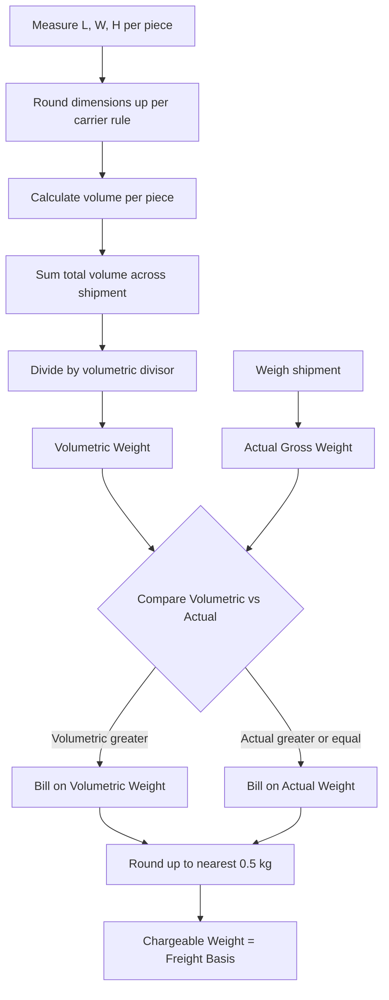

## Chargeable Weight and Volumetric Weight Calculations

### Overview

Air freight pricing is based on **chargeable weight**, not simply actual physical weight. Because aircraft cargo capacity is constrained by both weight and volume (cabin/hold space), carriers bill according to whichever metric — actual gross weight or volumetric (dimensional) weight — yields the higher figure. This prevents low-density, bulky cargo from being underpriced relative to the space it occupies.

### Core Formula

$$\text{Volumetric Weight (kg)} = \frac{L \times W \times H \text{ (cm)}}{\text{Volumetric Divisor}}$$

$$\text{Chargeable Weight} = \max(\text{Actual Gross Weight}, \text{Volumetric Weight})$$

### Volumetric Divisors by Mode and Standard

The divisor converts volume into an equivalent weight and varies by transport mode and the applicable industry standard:

| Standard / Context | Divisor (cm³/kg) | Notes |
| --- | --- | --- |
| IATA international air freight (current standard) | 6000 | Adopted industry-wide since 2007 |
| Older / legacy air freight standard | 5000 | Still used by some carriers or on some trade lanes |
| Express couriers (DHL, FedEx, UPS) | 5000 | Common for parcel/courier shipments |
| Road freight (Europe, general) | 3000–5000 | Varies significantly by carrier |

[Unverified — exact divisor in use should always be confirmed against the specific carrier's current tariff, as courier and regional practices diverge from the IATA air freight standard]

For imperial units (inches, pounds), the equivalent IATA formula is:

$$\text{Volumetric Weight (lb)} = \frac{L \times W \times H \text{ (in)}}{366}$$

### Step-by-Step Calculation Process

1. Measure each package's length, width, and height (round up to the nearest whole cm/in per carrier convention)
2. Calculate volume per package: $V = L \times W \times H$
3. Sum volume across all packages in the shipment (if multiple pieces share one AWB)
4. Divide total volume by the divisor to get volumetric weight
5. Compare volumetric weight against actual gross weight
6. Chargeable weight = the greater of the two, generally rounded up to the nearest 0.5 kg per IATA convention

### Worked Example 1 — Actual Weight Governs

Shipment: 4 boxes, each 40 cm × 30 cm × 30 cm, actual weight 18 kg per box.

- Volume per box: $40 \times 30 \times 30 = 36{,}000\ \text{cm}^3$
- Total volume: $4 \times 36{,}000 = 144{,}000\ \text{cm}^3$
- Volumetric weight: $144{,}000 / 6000 = 24\ \text{kg}$
- Total actual weight: $4 \times 18 = 72\ \text{kg}$
- Chargeable weight: $\max(72, 24) = 72\ \text{kg}$

Dense cargo (e.g., machined metal parts) typically results in actual weight governing.

### Worked Example 2 — Volumetric Weight Governs

Shipment: 10 boxes, each 60 cm × 50 cm × 45 cm, actual weight 8 kg per box.

- Volume per box: $60 \times 50 \times 45 = 135{,}000\ \text{cm}^3$
- Total volume: $10 \times 135{,}000 = 1{,}350{,}000\ \text{cm}^3$
- Volumetric weight: $1{,}350{,}000 / 6000 = 225\ \text{kg}$
- Total actual weight: $10 \times 8 = 80\ \text{kg}$
- Chargeable weight: $\max(80, 225) = 225\ \text{kg}$

Bulky, lightweight cargo (e.g., packaging materials, foam products, garments) typically triggers this outcome, penalizing shippers for low-density packing.

### Worked Example 3 — Mixed Piece Shipment

Shipment with irregular pieces, each measured individually then summed:

| Piece | L (cm) | W (cm) | H (cm) | Volume (cm³) | Actual Wt (kg) |
| --- | --- | --- | --- | --- | --- |
| 1 | 100 | 80 | 60 | 480,000 | 45 |
| 2 | 50 | 50 | 50 | 125,000 | 20 |
| 3 | 70 | 40 | 30 | 84,000 | 15 |

- Total volume: $480{,}000 + 125{,}000 + 84{,}000 = 689{,}000\ \text{cm}^3$
- Volumetric weight: $689{,}000 / 6000 = 114.83\ \text{kg}$, rounded up to $115\ \text{kg}$
- Total actual weight: $45 + 20 + 15 = 80\ \text{kg}$
- Chargeable weight: $\max(80, 115) = 115\ \text{kg}$

### Rounding Conventions

- **Weight**: rounded up to the next 0.5 kg (e.g., 114.1 kg → 114.5 kg)
- **Dimensions**: rounded up to the next whole cm (or 0.5 in for imperial) before calculation, per most carrier tariffs
- These rounding rules compound conservatively in the carrier's favor; shippers should apply the same rounding when pre-calculating freight costs to avoid quote discrepancies

### Density Break-Even Point

There exists a critical density at which actual weight and volumetric weight are equal — useful for shippers optimizing packaging:

$$\text{Break-even density} = \frac{\text{Divisor}}{1{,}000{,}000} \text{ kg/cm}^3 = 167\ \text{kg/m}^3 \text{ (at divisor 6000)}$$

Cargo denser than 167 kg/m³ is billed on actual weight; cargo less dense than that is billed on volumetric weight. This threshold is a key packaging engineering consideration — compressing packaging or using space-efficient materials below this density point directly reduces freight cost.

### Chargeable Weight Decision Flow

### Interaction with Freight Rate Breaks

Chargeable weight also determines which **rate bracket** applies (e.g., -45kg, +45kg, +100kg, +300kg, +500kg rate tiers), since air freight tariffs are tiered — higher chargeable weight bands often have a **lower per-kg rate**. This creates a common optimization scenario:

**Example**: If the -45kg rate is $8.00/kg and the +100kg rate is $5.50/kg, a 95 kg chargeable weight shipment costs $95 \times 8.00 = \$760$, but artificially "topping up" to bill at 100 kg and the +100kg rate costs $100 \times 5.50 = \$550$ — cheaper despite the higher nominal weight. Forwarders and carriers frequently apply this "weight break" optimization automatically when quoting.

### Practical Implications for Documentation

- Chargeable weight is entered in **Box 12** of the Air Waybill, alongside actual gross weight, rate class, and total charges
- Discrepancies between declared dimensions/weight and actual measurements at the airline's cargo terminal can result in **re-weighing and re-rating**, with the shipper billed the corrected amount
- Palletization and consolidation change effective volumetric calculations — forwarders often recalculate volumetric weight after building a **Unit Load Device (ULD)**, since the ULD's own dimensions (not the sum of individual pieces) may become the basis for volume calculation when priced as a ULD Rate rather than a General Cargo Rate

**Related Topics**

- Air Freight Rate Structures (GCR, Class Rate, Specific Commodity Rate, ULD Rates)
- Unit Load Devices (ULDs) and Their Impact on Volumetric Calculations
- Packaging Optimization for Freight Density
- Air Waybills and Air Freight Documentation
- Freight Rate Weight-Break Optimization Strategies
- Courier vs. Air Freight Volumetric Divisor Differences