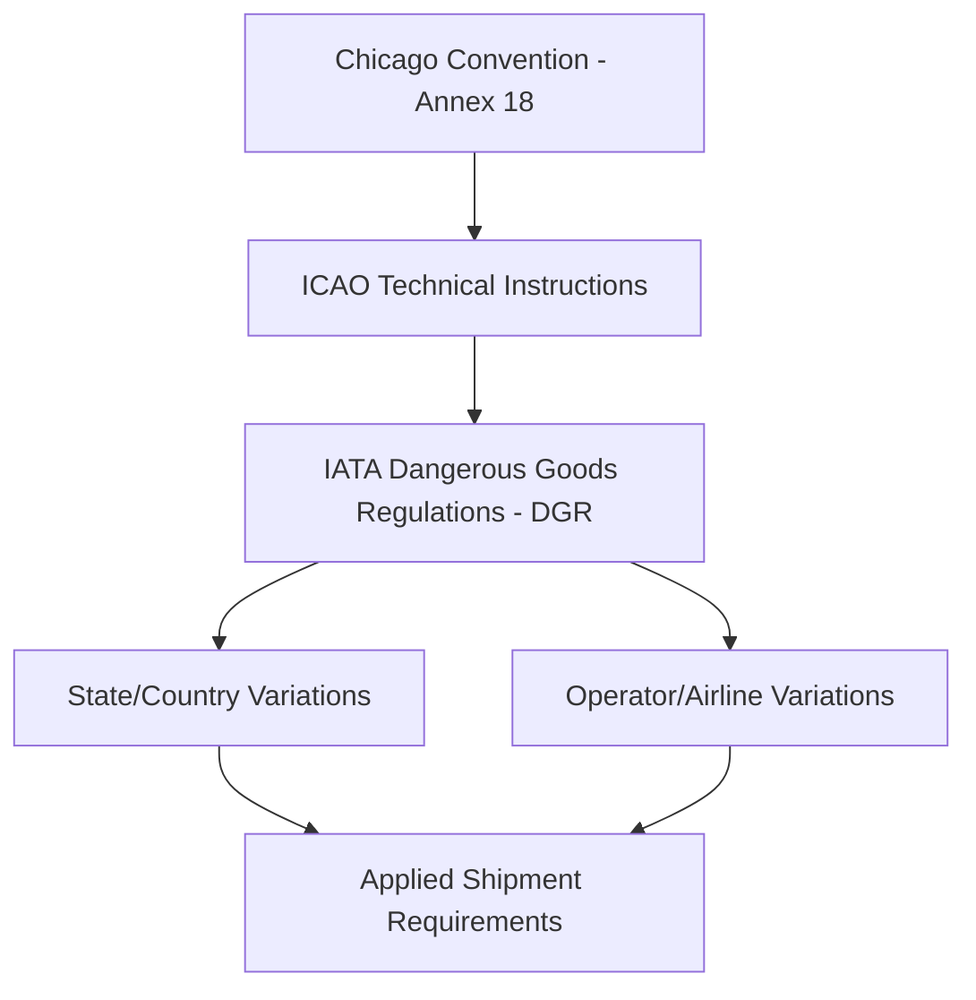
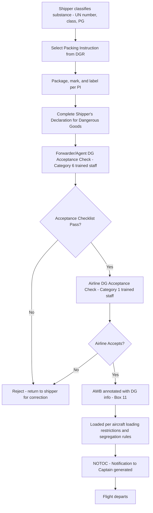

## IATA Regulations and Dangerous Goods Regulations

### Overview

The **International Air Transport Association (IATA)** publishes standards governing commercial air cargo, the most safety-critical of which is the **Dangerous Goods Regulations (DGR)** manual — the global reference for classifying, packaging, marking, labeling, and documenting hazardous materials transported by air. IATA DGR is updated **annually** and builds on the **ICAO Technical Instructions for the Safe Transport of Dangerous Goods by Air**, which are the binding legal instrument under the Chicago Convention; IATA DGR often imposes stricter operator variations on top of the ICAO baseline. [Unverified — always confirm current edition number and effective date against the latest IATA DGR release, as this is revised yearly]

### Regulatory Hierarchy

- **ICAO Technical Instructions**: the legally binding minimum standard, revised every 2 years
- **IATA DGR**: incorporates ICAO rules plus additional restrictions, revised annually, used as the practical industry reference by airlines, forwarders, and shippers
- **State Variations**: country-specific additional restrictions (e.g., stricter rules for lithium batteries in certain jurisdictions)
- **Operator Variations**: individual airline restrictions beyond IATA/ICAO minimums (e.g., an airline refusing to carry a particular dangerous goods class entirely)

### The 9 UN Hazard Classes

| Class | Category | Examples |
| --- | --- | --- |
| 1 | Explosives | Fireworks, ammunition, detonators |
| 2 | Gases | Compressed gas cylinders, aerosols, lighters |
| 3 | Flammable liquids | Paints, solvents, fuels, perfumes |
| 4 | Flammable solids | Matches, self-reactive substances |
| 5 | Oxidizing substances/organic peroxides | Bleaching agents, certain fertilizers |
| 6 | Toxic and infectious substances | Pesticides, clinical/medical waste |
| 7 | Radioactive material | Medical isotopes, industrial radiography sources |
| 8 | Corrosives | Battery acid, industrial cleaning agents |
| 9 | Miscellaneous dangerous goods | Lithium batteries, dry ice, magnetized material, asbestos |

Each class may be further subdivided (e.g., Class 3 divisions by flash point), and each substance is assigned a specific **UN Number** (a 4-digit identifier, e.g., UN3480 for lithium-ion batteries shipped alone) and a **Proper Shipping Name (PSN)**.

### Key Documentation Requirements

**Shipper's Declaration for Dangerous Goods (DGD)**

The core document required for most dangerous goods shipments, containing:

- UN number, proper shipping name, hazard class/division
- Packing group (I = high danger, II = medium, III = low)
- Quantity and type of packaging (inner/outer packaging counts)
- Packing Instruction (PI) number referenced from the DGR
- Emergency contact/response telephone number
- Shipper's certification signature, attesting compliance

**Exceptions to DGD requirement**: certain "excepted quantity" or "limited quantity" shipments, and fully regulated lithium battery shipments packed under specific Section II provisions, may not require a full DGD but still require specific package marking and, in most cases, an Air Waybill notation.

**Air Waybill notation**

Box 11 (Handling Information) on the AWB must reference the presence of dangerous goods and the applicable DGD or exemption code.

**Packing Instructions (PI)**

Each substance/UN number maps to specific Packing Instructions in the DGR specifying:

- Permitted inner/outer packaging combinations
- Maximum quantity per package
- Required cushioning/absorbent materials
- Segregation requirements from incompatible substances

### Marking and Labeling Requirements

Every dangerous goods package must display:

- **UN specification marking** on the packaging itself (certifying the packaging type passed UN performance testing)
- **Proper Shipping Name and UN Number**
- **Hazard Class Labels** (diamond-shaped, class-specific pictograms and colors)
- **Handling labels** where applicable (e.g., "Cargo Aircraft Only," "Orientation arrows" for liquids)
- **Shipper and consignee name/address**

### Lithium Battery Provisions (Class 9) — Special Focus

Lithium batteries are among the most heavily regulated and frequently revised DGR categories due to fire risk:

| Battery Type | Section | Key Provision |
| --- | --- | --- |
| Lithium metal batteries (UN3090) | Varies (I/II/IA/IB) | State of charge and quantity limits per package |
| Lithium-ion batteries (UN3480) | Varies (I/II) | Watt-hour rating limits, state-of-charge restrictions for air transport (often ≤30% SoC for cargo-only shipments per many operator variations) |
| Batteries packed with equipment (UN3091/UN3481) | — | Different packaging thresholds than "batteries alone" |
| Batteries contained in equipment | — | Generally least restrictive category |

[Unverified — specific quantity thresholds, watt-hour limits, and state-of-charge percentages change frequently between DGR editions and should be verified against the current edition before shipment preparation]

Many airlines have banned lithium-ion battery shipments **as cargo on passenger aircraft** entirely following industry safety reviews, restricting them to cargo-only (freighter) aircraft — this is a common **operator variation** rather than a blanket ICAO/IATA prohibition.

### Roles and Training Requirements

IATA DGR mandates **category-specific recurrent training** (renewed every 24 months) for personnel involved in dangerous goods handling:

| Category | Personnel |
| --- | --- |
| 1 | Acceptance staff (airline cargo acceptance) |
| 3 | Shippers/packers preparing dangerous goods for transport |
| 6 | Forwarders/agents accepting dangerous goods from shippers |
| 7 | Security/screening staff |
| 9 | Ground handling staff loading/unloading cargo |
| 10 | Flight crew |

A **Dangerous Goods Training Certificate** must be held by relevant personnel; shipments processed by non-certified personnel are non-compliant regardless of correct paperwork.

### Dangerous Goods Acceptance and Processing Flow

### NOTOC (Notification to Captain)

A mandatory document generated by the airline (not the shipper) listing all dangerous goods loaded on a specific flight, including location in the aircraft hold, for the flight crew's awareness in case of an in-flight emergency. This is distinct from the Shipper's Declaration and generated internally by ground operations/loading control systems.

### Forbidden and Restricted Items

Certain items are **absolutely forbidden** on aircraft under any circumstances (e.g., certain unstable explosives, undeclared infectious substances above containment thresholds), while others are **forbidden unless specifically exempted** by the state of origin/destination or the operator. The DGR maintains a "List of Dangerous Goods" table (DGR Table 4.2) mapping every regulated substance to its specific transport provisions — this table is the master cross-reference used by trained DG personnel.

### Compliance and Penalties

Non-compliance with IATA DGR/ICAO Technical Instructions can result in:

- Criminal and civil penalties under national aviation law (in the Philippines, enforced via CAAP — Civil Aviation Authority of the Philippines — regulations aligned with ICAO Annex 18)
- Airline and forwarder loss of dangerous goods handling certification
- Significant safety risk, as improperly declared dangerous goods have been identified as causal or contributing factors in historical cargo aircraft accidents

### Practical Example

A shipper in Manila wants to export 50 units of lithium-ion battery packs (UN3480, each 20 Wh) via air freight to Singapore.

1. Shipper checks DGR Table 4.2 entry for UN3480 → determines applicable Packing Instruction (e.g., PI965, Section II for smaller quantities)
2. Packs batteries per PI965 Section II limits (state of charge ≤30%, quantity per package limit, non-conductive packaging separation)
3. Marks package with Class 9 lithium battery handling label and UN3480 marking
4. Depending on section, a DGD may not be required for Section II, but the AWB must still be annotated
5. Forwarder's Category 6-trained staff perform acceptance check against IATA DGR checklist
6. Airline confirms it accepts lithium-ion battery cargo on the selected routing (checking operator variations — some airlines restrict this to freighter-only flights)
7. NOTOC generated by airline ground ops prior to departure

**Related Topics**

- Air Waybills and Air Freight Documentation
- Packing Instructions (PI) Deep Dive by Hazard Class
- Lithium Battery Shipping Regulation Updates
- ICAO Technical Instructions vs. IATA DGR Differences
- Dangerous Goods Training Categories and Recurrency Requirements
- Perishable Cargo Regulations (IATA PCR) as a Parallel Framework