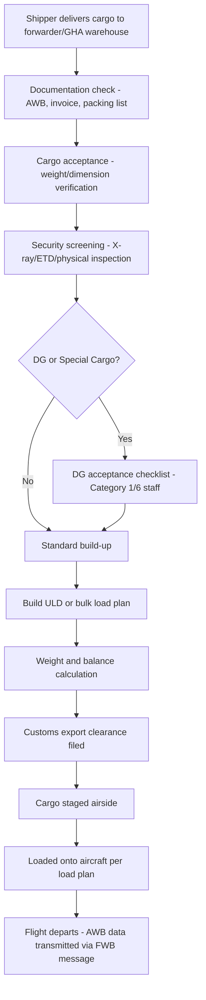
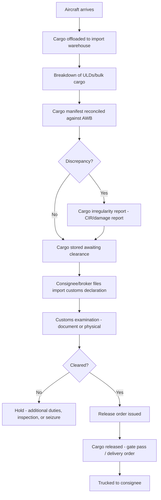

## Airport Cargo Handling and Ground Operations

### Overview

Airport cargo handling encompasses the physical and procedural workflow that moves freight from truck/warehouse to aircraft (export) or aircraft to consignee/customs (import). It involves multiple specialized actors — ground handling agents, cargo terminal operators, customs authorities, and airline ramp operations — coordinating through a mix of physical processes (build-up, break-down, palletization) and data systems (cargo tracking, customs interfaces).

### Key Actors and Responsibilities

| Actor | Role |
| --- | --- |
| Freight Forwarder | Books space, consolidates cargo, prepares HAWB, coordinates trucking to/from airport |
| Ground Handling Agent (GHA) | Physically receives, screens, builds/breaks down cargo; operates warehouse on behalf of airline |
| Airline / Cargo Department | Owns capacity allocation, issues MAWB, sets acceptance criteria |
| Customs Authority | Clears import/export declarations (in PH: Bureau of Customs) |
| Airport Authority | Manages airside/landside infrastructure, security zones |
| Cargo Terminal Operator (CTO) | Operates the cargo warehouse facility, sometimes distinct from GHA |

### Export Cargo Flow

### Import Cargo Flow

### Security Screening Requirements

Under ICAO Annex 17 and national civil aviation security programs, all cargo destined for passenger aircraft must be screened before loading, using one or more methods:

- **X-ray screening**: standard for most general cargo
- **Explosive Trace Detection (ETD)**: swab-based chemical detection
- **Physical search**: manual inspection, often for cargo unsuitable for X-ray (dense metal, large machinery)
- **Known Consignor / Regulated Agent status**: pre-vetted supply chain participants whose cargo may qualify for reduced screening, provided chain-of-custody integrity is maintained from point of origin

Cargo that cannot be adequately screened (e.g., due to density or size) may be restricted to **cargo-only (freighter) aircraft**, which in many jurisdictions have less stringent screening mandates than passenger aircraft, reflecting different risk profiles.

### Unit Load Devices (ULDs)

ULDs are standardized containers/pallets used to consolidate cargo for efficient aircraft loading:

| Type | Description | Common Use |
| --- | --- | --- |
| Containers (AKE, AKH, etc.) | Enclosed, contoured to fit fuselage | Widebody lower-deck cargo |
| Pallets (PMC, PAG) | Flat base, cargo secured with netting | Main-deck freighter loads, bulky items |
| Igloos | Pallet with rigid contoured cover | Weather-protected palletized cargo |

Each ULD type has an IATA-standard code identifying its base size and contour, which ground handlers and load planners use to determine aircraft compatibility and maximum loadable weight.

### Weight and Balance / Load Planning

Ground operations must calculate the aircraft's **center of gravity (CG)** based on cargo distribution, in coordination with passenger and fuel loading:

- Load planners position ULDs/bulk cargo across cargo holds to keep CG within certified limits
- A **Loading Instruction Report (LIR)** or equivalent is issued to ramp staff specifying exact ULD/bulk cargo positions
- Miscalculated weight and balance is a critical safety issue; ground handling systems typically use dedicated Weight & Balance software integrated with the airline's Departure Control System (DCS)

### Cargo Irregularities and Claims

Common irregularities documented at handling stages:

- **Short-shipped**: cargo listed on AWB but not actually loaded
- **Over-carried**: cargo loaded but destined for wrong station, continuing past intended destination
- **Damaged cargo**: physical damage discovered at breakdown
- **Pilferage**: missing contents from an otherwise intact package

These are documented via a **Cargo Irregularity Report (CIR)** or airline-specific equivalent, which becomes the basis for insurance claims and carrier liability assessment under the Montreal Convention framework.

### Cool Chain and Special Cargo Handling

Certain cargo categories require dedicated ground infrastructure:

- **Perishables (PER/PEF codes)**: cold storage facilities, temperature-controlled ULDs, time-critical transfer windows
- **Live Animals (AVI)**: IATA Live Animals Regulations (LAR) compliant handling, specific holding areas
- **Valuable Cargo (VAL)**: secure, access-controlled storage areas, chain-of-custody documentation
- **Human Remains (HUM)**: dedicated handling protocols, often requiring priority processing

### Customs Interface at the Airport

In the Philippine context, airport cargo handling interfaces with Bureau of Customs systems (e.g., **e2m Customs** for electronic-to-mobile declarations) for both export clearance (before airside staging) and import clearance (before consignee release). Cargo cannot legally move past customs-controlled zones without an approved declaration or applicable exemption, creating a hard dependency between the physical ground handling flow and the digital customs filing process.

### Data and Messaging Standards

Ground operations coordinate through standardized IATA cargo messaging (Cargo-IMP legacy format or modern Cargo-XML), including:

- **FWB** (Freight Waybill) — transmits AWB data electronically
- **FHL** (House Waybill) — transmits HAWB details for consolidated shipments
- **FSU** (Status Update) — cargo status milestones (e.g., RCS = Received from Shipper, DEP = Departed, ARR = Arrived, DLV = Delivered)
- **CHAMP/Cargo-IMP** networks historically carried these messages between forwarders, GHAs, and airlines; increasingly replaced by API-based integrations

### Practical Example

A forwarder tenders 200 kg of general cargo (5 pieces) for export from Manila to Hong Kong:

1. Cargo arrives at GHA warehouse with commercial invoice, packing list, and pre-alerted HAWB/MAWB numbers
2. GHA verifies piece count and weight against documents — discrepancy triggers a query back to the forwarder before acceptance
3. X-ray screening clears all 5 pieces (no DG declared)
4. Cargo built into a single AKE container alongside other shippers' consolidated freight
5. Load control assigns the AKE to a specific hold position per the day's load plan
6. FWB message transmitted to the destination station ahead of flight arrival
7. On arrival in Hong Kong, GHA breaks down the AKE, reconciles piece count, and stages cargo for consignee's broker to file import clearance

**Related Topics**

- Air Waybills and Air Freight Documentation
- Unit Load Devices (ULD) Types and Compatibility
- IATA Regulations and Dangerous Goods Handling
- Cargo Security Screening Standards (ICAO Annex 17)
- Cool Chain Logistics for Perishable Air Cargo
- Customs Clearance Procedures for Air Cargo (Philippine BOC e2m)