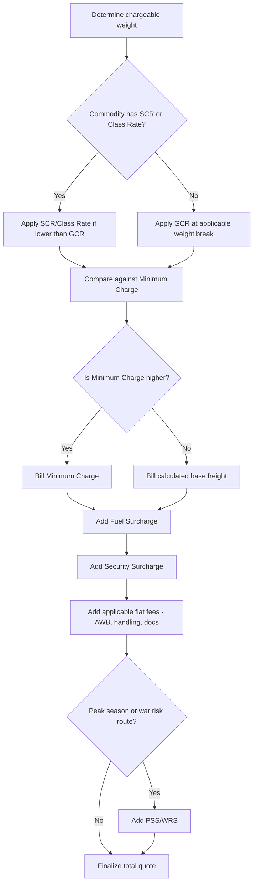

## Air Freight Pricing and Surcharges

### Overview

Air freight pricing is built from a **base freight rate** applied to chargeable weight, layered with a series of **surcharges** that reflect cost pass-throughs (fuel, security), regulatory fees, and service-specific charges. Understanding the full rate structure is essential to accurately quoting or auditing an air freight invoice, since the base rate alone often understates total cost by 20–40%. [Inference — surcharge proportion of total cost varies significantly by trade lane, fuel price environment, and carrier]

### Base Rate Structures

| Rate Type | Code | Description |
| --- | --- | --- |
| General Cargo Rate | GCR | Standard rate applied to ordinary cargo, tiered by weight breaks |
| Specific Commodity Rate | SCR | Discounted rate for specific, high-volume, low-risk commodities (e.g., certain textiles, machinery parts) between defined city pairs |
| Class Rate | Class Rate | Percentage surcharge or discount off GCR applied to specific commodity classes (e.g., +50% for live animals, -20% for newspapers/periodicals in some tariffs) |
| ULD Rate | BUC (Bulk Unitization Charge) | Flat rate per ULD type regardless of exact weight/volume, up to a pivot weight, with excess billed per kg above pivot |
| Minimum Charge | M | Minimum amount charged regardless of actual chargeable weight, protecting the carrier's per-shipment handling cost floor |

### Weight Break Rate Tiers (GCR Example)

GCR tariffs are structured in weight brackets, with per-kg rate typically decreasing as weight increases:

| Weight Break | Example Rate (USD/kg) |
| --- | --- |
| Minimum (M) | Flat fee, e.g., $45 |
| -45 kg (N) | $8.50/kg |
| +45 kg (Q45) | $6.20/kg |
| +100 kg (Q100) | $5.10/kg |
| +300 kg (Q300) | $4.30/kg |
| +500 kg (Q500) | $3.80/kg |

As covered in chargeable weight calculations, shippers/forwarders often "round up" to the next weight break if doing so produces a lower total charge — a standard rating optimization applied at quotation stage.

### Common Surcharges

| Surcharge | Code | Basis |
| --- | --- | --- |
| Fuel Surcharge | FSC | Per-kg charge tied to jet fuel price indices, adjusted periodically (monthly/biweekly) by carriers |
| Security Surcharge | SSC / SCC | Per-kg charge covering mandated cargo security screening costs |
| War Risk Surcharge | WRS | Applied on specific routes with elevated geopolitical/insurance risk |
| Peak Season Surcharge | PSS | Applied during high-demand periods (e.g., pre-holiday shipping season) reflecting capacity scarcity |
| AWB Fee | AWB | Flat administrative fee per Air Waybill issued |
| Handling Fee | THC (Terminal Handling Charge) / Handling | Covers ground handling agent's warehouse and cargo processing costs |
| Dangerous Goods Fee | DG Fee | Additional charge for DG acceptance checks, special handling, segregation |
| Screening Fee | X-ray/ETD fee | Covers mandated security screening cost, sometimes bundled into SSC |
| Documentation Fee | DOC | Covers paperwork processing (customs docs, certificates) |
| Charges Collect Fee | CCF | Applied when freight is billed Collect (CC) rather than Prepaid (PP), covering the carrier's/agent's collection risk and effort |

### Anatomy of a Total Air Freight Quote

$$\text{Total Freight Cost} = (\text{Chargeable Weight} \times \text{Base Rate}) + \sum(\text{Surcharges})$$

**Worked Example:**

Shipment: Chargeable weight 250 kg, Manila (MNL) to Los Angeles (LAX)

| Line Item | Calculation | Amount (USD) |
| --- | --- | --- |
| Base Freight (Q100 rate) | 250 kg × $5.10/kg | $1,275.00 |
| Fuel Surcharge | 250 kg × $0.85/kg | $212.50 |
| Security Surcharge | 250 kg × $0.15/kg | $37.50 |
| AWB Fee | Flat | $25.00 |
| Handling Fee | Flat | $40.00 |
| Documentation Fee | Flat | $15.00 |
| **Total** |  | **$1,605.00** |

Here, surcharges and fees add roughly 21% on top of the base freight line — illustrating why quoting only the "base rate" substantially understates actual shipment cost.

### Pricing Flow and Rate Selection Logic

### Prepaid vs. Collect and Its Pricing Implications

- **Prepaid (PP)**: Shipper pays all charges at origin; simpler reconciliation, no collection risk to the carrier
- **Collect (CC)**: Consignee pays at destination; carriers/agents often apply a **Charges Collect Fee** to offset credit and collection risk, and some destination countries restrict or disallow Collect terms for certain shipment types

The choice interacts directly with the shipment's Incoterm — under **EXW** or **FCA**, the buyer/consignee typically arranges and pays freight (favoring Collect), while under **CPT, CIP, CFR, CIF** the seller/shipper prepays freight to the named destination (favoring Prepaid).

### Rate Volatility Factors

- **Fuel price indices**: FSC is typically re-published on a recurring cycle (e.g., monthly) tracking jet fuel benchmark prices such as Platts Jet Fuel indices [Unverified — specific index and update cycle vary by carrier and should be confirmed against the carrier's current fuel surcharge policy]
- **Capacity constraints**: belly-hold capacity (cargo carried in passenger aircraft) fluctuates with passenger flight schedules; freighter-heavy routes are less exposed to this volatility
- **Seasonal demand**: e-commerce peak season (Q4), perishable harvest seasons, and industry-specific demand spikes (e.g., semiconductor shipment cycles) drive PSS application
- **Currency adjustment factors (CAF)**: on some trade lanes, a currency surcharge is applied to offset exchange rate volatility between the rate's quoted currency and local settlement currency

### Rate Quotation Documentation

Freight quotes are typically issued as a **rate sheet** or **tariff filing**, referencing:

- Origin–destination city pair
- Commodity description/class if applicable
- Validity period (rates are frequently time-bound, e.g., valid for 30 days)
- Applicable weight breaks and per-kg rates
- Separately itemized surcharges, noting which are subject to change without notice (typically FSC/SSC) versus fixed for the quote's validity period

### Practical Considerations for Freight Audit

When auditing an air freight invoice against a quote, the exact validation sequence checks:

1. Chargeable weight recalculation (verify against actual AWB Box 12 entry)
2. Correct weight break applied (was optimization opportunity missed or misapplied?)
3. Fuel/security surcharge rate matches the carrier's published rate for the invoice date (not the quote date — these are often time-variant)
4. No duplicate or unauthorized flat fees added
5. Currency conversion rate applied correctly if invoice currency differs from quoted currency

**Related Topics**

- Chargeable Weight and Volumetric Weight Calculations
- Air Waybills and Air Freight Documentation
- Incoterms Interaction with Freight Payment Terms (EXW, FCA, CPT, CIP, CFR, CIF)
- Freight Rate Weight-Break Optimization Strategies
- Fuel Surcharge Index Mechanics and Carrier Tariff Filing
- Freight Audit and Invoice Reconciliation Practices