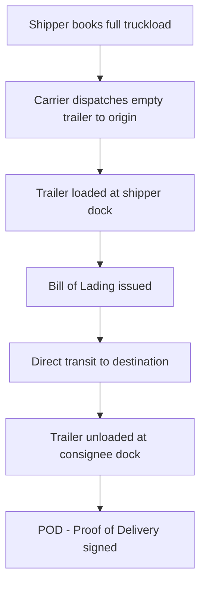
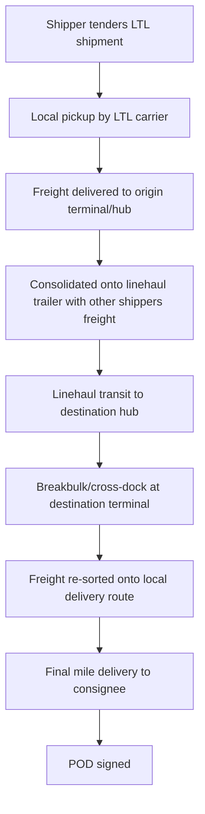

## Full Truckload and Less Than Truckload Freight

### Overview

Road freight is fundamentally divided into two service models based on how trailer capacity is utilized: **Full Truckload (FTL)**, where a single shipper's cargo occupies an entire trailer, and **Less Than Truckload (LTL)**, where multiple shippers' freight shares trailer space, consolidated and routed through a hub-and-spoke network. The choice between them drives cost structure, transit time, handling risk, and documentation requirements.

### Core Comparison

| Attribute | FTL | LTL |
| --- | --- | --- |
| Trailer usage | Single shipper, full trailer | Multiple shippers, shared trailer |
| Typical shipment size | 10,000–45,000 lbs / full pallet count (e.g., 24-26 pallets) | 100–15,000 lbs / 1-6 pallets typically |
| Pricing basis | Flat rate per truck/mile | Per-hundredweight (CWT) with freight class and weight breaks |
| Handling | Loaded once, unloaded once (direct) | Multiple touch points (hub transfers, cross-docking) |
| Transit time | Faster, direct point-to-point | Slower, due to consolidation/deconsolidation stops |
| Damage risk | Lower (single handling) | Higher (multiple handling, freight compatibility issues) |
| Documentation | Single Bill of Lading | Bill of Lading + freight classification (NMFC in the US) |

### FTL Operating Model

FTL is priced as a function of distance, equipment type, and market capacity conditions (spot rate vs. contract rate), independent of the exact weight/volume as long as it doesn't exceed legal trailer limits.

### LTL Operating Model (Hub-and-Spoke)

Each hub transfer point is a **touch point** — a physical handling event that increases both transit time and damage/loss risk relative to FTL's single load/unload cycle.

### LTL Freight Classification (NMFC System)

In LTL pricing (particularly in the US market, though the underlying principles generalize), freight is assigned a **National Motor Freight Classification (NMFC)** class from 50 to 500, based on four factors:

| Factor | Description |
| --- | --- |
| Density | Weight per cubic foot — lower density generally means higher class/cost |
| Stowability | How easily freight combines with other freight in the trailer (hazmat, odd shapes reduce stowability) |
| Handling | Ease/difficulty of handling (fragile, oversized items increase handling class) |
| Liability | Risk of damage, theft, or damaging other freight (value, perishability, hazmat) |

Lower class numbers (e.g., Class 50) indicate dense, easily-handled, low-liability freight (e.g., steel) and are cheaper to ship; higher class numbers (e.g., Class 500) indicate low-density, high-liability freight (e.g., empty foam containers) and cost more per unit weight. [Unverified — NMFC classification is a US-specific system; other regions use analogous but distinct freight classification schemes, and the applicable system should be confirmed by trade lane]

### Density Calculation for LTL Classification

$$\text{Density (lb/ft}^3\text{)} = \frac{\text{Weight (lb)}}{\text{Volume (ft}^3\text{)}}$$

**Example:** A pallet weighing 400 lbs measuring 48" × 40" × 60":

- Volume in cubic feet: $\frac{48 \times 40 \times 60}{1728} = 66.7\ \text{ft}^3$
- Density: $400 / 66.7 = 6.0\ \text{lb/ft}^3$

A density of 6 lb/ft³ typically falls in a mid-to-high NMFC class range, illustrating how low-density shipments (bulky, light) are penalized similarly to the volumetric weight logic in air freight, though the underlying formula and thresholds differ entirely.

### Pricing Structures

**FTL Pricing**

- **Spot rate**: negotiated per shipment based on current market capacity/demand (lane-specific, e.g., $/mile)
- **Contract rate**: pre-negotiated rate over a fixed period (e.g., annual), providing price stability but potentially less favorable than spot rates during soft market periods
- Common cost components: linehaul rate × distance, fuel surcharge (indexed to diesel price, typically via DOE weekly index or equivalent), accessorials (detention, layover, tolls)

**LTL Pricing**

- Base rate per hundredweight (CWT) at the applicable NMFC class, tiered by weight breaks (similar tiering logic to air freight GCR, though independently calculated)
- **Minimum charge** applies regardless of actual weight
- **Freight-all-kinds (FAK)** agreements: negotiated blanket classification simplifying multi-commodity shippers' rating (avoids classifying every individual SKU)
- Accessorial charges layered on top (see below)

### Common Accessorial Charges (Both Modes, LTL-Heavy)

| Accessorial | Description |
| --- | --- |
| Liftgate | Required when dock-level loading/unloading is unavailable |
| Residential Delivery | Non-commercial address delivery surcharge |
| Inside Delivery | Delivery beyond the truck/dock, into a building |
| Detention | Charge for excess time the truck is held beyond free loading/unloading time |
| Redelivery | Charge for failed first delivery attempt requiring a second trip |
| Limited Access | Delivery to constrained locations (military bases, construction sites, schools) |
| Reweigh/Reclassification | Charge applied when carrier's terminal scale finds actual weight/class differs from the shipper's declaration |

### Break-Even Point Between FTL and LTL

Shippers typically evaluate FTL vs. LTL based on shipment volume relative to trailer capacity:

- Below roughly 6 pallets / 5,000–7,500 lbs: LTL is usually more cost-effective (paying only for space used)
- Above roughly 10-12+ pallets: FTL often becomes cheaper due to LTL's per-CWT rate structure and accessorial accumulation
- The middle range (6-10 pallets) is where **volume LTL** or **partial truckload (PTL)** — an intermediate service booking partial trailer space at negotiated flat rates rather than class-based CWT rates — often becomes the optimal choice

[Inference — exact break-even thresholds vary significantly by lane, carrier network density, and current market rate conditions; these figures are illustrative industry rules of thumb, not fixed formulas]

### Documentation

**Bill of Lading (BOL)**

- The foundational contract of carriage and receipt document for both FTL and LTL
- For LTL, the BOL must include NMFC class, weight, and commodity description per line item, since this directly drives billing
- Serves as the basis for **freight classification disputes** — a carrier's terminal may reweigh/reclass a shipment against the declared BOL details, resulting in a **rate adjustment**

**Proof of Delivery (POD)**

- Signed confirmation of delivery, used for billing finalization and claims resolution
- For LTL, POD often includes exception notations (e.g., "1 carton damaged") critical for subsequent claims

**Freight Bill**

- The invoice issued by the carrier based on final BOL weight/class (post-reweigh if applicable) plus accessorials

### Claims and Liability

- FTL: liability typically governed by the carrier's tariff or contract terms, often capped per released value unless higher value is declared
- LTL: liability similarly capped, often on a **per-pound basis** tied to the freight's NMFC class — lower-class (denser, cheaper) freight often has a lower per-pound liability cap than higher-class freight, reflecting typical value density assumptions
- Multiple-touch handling in LTL statistically increases exposure to damage claims relative to FTL's single-handling model

### Practical Example

A shipper needs to move 8 pallets (3,200 lbs total, mixed general merchandise, estimated density 9 lb/ft³, NMFC Class 100) from a Manila-area warehouse to a distributor 400 km away.

**LTL evaluation:**

- CWT rate at Class 100, weight break for 3,200 lbs: e.g., $18/CWT → $32 \times 18 = \$576$ base
- Add liftgate accessorial ($75) if consignee lacks a loading dock
- Total estimated: ~$650, with transit via at least one hub transfer point, typically 2-4 days depending on network density

**FTL evaluation:**

- Full 40-ft trailer FTL rate for the lane: e.g., $1,200 flat regardless of the 8-pallet partial load
- Faster, single-touch delivery, likely same-day or next-day
- Only cost-justified if the shipper has additional freight to consolidate into the same truck, or values speed/damage-risk reduction enough to absorb the higher per-shipment cost

This comparison illustrates the core FTL/LTL tradeoff: LTL is more cost-efficient for partial loads but incurs consolidation-related time and handling risk, while FTL trades higher fixed cost for speed and handling simplicity.

**Related Topics**

- NMFC Freight Classification System in Depth
- Bill of Lading Types and Legal Function in Road Freight
- Partial Truckload (PTL) as an Intermediate Service Model
- Freight Accessorial Charges and Detention/Demurrage Management
- Road Freight Documentation Requirements (Philippine LTO/LTFRB Context)
- Cross-Docking and Hub-and-Spoke Network Design