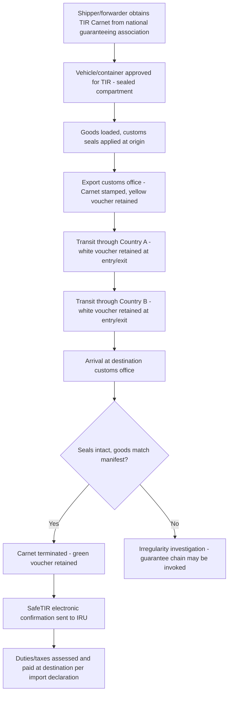

## Cross Border Trucking and the TIR Carnet System

### Overview

Cross-border road freight requires navigating customs transit procedures at each national boundary the shipment crosses. The **TIR (Transports Internationaux Routiers / International Road Transports) Carnet system** is the primary international customs transit framework enabling goods to move across multiple countries under a single customs document, with duties and taxes suspended until arrival at the final destination customs office — eliminating the need for cargo inspection and duty deposit at every border crossing.

### The TIR Convention Framework

The TIR system operates under the **UN TIR Convention (1975)**, administered globally by the **International Road Transport Union (IRU)** under UN Economic Commission for Europe (UNECE) oversight. It is most heavily used across Europe, Central Asia, the Middle East, and North Africa; applicability outside these traditional corridors (including Southeast Asia) is limited, since a country must be a Contracting Party to the Convention and have an authorized national guaranteeing association for the system to function on that route. [Unverified — TIR Convention accession status changes periodically; current country participation should be verified against the UNECE/IRU official contracting parties list, particularly for ASEAN corridors]

### Core Principles of TIR

| Principle | Mechanism |
| --- | --- |
| Mutual recognition of customs controls | Goods sealed at origin are not re-inspected at transit borders, only at final destination |
| Duty/tax suspension | No duties/taxes paid at transit; only assessed and settled at final destination |
| Guarantee chain | National guaranteeing associations (authorized by IRU) provide a financial guarantee covering potential duty/tax liability if goods are diverted or lost in transit |
| Sealed load compartment | Vehicle/container must be TIR-approved, meaning its cargo space is customs-sealable and tamper-evident |
| Single transit document | The TIR Carnet itself replaces multiple national transit documents across the entire journey |

### The TIR Carnet Document

The Carnet is a standardized booklet containing:

- **Yellow pages/vouchers**: retained by customs at export
- **White pages/vouchers**: retained by customs at each transit country entry/exit
- **Green pages/vouchers**: retained by customs at final destination (termination)
- A manifest listing the goods, consignor, consignee, and vehicle/container details
- A unique **TIR Carnet number**, tracked centrally via the IRU's **SafeTIR** system, which electronically confirms carnet termination to guaranteeing associations and customs authorities

### TIR Transit Process Flow

### Vehicle and Container Approval Requirements

Only vehicles or containers meeting specific construction standards qualify for TIR use, certified via a **Certificate of Approval**:

- Load compartment must be constructed so that no goods can be removed/added without visible damage or seal tampering
- No concealed spaces where goods could be hidden to evade customs control
- Approval typically valid for a fixed period (e.g., 2 years for road vehicles) or until structural modification, requiring periodic re-certification

### Guarantee Chain and Financial Liability

The guarantee chain is the financial backbone of the system:

- Each country's **national guaranteeing association** (typically affiliated with the national road transport/trucking industry body) guarantees payment of duties/taxes up to a maximum amount per Carnet if goods go missing or are fraudulently diverted during transit
- The maximum guaranteed amount is set by international agreement (periodically revised) and represents the ceiling of exposure per Carnet, not per shipment value
- If an irregularity occurs, customs authorities can claim against the guaranteeing chain, which then pursues recovery from the Carnet holder (the transport operator)
- This chain of guarantees is what allows customs authorities to trust the TIR framework without physically re-inspecting sealed cargo at every border

### TIR vs. Standard Bilateral/National Transit Procedures

| Attribute | TIR Carnet | Bilateral/National Transit |
| --- | --- | --- |
| Document scope | Single document, multiple countries | Separate transit documents per country pair |
| Inspection frequency | Only at origin and final destination | Potentially at every border crossing |
| Duty/tax handling | Suspended until final destination | May require deposit/bond at each transit country |
| Applicability | Only among TIR Convention Contracting Parties with active guaranteeing chain | Universal, but requires bilateral/multilateral transit agreements or ad hoc arrangements |
| Administrative burden | Lower once vehicle/carnet obtained | Higher, cumulative across each border |

### ASEAN and Regional Alternatives

Since TIR coverage is not universal, other regions rely on region-specific customs transit frameworks. In Southeast Asia, cross-border road freight (e.g., overland corridors connecting the Greater Mekong Subregion) has historically relied on:

- **ASEAN Framework Agreement on the Facilitation of Goods in Transit (AFAFGIT)**: the ASEAN-specific analog to the TIR concept, establishing common transit documentation and guarantee principles among ASEAN member states
- **Bilateral cross-border transport agreements**: negotiated country-pair arrangements (e.g., between Thailand-Laos-Vietnam-China corridors) governing vehicle permits, cargo transit, and driver documentation

[Unverified — AFAFGIT implementation maturity and operational uptake varies significantly by member state and corridor; current operational status should be confirmed against ASEAN Secretariat or national customs sources for the specific corridor in question]

Since the Philippines is an archipelago without land borders to other countries, direct cross-border trucking under TIR or AFAFGIT does not apply to Philippine domestic logistics; cross-border road freight relevance for Philippine-based operations arises primarily in the context of understanding client/partner operations in mainland Southeast Asia or documentation for goods that transit overland before reaching a Philippine port/airport.

### Required Supporting Documentation for Cross-Border Trucking (General)

Beyond the TIR Carnet or regional equivalent, cross-border trucking typically requires:

- **Vehicle registration and cross-border permit** for the specific countries transited
- **Driver's international driving permit** or country-specific cross-border driver authorization
- **Commercial invoice and packing list** for the cargo
- **Certificate of Origin**, particularly relevant for preferential tariff treatment under regional trade agreements
- **Insurance documentation** valid across all transited jurisdictions (cross-border motor insurance / "green card" equivalent systems in some regions)
- **Import/export customs declarations** at origin and final destination, even though transit countries themselves are bypassed under TIR/AFAFGIT

### Common Irregularities and Risk Points

- **Seal tampering or breakage**: triggers mandatory inspection and potential guarantee chain invocation
- **Manifest discrepancies**: quantity or description mismatches discovered at destination trigger investigation and possible penalty
- **Carnet expiration**: Carnets have a validity period; expiry mid-transit creates significant customs complications
- **Route deviation**: transiting through a non-declared country or route not covered by the guaranteeing chain can void TIR coverage for that leg

### Practical Example

A trucking company moves industrial equipment from a manufacturing hub in Country A, through transit Country B, to a final buyer in Country C, all TIR Convention Contracting Parties.

1. Forwarder obtains a TIR Carnet from Country A's national guaranteeing association
2. Truck (TIR-approved trailer) loaded, customs seals applied at Country A's export customs office; yellow voucher retained
3. At the Country A/B border, white voucher retained on exit; another at Country B entry — no cargo inspection since seals are intact
4. Truck transits Country B without further customs stops (assuming no scheduled control points), white voucher retained at Country B/C border
5. Arrival at Country C's destination customs office: seals verified intact, manifest matches physical goods
6. Green voucher retained, Carnet terminated, SafeTIR confirmation transmitted to IRU
7. Country C customs then processes the standard import declaration and duty assessment, entirely separate from the TIR transit mechanism itself

**Related Topics**

- Bill of Lading and CMR Consignment Note for International Road Freight
- ASEAN Framework Agreement on the Facilitation of Goods in Transit (AFAFGIT)
- Customs Bonded Warehousing and Duty Suspension Regimes
- Certificate of Origin and Preferential Trade Agreements
- Cross-Border Cargo Insurance Frameworks
- Full Truckload and Less Than Truckload Freight