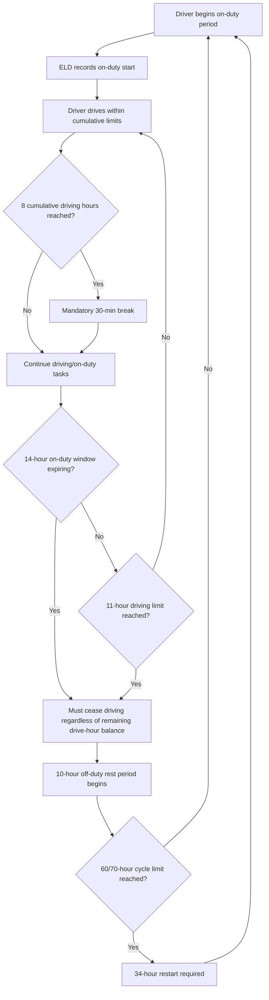
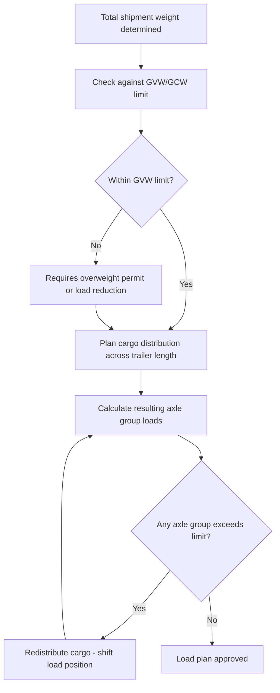

## Trucking Regulations, Hours of Service, and Weight Limits

### Overview

Trucking operations are governed by two intertwined regulatory domains: **Hours of Service (HOS)** rules, which limit driver working/driving time to reduce fatigue-related accident risk, and **weight and dimension limits**, which govern how much cargo a vehicle may legally carry to protect road infrastructure and vehicle stability. Both frameworks vary significantly by jurisdiction, so a shipper or logistics planner must apply the specific rules of the country/region in which the trucking movement occurs.

### Hours of Service (HOS) — General Principles

Most jurisdictions structure HOS around similar underlying concepts, though specific numeric limits differ:

| Concept | Purpose |
| --- | --- |
| Maximum daily driving time | Caps continuous/cumulative driving hours per 24-hour period |
| Maximum on-duty time | Caps total working time (driving + non-driving duties like loading) per day |
| Mandatory rest period | Minimum consecutive off-duty hours required between shifts |
| Cumulative limits (weekly/cycle) | Caps total driving/on-duty hours over a rolling multi-day period, forcing an extended reset break |
| Break requirements | Mandatory short break after a threshold of continuous driving (e.g., 30 minutes after 8 hours) |

### US FMCSA HOS Framework (Illustrative Reference Model)

Widely referenced internationally as a mature regulatory model, the US Federal Motor Carrier Safety Administration (FMCSA) HOS rules for property-carrying drivers include:

- **11-hour driving limit**: after 10 consecutive hours off duty
- **14-hour on-duty window**: driving not permitted after the 14th consecutive hour after coming on duty
- **30-minute break**: required after 8 cumulative hours of driving
- **60/70-hour limit**: maximum on-duty hours over 7/8 consecutive days depending on carrier operation type
- **34-hour restart**: a 34-consecutive-hour off-duty period resets the 60/70-hour cumulative clock

[Unverified — specific numeric HOS limits are subject to periodic regulatory amendment; current effective values should be confirmed against the FMCSA's current regulations if applying this framework operationally]

### Electronic Logging Devices (ELD)

Modern HOS compliance is increasingly enforced via **Electronic Logging Devices**, which automatically record:

- Engine on/off times
- Vehicle motion status (driving vs. stationary)
- Duty status changes (on-duty, off-duty, sleeper berth, driving) as manually logged by the driver
- Location data at duty status change points

ELDs replaced paper logbooks in many jurisdictions specifically to reduce falsification of driving hours, a historically significant compliance gap under manual logging systems.

### HOS Compliance Flow

### Weight Limit Frameworks

Weight regulation typically operates on multiple simultaneous constraints:

| Limit Type | Description |
| --- | --- |
| Gross Vehicle Weight (GVW) / Gross Vehicle Weight Rating (GVWR) | Maximum total weight of vehicle + cargo + fuel + driver |
| Gross Combination Weight (GCW) | Maximum total weight for tractor-trailer combinations |
| Axle weight limits | Maximum weight permitted per axle or axle group, preventing concentrated road damage |
| Bridge formula | A mathematical formula limiting weight based on axle spacing, preventing excessive weight concentration over short spans |

### The Bridge Formula Concept

Many jurisdictions apply a "bridge formula" restricting gross weight as a function of the distance between axle groups, not just total axle count. The general principle:

$$W = 500 \left( \frac{LN}{N-1} + 12N + 36 \right)$$

Where $W$ = maximum weight (lb), $L$ = distance between outer axles (ft), $N$ = number of axles in the group. This is the US Federal Bridge Formula structure, illustrative of the general logic used by many bridge-formula-based systems: longer axle spacing distributes weight over a greater span, permitting higher total weight without exceeding per-span structural load limits. [Unverified — exact formula constants and structure are jurisdiction-specific; this is the US federal example and should not be assumed to apply outside that regulatory context]

### Illustrative Weight Limits by Configuration (Reference Ranges)

| Configuration | Typical Max GVW Range |
| --- | --- |
| Single unit truck (2-axle) | ~15,000–20,000 kg |
| Single unit truck (3-axle) | ~23,000–26,000 kg |
| Tractor + semi-trailer (5-axle) | ~36,000–44,000 kg |
| Tractor + semi-trailer (6-axle) | ~40,000–48,000 kg |

[Unverified — these are broadly illustrative reference ranges only; actual legal limits vary substantially by country and even by specific road classification within a country, and must be confirmed against the applicable national/local regulation, such as the Philippines' LTFRB/DPWH vehicle weight and dimension regulations, before operational use]

### Overweight Permits and Enforcement

- Shipments exceeding standard legal weight limits typically require an **overweight/oversize permit**, issued by the relevant road authority, often specifying permitted routes, time-of-day restrictions, and required escort vehicles for significantly oversized loads
- Enforcement occurs via **weigh stations** (fixed or portable scales) positioned along major routes, where vehicles may be required to stop for weight verification
- Penalties for non-compliance typically scale with the degree of overweight violation and can include fines, cargo offloading requirements, or vehicle impoundment in serious cases

### Weight Distribution and Axle Loading

Beyond total GVW, cargo must be distributed within the vehicle/trailer to keep individual axle loads within limits:

Improper weight distribution — even within total GVW limits — can result in individual axle overloads, which are independently enforceable violations distinct from gross weight violations.

### Driver Qualification and Vehicle Compliance (Related Regulatory Layer)

Alongside HOS and weight rules, trucking regulation typically also encompasses:

- **Commercial driver licensing** requirements specific to vehicle class/weight category
- **Vehicle roadworthiness inspections** (periodic mandatory safety inspections)
- **Insurance requirements** specific to commercial freight operations
- **Hazmat endorsements** for drivers transporting dangerous goods by road, analogous in purpose to the air freight DG training categories but under separate road-specific regulatory regimes

### Philippine Context Notes

For Philippine domestic trucking operations, the relevant regulatory bodies include the **Department of Public Works and Highways (DPWH)** for road/bridge weight limits and the **Land Transportation Franchising and Regulatory Board (LTFRB)** / **Land Transportation Office (LTO)** for vehicle registration, driver licensing, and franchise compliance. [Unverified — specific current numeric weight limits and HOS-equivalent driver duty regulations for the Philippines should be verified directly against current DPWH/LTFRB/LTO issuances, as this reference material has drawn primarily on internationally common frameworks such as the US FMCSA model for illustrative structure]

### Practical Example

A logistics planner is scheduling a 14-hour driving route (under a jurisdiction using an 11-hour driving limit / 14-hour on-duty window model) with a 32,000 kg gross combination weight shipment on a 5-axle configuration.

**HOS check:**

- Route requires 14 hours of driving — exceeds the 11-hour driving limit
- Planner must schedule a mandatory rest break and split the route across two duty periods, or assign a relay/team driver arrangement to complete the route within one continuous on-duty window

**Weight check:**

- 32,000 kg GCW is within a typical 5-axle tractor-semitrailer's legal range (~36,000–44,000 kg illustrative), so no overweight permit is anticipated — but axle-by-axle distribution must still be verified against individual axle group limits, since a legal total weight can still produce an illegal axle overload if cargo is positioned too far toward one end of the trailer

**Related Topics**

- Full Truckload and Less Than Truckload Freight
- Cross Border Trucking and the TIR Carnet System
- Overweight and Oversize Permit Processes
- Commercial Vehicle Driver Qualification and Hazmat Endorsements
- Bridge Formula and Axle Load Engineering Principles
- Philippine DPWH/LTFRB Trucking Regulatory Framework