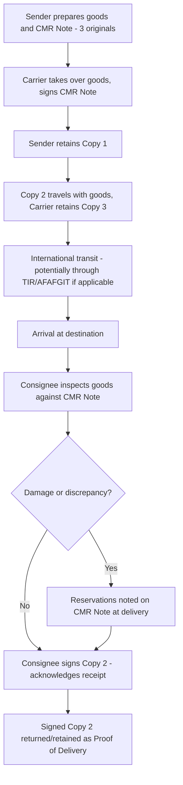

## Road Freight Documentation and the CMR Consignment Note

### Overview

International road freight relies on the **CMR Consignment Note** (from the French *Convention relative au contrat de transport international de Marchandises par Route*) as its primary contract of carriage document, analogous in function to the Air Waybill in air freight or the Bill of Lading in ocean freight. The CMR Convention (1956, with a 1978 Protocol) governs the rights, obligations, and liability of parties in international road carriage of goods, and is in force across Europe, parts of Asia, the Middle East, and North Africa among Contracting Parties to the Convention.

### Legal Status and Applicability

- The **CMR Convention** applies automatically to any contract for the international carriage of goods by road **when at least the place of taking over the goods and the place of delivery are in two different countries**, at least one of which is a Contracting Party — the parties do not need to explicitly opt into CMR for it to apply
- It does **not** apply to purely domestic road transport (moving goods within a single country), which instead falls under that country's national road freight/civil code framework
- As with the TIR Carnet system, CMR applicability is geographically bounded by Convention membership; jurisdictions outside the traditional European/Central Asian/Middle Eastern CMR sphere typically rely on other national or bilateral documentation frameworks for road freight contracts of carriage. [Unverified — current CMR Contracting Party list should be verified against the UNECE treaty status registry, as accession changes periodically]

### The CMR Note vs. Other Transport Documents

| Attribute | CMR Note | Air Waybill | Ocean Bill of Lading |
| --- | --- | --- | --- |
| Governing convention | CMR Convention (1956/1978 Protocol) | Montreal/Warsaw Convention | Hague-Visby/Hamburg/Rotterdam Rules |
| Negotiability | Non-negotiable | Non-negotiable | Can be negotiable |
| Document of title | No | No | Yes (if negotiable) |
| Copies issued | 3 originals (min.) | 3 originals (standard) | Varies, often 3 originals |
| Mode | Road | Air | Sea |

### CMR Note Structure and Required Fields

A CMR Consignment Note is typically prepared in at least **three original copies** (one for sender, one accompanying the goods to the consignee, one retained by the carrier), containing:

| Field Group | Content |
| --- | --- |
| Parties | Sender, carrier, consignee names and addresses |
| Place and date | Place/date of taking over the goods, place designated for delivery |
| Goods description | Nature of goods, packaging method, number of packages, marks/numbers |
| Weight/quantity | Gross weight or otherwise expressed quantity |
| Carriage charges | Charges relating to carriage, and who bears them (sender or consignee) |
| Instructions | Customs and other formalities instructions, special agreements (e.g., prohibition on transshipment) |
| Documents attached | List of documents handed to the carrier (invoices, certificates, permits) |

### CMR Process Flow

### Carrier Liability Under CMR

CMR establishes a liability regime broadly analogous in structure to the air and sea conventions, but with road-specific characteristics:

- The carrier is liable for **total or partial loss of goods, or damage occurring between the time of taking over and delivery**, as well as for delay
- Liability is **presumed** — the burden falls on the carrier to prove one of the specific exempting circumstances defined in the Convention (e.g., inherent vice of the goods, insufficient packing by the sender, force majeure-type events specific to the Convention's wording) rather than on the claimant to prove carrier fault
- Compensation for loss/damage is **capped per kilogram of gross weight** of the goods lost/damaged, using a Special Drawing Rights (SDR)-based unit of account, similar in structural concept to the Montreal Convention's per-kg cap in air freight, though the specific numeric SDR/kg figure differs from the air freight convention's rate [Unverified — the current CMR liability cap per kg should be confirmed against the Convention text/protocol currently in force, as protocol revisions have adjusted this figure historically]
- **Higher liability** can be declared by the sender (with carrier agreement and likely a supplementary charge), similar in concept to the "declared value for carriage" mechanism in air freight AWBs
- The right to claim against the carrier is time-barred after a **limitation period** (commonly one year, extendable to three years in cases of willful misconduct or equivalent default), requiring claimants to act within the Convention's prescribed window

### Reservations and Claims Process

If goods arrive damaged or with a quantity discrepancy, the consignee's actions at delivery are procedurally significant under CMR:

- **Apparent damage/loss**: reservations should be noted on the CMR Note **at the time of delivery**, or the goods are presumed (rebuttably) to have been delivered in the condition described in the Note
- **Non-apparent damage**: written notice to the carrier is generally required within a short period after delivery (commonly within 7 days, excluding non-working days) to preserve the claim, since damage not apparent at the time of unloading is otherwise harder to attribute definitively to the carriage period

This procedural discipline mirrors the general cargo claims principle across transport modes: **prompt, documented notation of exceptions at the point of handover is what preserves recourse**, whether that's a CMR reservation, an air freight Cargo Irregularity Report, or an LTL Proof of Delivery exception notation.

### CMR's Interaction with Customs Transit Systems

The CMR Note is the **contract of carriage document** and is distinct from (though it travels alongside) customs transit documents such as the **TIR Carnet**. A single international road shipment may simultaneously carry:

- A **CMR Note** — governing the commercial/legal relationship between sender, carrier, and consignee
- A **TIR Carnet** (or regional equivalent like AFAFGIT documentation) — governing customs transit and duty suspension across borders
- **Commercial invoice, packing list, certificate of origin** — supporting the underlying trade transaction and customs valuation

These serve distinct legal functions and are not substitutes for one another; a shipment moving under TIR still requires a CMR Note (or equivalent contract of carriage document) to establish the sender-carrier-consignee relationship and liability framework.

### Sender's Obligations and Warranties

Under CMR, the sender bears responsibility for the accuracy of information provided for the Note, and is liable to the carrier for:

- Inaccurate or incomplete information in the consignment note
- Insufficient or defective packing (unless the defect was apparent to the carrier and the carrier accepted the goods without reservation)
- Failure to provide required documents/information for customs or other formalities

This allocation of responsibility parallels the shipper's certification obligations in air freight's Shipper's Declaration for Dangerous Goods, or the shipper's warranty of accuracy on an Air Waybill/Bill of Lading — across all modes, the party tendering the goods bears primary responsibility for the accuracy of the declared information.

### Successive Carriers Under CMR

CMR includes specific provisions for shipments involving **successive road carriers** (e.g., a shipment handed off between multiple trucking companies across a multi-leg international route under a single CMR Note): each successive carrier becomes party to the contract of carriage under the terms of the original consignment note, and is jointly liable for the performance of the entire carriage, with the right to have his particular participation noted against the note upon taking over the goods.

### Practical Example

A shipment of machinery parts moves by road from a manufacturer in Country A to a buyer in Country C, transiting Country B, all CMR Convention Contracting Parties.

1. Sender in Country A prepares the CMR Note (3 originals) describing 10 crates, gross weight 4,200 kg, along with commercial invoice and certificate of origin as attached documents
2. Carrier takes over the goods, signs the CMR Note, retains Copy 3; Copy 1 stays with sender, Copy 2 travels with the shipment
3. Shipment transits Country B under a TIR Carnet (separate document, handling customs transit) while the CMR Note continues to govern the carriage contract itself
4. On arrival in Country C, consignee inspects the crates and finds one crate with visible external damage — this is noted as a reservation directly on the CMR Note (Copy 2) before signing for receipt
5. The noted reservation preserves the consignee's right to claim against the carrier for that crate's damage, since the presumption of "delivered as described" is rebutted by the recorded reservation
6. Claim is filed within the CMR's limitation period, referencing the CMR Note number, the recorded reservation, and supporting documentation (commercial invoice value, damage assessment)

**Related Topics**

- Cross Border Trucking and the TIR Carnet System
- Full Truckload and Less Than Truckload Freight
- Air Waybills and Air Freight Documentation (Cross-Modal Comparison)
- Cargo Claims and Liability Frameworks Across Transport Modes
- Certificate of Origin and Trade Documentation Requirements
- Trucking Regulations, Hours of Service, and Weight Limits