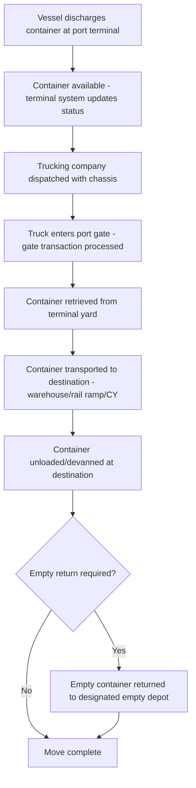
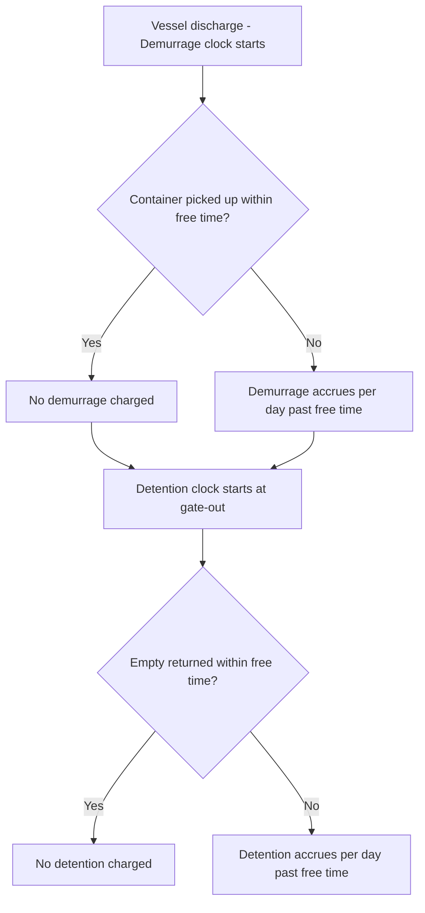
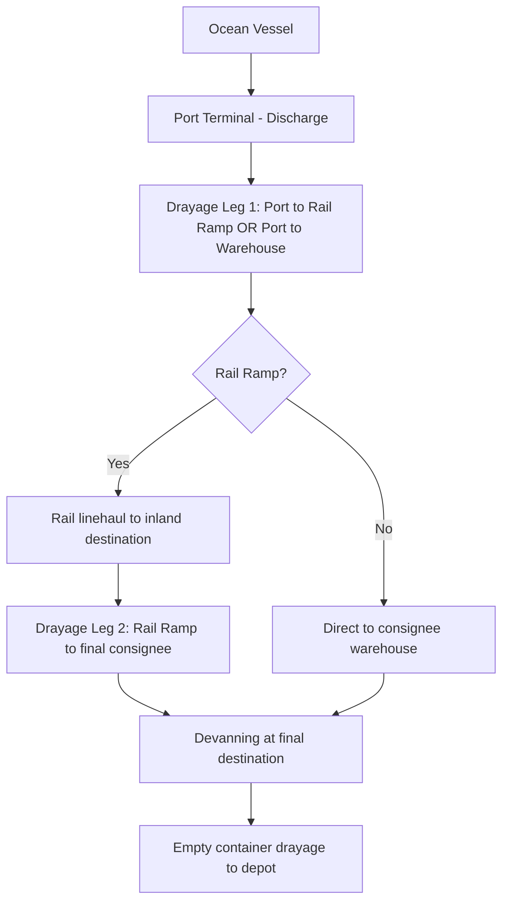

## Drayage and Port Trucking Operations

### Overview

**Drayage** refers to the short-distance movement of containerized or bulk freight, typically between a port/rail terminal and a nearby warehouse, distribution center, or intermodal facility. It is the critical "first mile" or "last mile" connector linking ocean/rail transport to the broader road freight network, and is characterized by high operational complexity relative to its short distances, driven by terminal scheduling, container chassis logistics, and demurrage/detention time pressure.

### Types of Drayage Moves

| Type | Description |
| --- | --- |
| Pier/Port Drayage | Container moved directly from marine terminal to a nearby destination (warehouse, rail ramp) |
| Inter-carrier Drayage | Container moved between two different carriers' facilities (e.g., ocean carrier terminal to a rail intermodal ramp) |
| Intra-carrier Drayage | Container moved between two facilities of the same carrier network |
| Expedited/Hot Drayage | Priority movement, often to avoid demurrage charges or meet a tight delivery window |
| Shuttle Drayage | Container moved to an off-dock storage yard when the port terminal itself has no space, pending final delivery |

### Core Drayage Process Flow

### Key Terminology

| Term | Meaning |
| --- | --- |
| Chassis | The wheeled frame a container sits on for road transport; may be carrier-owned, pooled, or trucker-owned |
| Gate transaction | The administrative/physical process of a truck entering/exiting a terminal, verified against booking/release data |
| Container Yard (CY) | Storage area at the port or an off-dock facility where containers await pickup or delivery |
| Empty depot | Facility where empty containers are returned after devanning, or picked up for export loading |
| Devanning / Stripping | Unloading cargo from a container at the destination facility |
| Live load / Live unload | Truck waits at the facility while the container is loaded/unloaded, versus dropping/picking a pre-loaded container ("drop and hook") |
| Drop and Hook | Truck drops an empty/loaded container/chassis and immediately picks up a different pre-positioned one, minimizing dwell time |

### Demurrage vs. Detention — Critical Cost Drivers

Drayage operations are financially shaped by two distinct time-based charges that are frequently confused:

| Charge | Assessed By | Triggered When |
| --- | --- | --- |
| **Demurrage** | Ocean carrier or terminal | Container remains within the port terminal beyond the free time allowance before pickup |
| **Detention** | Ocean carrier | Container (once picked up) is not returned (empty) to the designated location within the free time allowance |

$$\text{Demurrage Period}: \text{Discharge} \rightarrow \text{Gate-out (pickup)}$$

$$\text{Detention Period}: \text{Gate-out (pickup)} \rightarrow \text{Empty return}$$

Both charges accrue **per day** (or per calendar day beyond free time) and can escalate quickly, often becoming a larger cost factor than the drayage move itself if terminal congestion or destination unloading delays occur. Effective drayage planning is substantially about managing these two clocks in parallel with the physical move.

### Free Time and Cost Escalation

### Chassis Availability and Split Operations

A significant operational complexity in many drayage markets is **chassis pool management**:

- In some markets, ocean carriers or chassis pool operators provide chassis; in others, the trucking company must supply its own
- **Chassis splits** occur when a container and an available chassis are not co-located, requiring an additional move leg to unite them before the drayage move can proceed — a common source of delay and cost escalation
- Chassis shortages during periods of port congestion can bottleneck drayage capacity independent of trucking capacity itself

### Terminal Appointment Systems

Modern port terminals typically require **appointment scheduling** for truck gate access, to manage yard congestion and gate throughput:

- Truckers/brokers book appointment windows via the terminal's online system, specifying container number, transaction type (import pickup, export drop, empty return)
- Missed or unavailable appointments directly extend dwell time, increasing demurrage/detention exposure
- **Dual transactions** (combining an import pickup with an export drop or empty return in a single gate visit) improve efficiency and are often incentivized by terminal operators through appointment system design

### Documentation for Drayage Moves

| Document | Purpose |
| --- | --- |
| Delivery Order (DO) | Issued by the ocean carrier/agent authorizing release of a specific container to a named trucking company |
| Terminal gate pass / Interchange Report | Records container/chassis condition and custody transfer at gate in/out |
| Bill of Lading (or its release reference) | Underlying ocean transport document; DO issuance is typically contingent on BL surrender or telex release confirmation |
| Customs release confirmation | Import customs clearance must typically be confirmed before the terminal will release the container for drayage pickup |

The **Delivery Order** is the pivotal document in the drayage chain — without it, the terminal will not release the container to the trucker regardless of physical availability, since it is the mechanism confirming the ocean carrier has authorized release (contingent on freight charges settled, customs cleared, and BL requirements satisfied).

### Interchange Reports and Damage Documentation

At both pickup (gate-in at origin location) and drop-off, an **Equipment Interchange Report (EIR)** documents the container/chassis condition, creating a custody record:

- Pre-existing damage noted at pickup protects the trucker from liability for damage that occurred before they took custody
- Damage discovered at drop-off but not noted at pickup can create liability disputes between trucker, terminal, and carrier
- This functions analogously to the reservation/exception-noting principle seen in CMR consignment notes and LTL proof-of-delivery — documented condition at each custody transfer point is what allocates liability

### Drayage in the Broader Intermodal Chain

For long inland movements, drayage typically bookends a **rail intermodal leg** — drayage moves the container the short distance to/from the rail ramp, while rail handles the long-haul portion, combining rail's cost efficiency over distance with drayage's flexibility for the first/last mile where rail infrastructure doesn't reach.

### Cost Structure

Drayage pricing typically reflects:

- **Base rate per move**, often zone-based (distance tiers from the terminal) rather than precise mileage
- **Chassis fee**, if the trucker must rent/use a pooled chassis
- **Fuel surcharge**, similar in concept to other road/air freight fuel surcharges, indexed to diesel price
- **Accessorials**: overweight container handling, hazmat container handling, live load/unload waiting time (per-hour charges beyond free waiting time), weekend/holiday gate fees
- **Pass-through demurrage/detention**, if incurred due to circumstances outside the immediate control of the party ultimately billed (subject to negotiation over which party bears responsibility — trucker delay vs. terminal congestion vs. consignee unloading delay)

### Practical Example

An importer's container discharges at a port terminal on Day 1, with 5 free days of demurrage allowed and 4 free days of detention.

1. Customs clearance completes on Day 2; Delivery Order issued by the carrier's agent
2. Trucking company books a terminal appointment for Day 4 pickup (within the 5-day demurrage free time)
3. Container picked up Day 4 — demurrage clock stops at zero charges (picked up within free time)
4. Detention clock starts at Day 4 gate-out
5. Container delivered to consignee's warehouse Day 4 (live unload scheduled same day), devanned, and returned empty to the depot Day 5 — within the 4-day detention free time, so no detention charges accrue
6. Total drayage cost: base rate + chassis fee + fuel surcharge only, with zero demurrage/detention — the outcome achieved by aligning the appointment booking and live-unload scheduling tightly against both free-time windows

**Related Topics**

- Demurrage and Detention Management Strategies
- Container Yard and Terminal Appointment Systems
- Rail Intermodal Transport and Ramp Operations
- Bill of Lading Release Mechanisms (Original BL, Telex Release, Sea Waybill)
- Full Truckload and Less Than Truckload Freight
- Customs Clearance Procedures Impacting Cargo Release Timing