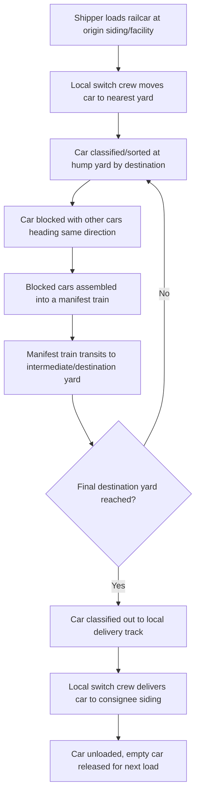
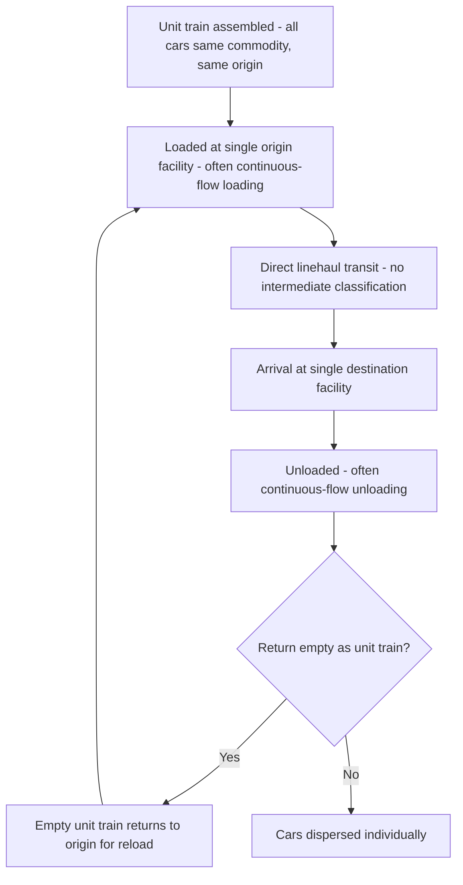

## Carload and Unit Train Operations

### Overview

Rail freight service models range across a spectrum of consolidation, from individual **carload** shipments moved through a classification network, to fully dedicated **unit trains** carrying a single commodity between two fixed points with no intermediate switching. Understanding this spectrum is central to evaluating rail's cost, speed, and volume tradeoffs relative to road and other modes.

### The Rail Service Spectrum

| Service Type | Description | Typical Use Case |
| --- | --- | --- |
| Carload (CL) | Single or few railcars moved via classification yards, mixed with other shippers' cars | General manufactured goods, chemicals, moderate volumes |
| Manifest/Way Freight | Individual cars/small blocks combined into mixed-commodity trains, sorted en route | Diverse cargo not filling a dedicated train |
| Unit Train | Entire train (typically 100+ cars) of a single commodity, single origin, single destination, no intermediate classification | Coal, grain, crude oil, intermodal containers at scale |
| Shuttle Train | A specialized unit train operating as a continuous loop between fixed origin/destination, optimized for rapid loading/unloading turnaround | High-volume grain, coal on dedicated corridors |

### Carload Operations and Classification Yards

Carload shipments move through a **hump yard / classification yard** network, analogous in concept to LTL's hub-and-spoke model but on rail infrastructure:

Each classification yard pass adds dwell time — a carload shipment moving through multiple yards before reaching its destination can accumulate significant transit time relative to the direct-route distance, similar in principle to how LTL's multiple hub transfers add time relative to FTL's single-touch model.

### Unit Train Operations

Unit trains bypass the classification process entirely:

Because unit trains never enter a classification yard, they avoid the dwell time, switching costs, and complexity of the carload network — the tradeoff is that unit train service is only economical when volume at a single origin-destination pair justifies dedicating 100+ cars exclusively to that flow.

### Economic Comparison

| Factor | Carload | Unit Train |
| --- | --- | --- |
| Minimum volume threshold | Low (single car) | High (100+ cars, often requiring dedicated loading/unloading infrastructure) |
| Per-ton-mile cost | Higher (yard handling overhead) | Lower (no classification cost, efficient equipment utilization) |
| Transit time | Variable, often slower (yard dwell) | Faster, more predictable (no yard dwell) |
| Equipment utilization | Lower (cars often idle during classification) | Higher (continuous cycling between fixed points) |
| Infrastructure requirement | Standard siding sufficient | Often requires unit-train-capable loading/unloading facility (loop track, high-speed loadout) |
| Typical commodities | Diverse manufactured goods, mixed chemicals, machinery | Coal, grain, crude oil, aggregates, large-volume intermodal |

### Car Cycle Time and Asset Utilization

A key operational metric for both carload and unit train service is **car cycle time** — the total time from empty car spotting, through loading, transit, unloading, and empty return, back to the next load:

$$\text{Cars Required} = \frac{\text{Annual Volume (tons)} \times \text{Cycle Time (days)}}{\text{Car Capacity (tons)} \times 365}$$

Unit trains are specifically engineered to minimize cycle time — dedicated loop tracks, high-speed continuous loading systems (e.g., loading a unit coal train without stopping, via a slow-moving conveyor loadout), and priority routing all compress the cycle, maximizing the number of loads a fixed car fleet can complete annually. Carload service, moving through variable-dwell classification yards, has inherently less predictable and generally longer cycle times.

### Documentation

**Rail Waybill / Bill of Lading**

The rail industry's contract of carriage and shipping document, functionally analogous to the AWB (air) or CMR Note (road), specifying shipper, consignee, commodity, car initials/numbers, routing, and rate authority reference.

**Switch List**

An operational document used by yard crews to sequence which cars are pulled, classified, or delivered during a given yard operation — internal to the railroad's operations rather than shipper-facing.

**Unit Train Contract / Service Agreement**

Because unit train service typically involves dedicated equipment and guaranteed volume commitments, it is often governed by a negotiated multi-year service contract between the shipper and railroad specifying volume commitments, car supply guarantees, and rate structure — distinct from the more transactional, tariff-based pricing common to individual carload movements.

### Car Ownership and Types

| Ownership Model | Description |
| --- | --- |
| Railroad-owned cars | Provided by the carrier as part of standard service |
| Shipper-owned/leased cars | Shipper owns or leases specialized cars (e.g., covered hoppers for grain, tank cars for chemicals), often required for unit train programs to guarantee equipment availability and specification |
| Private car fleets (third-party lessors) | Leasing companies provide specialized railcars to shippers under lease agreements, common for tank cars and specialized hoppers |

Common car types relevant to carload/unit train operations include **boxcars** (general merchandise), **covered hoppers** (grain, cement, plastics pellets), **open hoppers/gondolas** (coal, aggregates), **tank cars** (liquid/gas chemicals, petroleum products), and **well cars/intermodal flatcars** (containers, trailers).

### Demurrage in Rail Context

Similar in concept to port drayage demurrage, rail carriers assess **car demurrage** when a shipper/consignee holds a railcar beyond the allotted free time for loading or unloading at their facility:

- Free time is typically specified in hours or days per car
- Demurrage escalates per day beyond free time, incentivizing prompt loading/unloading
- Unit train operations are particularly sensitive to demurrage exposure at scale, since 100+ cars held even briefly beyond free time can generate substantial aggregate charges — this is a primary driver behind investment in high-speed continuous loadout/unloadout infrastructure for unit train shippers

### Interchange Between Railroads

When a shipment moves across multiple railroads' networks (common in carload service crossing different carriers' territories), an **interchange** occurs at a junction point where custody of the car transfers from one railroad to another:

- Interchange agreements and per-diem car-hire arrangements govern compensation between railroads for use of each other's equipment
- Unit trains are sometimes structured to minimize interchanges (single-railroad routing where possible) specifically to avoid the dwell time and complexity interchange introduces, reinforcing the unit train model's overall philosophy of eliminating intermediate handling events

### Practical Example

A grain shipper in an agricultural region needs to move 10,000 tons of wheat to a port export terminal, comparing carload versus unit train service.

**Carload approach:**

- Shipment split across ~100 individual covered hopper cars (100 tons/car), tendered in smaller batches over time
- Cars move through 2-3 intermediate classification yards en route, each adding 1-2 days of dwell
- Total transit time: potentially 7-10 days per car batch, with variable arrival timing at the port terminal complicating vessel loading coordination

**Unit train approach:**

- Shipper has (or leases access to) a loop-track loading facility capable of loading 100+ cars in a single continuous operation
- All 100 cars loaded as a single unit train, moved directly to the port terminal with no intermediate classification
- Total transit time: potentially 2-3 days, with predictable arrival timing enabling tighter vessel loading coordination and reduced port-side demurrage risk
- Tradeoff: requires the shipper to have sufficient volume and loading infrastructure to justify dedicating an entire train, and typically involves a multi-year service contract commitment with the railroad rather than ad hoc tariff-rate carload bookings

**Related Topics**

- Rail Waybills and Bill of Lading Documentation
- Rail Demurrage and Car Cycle Time Optimization
- Intermodal Rail and Drayage Integration
- Railcar Types and Leasing Arrangements
- Drayage and Port Trucking Operations
- Full Truckload and Less Than Truckload Freight (Cross-Modal Comparison)