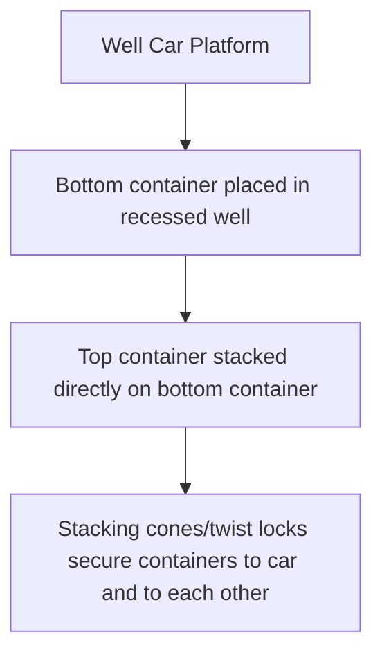
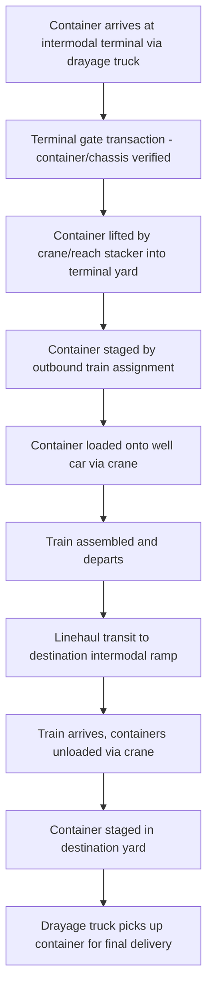

## Intermodal Rail and Container on Flatcar Service

### Overview

Intermodal rail transport moves standardized containers or trailers on specialized railcars, combining rail's long-haul cost efficiency with road drayage's flexibility for first/last-mile delivery. **Container on Flatcar (COFC)** and its historical counterpart **Trailer on Flatcar (TOFC)** are the two core equipment configurations underlying this service, with COFC now dominant due to superior stacking efficiency and container standardization with ocean freight.

### COFC vs. TOFC

| Attribute | COFC (Container on Flatcar) | TOFC (Trailer on Flatcar, "Piggyback") |
| --- | --- | --- |
| Unit moved | Intermodal container (no wheels) | Highway trailer (with wheels/chassis) |
| Stacking | Can be double-stacked in well cars | Cannot be stacked (wheels/chassis in the way) |
| Weight efficiency | Higher (lighter container structure) | Lower (trailer chassis adds dead weight) |
| Ocean freight compatibility | Direct (same container moves ship-rail-truck) | None (requires separate container-to-trailer transfer) |
| Current market position | Dominant, especially for import/export intermodal | Declining, niche domestic use only |

### Well Cars and Double-Stack Technology

The dominant COFC equipment type is the **well car** (also called a double-stack car), designed with a recessed center section allowing containers to sit lower to the rail, enabling two containers to be stacked without exceeding rail clearance (loading gauge) limits:

Double-stacking roughly doubles a train's container capacity per unit of train length without adding proportional locomotive/crew cost, making it the primary efficiency driver behind modern intermodal rail economics relative to single-stack or TOFC configurations. Well cars are commonly built in **articulated multi-unit sets** (typically 5-unit platforms sharing connected articulated couplings), reducing overall train weight and improving ride stability compared to individual flatcars.

### Intermodal Terminal Operations

Intermodal terminals ("ramps") use overhead gantry cranes or mobile equipment (reach stackers, top handlers) to lift containers on/off railcars — a fundamentally different handling model from carload's coupling/switching operations, since intermodal containers are lifted as discrete units rather than the railcar itself being switched car-by-car through a classification yard.

### Intermodal vs. Carload — Structural Differences

Unlike carload service (covered separately under Carload and Unit Train Operations), intermodal trains typically operate more like a **hybrid** between unit train and carload logic:

- Intermodal trains often run on **fixed schedules between major ramp pairs** (similar to a scheduled unit train), rather than being individually classified car-by-car at hump yards
- However, unlike a true unit train, an intermodal train's individual containers may have diverse origins/destinations reached via **ramp-to-ramp trains plus drayage on both ends**, rather than one single dedicated origin-destination flow
- This scheduled, ramp-based model minimizes classification yard dwell (a carload pain point) while still serving diffuse origin/destination demand (unlike a true unit train's single-flow rigidity)

### International (IPI) and Domestic Intermodal

| Category | Description |
| --- | --- |
| International Intermodal / IPI (Interior Point Intermodal) | Ocean containers moved by rail from a coastal port to an inland destination, bypassing the need for the ocean carrier to call at a port near the final inland market |
| Mini-Landbridge (MLB) | Ocean containers moved by rail across a landmass to reach a different coastal port for onward ocean transport (e.g., Asia-US East Coast via West Coast port + rail, faster than all-water routing via canal) |
| Domestic Intermodal | Domestic-use containers (often 53-foot, not ISO-standard ocean dimensions) moved rail-to-truck entirely within one country, competing directly with long-haul FTL trucking |

Domestic intermodal containers are frequently a different size/type than international ocean containers (commonly larger domestic-only 53-ft containers in some markets) specifically because they never need to be ocean-compatible, allowing optimization purely for the rail-truck domestic corridor.

### Documentation for Intermodal Movements

Intermodal shipments typically require coordination across multiple documents spanning the ocean, rail, and drayage legs:

| Document | Governs |
| --- | --- |
| Ocean Bill of Lading (or Through Bill of Lading) | The ocean carrier's contract of carriage, potentially covering the full door-to-door movement including the rail leg if issued as a "through" or "combined transport" document |
| Rail Waybill / Interline Waybill | The rail carrier's specific transport document for the rail leg, sometimes issued by the ocean carrier as an intermediary under a through-transport arrangement |
| Interchange/Equipment Interchange Report (EIR) | Documents container/chassis condition at each custody transfer point (drayage-to-rail, rail-to-drayage) |
| Delivery Order | Authorizes container release at the destination ramp to the designated drayage trucker |

A **Through Bill of Lading** issued by the ocean carrier, covering the entire door-to-door movement including the inland rail leg, is common in IPI service — the shipper deals with a single contracting carrier even though physical custody passes through ocean vessel, rail, and drayage truck operators.

### Cost and Service Tradeoffs vs. Long-Haul Trucking

| Factor | Intermodal Rail | Long-Haul FTL Trucking |
| --- | --- | --- |
| Cost per mile (long distance) | Generally lower | Generally higher |
| Transit time | Slower (terminal handling + linehaul + drayage on both ends) | Faster (direct point-to-point) |
| Reliability/predictability | Schedule-based, generally consistent on established corridors | Variable, subject to driver HOS limits, traffic |
| Minimum distance for cost advantage | Typically only cost-competitive beyond a threshold distance (commonly cited around 500+ miles/800+ km) | Competitive at any distance, especially short-haul |
| Emissions profile | Generally lower per ton-mile | Generally higher per ton-mile |
| Flexibility | Lower (fixed ramp locations, requires drayage legs) | Higher (direct door-to-door) |

[Unverified — the specific distance threshold at which intermodal becomes cost-competitive against trucking varies by lane, fuel price environment, and current trucking capacity/rate conditions; the figure cited is a commonly referenced industry rule of thumb rather than a fixed universal breakpoint]

### Chassis Provisioning Models

As with port drayage (covered separately), intermodal rail relies on a **chassis pool** to marry containers with wheels for the drayage legs at both ends:

- **Wheeled operations**: containers remain on chassis throughout the rail terminal dwell, allowing faster truck pickup but consuming more yard space per container
- **Grounded operations**: containers are removed from chassis and stacked/grounded in the yard, requiring a lift operation to re-mount on a chassis for drayage pickup, but using yard space more efficiently
- Chassis pool management (shared neutral pools vs. carrier-specific chassis) significantly affects drayage efficiency and cost at the terminal interface, mirroring the chassis split issues discussed in port drayage operations

### Practical Example

An importer's ocean container arrives at a West Coast port and needs to reach an inland distribution center 1,500 km away.

1. Container discharged from vessel at the port terminal
2. Rather than long-haul trucking the full 1,500 km, the container moves via short drayage to a nearby rail intermodal ramp
3. Container lifted onto a well car (likely double-stacked with another container) as part of a scheduled intermodal train
4. Train departs on a fixed schedule, transiting directly to the inland ramp with no intermediate classification yard handling
5. On arrival, container is lifted off the well car, grounded or placed on a chassis in the destination ramp yard
6. Local drayage trucker picks up the container for final delivery to the distribution center
7. Compared to an all-truck routing, this rail-drayage combination typically offers lower total cost for the long-haul portion, at the expense of additional transit time from the two terminal handling events (origin and destination ramps) plus the drayage legs on each end

**Related Topics**

- Drayage and Port Trucking Operations
- Carload and Unit Train Operations
- Bill of Lading Types (Through Bill of Lading, Combined Transport Document)
- Chassis Pool Management and Wheeled vs. Grounded Operations
- Full Truckload vs. Intermodal Cost-Distance Breakeven Analysis
- Rail Demurrage and Terminal Free Time Management