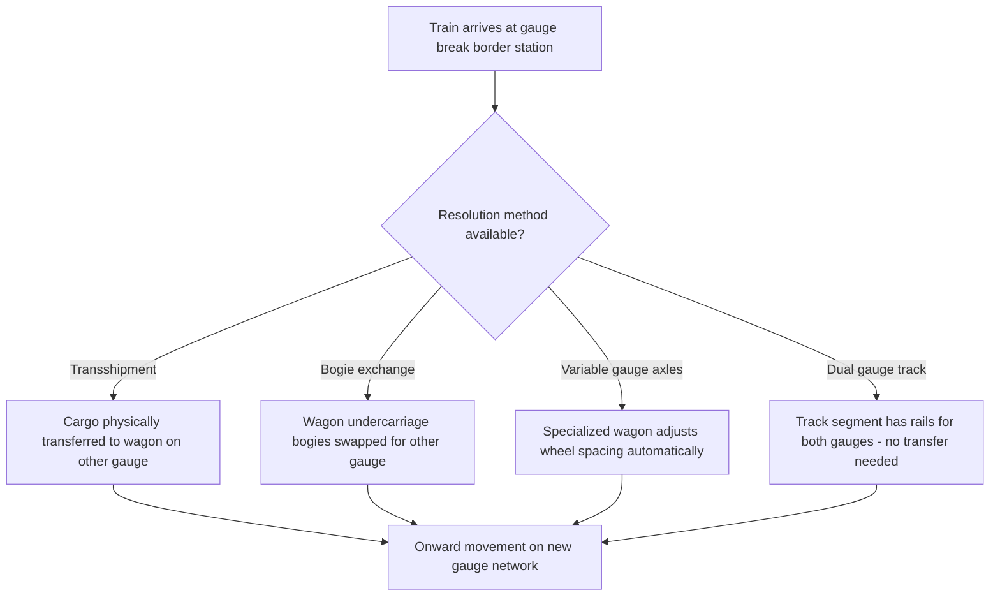
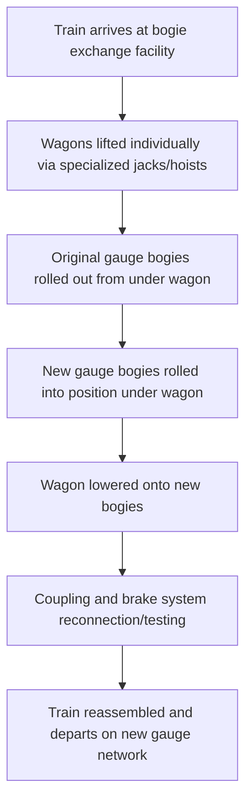

## Rail Gauges and Cross Border Rail Networks

### Overview

**Track gauge** — the distance between the inner faces of the two rails — is the fundamental physical constraint governing whether rolling stock from one rail network can operate on another. Because gauge standards evolved independently across countries and historical periods, cross-border rail freight frequently encounters **gauge breaks** where trains cannot physically continue onto an adjoining network without technical intervention, creating a distinct logistical challenge with no direct equivalent in ocean or air freight.

### Major World Track Gauges

| Gauge Name | Width | Primary Regions |
| --- | --- | --- |
| Standard Gauge | 1,435 mm (4 ft 8½ in) | North America, most of Europe, China, Australia (mainline), much of the Middle East |
| Broad Gauge (Indian/Iberian) | 1,668 mm (Iberian) / 1,676 mm (Indian) | Spain, Portugal / India, Pakistan, Bangladesh, Sri Lanka, Argentina |
| Russian Gauge | 1,520 mm | Russia, former Soviet states (CIS), Mongolia, Finland (1,524 mm, functionally compatible) |
| Cape Gauge (Narrow) | 1,067 mm | Southern Africa, Japan (most of national network), parts of Southeast Asia, Indonesia |
| Metre Gauge | 1,000 mm | Thailand, Vietnam, parts of East Africa, historical narrow-gauge networks |

[Unverified — gauge figures are widely documented historical/engineering standards, but exact regional coverage details, especially for countries with mixed-gauge networks, should be confirmed for any specific corridor being planned]

### Why Gauge Divergence Occurred

Gauge standards were largely set by individual national or colonial-era railway builders in the 19th century, often without coordination, and in some cases deliberately chosen to be **incompatible with neighboring networks for strategic/military reasons** (preventing an adversary from easily using captured rolling stock or running trains directly across a border in wartime). [Inference — this strategic rationale is a widely cited historical explanation for some gauge choices, notably in parts of Eastern Europe and the former Russian Empire/Soviet Union, though the full picture involves multiple contributing factors including engineering preference and available construction resources at the time each network was built]

### The Gauge Break Problem

### Gauge Break Resolution Methods

| Method | Description | Time/Cost Impact |
| --- | --- | --- |
| Transshipment | Cargo unloaded from one gauge's wagon and reloaded onto another gauge's wagon | High — full unload/reload labor and time cost |
| Bogie exchange | The wagon's undercarriage (bogie/truck assembly) is swapped for one matching the new gauge, while the wagon body and cargo remain undisturbed | Moderate — requires specialized lifting facility but avoids full unload |
| Variable gauge axles (VGA) | Specialized wheelsets that mechanically adjust their spacing while passing through a changeover facility, without lifting the wagon | Lower — fastest resolution but requires expensive specialized rolling stock and changeover infrastructure |
| Dual gauge track | A track segment is built with a third rail (or overlapping rail sets) allowing both gauges to operate on the same physical alignment | Eliminates the break entirely for that segment, but is a fixed infrastructure investment rather than a per-train solution |

### Bogie Exchange Process (Illustrative)

Bogie exchange is one of the more common industrial solutions at major gauge-break border crossings (notably used historically and currently at various Russian-gauge/standard-gauge interfaces):

This process, while avoiding cargo handling, still introduces significant dwell time at the border facility — a major driver behind interest in variable gauge axle technology on high-volume corridors where bogie exchange facility throughput becomes a bottleneck.

### Cross-Border Rail Freight Beyond Gauge

Even where gauge is compatible, cross-border rail freight involves additional coordination layers:

| Layer | Consideration |
| --- | --- |
| Signaling systems | Different countries often use incompatible train control/signaling standards, requiring locomotives equipped with multiple systems or a locomotive change at the border |
| Electrification standards | Voltage/current type (AC/DC) differences require either dual-system locomotives or a locomotive change |
| Loading gauge (structure clearance) | The maximum height/width profile permitted on a given network's tunnels/bridges/platforms — distinct from track gauge, and can independently restrict what equipment (e.g., double-stack containers) can transit a given route |
| Customs and regulatory transit | Cross-border rail freight still requires customs transit documentation, conceptually paralleling the TIR Carnet system for road freight, though rail-specific transit frameworks (e.g., the **SMGS** convention used across much of Eurasia, or **CIM** used in much of Europe) govern the contract of carriage and liability framework |
| Locomotive/crew changes | Even on compatible gauge, crew qualification and locomotive ownership typically change at national borders, requiring an operational handover distinct from the physical track/cargo continuity |

### SMGS and CIM — Rail's Analogs to CMR/TIR

Much as road freight relies on the CMR Convention for contract of carriage and TIR for customs transit, international rail freight operates under its own conventions:

- **CIM (Convention concernant le transport international ferroviaire des marchandises)**: governs international rail freight contracts primarily across Western/Central Europe and connected networks, under the broader COTIF framework
- **SMGS (Agreement on International Railway Freight Communications)**: the historically Soviet-originated framework governing rail freight contracts across Russia, China, Central Asia, and other Eurasian networks
- Shipments transiting between a **CIM-zone** country and an **SMGS-zone** country (a common scenario on Eurasian landbridge routes, e.g., China-Europe rail freight) require a **CIM/SMGS common consignment note**, harmonizing documentation across the two legal frameworks at the interface point, since neither convention alone covers the full door-to-door movement

[Unverified — the operational and legal details of the CIM/SMGS harmonization mechanism have evolved over time; current procedural specifics for any given corridor should be verified against current railway/consignment authority guidance]

### Southeast Asian Context

Most Southeast Asian mainline rail networks use **metre gauge** (1,000 mm) — including Thailand and Vietnam — creating gauge compatibility within parts of the region, though connections to China's standard-gauge network at the northern border introduce a gauge break requiring one of the resolution methods above for any through rail freight movement along that specific corridor. The Philippines, as an archipelago with no land rail connections to other countries, has no direct cross-border rail freight relevance — the country's domestic rail network operates in isolation from any international gauge interface question, though this topic remains relevant for understanding regional logistics corridors (e.g., mainland Southeast Asia-China rail freight) that may connect with Philippine-bound cargo at a sea or air interchange point.

### Practical Example

A shipment of manufactured goods needs to move by rail from a standard-gauge network in Country A, across a border into a broad-gauge network in Country B.

1. Train assembled in Country A on standard gauge (1,435 mm) rolling stock
2. Train arrives at the border gauge-break station
3. Facility assessment: given the cargo type (palletized manufactured goods, not requiring specialized wagons), transshipment is selected over bogie exchange, since the origin wagons are standard general-purpose types not economically justifying a bogie-exchange facility investment for this traffic volume
4. Cargo is craned/forklifted from standard-gauge wagons onto broad-gauge wagons at the border transshipment facility
5. A new consignment note is issued (or the existing CIM note is supplemented with an SMGS-compatible note, if the specific corridor spans both convention zones) to reflect the continuing movement under Country B's rail freight legal framework
6. Train continues onward into Country B's broad-gauge network to final destination

This example illustrates why, absent dual-gauge track or gauge-break-avoiding technology, rail's efficiency advantage over road for long-haul freight can be significantly eroded on corridors crossing incompatible gauge networks, since the gauge break introduces cost and dwell time roughly analogous to an additional terminal handling event.

**Related Topics**

- Carload and Unit Train Operations
- Intermodal Rail and Container on Flatcar Service
- CIM and SMGS Rail Freight Conventions
- Cross Border Trucking and the TIR Carnet System (Comparative Framework)
- China-Europe Rail Freight Corridor (Eurasian Landbridge) Logistics
- Loading Gauge and Structure Clearance Constraints on Intermodal Rail