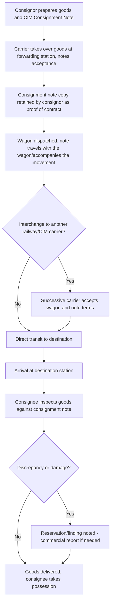

## Rail Freight Documentation and the CIM Consignment Note

### Overview

International rail freight moving through Europe and connected networks relies on the **CIM Consignment Note** (from the French *Contrat de transport international ferroviaire des marchandises*) as its primary contract of carriage document — the rail-specific counterpart to the CMR Note in road freight and the AWB in air freight. CIM operates under the broader **COTIF Convention** (Convention concerning International Carriage by Rail), administered by the **Intergovernmental Organisation for International Carriage by Rail (OTIF)**.

### Legal Framework: COTIF and CIM

- **COTIF** is the umbrella international treaty governing rail transport across its Contracting Parties (predominantly European, with some extension into North Africa and the Middle East)
- **CIM** is one of COTIF's specific "Uniform Rules" appendices — specifically **Appendix B (CIM)** — dealing with the contract for international carriage of goods by rail; other appendices under COTIF cover passengers (CIV), dangerous goods by rail (RID), and other rail-specific regulatory domains
- CIM applies automatically when the place of taking over the goods and the place designated for delivery are situated in two different States, at least one of which is a COTIF Contracting Party, without requiring the parties to explicitly elect its application — structurally similar in this respect to how the CMR Convention applies automatically to qualifying international road movements

[Unverified — current COTIF/CIM Contracting Party membership should be verified against OTIF's official treaty status records, as accession status can change]

### CIM vs. SMGS — Two Rail Freight Legal Zones

As introduced under rail gauge and cross-border network topics, international rail freight operates under two principal, historically distinct legal frameworks:

| Framework | Geographic Zone | Governing Body |
| --- | --- | --- |
| CIM | Western/Central Europe and connected networks, parts of Middle East/North Africa | OTIF (COTIF Convention) |
| SMGS | Russia, China, Central Asia, and other Eurasian/former Soviet-sphere networks | Organisation for Cooperation between Railways (OSJD) |

A shipment transiting from a CIM-zone country into an SMGS-zone country (or vice versa) — a scenario increasingly relevant on Eurasian landbridge corridors such as China-Europe rail freight — requires a **CIM/SMGS common consignment note**, a harmonized document format recognized under both legal frameworks, avoiding the need to re-issue an entirely separate consignment note at the zone interface.

### CIM Consignment Note Structure

The CIM Consignment Note is prepared with multiple copies distributed among the sender, the carrier(s), and accompanying the goods, and contains:

| Field Group | Content |
| --- | --- |
| Parties | Consignor and consignee names/addresses |
| Route and stations | Forwarding station, destination station, route to be followed if specified |
| Goods description | Nature of goods, packaging, number of packages, marks |
| Weight | Mass of the goods as declared |
| Wagon details | Wagon number(s), owner (railway-owned vs. private wagon) |
| Carriage charges | Charges and designation of which party (consignor/consignee) bears them |
| Declared value / interest in delivery | Optional declarations affecting liability limits, analogous to declared value mechanisms in AWB/CMR |
| Documents attached | Customs and other accompanying documents handed to the carrier |

### CIM Process Flow

### Carrier Liability Under CIM

CIM's liability structure follows a pattern structurally similar to CMR and the air freight conventions, adapted to rail's operational characteristics:

- The carrier is liable for **loss, damage, or delay** occurring between taking over and delivery of the goods
- Liability is **presumed against the carrier**, who must prove a specific exempting cause (defect inherent in the goods, insufficient packing by the consignor not apparent to the carrier, force majeure-equivalent circumstances defined in the Uniform Rules, or fault of the consignor/consignee) to escape liability
- Compensation is **capped per kilogram of gross mass** of goods lost or damaged, expressed via a Special Drawing Rights (SDR)-based unit of account, structurally parallel to the per-kg SDR caps seen in the Montreal Convention (air) and CMR (road), though the specific numeric SDR/kg figure is set independently within the CIM Uniform Rules text [Unverified — current CIM per-kg liability limit should be confirmed against the currently applicable COTIF/CIM Uniform Rules text, as revisions occur periodically]
- A **higher declared value/"interest in delivery"** can be stated by the consignor to increase the liability ceiling, generally with an additional charge, again paralleling the declared value mechanisms across air, road, and rail conventions
- Claims are subject to a **limitation period** (commonly one year, with extension to a longer period such as two years in cases of intentional wrongdoing or equivalent gross fault) within which the claimant must act

### Successive and Substitute Carriers

CIM specifically contemplates rail freight moving across **multiple railway undertakings' networks** under a single consignment note:

- When several successive carriers undertake the carriage under the same CIM Consignment Note, each becomes party to the contract on the terms of the original note as the goods are handed over to them
- This mirrors the successive-carrier provisions found in CMR for road freight, reflecting a common legal design pattern across transport conventions: a single consignment note governing the entire multi-carrier journey rather than requiring a fresh contract at every interchange point

### CIM's Relationship to Wagon Interchange and Private Wagons

- Rail freight under CIM can move in either **railway-owned wagons** or **privately owned/leased wagons** (common for specialized cargo — chemicals, grain, intermodal flatcars), with wagon ownership noted on the consignment note
- Where a shipment crosses between multiple national rail networks, custody transfer at each **interchange point** is handled under railway-to-railway interchange agreements distinct from (though coordinated with) the CIM contract of carriage itself — conceptually analogous to how a CMR Note governs the sender-carrier-consignee relationship while a separate TIR Carnet governs customs transit for the same road movement

### Documentation Package for International Rail Freight

Beyond the CIM Consignment Note itself, a typical international rail freight movement is supported by:

| Document | Purpose |
| --- | --- |
| CIM Consignment Note (or CIM/SMGS common note) | Contract of carriage, rail's core transport document |
| Commercial Invoice | Underlying trade transaction value and terms |
| Packing List | Itemized cargo contents for customs and handling verification |
| Certificate of Origin | Preferential tariff treatment support where applicable |
| Customs transit declaration | Required at each customs border the rail movement crosses, since CIM itself is a carriage contract, not a customs transit instrument |
| Dangerous goods documentation (RID-compliant) | Required for hazardous cargo, under COTIF's separate RID appendix governing rail carriage of dangerous goods (rail's analog to IATA DGR for air or ADR for road) |

### Practical Example

A shipment of industrial chemicals moves by rail from a manufacturer in a CIM-zone country to a buyer in an SMGS-zone country, requiring transit across the CIM/SMGS legal boundary.

1. Consignor prepares a **CIM/SMGS common consignment note**, since the movement spans both legal zones, avoiding the need for two entirely separate contract documents
2. Given the chemical cargo, the shipment is also accompanied by RID-compliant dangerous goods documentation specific to rail carriage
3. Wagon (a private tank wagon, given the chemical commodity) is taken over by the first carrier at the forwarding station; CIM liability framework applies for this initial leg
4. At the CIM/SMGS zone interchange point, custody transfers to a successive carrier operating under the SMGS portion of the common note's legal framework
5. Wagon continues to final destination in the SMGS-zone country
6. On arrival, the consignee inspects the tank wagon; any discrepancy (e.g., seal integrity, quantity per accompanying documentation) is noted at this point, since — consistent with the general multi-modal principle seen across CMR, air freight CIRs, and LTL PODs — the promptness and documentation of any exception at the point of delivery is what preserves the consignee's position in any subsequent claim

**Related Topics**

- Carload and Unit Train Operations
- Rail Gauges and Cross Border Rail Networks
- CMR Consignment Note (Road Freight Comparative Framework)
- RID Dangerous Goods by Rail Regulations
- China-Europe Rail Freight Corridor and CIM/SMGS Interoperability
- Cargo Claims and Liability Frameworks Across Transport Modes