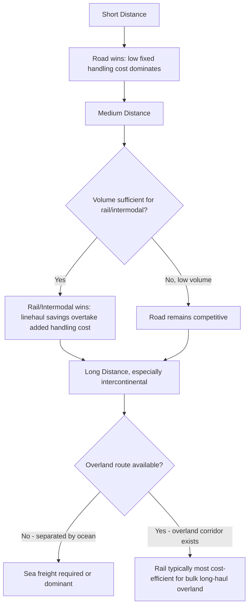
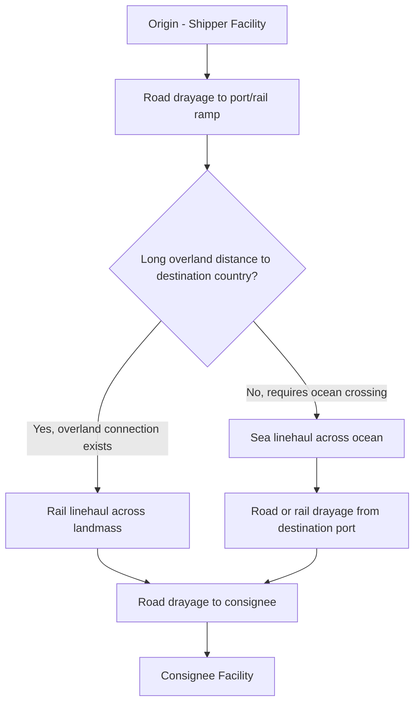

## Comparing Rail Freight to Road and Sea Transport

### Overview

Choosing between rail, road, and sea freight requires weighing cost, speed, capacity, flexibility, and environmental factors against the specific shipment profile — distance, volume, cargo type, and time sensitivity. No single mode dominates across all dimensions; the optimal choice is typically corridor- and shipment-specific, and often the best solution combines modes (intermodal) rather than relying on a single one exclusively.

### Core Comparative Matrix

| Attribute | Rail | Road (Trucking) | Sea (Ocean) |
| --- | --- | --- | --- |
| Cost per ton-mile (long haul) | Low-moderate | Moderate-high | Lowest |
| Speed | Moderate | Fast (short-medium haul) | Slowest |
| Door-to-door capability | No (requires drayage) | Yes (direct) | No (requires drayage on both ends) |
| Capacity per unit | High (unit trains: thousands of tons) | Low (single truckload: ~20-45 tons) | Highest (vessels: tens of thousands of tons) |
| Flexibility/routing | Fixed infrastructure (tracks, terminals) | Highest (any road-accessible point) | Fixed infrastructure (ports) |
| Weather sensitivity | Low-moderate | Moderate (road conditions) | Higher (storms, port closures) |
| Typical distance sweet spot | Medium-long haul, especially 500+ km inland | Short-medium haul, any distance | Long haul, especially intercontinental |
| Emissions per ton-mile | Low | Highest | Lowest |
| Border/customs complexity | High (gauge breaks, multiple conventions) | Moderate (TIR/CMR frameworks exist) | Moderate (well-established international frameworks) |

### Cost Structure Comparison

$$\text{Total Landed Transport Cost} = \text{Linehaul Cost} + \text{Terminal/Handling Cost} + \text{First/Last Mile Cost} + \text{Time-in-Transit Cost}$$

- **Sea freight** has the lowest linehaul cost per ton-mile by a wide margin, but requires drayage/rail on both ends (since ports are fixed points), and carries the highest **time-in-transit cost** (inventory carrying cost, capital tied up) due to slow transit speeds
- **Rail freight** sits between sea and road: lower linehaul cost than trucking over long distances, but — like sea — requires drayage to bridge the gap between fixed rail terminals and actual origin/destination points, adding cost and complexity road freight avoids entirely
- **Road freight** has the highest linehaul cost per ton-mile for long distances, but eliminates terminal handling and drayage entirely for point-to-point movements, often making it cost-competitive or superior for shorter distances despite the higher headline rate

### Break-Even Distance Framework

A commonly used framework compares modes based on the point at which one mode's total cost (linehaul + fixed handling costs) overtakes another's:

The core logic: fixed terminal/handling costs (present in rail and sea, largely absent in road) must be amortized over enough distance for the lower linehaul rate to produce net savings — below that break-even distance, road's simplicity wins regardless of its higher per-mile rate. [Inference — the specific break-even distance is highly corridor- and commodity-dependent and is not a fixed universal number; it should be calculated per shipment profile rather than assumed from a general rule]

### Transit Time and Inventory Cost Tradeoff

| Mode | Typical Long-Haul Transit Character | Inventory Carrying Cost Implication |
| --- | --- | --- |
| Road | Fastest for overland distances | Lowest inventory-in-transit cost |
| Rail | Moderate — faster than sea, slower than direct road for very long distances once terminal dwell is included | Moderate |
| Sea | Slowest, especially intercontinental (days to weeks) | Highest — significant capital tied up in transit inventory |

This tradeoff is why time-sensitive or high-value goods often justify air or road freight's cost premium, while low-value, high-volume, non-time-sensitive bulk commodities (coal, grain, ore, base chemicals) gravitate toward rail and sea, where the inventory carrying cost of slower transit is outweighed by the substantially lower linehaul rate.

### Capacity and Scale Economics

- **Sea freight** offers the largest single-shipment scale: a large container vessel can carry the equivalent of thousands of truckloads in one voyage, driving sea's structurally lowest per-unit cost at scale
- **Rail unit trains** offer the next tier of scale — a single train can move the equivalent of 100+ individual trucks' worth of cargo, which is why unit train economics (covered separately) become attractive specifically at high-volume, single-commodity, fixed-corridor flows
- **Road freight** operates at the smallest scale per movement (single trailer), which is precisely its flexibility advantage — a truck can serve virtually any origin-destination pair without requiring fixed terminal infrastructure, at the cost of losing the scale economics available to rail and sea

### Environmental and Regulatory Considerations

- Rail and sea generally have substantially lower carbon emissions per ton-mile than road freight, a factor increasingly weighted in shipper mode selection decisions under corporate sustainability commitments and, in some jurisdictions, regulatory carbon pricing mechanisms
- Road freight's emissions profile, combined with driver Hours of Service constraints (covered separately), creates both an environmental and an operational capacity ceiling that rail and sea do not share in the same way
- [Unverified — specific emissions figures per ton-mile vary by equipment type, fuel source, load factor, and route, and should be sourced from current mode-specific lifecycle emissions studies rather than assumed as fixed constants]

### Documentation and Liability Framework Comparison

| Mode | Primary Contract Document | Governing Convention | Liability Basis |
| --- | --- | --- | --- |
| Road | CMR Note | CMR Convention | Presumed carrier fault, SDR/kg cap |
| Rail | CIM Consignment Note (or SMGS/common note) | COTIF/CIM (or SMGS) | Presumed carrier fault, SDR/kg cap |
| Sea | Bill of Lading | Hague-Visby/Hamburg/Rotterdam Rules | Varies by convention; historically more carrier-favorable defenses than road/rail/air |
| Air | Air Waybill | Montreal Convention | Presumed carrier fault, SDR/kg cap |

Notably, road, rail, and air freight liability conventions share a broadly similar structural design (presumed carrier liability, per-kilogram SDR-based caps, declared value mechanisms, defined limitation periods) — a pattern reflecting historical cross-pollination in international transport law — while sea freight liability frameworks have historically diverged more, with a more fragmented convention landscape (multiple competing conventions in force across different countries) and generally more carrier-favorable liability defenses reflecting ocean shipping's distinct historical development.

### Intermodal Combination as the Practical Norm

For most long-distance international freight, the realistic comparison is not "rail vs. road vs. sea" as mutually exclusive choices, but rather **which combination** best serves the shipment:

This is precisely the intermodal model already covered under Drayage, Intermodal Rail, and Container on Flatcar topics — road bridges the "first/last mile" gaps that fixed rail and port infrastructure inherently create, while rail and sea handle the cost-efficient long-haul middle segment.

### Decision Framework Summary

| Shipment Profile | Likely Optimal Mode(s) |
| --- | --- |
| Short distance, any volume, time-sensitive | Road (FTL or LTL depending on volume) |
| Medium-long overland distance, high volume, single commodity | Rail (unit train if volume justifies) |
| Medium-long overland distance, moderate/mixed volume | Intermodal rail + drayage |
| Intercontinental, high volume, not time-critical | Sea freight (+ drayage/rail at each end) |
| Intercontinental, time-critical or high-value/low-weight | Air freight (covered in a separate chapter), despite highest per-kg cost |
| Landlocked or ocean-inaccessible destination, high volume | Rail (subject to gauge/network compatibility) or road |

### Practical Example

A shipper needs to move 500 tons of packaged consumer goods from a manufacturing hub to a distribution center 1,200 km away, in a market with both rail and road infrastructure available, and moderate time sensitivity.

**Road-only evaluation:**

- Would require roughly 15-20 FTL truckloads (assuming ~25-35 tons/truck)
- Fastest transit, direct door-to-door, no terminal handling
- Highest aggregate linehaul cost given the long distance, and highest aggregate emissions

**Rail (intermodal) evaluation:**

- Consolidate into containers/wagons, drayage to origin rail ramp, intermodal linehaul, drayage from destination ramp
- Likely lower total linehaul cost given the 1,200 km distance exceeds typical intermodal break-even thresholds
- Added transit time from terminal handling and drayage legs at both ends, and dependent on rail terminal availability/scheduling at both the origin and destination markets

**Likely outcome**: for non-urgent, high-volume shipments over this distance, intermodal rail is frequently the more cost-efficient choice despite longer transit time, while road remains preferable if the shipment is time-critical, volume is too low to justify rail terminal handling costs, or rail/intermodal infrastructure is not conveniently positioned relative to the actual origin/destination points.

**Related Topics**

- Carload and Unit Train Operations
- Intermodal Rail and Container on Flatcar Service
- Full Truckload and Less Than Truckload Freight
- Drayage and Port Trucking Operations
- Air Freight Pricing and Surcharges (Cross-Modal Cost Comparison)
- Incoterms Selection and Mode-of-Transport Interaction