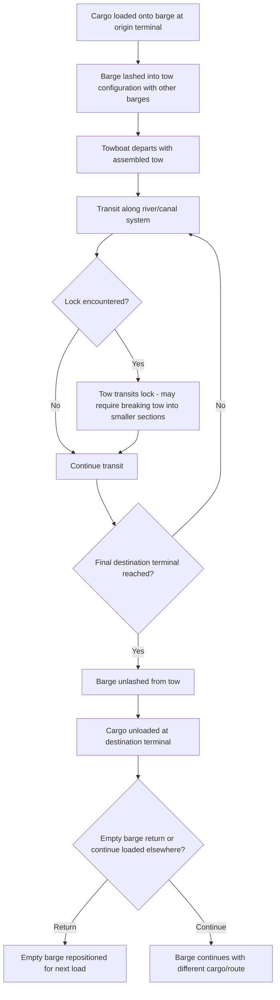
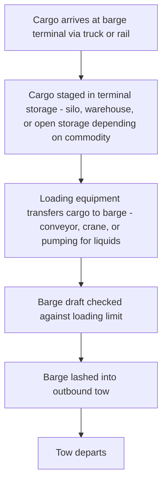

## River and Canal Barge Transport

### Overview

Inland waterway transport moves cargo via barges and push-tow vessels along rivers, canals, and connected lake systems, offering a distinctive cost and capacity profile among freight modes. It is characterized by very high per-unit capacity, low fuel consumption per ton-mile, and correspondingly slow transit speeds, making it best suited to bulk, non-time-sensitive commodities moving along navigable inland corridors.

### Barge and Tow Configurations

| Configuration | Description |
| --- | --- |
| Single Barge | One unpowered barge moved independently or as part of a small group |
| Barge Tow / Push-Tow | A towboat pushes a configured group ("tow") of multiple barges lashed together, common on major river systems |
| Self-Propelled Barge | A barge with its own propulsion, operating independently without a separate towboat |
| Integrated Tug-Barge (ITB) | A specially designed tug that mechanically connects to a barge, functioning similarly to a single vessel, often used on coastal/inland-adjacent routes |

A push-tow on a major river system can consist of a dozen or more barges lashed together in a rectangular configuration, moved by a single towboat — this consolidation is the core driver of inland waterway's capacity and cost efficiency, analogous in spirit to how a unit train consolidates rail capacity, but achieved through lashing multiple independent barge units rather than coupled railcars.

### Barge Transport Process Flow

### Locks and Navigation Infrastructure

Rivers and canals often require **locks** to manage elevation changes along a waterway, and lock transit is a defining operational and scheduling constraint of barge transport:

- A lock raises or lowers vessels between different water levels by admitting/releasing water into a sealed chamber
- Large tows frequently exceed a lock chamber's length, requiring the tow to be **broken apart** into smaller sections, each transited through the lock separately, then **reassembled** on the other side — a time-consuming process that can take hours per lock on high-traffic waterways
- Lock capacity and scheduling (particularly at aging or high-traffic locks) is a well-documented bottleneck constraint on inland waterway system throughput, and lock maintenance closures can suspend transit entirely on a given corridor for extended periods [Unverified — specific lock capacity, dimensions, and current operational/maintenance status are waterway-specific and time-variant; current conditions should be verified against the relevant waterway authority for any specific corridor being planned]

### Draft and Water Level Constraints

Barge transport capacity is directly constrained by the waterway's **navigable draft** — the water depth available for vessel passage:

$$\text{Maximum Load} \propto \text{Available Draft} - \text{Barge's Own Draft Requirement (light)}$$

- Seasonal and weather-driven water level fluctuations (drought conditions, flooding) directly affect how deeply loaded a barge can safely operate, and in extreme conditions can suspend navigation on a waterway segment entirely
- Low-water conditions force barges to load below their nominal maximum capacity to maintain safe clearance, directly reducing the tonnage moved per barge/tow and increasing effective per-ton transport cost during such periods
- This weather/hydrological sensitivity is a distinguishing risk factor for inland waterway transport relative to rail or road, which are comparatively less exposed to this specific constraint (though both have their own weather sensitivities)

### Cargo Types Suited to Barge Transport

| Commodity Category | Examples | Rationale |
| --- | --- | --- |
| Bulk agricultural | Grain, soybeans | High volume, low value-density, non-time-critical, seasonal harvest flows align with barge scheduling |
| Bulk minerals/aggregates | Coal, sand, gravel, ore | Very high volume, extremely low value-density, cost-efficiency dominates mode choice |
| Bulk liquids | Petroleum products, chemicals | Tank barges provide efficient bulk liquid transport along suitable waterways |
| Steel and heavy machinery | Coils, large fabricated components | Oversized/overweight cargo often exceeds practical road/rail limits, making barge one of few viable options |
| Project cargo | Wind turbine components, industrial modules | Barge transport avoids road/rail dimensional and weight restrictions for exceptionally large single pieces |

### Cost and Efficiency Characteristics

| Factor | Barge Transport |
| --- | --- |
| Cost per ton-mile | Lowest among land-adjacent inland modes, often below rail for bulk commodities |
| Fuel efficiency | Highest ton-miles per unit of fuel among common freight modes, due to low water resistance relative to load carried |
| Speed | Slowest common inland mode (barge tows typically move at a few miles/km per hour net of current effects) |
| Capacity per unit | Very high — a single large barge can carry a multiple of a rail car's capacity, and a full tow multiplies this further |
| Terminal requirements | Requires waterside terminal/dock infrastructure, similar in concept to rail's need for ramps/sidings |

This cost-speed tradeoff mirrors the broader intermodal pattern seen across rail, sea, and now barge: the slowest modes tend to be the cheapest per ton-mile, making them best suited to high-volume, low-value-density, non-time-sensitive cargo where inventory carrying cost is a secondary concern relative to linehaul savings.

### Barge Terminal Operations

Barge terminals frequently function as **transload points** bridging rail or road delivery to barge loading, since origin/destination points are rarely directly on a navigable waterway — this creates a drayage-equivalent first/last-mile requirement structurally similar to rail's dependence on trucking to bridge the gap between fixed rail ramps and actual shipper/consignee locations.

### Documentation

Inland waterway freight documentation is generally less standardized under a single dominant international convention compared to road (CMR), rail (CIM/SMGS), or air (Montreal), and often follows:

- **Bill of Lading or Waybill** issued by the barge operator, functioning as the contract of carriage and cargo receipt, with terms often drawing on the operator's own tariff/terms of service or applicable national inland waterway transport law
- **Regional/national inland waterway conventions** where they exist (e.g., certain European inland waterway liability frameworks under CMNI — the Budapest Convention on the Contract for the Carriage of Goods by Inland Waterway), governing liability and documentation for qualifying international inland waterway movements [Unverified — CMNI applicability and current Contracting Party status should be verified for any specific European inland waterway movement, and equivalent frameworks or their absence should be confirmed for waterways outside Europe]
- **Customs and commercial documents** (commercial invoice, packing list, certificate of origin) accompanying the shipment as with any other mode, particularly where the waterway movement crosses an international border

### International Inland Waterways

Some of the world's major river/canal systems function as genuinely international transport corridors, requiring cross-border coordination:

- Rivers forming or crossing international borders (e.g., major European river systems connecting multiple countries via canal links) require navigation agreements and, in some cases, dedicated multinational river commissions overseeing navigation rights, tolls, and infrastructure standards
- Where a waterway crosses a border, customs clearance procedures apply at the border-crossing point analogous in principle to road/rail border crossings, though physically implemented via designated river customs posts rather than fixed road/rail checkpoints

### Practical Example

A grain shipper needs to move 5,000 tons of soybeans from an inland agricultural region to a coastal export terminal, with a navigable river connecting the two points.

1. Grain is trucked (or moved by rail) from the farm/elevator to the nearest barge loading terminal — a first-mile drayage-equivalent leg, since the farm itself is not waterside
2. At the terminal, grain is loaded via conveyor into a series of hopper barges, with loading calculated against current river draft conditions to avoid exceeding safe load limits
3. Multiple loaded barges are lashed into a single tow, with the towboat coupled at the stern
4. The tow transits downriver, passing through several locks along the route — at each lock, the tow may be split into smaller sections to fit the lock chamber, adding cumulative transit time beyond pure linehaul distance/speed
5. On arrival at the coastal export terminal, barges are unlashed individually and each is unloaded (via conveyor or grain elevator equipment) directly into the export terminal's storage or directly alongside an ocean vessel for loading
6. This barge-to-vessel transfer at the coastal terminal effectively functions as the "drayage" bridging inland waterway transport to the ocean freight leg of the grain's ultimate export journey — directly paralleling the rail-to-ship or truck-to-ship interfaces seen in port drayage operations

**Related Topics**

- Drayage and Port Trucking Operations (Comparative Terminal Interface Model)
- Carload and Unit Train Operations (Comparative Bulk Consolidation Model)
- Pipeline Transport for Bulk Liquids and Gases
- Comparing Rail Freight to Road and Sea Transport
- CMNI Convention and Inland Waterway Liability Frameworks
- Port and Terminal Bulk Cargo Handling Equipment