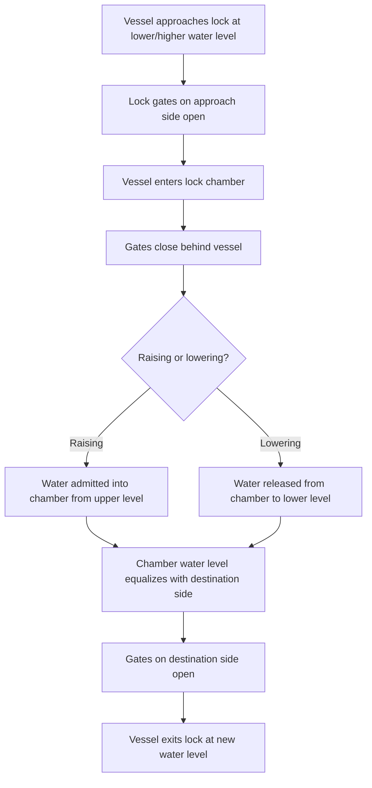
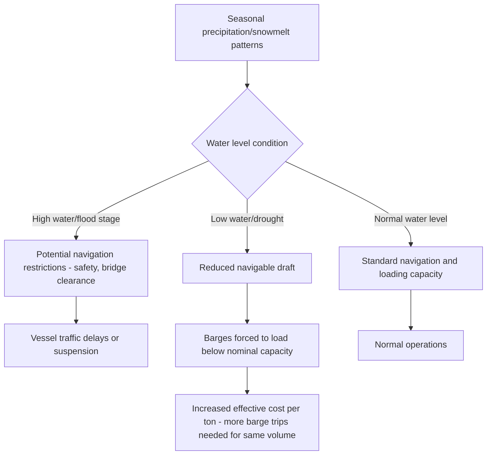

## Inland Waterway Networks and Infrastructure

### Overview

Inland waterway transport depends on a physical infrastructure system distinct from road, rail, or air — natural rivers, engineered canals, locks, dams, and terminal facilities that together create a navigable network. Unlike road networks (largely universal accessibility) or even rail (fixed but extensively built-out in many regions), inland waterway networks are geographically constrained by natural hydrology and historical canal-building investment, making their coverage inherently uneven across the globe.

### Core Infrastructure Components

| Component | Function |
| --- | --- |
| Natural Rivers | Primary navigable channels, often requiring maintenance dredging to sustain reliable draft |
| Canals | Engineered waterways connecting natural water bodies, river systems, or bypassing non-navigable sections |
| Locks | Mechanisms to raise/lower vessels between different water levels along a waterway |
| Dams and Weirs | Control water levels and flow, often paired with locks to maintain navigable pools |
| Ports and Terminals | Loading/unloading facilities connecting waterway transport to road/rail networks |
| Navigation Aids | Buoys, channel markers, depth sounding systems supporting safe vessel passage |

### Major Global Inland Waterway Systems (Illustrative)

| System/Region | Characteristics |
| --- | --- |
| Mississippi River System (North America) | Extensive lock-and-dam network, major bulk grain/coal/petroleum corridor |
| Rhine-Danube Corridor (Europe) | Connects North Sea to Black Sea via river and canal links, extensively used for international bulk and containerized barge transport |
| Yangtze and Pearl River Systems (China) | Major domestic bulk and containerized cargo corridors, among the highest-volume inland waterway systems globally |
| Mekong River System (Southeast Asia) | Cross-border river transport connecting several Southeast Asian countries, variable navigability by season and river section |

[Unverified — relative traffic volumes, current navigability status, and infrastructure conditions across these systems change over time and should be verified against current waterway authority data for any specific planning purpose]

### Lock System Mechanics

Lock chambers have fixed maximum dimensions (length, width, and available depth), which directly caps the maximum vessel or tow configuration size that can transit a given waterway — a structural bottleneck distinct from, but conceptually similar to, rail's loading gauge (structure clearance) constraint or ocean shipping's canal-transit size restrictions (as with Panama/Suez-max vessel classes).

### Waterway Classification Systems

Many regions classify inland waterways by a standardized class system reflecting the maximum vessel/barge dimensions the waterway can accommodate:

| Class Concept | General Characteristic |
| --- | --- |
| Lower classes | Smaller vessels/barges, often limited to domestic or regional traffic, shallower draft |
| Higher classes | Larger vessels/barge tow configurations, often designed for international standard push-tow or self-propelled vessel dimensions |

[Unverified — specific classification schemes (e.g., the European CEMT/ECMT waterway classification system) use particular numeric class designations and dimensional thresholds that are region-specific; the applicable classification framework and current waterway class ratings should be confirmed against the relevant regional waterway authority rather than assumed universal]

### Dredging and Channel Maintenance

Natural rivers require ongoing **dredging** — the removal of accumulated sediment — to maintain a navigable channel depth:

- Sediment deposition is a continuous natural process, particularly pronounced at river bends, confluences, and areas of reduced flow velocity
- Dredging is typically an ongoing maintenance program managed by the relevant waterway authority, funded through a combination of government infrastructure budgets and, in some systems, waterway usage fees/tolls
- Deferred or insufficient dredging investment directly translates into reduced navigable draft, which — as covered in barge transport operations — directly constrains how heavily barges can be loaded, creating a direct link between infrastructure investment levels and inland waterway transport's practical cost-competitiveness

### Seasonal and Hydrological Variability

Inland waterway navigability is subject to natural hydrological cycles in a way road and rail infrastructure generally are not:

Some waterways experience seasonal closure or severely restricted navigability during dry seasons or drought years, requiring shippers dependent on those corridors to have contingency plans (alternative modes, seasonal stockpiling, adjusted shipment timing) — a planning consideration with limited direct analog in road or rail freight, though somewhat comparable to how extreme weather can periodically disrupt those modes as well.

### Toll and Usage Fee Structures

Many inland waterway systems, particularly maintained canal segments and heavily engineered river sections, charge **tolls or usage fees** to fund infrastructure maintenance:

- Fees are often assessed based on vessel/barge tonnage, cargo type, or transit distance
- Canal segments bypassing non-navigable natural river sections (effectively providing an engineered shortcut or enabling passage where none would otherwise exist) often carry the highest toll rates, reflecting the significant capital investment embedded in their construction and maintenance
- Toll structures directly factor into the total cost comparison between inland waterway transport and competing modes for a given corridor, alongside the linehaul, terminal, and drayage cost components covered in barge transport operations

### Environmental and Regulatory Considerations

Inland waterway infrastructure decisions intersect with environmental management in ways distinct from other freight modes:

- Dredging operations can raise environmental considerations related to sediment disposal, aquatic habitat disruption, and water quality
- Dam and lock operations affect river ecosystems, fish migration patterns, and flood control — meaning inland waterway infrastructure is frequently managed under a multi-purpose mandate (navigation, flood control, water supply, hydropower, environmental protection) rather than a transport-only mandate, unlike road or rail infrastructure which is more singularly transport-focused
- This multi-purpose infrastructure governance model means navigation interests must often be balanced against competing water management priorities, which can introduce additional complexity into long-term waterway capacity planning relative to the more transport-dedicated planning processes for road and rail networks

### Cross-Border Waterway Governance

Where a waterway system spans multiple countries, international coordination mechanisms are typically required:

- **River commissions** (multinational bodies) may oversee shared navigation standards, toll structures, and infrastructure investment coordination across the countries bordering or crossed by a shared waterway
- Differing national regulations on vessel standards, crew qualifications, and safety requirements can create friction at cross-border transit points, conceptually similar to (though generally less complex than) the gauge/signaling/electrification interoperability challenges seen in cross-border rail networks
- Southeast Asia's Mekong River system exemplifies this cross-border governance challenge, given its passage through multiple countries with varying navigability, infrastructure investment levels, and regulatory frameworks along different river sections [Unverified — current cross-border navigation agreement status and infrastructure conditions along the Mekong or other specific cross-border systems should be verified against current regional waterway authority sources]

### Waterway-Adjacent Terminal Infrastructure

Beyond the waterway itself, network functionality depends on terminal infrastructure at loading/unloading points:

- **Bulk terminals**: specialized for grain, coal, aggregates — often featuring conveyor systems, silos, and high-throughput loading/unloading equipment
- **Liquid bulk terminals**: tank farms and pumping infrastructure for petroleum products and chemicals moved via tank barges
- **Container-on-barge terminals**: increasingly relevant on systems like the Rhine, supporting containerized cargo movement via barge as an alternative to road/rail for port-to-inland-destination container movements
- Terminal infrastructure density and capacity directly determines how effectively a given waterway segment can be utilized, independent of the waterway's own navigability characteristics — a waterway with excellent natural navigability but sparse terminal infrastructure will underperform its theoretical capacity

### Practical Example

A logistics planner is assessing whether to route bulk cargo via an inland waterway system that includes both natural river sections and an engineered canal bypass around a historically non-navigable rapids section.

1. Planner confirms current waterway classification and maximum vessel/tow dimensions for the route, since this determines whether standard push-tow configurations can be used or whether smaller vessels are required
2. Seasonal water level data is checked against the planned shipment timing — if the route is scheduled during a historically low-water period, the planner budgets for reduced barge loading capacity (more barge trips required for the same total tonnage) or considers timing the shipment to a higher-water season if flexibility allows
3. Toll costs for the engineered canal bypass segment are factored into total routing cost, compared against the alternative (if one exists) of a longer natural river route avoiding the toll but potentially adding transit time
4. Terminal infrastructure at both the origin loading point and destination unloading point is confirmed to have adequate capacity and equipment for the specific commodity (e.g., grain conveyor capacity, or liquid bulk pumping rate) to avoid loading/unloading becoming the bottleneck rather than the waterway transit itself

**Related Topics**

- River and Canal Barge Transport
- Rail Gauges and Cross Border Rail Networks (Comparative Infrastructure Constraint Model)
- Pipeline Transport for Bulk Liquids and Gases
- Comparing Rail Freight to Road and Sea Transport
- CMNI Convention and Inland Waterway Liability Frameworks
- Port and Terminal Bulk Cargo Handling Equipment