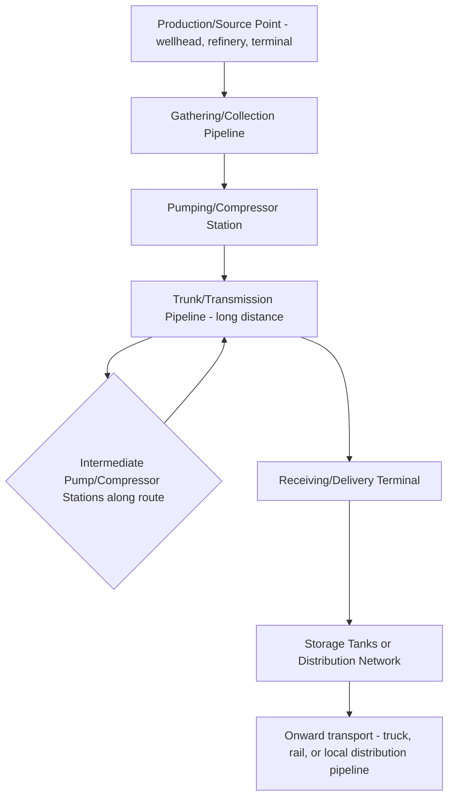
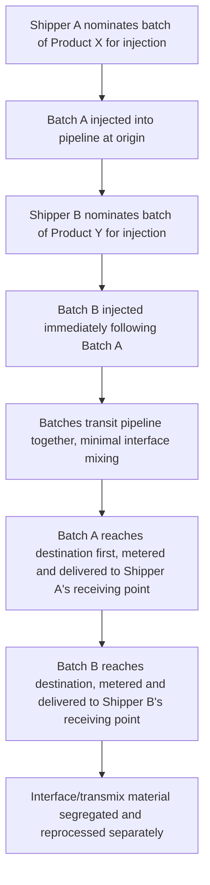
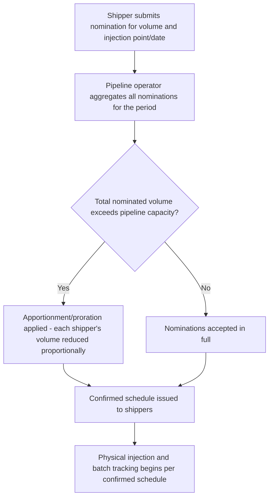

## Pipeline Transport of Liquids and Gases

### Overview

Pipeline transport moves liquids and gases through fixed, continuous conduits rather than discrete vehicle-based shipments, making it structurally distinct from every other freight mode covered so far. Instead of discrete units of cargo (containers, wagons, barges) moving between points, pipelines transport a **continuous flow** of product, with individual "shipments" existing as accounting entries (batches or nominated volumes) rather than physically distinguishable units — a fundamentally different logistics paradigm from batch-based freight modes.

### Pipeline Categories by Product

| Category | Products | Typical Diameter Range |
| --- | --- | --- |
| Crude Oil Pipelines | Unrefined petroleum from production fields to refineries | Large diameter, long-distance trunk lines |
| Refined Products Pipelines | Gasoline, diesel, jet fuel, other refined outputs from refineries to distribution terminals | Moderate diameter |
| Natural Gas Pipelines | Transmission (long-distance, high-pressure) and distribution (local, lower-pressure) gas networks | Varies significantly by transmission vs. distribution role |
| Chemical/NGL Pipelines | Natural gas liquids (ethane, propane, butane), specialty chemical products | Varies by product and volume |
| Water and Slurry Pipelines | Water conveyance, or solid material suspended in liquid (e.g., coal slurry, mineral concentrate slurry) | Varies significantly by application |

### Pipeline System Architecture

### Batch Transport in Multi-Product Pipelines

Many pipelines carry **multiple distinct products** through the same physical line sequentially, using a **batching system**:

- Different products (e.g., gasoline, then diesel, then jet fuel) are pumped in sequence through the same pipeline, with minimal physical mixing at the interface between batches
- The mixed-interface material at each batch boundary ("transmix") is typically downgraded, reprocessed, or blended back into a lower-specification product, representing a built-in efficiency loss inherent to the batching process
- Shippers **nominate** volumes for injection at specific points and scheduled times, with the pipeline operator managing the sequencing, tracking each shipper's batch through the system, and ensuring the correct volume is delivered to the correct receiving party at the destination — this scheduling/tracking function is functionally analogous to a freight forwarder's consolidation management, but applied to a continuous-flow medium rather than discrete cargo units

### Batching Process Flow

### Ownership and Operating Models

| Model | Description |
| --- | --- |
| Common Carrier Pipeline | Operates as a regulated utility-like service, accepting nominations from multiple shippers under published tariff rates and terms, analogous in spirit to a common carrier obligation in other transport modes |
| Proprietary/Private Pipeline | Owned and operated by a single company primarily for its own product movement (e.g., a producer's dedicated line from its own field to its own refinery), with limited or no third-party access |
| Joint Venture Pipeline | Owned by a consortium of companies, often built specifically to serve a shared corridor need beyond what any single owner could economically justify alone |

Common carrier pipelines typically operate under a **tariff filing system** with the relevant regulatory authority, specifying transportation rates, nomination procedures, and terms of service — conceptually similar to how rail carload service historically operated under published tariffs, though pipeline's continuous-flow physical nature makes the capacity allocation and scheduling mechanics distinct from any discrete-unit freight mode.

### Pipeline Capacity and Nomination Systems

Because pipeline capacity is finite and the product flow is continuous, shippers must **nominate** volumes in advance through a scheduling process:

**Apportionment** (or proration) — proportionally reducing each shipper's requested volume when aggregate demand exceeds available capacity — is a distinctive capacity allocation mechanism not directly paralleled in discrete-unit freight modes, where a shipper either secures a truck/railcar/container slot or does not; pipeline nomination instead allows partial fulfillment of every shipper's request simultaneously.

### Metering and Custody Transfer

Pipeline transport relies on **metering stations** at injection and delivery points to establish the precise volume transferred, since there is no physical container or discrete unit to count:

- **Custody transfer meters** at delivery points establish the legal quantity received by the receiving party, forming the basis for commercial settlement between shipper, pipeline operator, and receiving party
- Metering accuracy and calibration is a critical commercial and regulatory concern, since even small percentage discrepancies compound to significant volume/value differences at the scale pipelines typically operate
- **Line loss/gain** — the difference between total volume injected and total volume delivered across a pipeline system over a given period — is tracked and reconciled, arising from factors like temperature/pressure-related volume changes, minor leakage, or metering tolerance variance

### Documentation and Commercial Framework

Unlike batch-based freight modes, pipeline transport does not use an equivalent to a Bill of Lading, Air Waybill, or CMR Note for each individual shipment, since there is no discrete shipment in the same sense. Instead, the commercial framework relies on:

| Document/Mechanism | Function |
| --- | --- |
| Transportation Services Agreement (TSA) | The overarching contract between shipper and pipeline operator governing access, nomination rights, and terms |
| Nomination confirmations | Period-by-period (often monthly) scheduling confirmations for specific injection/delivery volumes |
| Meter tickets / custody transfer statements | Records of actual volume measured at injection and delivery points, forming the basis for invoicing |
| Pipeline tariff | The published rate schedule and general terms of service (for common carrier/regulated pipelines) |

### Safety and Regulatory Considerations

Pipeline transport is subject to extensive safety regulation given the hazards associated with high-pressure liquid/gas transport over long distances through populated and environmentally sensitive areas:

- **Integrity management programs**: ongoing inspection (including internal inspection via "smart pigs" — instrumented devices run through the pipeline to detect corrosion, deformation, or other defects), pressure testing, and corrosion control
- **Leak detection systems**: monitoring flow/pressure data to identify potential leaks, given the environmental and safety consequences of undetected pipeline failures
- **Right-of-way management**: maintaining clear, monitored corridors along the pipeline route to prevent third-party damage (e.g., from excavation) and enable inspection/maintenance access
- Regulatory oversight typically sits with a dedicated pipeline safety authority distinct from general transport regulators, reflecting the specialized hazard profile of pipeline infrastructure compared to vehicle-based freight modes

### Comparative Position Among Freight Modes

| Attribute | Pipeline |
| --- | --- |
| Product scope | Extremely narrow — liquids and gases only, no solid/packaged/containerized cargo |
| Cost per unit volume (long haul) | Very low for high-volume, sustained flow |
| Speed | Continuous flow, but overall transit time can still span days for very long pipelines given typical flow velocities |
| Flexibility | Lowest of all modes — fixed route, fixed product type compatibility, extremely high fixed capital cost to build new capacity |
| Capacity scalability | High sustained throughput once built, but effectively fixed in the short-to-medium term (new pipeline construction is a multi-year undertaking) |
| Weather sensitivity | Very low — largely unaffected by surface weather conditions once operational, a distinct advantage over road, rail, sea, or inland waterway |

Pipeline's near-total inflexibility (fixed route, fixed product compatibility, enormous fixed capital investment) is the direct tradeoff for its very low variable cost per unit once built — this positions pipeline as viable only where sustained, high-volume, long-term demand for moving a specific liquid/gas product between two fixed points justifies the infrastructure investment, in sharp contrast to road freight's opposite extreme of minimal fixed infrastructure and maximum routing flexibility.

### Practical Example

A refinery needs to receive crude oil from a production field 800 km away and ship refined gasoline to a distribution terminal 300 km away, with common carrier pipelines available on both routes.

**Inbound crude oil:**

1. Refinery (as shipper) submits a nomination to the crude pipeline operator for a specified monthly volume
2. Pipeline operator aggregates this against other shippers' nominations on the same line; if total nominated volume is within capacity, the refinery's full nomination is confirmed
3. Crude is injected at the production field's connection point, transits the pipeline continuously (with intermediate pump stations maintaining flow pressure), and is metered at the refinery's custody transfer point upon delivery
4. Settlement is based on the metered delivered volume, per the transportation services agreement's rate terms

**Outbound gasoline:**

1. Refinery nominates a batch of gasoline for injection into the refined products pipeline, scheduled to follow another shipper's diesel batch already in transit
2. The interface material between the diesel and gasoline batches is segregated as transmix at the receiving terminal and reprocessed rather than delivered to either shipper as their nominated product
3. Gasoline batch is metered and delivered to the distribution terminal's receiving point, completing the shipment without any physical unit (container, wagon, barge) having been used at any stage of the movement

**Related Topics**

- River and Canal Barge Transport (Comparative Bulk Liquid Transport Model)
- Comparing Rail Freight to Road and Sea Transport
- Bulk Liquid Terminal Operations and Tank Storage
- Pipeline Safety Regulation and Integrity Management
- Incoterms Applicability Limitations for Pipeline-Delivered Commodities
- Commodity Trading and Physical Delivery Logistics for Oil and Gas