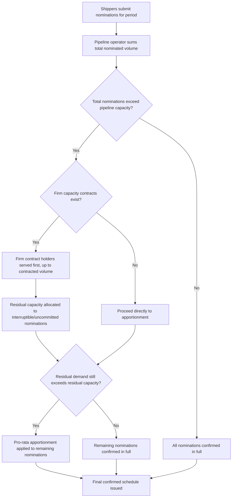

## Pipeline Capacity Allocation and Regulation

### Overview

Because pipeline capacity is physically fixed once built and product flow is continuous rather than unit-based, allocating that capacity fairly among multiple shippers — and regulating the terms under which it happens — requires mechanisms distinct from the booking/tariff systems used in discrete-unit freight modes. This topic examines the specific allocation methods, regulatory oversight models, and access frameworks that govern who gets to move product through a pipeline, and on what terms.

### Why Pipeline Capacity Allocation Differs from Other Modes

| Freight Mode | Capacity Unit | Allocation Mechanism |
| --- | --- | --- |
| Road (FTL/LTL) | Discrete truck/trailer slots | Booking, spot market, contract capacity |
| Rail | Discrete railcar/train slots | Car ordering, service contracts, unit train scheduling |
| Sea | Discrete container/vessel space | Booking, freight forwarder allocation, slot charters |
| Air | Discrete AWB/cargo space | Booking, forwarder consolidation |
| **Pipeline** | Continuous volumetric throughput | **Nomination and apportionment against finite flow capacity** |

Pipelines cannot "add another truck" or "book another container" to accommodate excess demand — the physical pipe has a fixed maximum throughput determined by diameter, pressure rating, and pump/compressor station capacity. This makes capacity allocation a recurring, structural challenge rather than an occasional peak-season issue.

### Core Allocation Methods

**Pro-Rata Apportionment**

- When total nominated volume across all shippers exceeds available capacity, each shipper's nomination is reduced proportionally to their requested share
- This is the most common default method on regulated common carrier pipelines, reflecting a principle of equal access rather than first-come-first-served or ability-to-pay allocation

**Historical/Base Period Allocation**

- Shippers with an established shipping history on the pipeline may receive priority allocation based on their historical volumes over a defined base period, with new or growing demand accommodated only from residual capacity
- This method tends to favor incumbent shippers and can create barriers for new entrants seeking pipeline access

**Open Season Bidding**

- For new pipeline capacity (either a newly constructed line or an expansion of an existing one), the pipeline developer conducts an **open season** — a formal process inviting potential shippers to bid for capacity commitments before construction proceeds
- Shippers typically commit to long-term firm capacity contracts during the open season, providing the pipeline developer with the demand certainty needed to justify the capital investment
- This mechanism directly parallels how significant new infrastructure investment across other freight modes (e.g., a dedicated unit train loop facility) often requires anchor shipper commitments before construction is justified

**Interruptible vs. Firm Service**

| Service Type | Characteristic |
| --- | --- |
| Firm Service | Shipper has a guaranteed capacity right, typically under a long-term contract, and is served ahead of interruptible shippers during any capacity constraint |
| Interruptible Service | Shipper accesses any available residual capacity beyond firm commitments, at typically lower rates, but service can be curtailed first if capacity becomes constrained |

This firm/interruptible distinction is conceptually similar to the difference between a rail shipper under a dedicated unit train service contract (firm, guaranteed) versus an ad hoc carload tariff shipper (subject to available capacity and scheduling).

### Capacity Allocation Decision Flow

### Regulatory Oversight Models

Pipeline regulation typically addresses two intertwined concerns: **rate regulation** (ensuring tariff rates are just and reasonable, particularly where a pipeline holds significant market power over a given corridor) and **access regulation** (ensuring non-discriminatory access for shippers, particularly third parties not affiliated with the pipeline owner).

| Regulatory Concern | Typical Mechanism |
| --- | --- |
| Rate reasonableness | Tariff filing and review by the relevant regulatory authority, sometimes with rate-of-return or price-cap methodologies |
| Non-discriminatory access | Common carrier obligations requiring the pipeline to serve all shippers on equivalent terms, preventing an owner from favoring its own affiliated shipments over third-party shippers |
| Market power / monopoly concerns | Regulatory scrutiny is often heightened where a pipeline is the only practical transport option for a given corridor (a "bottleneck" facility), since the owner could otherwise extract monopoly rents from captive shippers |
| Safety and environmental compliance | Separate from rate/access regulation, typically overseen by a dedicated pipeline safety authority (covered under pipeline transport fundamentals) |

[Unverified — specific regulatory bodies, rate-setting methodologies, and the degree of common carrier obligation imposed vary substantially by country and by whether a given pipeline is classified as an interstate/international common carrier versus a private/proprietary line; applicable regulatory framework should be confirmed against the specific jurisdiction and pipeline classification in question]

### Third-Party Access Regimes

A central regulatory question for pipeline networks, particularly in the natural gas and oil sectors, is whether and how **third parties** (shippers unaffiliated with the pipeline owner) can access capacity on a pipeline built and operated by another company:

- **Negotiated Third-Party Access (nTPA)**: access terms are negotiated bilaterally between the pipeline owner and the requesting shipper, with regulatory oversight limited to ensuring the negotiation occurs in good faith
- **Regulated Third-Party Access (rTPA)**: access terms (including rates) are set or approved by the regulator according to published rules, reducing the pipeline owner's discretion to deny or disadvantage third-party shippers
- **Vertical separation / unbundling**: in some regulatory regimes, particularly in natural gas markets, pipeline transportation is structurally or at least operationally separated from the ownership of the gas itself, specifically to prevent a vertically integrated company from using pipeline ownership to disadvantage competing gas suppliers

This tension — between an infrastructure owner's incentive to prioritize its own affiliated business and the broader market's interest in open access to essential infrastructure — is a recurring theme in pipeline regulation globally, though the specific regulatory solution adopted (negotiated access, regulated access, or ownership unbundling) varies significantly by country and sector. [Inference — the general policy tension described here reflects a widely recognized economic principle regarding "essential facilities," but the specific regulatory regime in force for any given pipeline should be verified against that jurisdiction's current energy/pipeline regulatory framework rather than assumed from this general description]

### Tariff Rate-Setting Approaches

| Approach | Description |
| --- | --- |
| Cost-of-Service / Rate-of-Return | Regulator sets rates to allow the pipeline to recover prudently incurred costs plus a reasonable return on invested capital |
| Price Cap Regulation | Regulator sets a maximum allowable rate (or rate escalation formula) for a defined period, giving the pipeline operator an incentive to control costs below the cap to retain the difference as profit |
| Negotiated/Market-Based Rates | In sufficiently competitive corridors (multiple pipeline or alternative transport options available), rates may be permitted to be negotiated directly between pipeline and shipper with reduced regulatory rate-setting involvement |

The choice of rate-setting approach often correlates with the degree of competition present on a given corridor — a pipeline facing genuine competitive alternatives (other pipelines, rail, or waterway options for the same origin-destination-product combination) is more likely to be permitted market-based rates, while a pipeline with effective monopoly control over its corridor is more likely to face cost-of-service or price-cap regulation.

### Congestion and Capacity Expansion Signals

Persistent apportionment (shippers routinely receiving less than their full nominated volume) serves as a market signal indicating capacity constraint, which can trigger:

- **Capacity expansion projects**: adding pump/compressor stations, looping (adding a parallel pipeline segment) to increase throughput on the constrained segment, or full new pipeline construction
- **Open season processes** (as described above) to gauge firm demand and secure anchor shipper commitments before committing capital to expansion
- **Rate incentive mechanisms**: in some regulatory frameworks, pipelines facing sustained apportionment may be permitted enhanced rate treatment for expansion capital, reflecting the demonstrated market need

### Practical Example

A common carrier crude oil pipeline connects an inland production region to a coastal export terminal. Three shippers (A, B, and C) each nominate volumes for the coming month, and total nominations exceed the pipeline's throughput capacity by 20%.

1. Pipeline operator first checks for firm capacity contracts: Shipper A holds a long-term firm contract for a fixed volume, secured during an open season when the pipeline was originally expanded
2. Shipper A's firm volume is confirmed in full, ahead of any apportionment
3. Remaining capacity (after satisfying Shipper A's firm commitment) is insufficient to cover the combined interruptible nominations from Shippers B and C
4. Pro-rata apportionment is applied to Shippers B and C's remaining nominations, each receiving a proportionally reduced volume relative to what they requested
5. The pattern of recurring apportionment on this corridor, observed over several months, becomes a signal considered by the pipeline operator when evaluating a potential looping project to add capacity — with a new open season likely conducted to secure firm commitments from Shippers B and C (or new entrants) before proceeding with the expansion investment

**Related Topics**

- Pipeline Transport of Liquids and Gases
- River and Canal Barge Transport (Comparative Bulk Commodity Infrastructure)
- Commodity Trading and Physical Delivery Logistics for Oil and Gas
- Pipeline Safety Regulation and Integrity Management
- Comparing Rail Freight to Road and Sea Transport
- Unit Train Service Contracts and Anchor Shipper Commitments (Comparative Capacity Commitment Model)