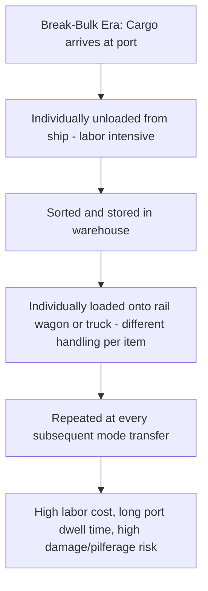
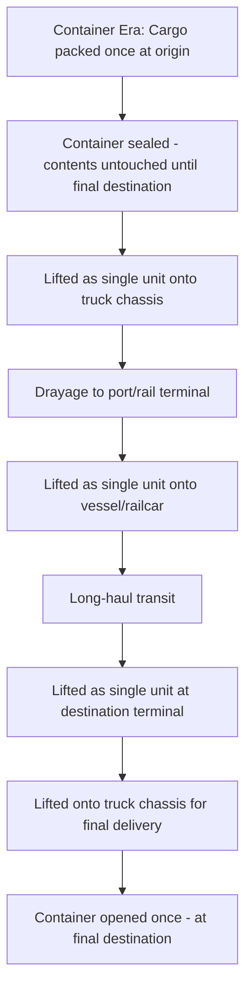

## Containerization as an Enabler of Intermodalism

### Overview

Containerization — the standardization of cargo into uniform, stackable steel boxes with universally recognized dimensions and handling fittings — is the single innovation most credited with enabling modern intermodal transport at global scale. By making the cargo unit itself identical regardless of which mode carries it, containerization decoupled cargo handling from mode-specific equipment, allowing the same physical box to move seamlessly from ship to rail to truck without ever opening or repacking its contents.

### The Core Problem Containerization Solved

Before standardized containers, freight moved as **break-bulk cargo** — individually handled crates, sacks, barrels, and pallets, each loaded and unloaded by hand or with mode-specific equipment at every transfer point between modes:

Every mode transfer under break-bulk handling required distinct labor, equipment, and time, and cargo sat exposed to damage, theft, and weather at each handling point. Port dwell times of a week or more were common, with the majority of a break-bulk vessel's total voyage time often spent in port loading/unloading rather than at sea.

### The Standardized Container Solution

The transformative shift: cargo is packed **once** and handled as a **single, standardized unit** across every subsequent mode transfer, with generic lifting equipment (cranes, reach stackers) replacing the diverse, labor-intensive handling methods break-bulk cargo required.

### ISO Standard Container Dimensions

Standardization under ISO specifications is what makes a container universally compatible with ships, railcars, chassis, and cranes worldwide, regardless of manufacturer or country of origin:

| Container Type | Length | Common Use |
| --- | --- | --- |
| 20-foot (TEU) | ~6.1 m | General cargo, heavier/denser goods (weight often limits before volume does) |
| 40-foot (2 TEU / 1 FEU) | ~12.2 m | General cargo, most common ocean container size |
| 40-foot High Cube | ~12.2 m, taller | Voluminous, lighter cargo |
| 45-foot | ~13.7 m | Higher-capacity international and some domestic use |

The **TEU (Twenty-foot Equivalent Unit)** is the standard industry measure of container capacity, used to express vessel capacity, port throughput, and trade volume statistics across the entire industry regardless of the actual mix of 20-ft and 40-ft containers involved.

### Standardized Fittings: The Technical Enabler

Beyond overall dimensions, containerization's interoperability depends on standardized **corner castings and twist-lock fittings** at each of the container's eight corners:

- These fittings allow **any** compliant crane, spreader, chassis, or railcar to securely lift, stack, and lock a container regardless of manufacturer, shipping line, or country of origin
- This is the specific technical detail that makes true intermodal interchangeability possible — without standardized corner fittings, a container built by one manufacturer might not be liftable or securable by another operator's equipment, undermining the entire interoperability premise
- The same fittings enable secure **stacking** (containers stacked on ships up to many tiers high, or double-stacked on rail well cars), since the corner castings transmit stacking loads predictably through aligned corner posts

### Container Types Beyond General Dry Cargo

| Type | Purpose |
| --- | --- |
| Standard Dry Container | General cargo, fully enclosed |
| Refrigerated ("Reefer") | Temperature-controlled cargo, integrated cooling unit |
| Open Top | Cargo requiring top-loading (e.g., machinery too tall for standard doors) |
| Flat Rack | Oversized/out-of-gauge cargo, no side walls |
| Tank Container | Bulk liquids/gases in a standardized ISO frame |
| Ventilated Container | Cargo requiring airflow (e.g., certain agricultural products) without full refrigeration |

Each specialized type retains the same standardized external dimensions and corner-casting interface, meaning even non-standard cargo needs are accommodated **without sacrificing intermodal compatibility** — a flat rack or tank container is still liftable, stackable, and transportable by the exact same cranes, chassis, and railcars as a standard dry container.

### How Containerization Enabled Each Mode's Intermodal Role

| Mode | Containerization's Enabling Effect |
| --- | --- |
| Ocean | Purpose-built container vessels (replacing general break-bulk ships) achieve massive scale economies through high-density stacking, directly enabling sea freight's structurally low cost per unit at scale |
| Rail | Double-stack well cars (covered under intermodal rail) exploit the container's stackability specifically, a capability impossible with TOFC trailers or break-bulk rail cargo |
| Road | Chassis-based drayage (covered under drayage operations) allows any compliant truck/chassis combination to move any compliant container, without requiring cargo-specific trailer types for most general freight |
| Terminal handling | Generic gantry cranes, reach stackers, and top handlers — rather than mode/cargo-specific handling equipment — became viable specifically because every container presents the same lifting interface |

### Economic Impact on Freight Documentation and Trade

Containerization's standardization effect extends beyond physical handling into the documentation and legal frameworks covered elsewhere in this material:

- **Through Bills of Lading** and combined transport documents (covered under intermodal rail) became commercially practical specifically because a single container's integrity and identity persist unchanged across the entire multi-modal journey — the same container number appears consistently from origin Bill of Lading through to final delivery, regardless of how many mode transfers occurred
- **Container seals** provide a simple, verifiable mechanism (analogous in function to the customs seals used in the TIR Carnet system for road freight) confirming the container has not been opened between origin sealing and destination inspection, supporting both commercial cargo integrity assurance and customs control objectives
- **Equipment Interchange Reports** (covered under drayage operations) rely on the container's standardized identity and condition-recording framework to allocate custody and liability at each handling transfer point

### Containerization's Limits

Not all cargo benefits from or is suited to containerization, and understanding these boundaries clarifies why other cargo-handling models (bulk, break-bulk, project cargo) persist alongside containerized freight:

| Cargo Type | Why Containerization Doesn't Apply |
| --- | --- |
| Bulk commodities (grain, coal, ore, crude oil) | Value density too low to justify container handling cost; bulk vessel/railcar/barge handling is more efficient at the required volumes |
| Oversized/project cargo | Exceeds standard container dimensions entirely, requiring flat rack, break-bulk, or specialized heavy-lift handling |
| Very low-volume/infrequent shippers | May not achieve sufficient container-load volume to justify full container use, relying instead on LCL (Less than Container Load) consolidation services analogous in concept to LTL road freight consolidation |

This is precisely why the freight modes and equipment types covered elsewhere in this material — unit trains, barges, pipelines, bulk vessels — remain essential alongside containerization rather than being superseded by it: containerization solved the general/mixed cargo intermodal problem specifically, while bulk and specialized cargo retain their own mode-specific optimal handling approaches.

### Practical Example

A manufacturer ships machine parts from an inland factory to an overseas buyer, illustrating containerization's end-to-end enabling effect:

1. Parts are packed into a standard 40-ft dry container at the factory — the **only** time the cargo is physically packed/unpacked until it reaches the buyer
2. Container is sealed, and a drayage truck (using a standard chassis compatible with any ISO container) moves it to the nearest rail intermodal ramp
3. Container is lifted by gantry crane onto a double-stack well car — the same corner-casting interface used at the factory's loading dock now interfaces with entirely different lifting/securing equipment at the rail ramp, with no modification to the container itself
4. Container travels by rail to the port, is lifted again by a different crane onto an ocean vessel, stacked among thousands of other containers from unrelated shippers and shipping lines, all sharing the identical physical interface
5. At the destination port, the container is lifted off, potentially moved by rail or truck again, and finally delivered to the buyer's facility where it is opened for the first time since leaving the factory
6. Throughout this journey — spanning truck, rail, and ocean vessel, operated by entirely separate companies — the cargo itself was never touched, repacked, or exposed, and the entire movement was trackable and documentable via the single consistent container number, illustrating precisely why containerization is considered the structural foundation enabling all the mode-specific intermodal mechanics (drayage, double-stack rail, vessel stowage) covered elsewhere in this material

**Related Topics**

- Drayage and Port Trucking Operations
- Intermodal Rail and Container on Flatcar Service
- Bill of Lading Types (Through Bill of Lading, Combined Transport Document)
- Less than Container Load (LCL) Consolidation Services
- Comparing Rail Freight to Road and Sea Transport
- Container Types and Specialized Equipment for Non-Standard Cargo