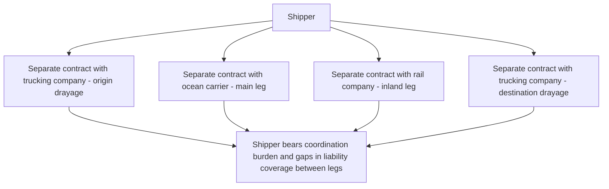
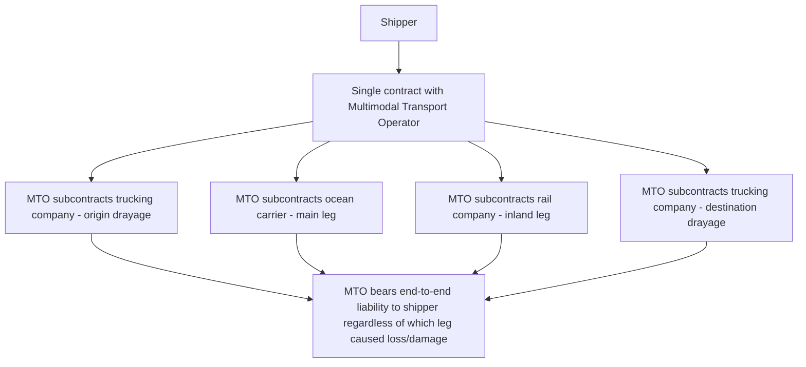
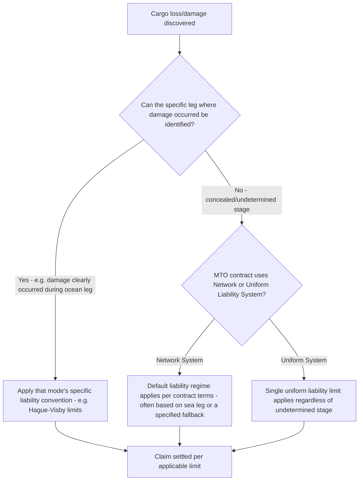

## Multimodal Transport Operators

### Overview

A **Multimodal Transport Operator (MTO)** is a single contracting party that takes responsibility for an entire door-to-door shipment spanning two or more modes of transport, issuing one contract and one set of transport documentation covering the whole journey, regardless of how many actual carriers physically perform each leg. This concept sits at the commercial and legal core of intermodalism: containerization (covered separately) made the physical handoff between modes seamless, but the MTO framework is what makes the **legal and commercial** handoff seamless for the shipper.

### The Core Problem MTOs Solve

Without an MTO, a shipper moving cargo across ocean, rail, and road legs would need to contract separately with each carrier:

This fragmented approach creates **liability gaps** at each handoff point — if cargo is damaged during a transfer between two carriers, determining which carrier's contract and which liability convention applies can become a genuinely disputed question, particularly when the damage's exact timing/location is unclear.

### The MTO Model

The shipper contracts with **one party** (the MTO), which issues a single **Multimodal Transport Document (MTD)** or **Combined Transport Bill of Lading**, and is responsible to the shipper for the cargo's safe carriage across the entire journey — regardless of which actual subcontracted carrier physically caused any loss or damage, and regardless of which specific leg it occurred on.

### Who Acts as an MTO

| Entity Type | Role as MTO |
| --- | --- |
| Ocean Carrier (Vessel-Operating) | Many container shipping lines act as MTOs by extending their Bill of Lading to cover inland rail/road legs beyond the port, issuing a "Combined Transport" or "Through" Bill of Lading |
| Freight Forwarder / NVOCC | Non-Vessel-Operating Common Carriers frequently act as MTOs, contracting with the shipper for the full door-to-door movement while subcontracting the actual ocean, rail, and road legs to underlying carriers |
| Dedicated Multimodal Transport Company | Some companies specialize purely in the MTO role, owning no transport assets themselves but taking full contractual responsibility for arranging and guaranteeing multimodal movements |

An MTO does not need to own any of the actual transport assets (vessels, railcars, trucks) used — the defining characteristic is **contractual responsibility for the whole journey**, not physical asset ownership. This is analogous in structure to how a freight forwarder in air freight consolidates and takes responsibility for HAWB shipments without owning the aircraft, but extended across multiple different modes rather than a single mode.

### The Multimodal Transport Document (MTD)

| Feature | Description |
| --- | --- |
| Single document | Covers the entire journey from origin receipt to final delivery, regardless of mode changes en route |
| Issuing party | The MTO, acting as principal (not merely as an agent for the underlying carriers) |
| Legal function | Evidence of the multimodal transport contract, receipt of goods, and (depending on form) potentially a document of title |
| Negotiability | Can be issued as negotiable or non-negotiable, depending on the MTO's practice and the shipper's requirements — a negotiable MTD functions similarly to a negotiable ocean Bill of Lading in enabling trade finance/Letter of Credit transactions |

### Legal Liability Frameworks for Multimodal Transport

Unlike single-mode transport, where a single convention (Montreal, CMR, CIM, Hague-Visby) applies cleanly across the entire movement, multimodal transport liability is legally more complex because the applicable rules can depend on **where in the journey** a loss occurred:

**Network Liability System**

- If the stage of the journey where loss/damage occurred can be identified, the liability rules applicable to that specific mode apply (e.g., Montreal Convention limits if loss occurred during the air leg, Hague-Visby limits if it occurred during the sea leg)
- If the stage cannot be identified (**concealed damage/loss**), a default liability regime (often based on the sea leg's rules, or a specifically negotiated MTO liability clause) applies instead

**Uniform Liability System**

- A single liability standard applies regardless of which leg the loss occurred on, providing simplicity and predictability at the potential cost of not perfectly matching each mode's own specialized liability framework

**UN Multimodal Transport Convention (1980)**

- An international convention specifically intended to create a uniform multimodal liability framework, though it has not achieved the widespread ratification of the single-mode conventions (Hague-Visby, Montreal, CMR, CIM), meaning most multimodal contracts in practice rely on **standard trade terms and conditions published by industry bodies** (such as FIATA's Multimodal Transport Bill of Lading terms) rather than a single universally binding treaty [Unverified — current ratification status of the UN Multimodal Transport Convention and the prevailing industry practice framework should be verified against current international trade law sources, as this area has historically been less harmonized than single-mode conventions]

### Liability Determination Flow

### FIATA and Industry Standard Documentation

In the absence of universal treaty ratification, industry bodies have developed widely used standard document formats and terms:

- **FIATA FBL (FIATA Multimodal Transport Bill of Lading)**: a standardized document format used by freight forwarders acting as MTOs, incorporating FIATA's standard trading conditions covering liability, jurisdiction, and other contractual terms
- These industry-standard documents function as a practical substitute for a universally ratified convention, providing shippers and forwarders a commonly recognized document format even though its legal force ultimately derives from contract law (the terms printed on/incorporated into the document) rather than an international treaty with the force of law independent of contractual agreement

### MTO Responsibilities Beyond Transport Contracting

Beyond arranging carriage, MTOs typically also handle or coordinate:

- **Customs documentation and clearance coordination** at both origin and destination, and at any intermediate customs transit points
- **Cargo insurance arrangement** (if requested by the shipper, as a value-added service beyond the base multimodal transport contract)
- **Consolidation and deconsolidation** (particularly for freight forwarder-MTOs handling multiple shippers' cargo, paralleling the HAWB/MAWB consolidation model in air freight)
- **Milestone tracking and status reporting** across the full multimodal journey, providing the shipper a single point of visibility rather than requiring the shipper to track status separately with each underlying carrier

### Practical Example

A shipper needs to move goods from an inland factory to an inland destination in another country, requiring drayage, ocean, and rail legs, and engages a freight forwarder acting as MTO.

1. Shipper contracts with the freight forwarder (MTO) for door-to-door delivery, receiving a single FIATA FBL document covering the entire movement
2. MTO subcontracts a local trucking company for origin drayage to the port, an ocean carrier for the main sea leg, and a rail operator for the inland leg at destination
3. During the sea leg, a container is damaged due to rough weather exposure on deck
4. Since the damage clearly occurred during the identifiable ocean leg, the network liability system applies the Hague-Visby (or applicable ocean liability convention) limits to determine the MTO's compensation liability to the shipper
5. The shipper claims directly against the MTO (the freight forwarder), not against the underlying ocean carrier — the MTO, in turn, may separately pursue recovery from its own subcontracted ocean carrier under their own carriage contract, but this recourse relationship is entirely separate from, and does not delay or complicate, the shipper's own claim against the MTO
6. This single point of claim contact is precisely the commercial value the MTO structure provides: the shipper never needs to determine independently which of three different subcontracted carriers to pursue, nor navigate three potentially different liability conventions directly

**Related Topics**

- Containerization as an Enabler of Intermodalism
- Bill of Lading Types (Through Bill of Lading, Combined Transport Document)
- Air Waybills and Air Freight Documentation (Comparative Forwarder Consolidation Model)
- Freight Forwarders and NVOCCs — Roles and Liability
- UN Multimodal Transport Convention and FIATA Standard Terms
- Cargo Claims and Liability Frameworks Across Transport Modes