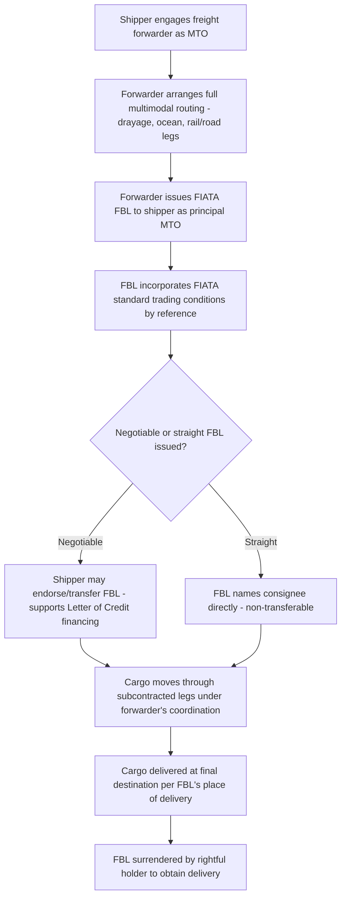

## Combined Transport Documents and the FIATA FBL

### Overview

Combined transport documents are the specific paper/electronic instruments that give legal effect to the Multimodal Transport Operator (MTO) model covered previously — they are what a shipper actually receives and relies upon when engaging an MTO for a door-to-door, multi-leg shipment. The **FIATA FBL (FIATA Multimodal Transport Bill of Lading)** is the most widely used standardized example of such a document, developed by the International Federation of Freight Forwarders Associations (FIATA) to provide a globally recognized format in the absence of a single, universally ratified multimodal transport treaty.

### Terminology: Combined Transport vs. Multimodal Transport Documents

The terms are used largely interchangeably in commercial practice, though some distinctions are sometimes drawn:

| Term | Common Usage |
| --- | --- |
| Combined Transport Document (CTD) | Generic term for any document covering carriage by two or more modes under a single contract |
| Multimodal Transport Document (MTD) | Often used more formally, particularly with reference to the UN Multimodal Transport Convention's terminology |
| Through Bill of Lading | Historically used, particularly where an ocean carrier extends its own Bill of Lading to cover an inland leg, sometimes acting more as an agent arranging the inland leg than as full principal MTO |
| FIATA FBL | A specific, branded, standardized document format issued under FIATA's model, incorporating FIATA's standard trading conditions |

[Unverified — the precise legal distinctions drawn between these terms, where they exist, can vary by jurisdiction and by the specific document's own printed terms; in much day-to-day commercial usage they function as broadly synonymous labels for the same underlying concept]

### The FIATA FBL's Origin and Purpose

FIATA developed the FBL specifically to address the practical gap left by the UN Multimodal Transport Convention (1980) never achieving the broad ratification needed to function as a universally binding legal framework (as noted under Multimodal Transport Operators). Rather than shippers and forwarders operating without any standardized document at all, FIATA created a model form that:

- Freight forwarders acting as MTOs could adopt as their standard document
- Incorporates a consistent set of **standard trading conditions** governing liability, jurisdiction, and other contractual terms
- Provides banks, customs authorities, and trading partners worldwide with a recognizable, consistently structured document format, even though its binding force derives from contract law (the terms printed on and incorporated into the document) rather than direct treaty law

### FIATA FBL Structure and Key Fields

| Field Group | Content |
| --- | --- |
| Issuer identification | The freight forwarder/MTO issuing the document, as principal (not as agent) |
| Consignor/Consignee | Parties to the shipment |
| Place of receipt / Place of delivery | The full door-to-door scope — critically, these are often inland points, not just port-to-port, distinguishing the FBL's scope from a standard ocean Bill of Lading |
| Ocean vessel / Pre-carriage / On-carriage details | Identifies the specific legs and carriers involved, even though the MTO holds unified responsibility |
| Goods description | Standard cargo description, packaging, marks, weight |
| Freight and charges | Prepaid/collect designation, as with single-mode documents |
| FIATA standard conditions reference | Incorporation by reference of FIATA's standard trading conditions governing the contract |
| Negotiability designation | Whether issued as negotiable ("to order") or non-negotiable (straight consignment) |

### Negotiable vs. Non-Negotiable FBLs

A defining commercial feature of the FIATA FBL is that — unlike an Air Waybill or CMR Note, both of which are inherently non-negotiable — the FBL **can be issued as a negotiable document**, similar in function to a negotiable ocean Bill of Lading:

| Form | Function |
| --- | --- |
| Negotiable FBL ("to order") | Can be endorsed and transferred, functioning as a document of title enabling the underlying goods to be bought/sold while in transit, and supporting Letter of Credit trade finance transactions |
| Non-Negotiable/Straight FBL | Names a specific consignee directly; not transferable by endorsement, simpler but less flexible for trade finance purposes |

This negotiability option is significant precisely because it allows the FBL to serve trade finance functions that a straight Air Waybill or CMR Note structurally cannot — a shipper using multimodal transport with a negotiable FBL retains the same trade finance flexibility as a shipper using a traditional negotiable ocean Bill of Lading, despite the shipment actually involving multiple modes.

### FIATA Standard Trading Conditions — Key Liability Provisions

The FBL's legal substance largely derives from FIATA's standard trading conditions incorporated by reference into the document, typically addressing:

- **Basis of liability**: generally a network liability system (as introduced under Multimodal Transport Operators) — applying the relevant single-mode convention's limits where the loss location is known, with a fallback limit for concealed/undetermined-location loss
- **Liability limits**: typically expressed per package/unit or per kilogram, using an SDR-based unit of account consistent with the broader pattern seen across Montreal, CMR, and CIM conventions
- **Time bar for claims**: a defined limitation period within which claims must be brought against the MTO
- **Jurisdiction and applicable law**: specifying which country's courts and law govern disputes arising under the FBL

[Unverified — specific numeric liability limits and time-bar periods under current FIATA standard conditions should be verified against FIATA's currently published model conditions, as these are periodically reviewed and updated]

### FBL Issuance and Document Flow

### FBL's Relationship to Underlying Carrier Documents

It is important to distinguish the FBL (the shipper-facing MTO contract) from the separate transport documents the MTO itself receives from each subcontracted carrier:

| Document Layer | Party Relationship |
| --- | --- |
| FIATA FBL | Between shipper and MTO (freight forwarder), covering the entire door-to-door movement |
| Ocean carrier's Bill of Lading | Between MTO (as shipper, from the ocean carrier's perspective) and the ocean carrier, covering only the sea leg |
| Rail/road carrier's transport document (e.g., CIM Note, CMR Note) | Between MTO (as shipper, from that carrier's perspective) and the underlying rail/road carrier, covering only that specific leg |

The original shipper never sees or needs to directly reference these underlying carrier documents — from the shipper's perspective, the FBL is the **only** document governing the transaction, with the MTO managing the layered set of underlying carrier contracts entirely behind the scenes. This layered document structure is the practical mechanism by which the MTO absorbs the coordination complexity that would otherwise fall on the shipper under a fragmented, multi-contract arrangement.

### Bank and Letter of Credit Acceptance

Because international trade finance frequently relies on presenting compliant transport documents to a bank under a Letter of Credit, the FBL's design specifically anticipates this use case:

- Banks operating under internationally recognized trade finance rules generally accept a properly issued multimodal transport document (including the FIATA FBL) as compliant presentation, provided it meets the specific requirements stated in the Letter of Credit and the applicable trade finance rules governing document examination
- This banking acceptance is precisely why the FBL's negotiability option matters commercially — a shipper relying on Letter of Credit financing needs assurance that the transport document they will present is one banks will recognize and accept, and the FIATA FBL was specifically designed with this trade finance interoperability in mind

[Unverified — specific document examination requirements and acceptance practices under Letters of Credit are governed by internationally used banking practice rules (such as UCP-based frameworks) and by the specific terms of each Letter of Credit; current requirements should be confirmed against the applicable rules and the specific LC terms for any actual trade finance transaction]

### Practical Example

An exporter sells goods to an overseas buyer under a Letter of Credit requiring presentation of a "multimodal transport document," with the shipment moving via truck drayage, ocean vessel, and inland rail to the buyer's inland destination.

1. Exporter engages a freight forwarder to act as MTO for the full door-to-door movement
2. Forwarder issues a **negotiable FIATA FBL**, naming the place of receipt as the exporter's factory and the place of delivery as the buyer's inland destination — spanning all three legs under one document
3. Exporter presents the FBL (along with other required documents — commercial invoice, packing list, certificate of origin) to their bank under the Letter of Credit
4. Bank examines the FBL against the Letter of Credit's stated requirements and the applicable trade finance document-examination rules, confirming it qualifies as an acceptable multimodal transport document
5. Upon compliant presentation, payment is released to the exporter under the Letter of Credit mechanism — occurring independently of, and generally well before, the cargo's actual physical arrival at the buyer's inland destination, illustrating how the FBL's negotiable, trade-finance-compatible design directly enables the underlying commercial transaction to settle promptly despite the shipment's multi-leg, multi-week physical journey

**Related Topics**

- Multimodal Transport Operators
- Containerization as an Enabler of Intermodalism
- Bill of Lading Negotiability and Letter of Credit Trade Finance
- UN Multimodal Transport Convention and Network vs. Uniform Liability Systems
- Air Waybills and Air Freight Documentation (Comparative Non-Negotiable Document Model)
- CMR and CIM Consignment Notes (Underlying Leg Documentation)