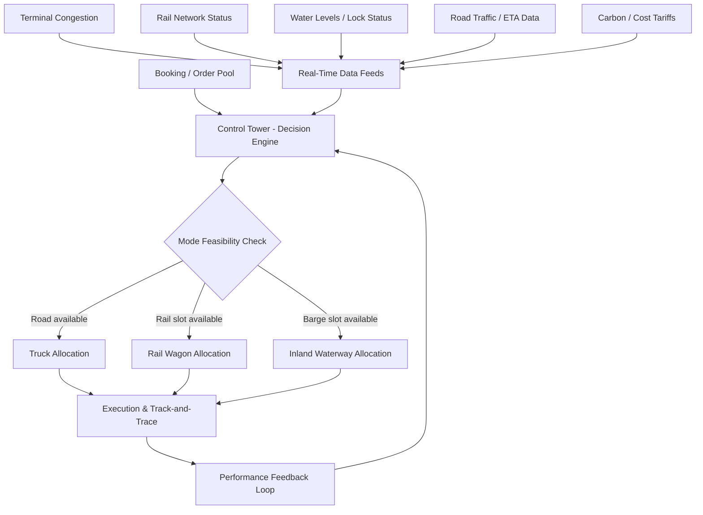

## Synchromodality and Modal Shift Strategies

### Definition and Conceptual Foundation

Synchromodality is a logistics planning approach in which a shipper or logistics service provider retains the flexibility to dynamically switch a shipment between transport modes (road, rail, inland waterway, short-sea, or air) during the planning or execution phase, based on real-time information about capacity, cost, transit time, and network conditions, without the shipper having to commit to a fixed mode at booking time.

This distinguishes synchromodality from earlier, related concepts:

- **Intermodal transport**: a single shipment moves in one standardized loading unit (container, swap body, trailer) across two or more modes, but the mode sequence is fixed in advance.
- **Multimodal transport**: similar to intermodal, but under a single contract of carriage covering multiple modes, with the routing predetermined at contracting.
- **Co-modality**: an EU policy-era concept (circa 2006) advocating efficient use of different modes individually or in combination, but without the real-time decision layer.
- **Synchromodality**: adds a control-tower layer that allows *mode reassignment after initial planning*, driven by live data feeds (traffic, water levels, terminal congestion, wagon availability), so the network — not the individual shipment — is optimized.

**Key Points**

- The unit load (container/trailer) is mode-agnostic by design, which is the physical precondition for synchromodality.
- Decision-making shifts from the shipper (mode choice at origin) to a logistics orchestrator (often a 4PL or control tower) that reallocates capacity across a pool of shipments.
- The goal is network-level optimization (aggregate cost, emissions, reliability) rather than shipment-level optimization.

### The Control Tower and Data Architecture

Synchromodal execution depends on a "control tower" function that ingests data and issues (or recommends) mode-reassignment decisions. A typical architecture:

Core data inputs typically include:

1. **Capacity data**: real-time or near-real-time slot availability from rail operators, barge operators, and trucking pools.
2. **Network condition data**: terminal dwell times, congestion at hubs, lock/lift bridge schedules on waterways, rail possessions (maintenance windows).
3. **Commercial data**: freight rates by mode (which fluctuate independently of each other), demurrage/detention exposure, and contractual transit-time commitments (SLAs).
4. **External/environmental data**: water depth on rivers (critical for barge feasibility, e.g., Rhine low-water events), weather, and emissions factors (for carbon-cost optimization under schemes like EU ETS extension to transport or internal carbon pricing).

[Inference] Many production control towers combine a rules engine (hard constraints: cut-off times, dangerous goods restrictions, customs status) with an optimization layer (linear programming or heuristic search) to select among feasible mode combinations, though the exact algorithmic approach is operator-specific and not standardized.

### Modal Shift Strategy Types

**Key Points**

- *Reactive modal shift*: triggered by a disruption (e.g., rail derailment, low Rhine water levels) forcing an already-planned rail/barge leg onto road at short notice.
- *Proactive/planned modal shift*: policy-driven, long-horizon shift of freight from road to rail or inland waterway to meet sustainability targets, cost structures, or regulatory pressure (e.g., EU's Green Deal modal shift targets, low-emission zones).
- *Opportunistic modal shift*: exploiting short-term price or capacity arbitrage between modes for non-time-critical freight (e.g., using barge for freight with slack in its delivery window).
- *Threshold-based shift*: predefined rules such as "if rail transit time exceeds X hours beyond baseline, reroute via road" — a simpler, rules-based precursor to full synchromodal optimization.

### Quantitative Decision Framework

A simplified generalized cost function used in modal choice and shift decisions:

$$GC_m = C_m + VOT \cdot T_m + VOR \cdot R_m + E_m \cdot P_{CO_2}$$

Where, for mode $m$:

- $C_m$ = direct freight cost
- $VOT$ = value of time (shipper's cost of transit-time)
- $T_m$ = transit time
- $VOR$ = value of reliability (penalty weighting for variability)
- $R_m$ = reliability/variance measure (e.g., standard deviation of transit time)
- $E_m$ = emissions per shipment for mode $m$
- $P_{CO_2}$ = internal or regulatory carbon price

A shift from mode $m_1$ to $m_2$ is triggered when $GC_{m_2} < GC_{m_1}$, subject to hard constraints (cut-off times, equipment availability, dangerous goods compatibility).

**Example**

A shipper has a 40-ft container moving Rotterdam–Duisburg, normally planned via barge ($C=€180$, $T=30h$). A low-water event on the Rhine reduces barge draft, effectively cutting payload and raising the *effective* per-container cost to €340 with $T=52h$ (uncertain). Rail intermodal is available at $C=€260$, $T=18h$, more reliable. Using the generalized cost function with a moderate $VOT$ and $VOR$, rail's generalized cost is lower once the barge delay risk is priced in, so the control tower reassigns the shipment to rail — an example of reactive, water-level-triggered modal shift.

### Enabling Infrastructure and Standardization Requirements

Synchromodality is only physically feasible when the following are in place:

- **Standardized unit loads**: ISO containers, swap bodies, or craneable semi-trailers that can be lifted between road chassis, rail wagons, and barges without repacking.
- **Multimodal terminal capability**: trimodal terminals (road-rail-water) or at minimum bimodal hubs positioned to allow reassignment without excessive drayage.
- **Interoperable data exchange**: EDI/API standards (e.g., EDIFACT IFTMIN/IFTSTA messages, or newer API-based platforms) so capacity and status data from independent carriers can feed a shared control tower.
- **Neutral or multi-carrier contracting**: framework agreements that allow the orchestrator to allocate volume across competing rail, barge, and road providers without single-carrier lock-in.

### Barriers and Limitations

**Key Points**

- **Fixed schedules**: rail and barge operate on timetables with fixed departure windows; late reassignment may miss the next available slot, effectively defaulting to road.
- **Cut-off times**: terminal and customs cut-offs constrain how late in the process a mode switch can occur.
- **Asset repositioning**: empty container/wagon repositioning costs are not always visible to shipment-level optimization but matter at network level.
- **Contractual rigidity**: long-term single-mode contracts (e.g., annual rail slot agreements) reduce the flexible capacity pool available for synchromodal reassignment.
- **Data fragmentation**: lack of standardized, real-time data sharing between competing carriers remains a persistent adoption barrier. [Unverified] The degree to which this barrier has been resolved varies significantly by region and corridor, with Northwest Europe (Rotterdam–Rhine–Alps corridor) generally cited as more mature than other geographies.
- **Trust and governance**: carriers may be reluctant to expose real-time capacity data to a control tower that could favor competitors.

### Regional Context and Policy Drivers

The most developed synchromodal networks are typically cited in the Rotterdam–Antwerp–Duisburg hinterland corridor, where high container volumes, dense trimodal terminal infrastructure, and the Rhine waterway create the density needed for mode flexibility to have real options to switch between.

Policy drivers reinforcing modal shift (distinct from synchromodality itself, but often the strategic justification for it):

- EU Green Deal and Sustainable and Smart Mobility Strategy targets for shifting freight to rail and inland waterways.
- Low-emission zones and road pricing (e.g., Eurovignette revisions) that raise the relative generalized cost of road.
- Modal shift subsidy schemes (e.g., historical "Marco Polo" programme predecessor schemes, and national rail/barge incentive schemes).

[Inference] Because policy instruments and subsidy schemes change relatively frequently, any programme names or thresholds cited should be verified against current official sources before being used in a compliance or funding-application context.

### Diagram — Decision Logic for Mode Reassignment (svg_diagram)

<svg xmlns="http://www.w3.org/2000/svg" viewBox="0 0 760 420" font-family="Arial, sans-serif">
<text x="380" y="25" text-anchor="middle" font-size="16" font-weight="bold">Synchromodal Mode Reassignment Logic (svg_diagram)</text>
<rect x="300" y="50" width="160" height="45" rx="6" fill="#e8f0fe" stroke="#3b5bdb" />
<text x="380" y="77" text-anchor="middle" font-size="12">Shipment in Pool</text>
<line x1="380" y1="95" x2="380" y2="130" stroke="#333" stroke-width="1.5" />
<polygon points="380,140 415,160 380,180 345,160" fill="#fff3bf" stroke="#e8590c" />
<text x="380" y="164" text-anchor="middle" font-size="11">Cut-off OK?</text>
<line x1="345" y1="160" x2="180" y2="160" stroke="#333" stroke-width="1.5" />
<text x="260" y="152" text-anchor="middle" font-size="10">No</text>
<rect x="100" y="140" width="160" height="45" rx="6" fill="#ffe3e3" stroke="#c92a2a" />
<text x="180" y="167" text-anchor="middle" font-size="12">Default: Road (urgent)</text>
<line x1="380" y1="180" x2="380" y2="210" stroke="#333" stroke-width="1.5" />
<text x="395" y="200" font-size="10">Yes</text>
<polygon points="380,210 425,235 380,260 335,235" fill="#fff3bf" stroke="#e8590c" />
<text x="380" y="239" text-anchor="middle" font-size="11">Rail/Barge Slot Free?</text>
<line x1="335" y1="235" x2="580" y2="235" stroke="#333" stroke-width="1.5" />
<text x="460" y="227" text-anchor="middle" font-size="10">No</text>
<rect x="580" y="212" width="160" height="45" rx="6" fill="#ffe3e3" stroke="#c92a2a" />
<text x="660" y="239" text-anchor="middle" font-size="12">Fallback: Road</text>
<line x1="380" y1="260" x2="380" y2="290" stroke="#333" stroke-width="1.5" />
<text x="395" y="280" font-size="10">Yes</text>
<polygon points="380,290 430,315 380,340 330,315" fill="#fff3bf" stroke="#e8590c" />
<text x="380" y="319" text-anchor="middle" font-size="11">GC(rail/barge) less than GC(road)?</text>
<line x1="330" y1="315" x2="180" y2="315" stroke="#333" stroke-width="1.5" />
<text x="255" y="307" text-anchor="middle" font-size="10">No</text>
<rect x="100" y="292" width="160" height="45" rx="6" fill="#ffe3e3" stroke="#c92a2a" />
<text x="180" y="319" text-anchor="middle" font-size="12">Stay/Assign: Road</text>
<line x1="380" y1="340" x2="380" y2="370" stroke="#333" stroke-width="1.5" />
<text x="395" y="360" font-size="10">Yes</text>
<rect x="300" y="370" width="160" height="45" rx="6" fill="#d3f9d8" stroke="#2b8a3e" />
<text x="380" y="397" text-anchor="middle" font-size="12">Assign: Rail/Barge</text>
</svg>

### KPIs Used to Evaluate Synchromodal Performance

- **Modal share shift**: percentage of ton-km or TEU-km moved by rail/barge vs. road over a period.
- **On-time performance (OTP)** by mode and network-wide.
- **Cost-to-serve variance**: deviation between planned and actual generalized cost.
- **CO2e per TEU-km**: emissions intensity, often benchmarked against modal emission factors (road typically highest per ton-km, inland waterway and rail lower, with variation by fuel/traction type).
- **Reassignment rate**: frequency with which shipments are switched post-initial-plan, used to gauge how "live" the synchromodal system actually is versus nominally intermodal.

**Related Topics**

- Intermodal terminal design and trimodal hub operations
- Control tower and 4PL orchestration models
- Incoterms interaction with mode-flexible contracts (risk transfer under FCA/CPT vs. fixed-mode assumptions in FOB/CIF)
- Inland waterway transport economics and low-water contingency planning
- Rail freight capacity allocation and slot auction mechanisms
- Carbon pricing and Scope 3 emissions accounting in freight mode selection
- EU TEN-T corridor policy and modal shift funding instruments