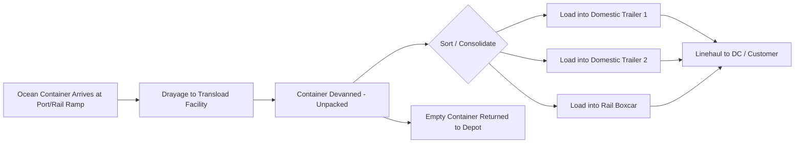

## Transload and Cross Dock Operations in Multimodal Chains

### Definitions and Distinction from Intermodal Transfer

**Transloading** is the physical transfer of cargo from one mode's equipment to another mode's equipment (e.g., ocean container to domestic rail boxcar or road trailer), where the cargo itself is handled and often repacked, rather than the sealed unit load simply being lifted intact.

**Cross-docking** is a warehouse/terminal operation where inbound freight is received, sorted, and consolidated for outbound shipment with minimal or no storage time (typically under 24 hours, often just hours), regardless of whether a mode change occurs.

**Key Points**

- Intermodal transfer (covered separately) moves the *sealed unit* (container, swap body) between modes without opening it — cargo integrity and seal are preserved.
- Transloading *opens* the unit load: cargo is removed from one container/trailer and re-loaded into a different one, often to reconfigure load size (e.g., splitting one 40-ft ocean container into two 53-ft domestic trailers, common in US import distribution) or to convert between incompatible gauges/equipment types.
- Cross-docking is an operational method (flow-through, minimal dwell) that can apply within a single mode (truck-to-truck) or across modes; it is not itself a mode-transfer concept, but the two overlap heavily in multimodal chains because mode changes are natural cross-dock trigger points.

### Why Transloading Exists: Structural Drivers

1. **Container size/regulatory mismatch**: Ocean containers (40-ft standard, 40-ft/45-ft high-cube) often carry less cubic volume than domestic equipment permits in destination markets (e.g., US 53-ft domestic dry van trailers), so transloading one ocean container's contents into fewer domestic trailers reduces linehaul unit count and cost.
2. **Weight distribution and axle limits**: Domestic road weight limits differ from ocean/rail weight allowances, sometimes requiring cargo redistribution.
3. **Equipment incompatibility**: Rail gauge differences, chassis pool imbalances, or restricted-service equipment (reefer plug compatibility, tank container fittings) can force a transfer to different equipment mid-chain.
4. **Consolidation/deconsolidation (LCL/FCL logic)**: Multiple less-than-container-load (LCL) shipments arriving in one container must be broken out and redistributed to multiple final consignees — a transload/cross-dock function performed at a container freight station (CFS).
5. **Network optimization**: Positioning transload facilities near port or rail ramp reduces expensive drayage of full ocean containers deep inland, substituting cheaper domestic linehaul beyond the transload point.

### Typical Transload Facility Flow

### Cross-Dock Operational Models

**Key Points**

- **Flow-through (pure) cross-dock**: freight moves directly from inbound door to outbound door via conveyor or short forklift move, with no put-away to storage; target dwell time measured in hours.
- **Hub-and-spoke consolidation cross-dock**: common in LTL (less-than-truckload) networks — inbound trailers from multiple origins are unloaded, freight is sorted by outbound destination lane, and reloaded onto outbound trailers, often overnight.
- **Retail/distribution cross-dock**: pre-allocated, store-ready pallets arrive already labeled for specific destinations ("pre-distribution" model) and are simply re-sorted by dock door, versus "post-distribution" where allocation decisions happen at the cross-dock itself based on real-time inventory need.
- **Opportunistic cross-dock**: a hybrid facility that cross-docks fast-moving SKUs while still warehousing slower-moving inventory under the same roof.

### Facility Layout Considerations

A cross-dock facility is typically designed as a narrow, elongated building (relative to a storage DC) to minimize interior travel distance between inbound and outbound doors, often in an "I", "T", "H", or "X" door configuration depending on throughput volume and sortation complexity.

**Example**

An "I" layout places inbound doors on one long side and outbound doors on the directly opposite long side, minimizing travel for simple lane-to-lane freight flow — suited to lower SKU-sortation complexity. An "X" or "H" layout adds corner/cross doors to support more complex many-to-many sortation, common in high-volume LTL hubs handling hundreds of outbound lanes.

### Multimodal Chain Integration Points

Transload and cross-dock operations typically occur at specific nodes in a multimodal chain:

- **Port-side CFS (Container Freight Station)**: LCL consolidation/deconsolidation immediately after ocean discharge.
- **Inland rail ramp transload facilities**: common in North American import logistics — International Piggyback Yard (IPI) or intermodal ramp devanning where ocean freight moves via rail to an interior point (e.g., Chicago, Kansas City) and is transloaded there rather than at the port, reducing port drayage congestion.
- **Regional distribution center cross-docks**: final-mile consolidation where multiple inbound linehaul trailers are broken down and reloaded for store or customer delivery routes.
- **Border crossing transload points**: in cross-border trade (e.g., US–Mexico, EU internal borders pre-Schengen customs union contexts), cargo is sometimes transloaded between carriers due to differing domestic trucking regulations, cabotage restrictions, or driver/equipment authorization limits.

### Cost and Time Trade-off Framework

Transloading introduces additional handling cost and dwell time but can reduce total landed cost through better equipment utilization. A simplified comparison:

$$TC_{transload} = C_{devan} + C_{sort} + C_{domestic\_linehaul} + C_{storage\_dwell}$$

$$TC_{direct} = C_{drayage\_extended} + C_{container\_linehaul} + C_{demurrage\_risk}$$

A transload strategy is favored when $TC_{transload} < TC_{direct}$, which typically holds when: (a) destination is far inland (long drayage avoided), (b) shipment volume allows near-full utilization of larger domestic equipment, and (c) transload facility dwell can be kept low enough to avoid its own detention/storage penalties.

[Inference] Exact cost thresholds vary substantially by trade lane, fuel prices, and regional labor costs, so the decision is generally modeled per-lane rather than applied as a universal rule.

### Risk, Documentation, and Cargo Integrity Considerations

**Key Points**

- **Chain of custody**: because the original carrier seal is broken during transload, cargo insurance and claims documentation must record seal numbers at devanning and re-sealing to preserve traceability.
- **Customs status**: transload facilities operating on freight still under bond (not yet customs-cleared) typically require bonded warehouse/CFS licensing and compliance with customs supervision requirements.
- **Damage/liability allocation**: additional handling at transload increases exposure to damage claims; contracts and bills of lading should clearly delineate liability handoff points (this connects directly to Incoterms risk-transfer points, e.g., where risk passes under FCA versus where physical custody changes at a transload facility — these are not always the same point and should be distinguished contractually).
- **Cargo security (C-TPAT / AEO context)**: [Unverified] specific facility certification requirements (e.g., C-TPAT in the US, AEO in the EU) for transload/cross-dock operators vary by program and should be verified against current customs authority guidance rather than assumed uniform.

### Technology and Automation in Cross-Dock Operations

- **Warehouse Management System (WMS) cross-dock modules**: manage inbound-to-outbound task assignment without generating a put-away location, using "wave" or "flow" logic tied to outbound trailer load plans.
- **Automated sortation systems**: tilt-tray, cross-belt, or sliding-shoe sorters for high-volume parcel/LTL cross-docks, routing items to outbound chutes based on barcode/RFID scan.
- **Yard Management Systems (YMS)**: coordinate trailer spotting at dock doors to synchronize inbound arrival with outbound departure windows, critical for minimizing dwell in flow-through models.
- **Dock scheduling/appointment systems**: reduce congestion and detention by sequencing carrier arrivals against sortation capacity.

### KPIs for Transload and Cross-Dock Performance

- **Dwell time**: average time freight spends at the facility (target: hours, not days, for pure cross-dock).
- **Dock-to-dock cycle time**: total elapsed time from inbound check-in to outbound departure.
- **Cube utilization on outbound equipment**: percentage of trailer/railcar cubic or weight capacity used after consolidation.
- **Damage/claims rate per handling event**: tracks incremental risk introduced by the extra touch.
- **Cost per unit transloaded** (per carton, pallet, or CBM).
- **On-time outbound departure rate**: measures whether cross-dock sortation is keeping pace with linehaul schedules.

**Related Topics**

- Intermodal terminal design and container lift operations (sealed-unit transfer contrast)
- Incoterms risk-transfer points versus physical custody transfer at transload facilities
- LTL hub-and-spoke network design
- Bonded warehousing and Container Freight Station (CFS) customs procedures
- Warehouse Management System (WMS) cross-dock configuration
- Drayage optimization and chassis pool management
- Synchromodality and dynamic mode reassignment (contrast: sealed-unit flexibility vs. cargo-level transload)