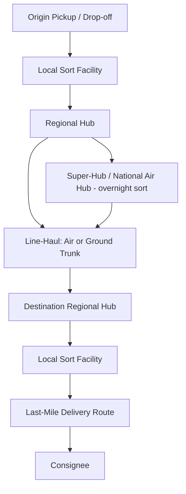

## Express and Small Parcel Carriers

### Definition and Market Segment Boundaries

Express and small parcel carriers move discrete, individually tracked shipments — typically under 70 lbs / 32 kg per piece (the conventional upper bound before freight moves into LTL/freight classifications) — through hub-and-spoke networks optimized for speed, tracking granularity, and door-to-door service, as distinct from LTL (multiple pallets, freight-class pricing) and TL/FTL (dedicated full truckload) freight.

**Key Points**

- **Parcel/ground**: standard multi-day delivery (e.g., 1–5 business days domestically), lowest cost per shipment.
- **Express**: guaranteed expedited delivery, typically next-day or 2-day, often time-of-day guaranteed (e.g., by 10:30 AM), commanding a substantial price premium.
- **Courier**: traditionally same-day, point-to-point, often unsorted (dedicated vehicle/rider), historically distinct from network-sorted parcel/express but increasingly blended in urban same-day/last-mile services.
- The segment is dominated globally by integrators that own the full network (air, line-haul, sortation, last-mile) — commonly cited examples include UPS, FedEx, and DHL Express — alongside postal-operator-linked services (e.g., USPS Priority Mail, Royal Mail) and a growing tier of regional/last-mile specialists (e.g., regional US carriers, and e-commerce-platform-owned delivery networks).

### Network Architecture: Hub-and-Spoke Model

The standard express/parcel network design is hub-and-spoke, chosen because it maximizes load consolidation on trunk (line-haul) legs while still offering many-to-many origin-destination coverage.

**Key Points**

- **Super-hub (national air hub)**: a centralized facility (classic example pattern: a single national hub receiving inbound flights late evening, sorting overnight, and dispatching outbound flights before dawn) enabling next-day service across a continental network from a single sort point.
- **Regional hubs**: intermediate sortation points reducing the number of direct point-to-point lanes needed; total lanes scale roughly as $O(n)$ hub connections rather than $O(n^2)$ direct connections for $n$ service points.
- **Local/delivery stations**: final sortation by delivery route before last-mile dispatch.

### Service Level Tiers and SLA Structures

| Tier | Typical Commitment | Primary Use Case |
| --- | --- | --- |
| Same-day / on-demand | Hours | Urgent B2B, e-commerce urban delivery |
| Overnight/next-day express | Next business day, sometimes time-definite (e.g., by 8:00/10:30 AM) | Time-critical documents, urgent parts, healthcare/pharma |
| 2-day / 3-day express | 2–3 business days | E-commerce expedited tier |
| Deferred/ground parcel | 1–5+ business days depending on zone distance | Standard e-commerce, low time-sensitivity |
| International express | 1–5 business days customs-inclusive | Cross-border B2B/B2C, often with integrated customs brokerage |

[Inference] Exact SLA windows, cut-off times, and service names are carrier- and region-specific and change with network investment cycles, so specific carrier commitments should be verified against current carrier service guides rather than assumed static.

### Rating and Pricing Mechanics

Parcel/express pricing typically combines several structural elements distinct from simple weight-based freight rating:

1. **Dimensional (DIM) weight pricing**: billed weight is the greater of actual weight and volumetric weight, calculated as:

$$DIM\ weight = \frac{L \times W \times H}{DIM\ divisor}$$

Common DIM divisors (in inches³/lb) are typically in the 139–166 range depending on carrier and service, meaning bulky-but-light shipments are billed at a higher "dimensional" weight rather than actual scale weight. [Unverified] Exact divisor values differ by carrier, service level, and have changed over time via periodic rate updates, so current divisors should be confirmed against the specific carrier's published rate guide.

2. **Zone-based pricing**: cost increases with the geographic "zone" distance between origin and destination ZIP/postal code groupings, layered on top of weight/DIM weight.
3. **Accessorial/surcharge structure**: additional fees stacked onto the base rate — common categories include residential delivery, fuel surcharge (indexed to a published fuel price benchmark, adjusted weekly in many carrier programs), address correction, delivery area surcharge (DAS) for extended/remote zones, oversize/additional handling for irregular dimensions or weight, and peak season surcharges during high-volume periods (e.g., year-end holiday peak).
4. **Peak season surcharges**: carriers commonly apply demand-based surcharges during defined high-volume windows, layered per package and sometimes per-pound above a threshold.

**Example**

A lightweight but bulky package (e.g., a large box of packing peanuts around a small item) measuring 24"×18"×18" with actual weight 8 lbs, using a DIM divisor of 139: DIM weight = $(24 \times 18 \times 18)/139 ≈ 56$ lbs. The carrier bills at 56 lbs (DIM weight) rather than 8 lbs (actual weight), since DIM weight exceeds actual weight — illustrating why cube-efficient packaging materially affects small-parcel shipping cost.

### Last-Mile Delivery Models

**Key Points**

- **Carrier-owned delivery**: integrator's own employed or contracted drivers (e.g., traditional UPS/FedEx delivery routes).
- **Independent Service Provider (ISP) / contracted delivery associate model**: carrier-branded but independently operated last-mile delivery businesses under a franchise-like contract structure, used by some major carriers to scale delivery capacity without direct employment.
- **Gig-economy/crowdsourced delivery**: on-demand driver networks (app-dispatched) used particularly for same-day and urban last-mile, common among e-commerce platform-owned logistics arms and dedicated last-mile startups.
- **Postal injection / partner injection**: an express/parcel carrier hands off the final delivery leg to a national postal operator in the destination country (common in cross-border e-commerce) to leverage the postal network's dense last-mile coverage and lower marginal delivery cost, trading off tracking granularity and speed.
- **Locker and pickup-point networks**: parcel lockers and retail pickup points reduce failed-delivery-attempt cost and last-mile drop density requirements, shifting the "last 100 meters" burden to the consumer.

### Track-and-Trace and Data Infrastructure

- **Barcode/label standards**: parcel shipments use carrier-specific barcode symbologies (commonly linear barcodes such as Code 128, and increasingly 2D barcodes) encoding tracking number, service type, and routing/sort-code information read by automated sortation scanners at each hub touchpoint.
- **Scan events**: each hub, sort, and delivery-vehicle scan generates a tracking event (e.g., "arrived at facility," "departed facility," "out for delivery," "delivered"), forming the customer-visible tracking timeline.
- **EDI/API integration**: shippers integrate via carrier APIs or EDI transaction sets (e.g., EDI 214 - Transportation Carrier Shipment Status Message in North American freight/parcel EDI conventions) for automated status updates into shipper order-management or e-commerce systems.
- **Proof of delivery (POD)**: electronic signature capture, photo-on-delivery, or geo-tagged delivery confirmation, increasingly standard for e-commerce and high-value shipments.

### Automated Sortation Technology

Modern parcel hubs rely on high-throughput automated sortation:

- **Cross-belt and tilt-tray sorters**: packages are singulated onto a moving carrier (belt segment or tilting tray), scanned, and diverted into the correct outbound chute at high speed (commonly thousands of packages per hour per line in large hubs).
- **Small sortation systems (SSS)**: adapted for irregular/small parcel mixes typical of e-commerce (polybags, small boxes) versus traditional uniform parcel/document mixes.
- **Robotic induction and singulation**: automated infeed systems reduce manual labor needed to place packages onto sortation equipment.
- **Dimensioning, weighing, and scanning (DWS) systems**: automatically capture dimensions and weight in-line for accurate DIM-weight billing and load planning, reducing manual measurement.

### Regulatory and Customs Dimensions (Cross-Border Express)

- **De minimis thresholds**: many countries apply a low-value threshold below which imported parcels are exempt from duty/tax or receive simplified clearance; [Unverified] specific threshold values and eligibility rules vary by country and are subject to periodic government policy change, so current thresholds should be confirmed against the destination country's customs authority rather than assumed from prior data.
- **Express clearance/pre-clearance**: integrators with in-house customs brokerage typically pre-lodge electronic customs data before physical arrival, enabling faster clearance than standard postal/commercial cargo processes.
- **Restricted and dangerous goods handling**: express carriers apply IATA Dangerous Goods Regulations (for air-transported express) and carrier-specific prohibited-item lists, with special handling/labeling requirements for items like lithium batteries.

### KPIs for Express/Parcel Network Performance

- **On-time delivery rate**: percentage of shipments meeting the quoted service commitment.
- **First-attempt delivery success rate**: percentage delivered without a failed/re-attempted delivery.
- **Cost per package (fully loaded, including accessorials)**.
- **Network sort accuracy / mis-sort rate**.
- **Average dwell time per hub touch**.
- **DIM-weight-to-actual-weight ratio (cube efficiency)**: used by shippers to identify packaging optimization opportunities.

**Related Topics**

- Last-mile delivery optimization and route density economics
- Reverse logistics and e-commerce returns processing
- Dimensional weight pricing and packaging optimization strategy
- Cross-border e-commerce customs clearance and de minimis policy
- Hub-and-spoke network design versus point-to-point freight networks
- Parcel carrier contract negotiation and accessorial fee audit
- Same-day and on-demand urban delivery models