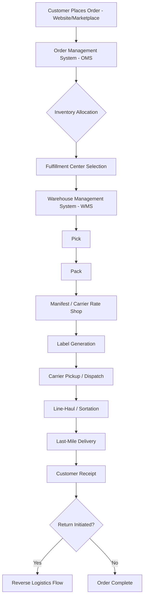

## Ecommerce Fulfillment Logistics

### Definition and Scope

E-commerce fulfillment logistics encompasses the end-to-end order processing chain from the moment a customer places an online order through to final delivery (and potential return), spanning inventory positioning, order management, warehouse/fulfillment-center operations, pick-pack-ship execution, carrier hand-off, and reverse logistics — distinct from traditional B2B/wholesale distribution primarily in its order profile: high order volume, low units-per-order, high SKU variety, and compressed delivery-time expectations.

**Key Points**

- Order profile shift: traditional distribution ships pallets/cases to few destinations; e-commerce fulfillment ships single units/small parcels to millions of individual addresses.
- Fulfillment models: **merchant-owned/self-fulfillment**, **third-party logistics (3PL) fulfillment**, **marketplace-managed fulfillment** (e.g., programs where the marketplace operator stores and ships seller inventory), and **dropshipping** (no inventory held by the seller; supplier ships direct to consumer).
- Success is measured heavily on speed (order-to-delivery cycle time), accuracy (perfect order rate), and cost-to-serve per order — often in tension with each other.

### End-to-End Order Flow

### Order Management System (OMS) and Distributed Order Management (DOM)

The OMS sits above the WMS and carrier systems, making the critical decision of *where* an order should be fulfilled from.

**Key Points**

- **Inventory allocation logic**: determines which fulfillment node (warehouse, store, dropship vendor) fills a given order line, based on inventory availability, proximity to customer, shipping cost, and node capacity.
- **Order splitting**: multi-item orders may be split across multiple fulfillment nodes when no single location holds full inventory, trading off shipping cost (multiple packages) against delivery speed.
- **Available-to-promise (ATP) / distributed order management (DOM)**: real-time inventory visibility across all nodes (warehouses, stores, in-transit) so the OMS can promise accurate delivery dates at checkout and avoid overselling.
- **Ship-from-store**: retail store inventory used as a fulfillment node for online orders, extending network density using existing physical footprint.

### Fulfillment Center Network Design

**Key Points**

- **Centralized (single/few node) network**: lower inventory holding cost and simpler operations, but longer average shipping distance and transit time to customers.
- **Distributed/regional network**: multiple fulfillment centers positioned near population density centers, reducing last-mile transit time and zone-based shipping cost, at the expense of inventory duplication and higher fixed cost.
- **Forward deployment / micro-fulfillment**: small urban fulfillment nodes or dark stores holding fast-moving SKUs close to demand, used to compress delivery windows (same-day/next-day) for high-velocity items.

$$Total\ Network\ Cost = \sum_{i} (C_{holding,i} + C_{facility,i}) + \sum_{j} C_{ship,j}$$

Network design decisions (number and location of nodes) generally optimize the trade-off between aggregate inventory-holding/facility cost (which tends to rise with more nodes, due to duplicated safety stock) and aggregate outbound shipping cost (which tends to fall with more nodes, due to shorter average shipping zones).

**Example**

A retailer shipping nationally from a single Midwest fulfillment center might average 3–4 shipping zones to coastal customers, incurring higher zone-based parcel rates and longer transit times. Adding two coastal fulfillment centers can reduce the average shipping zone for most orders, lowering per-order freight cost and enabling 1–2 day ground delivery — but requires holding duplicate safety stock of top SKUs at each new node, illustrating the classic centralization-vs-distribution trade-off. [Inference] The specific breakeven point between added facility/inventory cost and freight savings is highly dependent on order volume, SKU velocity concentration, and prevailing carrier rates, and would require lane-specific modeling rather than a general rule.

### Warehouse Management System (WMS) Operations

**Key Points**

- **Slotting**: placement of SKUs within the warehouse based on velocity (fast-movers placed in easily accessible "golden zone" locations) to minimize pick travel time.
- **Wave planning**: grouping orders into batches ("waves") released to the pick floor together, often synchronized to carrier pickup cut-off times.
- **Pick methodologies**:
  - *Discrete/single-order picking*: one picker completes one order at a time — simple but low throughput for high-volume operations.
  - *Batch picking*: one picker collects items for multiple orders in a single pass, sorted afterward.
  - *Zone picking*: pickers assigned to fixed warehouse zones, handing off totes/orders between zones.
  - *Cluster picking*: a picker fulfills multiple orders simultaneously using a cart with multiple totes, guided by pick-to-light or voice-directed systems.
- **Pack station operations**: cartonization logic (selecting optimal box size algorithmically) to minimize dimensional weight and void-fill material.
- **Automation integration**: goods-to-person systems (e.g., automated storage and retrieval systems, autonomous mobile robots bringing shelving to stationary pickers) increasingly used in high-volume e-commerce fulfillment centers to reduce pick travel time versus traditional person-to-goods picking.

### Carrier Selection and Rate Shopping

**Key Points**

- **Multi-carrier rate shopping**: at manifest time, the system evaluates available carriers/services against the order's weight, dimensions, destination zone, and required delivery date, selecting the lowest-cost option meeting the service requirement.
- **Carrier diversification**: using multiple parcel carriers (rather than a single carrier) to maintain rate leverage, provide network resilience during peak season or service disruptions, and match service strengths to shipment profiles (e.g., postal-injection services for lightweight low-value items, integrator express for time-critical shipments).
- **Freight/parcel API integration**: real-time rate and label API calls (or aggregator/multi-carrier shipping software) embedded into the OMS/WMS workflow to automate carrier selection and label generation at scale.

### Reverse Logistics (Returns Processing)

E-commerce's high return rate (materially higher than traditional retail, particularly in categories like apparel) makes returns processing a first-class fulfillment function rather than an afterthought.

**Key Points**

- **Returns authorization (RMA) process**: customer-initiated return request generates a return label and expected-return record before the physical item ships back.
- **Returns receiving and disposition**: inbound returns are inspected and disposed to one of several paths — restock as sellable inventory, liquidation/secondary market channel, refurbishment, or disposal/recycling — based on condition grading.
- **Reverse logistics network**: may route through the original fulfillment center, a dedicated returns processing center, or third-party returns-management providers; in-store returns (for omnichannel retailers) can also feed inventory back into the network.
- **Return-to-available inventory speed**: how quickly a returned, restockable item becomes available-to-sell again is itself a fulfillment KPI, since delayed reintegration ties up working capital in "in-transit-return" limbo.

### Peak Season and Demand Volatility Management

**Key Points**

- **Demand forecasting**: statistical and machine-learning-based demand models used to plan inventory positioning and labor ahead of known peak events (e.g., major seasonal shopping periods).
- **Surge labor strategies**: temporary/seasonal workforce scaling, cross-training, and shift restructuring to handle peak-to-trough volume swings that can be several multiples of average daily volume.
- **Carrier capacity contracting**: securing guaranteed volume commitments or peak-season capacity agreements with carriers in advance, given that parcel carriers apply peak surcharges and may impose volume caps on shippers during high-demand windows.
- **Cut-off time management**: dynamically communicating realistic delivery-date promises to customers as fulfillment and carrier capacity tightens toward key delivery deadlines.

### Key Metrics for E-commerce Fulfillment

- **Order-to-delivery cycle time**: elapsed time from order placement to customer receipt, often segmented into "click to ship" and "ship to delivery" components.
- **Perfect order rate**: percentage of orders delivered complete, on time, undamaged, and with accurate documentation.
- **Order accuracy rate**: percentage of orders picked/packed without SKU or quantity errors.
- **Cost per order (fully loaded)**: labor, packaging, and outbound freight cost combined.
- **Inventory accuracy**: agreement between WMS-recorded inventory and physical count, critical for preventing oversell/order cancellation.
- **Return rate and return processing cycle time**.
- **Fill rate / stockout rate**: percentage of demand met from available inventory without backorder.

### Illustrative Network Trade-off (svg_diagram)

<svg xmlns="http://www.w3.org/2000/svg" viewBox="0 0 700 340" font-family="Arial, sans-serif">
<text x="350" y="25" text-anchor="middle" font-size="16" font-weight="bold">Fulfillment Node Count vs. Cost Trade-off (svg_diagram)</text>
<line x1="80" y1="290" x2="650" y2="290" stroke="#333" stroke-width="1.5" />
<line x1="80" y1="290" x2="80" y2="50" stroke="#333" stroke-width="1.5" />
<text x="365" y="320" text-anchor="middle" font-size="12">Number of Fulfillment Nodes</text>
<text x="30" y="170" text-anchor="middle" font-size="12" transform="rotate(-90 30 170)">Total Cost</text>
<path d="M100,270 Q250,240 400,180 T620,90" fill="none" stroke="#c92a2a" stroke-width="2" />
<text x="600" y="80" font-size="11" fill="#c92a2a">Inventory/Facility Cost</text>
<path d="M100,90 Q250,140 400,220 T620,270" fill="none" stroke="#1971c2" stroke-width="2" />
<text x="450" y="235" font-size="11" fill="#1971c2">Outbound Shipping Cost</text>
<path d="M100,180 Q250,160 350,165 T620,205" fill="none" stroke="#2b8a3e" stroke-width="3" stroke-dasharray="4,2" />
<text x="330" y="150" font-size="11" fill="#2b8a3e">Total Network Cost</text>
<circle cx="350" cy="165" r="5" fill="#2b8a3e" />
<text x="360" y="150" font-size="10">Optimal node count (illustrative)</text>
</svg>

**Related Topics**

- Order management systems and distributed order management (DOM) architecture
- Warehouse automation: AS/RS, autonomous mobile robots, and goods-to-person picking
- Reverse logistics network design and returns disposition strategy
- Express and small parcel carrier rating mechanics (dimensional weight, zone pricing)
- Last-mile delivery models and delivery density economics
- Demand forecasting and peak-season capacity planning
- Omnichannel fulfillment and ship-from-store strategy