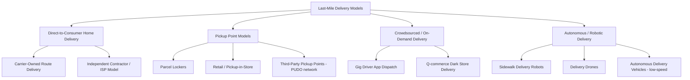

## Last Mile Delivery Models and Innovations

### Definition and Strategic Importance

The "last mile" refers to the final leg of the delivery chain — moving a shipment from the last distribution/sortation point to the end consumer's door (or pickup point). Despite representing a small fraction of total shipment distance, it is consistently cited as the most operationally complex and highest-cost-per-unit segment of the supply chain, due to low stop density, address-level variability, and high service-expectation pressure from consumers.

**Key Points**

- The last mile is disproportionately expensive because economies of scale (achievable in line-haul via full trailer/container loads) largely disappear at the delivery-stop level — cost is driven by stops-per-route and drop density rather than total volume.
- Consumer expectations (speed, delivery windows, real-time tracking) have risen faster than the underlying cost structure has fallen, creating persistent margin pressure on retailers and carriers.
- Last-mile strategy sits at the intersection of network design, route optimization, technology, and increasingly sustainability/urban-policy constraints (low-emission zones, delivery curfews).

### Core Delivery Model Taxonomy

### Direct-to-Consumer Home Delivery Models

**Key Points**

- **Carrier-owned/employed driver routes**: traditional model used by major parcel integrators and postal operators; drivers follow optimized daily routes covering a fixed geographic zone.
- **Independent Service Provider (ISP) / delivery-partner contract model**: carrier-branded, independently operated small delivery businesses contracted to service specific routes — used to scale delivery capacity, particularly to absorb e-commerce volume growth, without direct employment of every driver.
- **Route density optimization**: the fundamental last-mile economic lever — cost per delivery falls as the number of stops per route mile rises, which is why last-mile cost is generally lower in dense urban areas and materially higher in rural/exurban delivery.
- **Failed delivery attempts**: a first-attempt delivery failure (no one home, access issue) roughly doubles the cost of that delivery due to the re-attempt, making delivery-window communication and access instructions a meaningful cost lever, not just a service-quality feature.

### Pickup Point and Locker Models

**Key Points**

- **Parcel lockers**: automated, self-service locker banks at high-traffic locations (transit stations, retail parking lots, apartment complexes) allowing carriers to make one consolidated drop for many recipients, converting many low-density home stops into one high-density locker stop.
- **Retail/pickup-in-store (BOPIS – buy online, pick up in store)**: leverages existing retail footprint as a pickup node, eliminating last-mile delivery cost entirely for that order in exchange for requiring customer travel.
- **Third-party pickup-drop-off (PUDO) networks**: independent convenience stores, kiosks, or partner retail locations contracted to accept and hold parcels on behalf of multiple carriers/retailers, common in markets with dense small-format retail.
- **Economic rationale**: pickup-point models shift the "last 100 meters" cost and effort from the carrier to the consumer, which is why they are typically offered at a lower shipping cost or incentive compared to home delivery.

### Crowdsourced and On-Demand Delivery

**Key Points**

- **Gig-economy app-dispatched delivery**: independent drivers accept delivery tasks via a mobile app, paid per-delivery or per-batch, used heavily for same-day and food/grocery delivery where fixed-route models are too slow or capital-intensive to scale quickly.
- **Q-commerce (quick commerce) dark stores**: small, urban, non-customer-facing micro-fulfillment centers stocked with fast-moving SKUs (groceries, convenience items), enabling delivery windows measured in tens of minutes rather than hours/days, paired with dense local rider/driver networks.
- **Hybrid crowdsourced + owned-fleet models**: many operators blend a base of owned/contracted capacity with on-demand crowdsourced capacity to absorb demand peaks without over-provisioning fixed fleet size.

### Autonomous and Robotic Delivery Innovations

**Key Points**

- **Sidewalk delivery robots**: small, low-speed, sidewalk-operating autonomous or semi-autonomous units delivering short-range parcels or food orders, typically operating within a geofenced service radius from a store or micro-fulfillment point.
- **Delivery drones**: unmanned aerial vehicles used for short-range, low-weight parcel delivery, particularly explored for rural/suburban low-density areas (where ground route density economics are worst) and for time-critical categories (e.g., medical supplies).
- **Low-speed autonomous delivery vehicles**: small, purpose-built autonomous ground vehicles (distinct from full-size autonomous trucks) designed for neighborhood-level parcel delivery, often still requiring a human to retrieve the parcel from a compartment upon arrival.
- **Regulatory dependency**: [Unverified] the pace and geographic footprint of drone and sidewalk-robot deployment is heavily dependent on local aviation authority and municipal right-of-way regulations, which vary significantly by jurisdiction and change frequently, so current operational scope in any specific market should be verified against recent regulatory and company announcements rather than assumed from general industry trends.

### Route Optimization Technology

**Key Points**

- **Dynamic route optimization software**: solves a variant of the Vehicle Routing Problem (VRP) — assigning stops to vehicles and sequencing them to minimize total distance/time subject to vehicle capacity, delivery-window, and driver-hours constraints.
- **Real-time re-optimization**: modern systems continuously re-sequence remaining stops in response to traffic conditions, new same-day order injections, or failed-attempt rescheduling, rather than solving the route once at the start of the day.
- **Delivery window management**: narrow, customer-selected delivery windows (common in grocery/scheduled delivery) impose hard time constraints on the VRP, generally increasing total route cost compared to unconstrained "delivery sometime today" models.
- **Address geocoding and access-point data**: accurate geocoding (mapping an address to precise coordinates, including building entrance/loading-dock location rather than just a street-level point) materially affects delivery time-per-stop, particularly in dense urban or multi-unit residential settings.

$$\min \sum_{v \in V} \sum_{(i,j) \in R_v} d_{ij} \quad \text{s.t. capacity, time-window, and driver-hours constraints}$$

Where $R_v$ is the route sequence for vehicle $v$ and $d_{ij}$ is the travel cost/distance between stops $i$ and $j$ — the general Capacitated Vehicle Routing Problem with Time Windows (CVRPTW) formulation underlying most commercial route-optimization engines. [Inference] Commercial route optimization platforms typically use metaheuristics (e.g., genetic algorithms, simulated annealing, or large-neighborhood search) rather than exact solvers for daily operational routing at scale, since exact VRP solutions are computationally intractable for large stop counts, though the specific algorithm is generally proprietary and not publicly documented per vendor.

### Urban Logistics Constraints and Micro-Consolidation

**Key Points**

- **Low-emission zones (LEZ) and delivery curfews**: increasing numbers of city centers restrict vehicle access by emissions class or time-of-day, pushing carriers toward electric vehicles, cargo bikes, or off-peak delivery scheduling for urban last-mile.
- **Urban Consolidation Centers (UCCs)**: facilities at the edge of a city center where freight from multiple carriers/shippers is consolidated onto shared, often lower-emission last-mile vehicles (cargo bikes, electric vans) for final urban delivery, reducing total vehicle-miles and congestion within the restricted zone.
- **Cargo bikes and micro-mobility delivery**: increasingly used for dense urban last-mile, particularly for smaller parcels, given lower operating cost, easier parking/loading, and exemption from some vehicle access restrictions.
- **Off-peak/night delivery**: some urban programs shift delivery to off-peak hours to reduce daytime congestion contribution, subject to noise-restriction regulations on vehicle types and loading/unloading equipment.

### Electric and Alternative-Fuel Last-Mile Fleets

**Key Points**

- Electric delivery vans and light commercial vehicles are increasingly deployed for last-mile fleets, driven by total-cost-of-ownership improvements on shorter, predictable urban routes (favorable for limited-range EVs) combined with regulatory pressure (LEZ compliance) and corporate sustainability commitments.
- Charging infrastructure planning (depot charging overnight versus opportunity charging during shifts) is a key operational constraint distinguishing EV last-mile fleet design from traditional internal-combustion fleet planning.
- [Inference] The economics of EV last-mile conversion are generally most favorable for short, high-stop-density urban routes and less favorable for long rural routes, though exact breakeven points depend on local electricity/fuel prices, vehicle costs, and incentive programs that vary by market and change over time.

### Failed Delivery Mitigation and Delivery Experience Technology

**Key Points**

- **Real-time tracking and narrow ETA windows**: proactive, granular delivery-window notifications (e.g., "arriving in the next 30 minutes") reduce missed-delivery likelihood by improving the odds the recipient is present or has arranged access.
- **In-person delivery instructions and safe-place drop options**: consumer-specified delivery preferences (leave at door, with neighbor, access codes) reduce failed-attempt rates without requiring driver-recipient contact.
- **Proof of delivery (photo/geo-tagged confirmation)**: reduces delivery disputes and supports claims resolution without requiring signature capture for every shipment.

### Key Metrics for Last-Mile Performance

- **Cost per delivery/cost per stop**: the primary last-mile economic metric, heavily influenced by stop density.
- **First-attempt delivery success rate**.
- **Stops per route hour / stops per route mile**: route density and driver productivity measure.
- **On-time delivery rate against promised window**.
- **Delivery-related customer satisfaction / complaint rate**.
- **Vehicle-miles per delivery (sustainability metric)**: used to track progress on emissions-reduction initiatives tied to consolidation and alternative-fuel adoption.

**Related Topics**

- Vehicle Routing Problem (VRP) formulations and route optimization algorithms
- E-commerce fulfillment network design and micro-fulfillment centers
- Urban Consolidation Centers and low-emission zone compliance strategy
- Express and small parcel carrier network architecture
- Electric vehicle fleet transition and depot charging infrastructure planning
- Autonomous vehicle and drone delivery regulatory landscape
- Reverse logistics integration with last-mile pickup networks