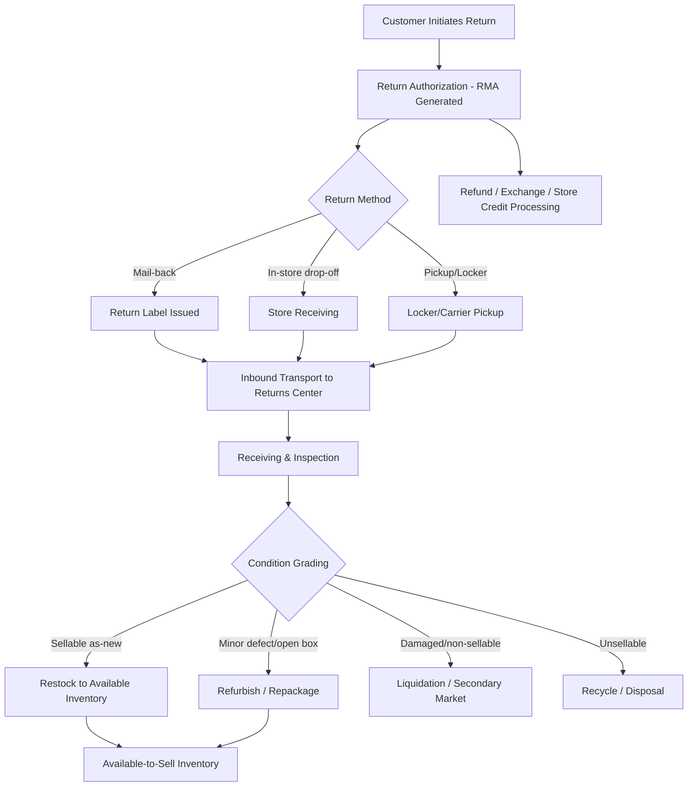

## Reverse Logistics and Returns Management

### Definition and Scope

Reverse logistics encompasses the planning, execution, and control of the flow of goods, packaging, and information moving from the point of consumption back toward the point of origin — for purposes including returns, repair, refurbishment, remanufacturing, recycling, or disposal — as distinct from forward logistics (origin-to-consumer flow). Returns management is the specific subset of reverse logistics dealing with customer-initiated product returns.

**Key Points**

- Reverse logistics is broader than "returns": it also covers repair/warranty logistics, end-of-life product take-back, packaging/pallet reuse (reusable transport items), and recall logistics.
- E-commerce return rates are structurally higher than traditional brick-and-mortar retail (particularly in apparel/footwear, where fit uncertainty drives try-and-return behavior), making returns a first-class cost and operations driver rather than an edge case.
- Reverse flows are inherently less predictable in volume, timing, and condition than forward flows, making reverse logistics operationally harder to forecast and standardize.

### End-to-End Reverse Logistics Flow

### Returns Authorization (RMA) Process

**Key Points**

- **Return Merchandise Authorization (RMA)**: the formal process by which a retailer approves a return before (or as) it is physically initiated, generating a tracking record that links the returning item to the original order, reason code, and expected disposition path.
- **Reason codes**: structured categorization of why an item is being returned (wrong size, defective, changed mind, not as described, damaged in transit) — critical data for both operational routing decisions and upstream product/quality feedback loops.
- **Self-service returns portals**: customer-facing systems allowing return initiation, label generation, and refund-method selection without contacting customer service, reducing handling cost and accelerating the returns cycle.
- **Return policy design trade-offs**: more lenient return windows and free return shipping increase conversion and customer satisfaction but directly increase return volume and reverse logistics cost — a deliberate commercial trade-off rather than a purely operational one.

### Returns Receiving and Inspection

**Key Points**

- **Physical inspection**: verifying the returned item matches the RMA (correct SKU, complete set/accessories), checking for damage, wear, or tampering, and confirming packaging condition.
- **Condition grading**: categorizing returned items (e.g., "like new/resalable," "open box," "damaged - repairable," "damaged - non-repairable," "used/worn") to determine the appropriate disposition path.
- **Fraud and abuse detection**: identifying patterns such as "wardrobing" (using and returning an item), empty-box returns, or serial-return behavior, often flagged through returns-management-system rules tied to customer return history.
- **Data capture for quality feedback**: aggregated reason-code and defect data feeding back to product design, quality control, and supplier scorecards — reverse logistics as an information source, not just a physical-flow function.

### Disposition Strategies

**Key Points**

- **Restock to available inventory**: fastest, highest-value path — item returns to sellable inventory with minimal processing, typically reserved for items in as-new condition.
- **Refurbishment/repackaging**: minor cleaning, repackaging, or light repair to bring an item back to sellable condition, often sold through a discounted or "open box" channel.
- **Liquidation**: bulk sale of returned goods to secondary-market liquidators, off-price retailers, or B2B liquidation marketplaces, typically recovering a fraction of original value but avoiding disposal cost.
- **Refurbishment/remanufacturing for durable goods**: particularly relevant for electronics and appliances, where components can be tested, repaired, and recertified for resale (e.g., "certified refurbished" programs).
- **Recycling/material recovery**: end-of-life processing to recover raw materials, relevant for electronics (e-waste regulations), textiles, and packaging.
- **Disposal**: last-resort path for items with no viable resale, refurbishment, or recycling value, subject to environmental disposal regulations depending on product category (e.g., hazardous materials, batteries).

### Reverse Logistics Network Design

**Key Points**

- **Centralized returns processing center**: a dedicated facility (separate from forward fulfillment centers) specializing in high-throughput inspection, grading, and disposition — favored when return volume is high enough to justify specialized labor and equipment.
- **Integrated returns-in-forward-facility model**: returns processed within existing fulfillment centers, favored when return volume doesn't justify a dedicated facility, or when fast return-to-available-inventory speed is prioritized (shorter travel distance back into sellable stock).
- **In-store returns as a reverse logistics node** (omnichannel retailers): leverages retail footprint for both customer convenience and consolidated inbound transport back to a processing center, though it introduces store-level labor and space burden.
- **Third-party reverse logistics providers (3PL/4PL specialists)**: providers specializing in receiving, grading, refurbishment, and liquidation on behalf of multiple retailers, offering scale economies smaller retailers cannot achieve independently.

### Reusable Packaging and Closed-Loop Logistics

**Key Points**

- **Reusable Transport Items (RTIs)**: pallets, crates, totes, and containers designed for multiple use cycles, requiring a reverse flow back to origin (or a pooling operator) after each forward use — common in grocery and industrial B2B supply chains.
- **Pallet pooling systems**: third-party pallet pool operators manage the reverse logistics of standardized pallets across multiple shippers/receivers, reducing the need for each participant to manage their own asset-return network.
- **Deposit-return schemes**: consumer-facing reverse logistics mechanisms (e.g., beverage container deposit systems) that create an economic incentive for the reverse flow of packaging back into a recycling/reuse stream.

### Cost Structure of Reverse Logistics

$$C_{reverse} = C_{return\_transport} + C_{receiving/inspection} + C_{disposition} + C_{lost\_value}$$

Where $C_{lost\_value}$ represents the difference between original sale value and recovered value (through resale, liquidation, or salvage), often the single largest cost component of a return — frequently exceeding the physical transportation and handling cost combined for lower-value goods.

**Example**

A $40 apparel item returned due to sizing: return shipping cost ($6), inspection/handling labor ($3), and — if the item can only be sold through a liquidation channel at 30% of original price — a lost-value cost of roughly $25 (the gap between the $40 original price and the ~$12 liquidation recovery). The lost-value component dominates total reverse logistics cost for this category, which is why return-rate reduction (better sizing information, product descriptions) is often a higher-leverage strategy than optimizing the physical reverse logistics process alone.

### Technology Enablers

**Key Points**

- **Returns Management Systems (RMS)**: dedicated software (sometimes a module within the WMS/OMS, sometimes standalone) managing the RMA lifecycle, inspection workflows, and disposition routing rules.
- **AI/rules-based grading assistance**: increasingly used to accelerate condition grading decisions using photo capture or structured inspection checklists, reducing manual judgment variability. [Unverified] The extent of AI-based automated grading adoption varies significantly across the industry and by product category, and specific vendor capabilities should be verified rather than assumed uniform.
- **Reverse logistics visibility/tracking**: applying the same tracking-event infrastructure used in forward parcel shipping to the return leg, giving both the retailer and customer visibility into return transit status.
- **Predictive return analytics**: models estimating expected return likelihood and reason at time of original sale (e.g., flagging high-return-risk SKU/size combinations), used to proactively adjust product information or sizing guidance and reduce return volume upstream.

### Key Metrics for Reverse Logistics Performance

- **Return rate**: percentage of shipped units/orders subsequently returned, often segmented by category/SKU.
- **Return processing cycle time**: elapsed time from return receipt to disposition decision and (if applicable) restocking to available inventory.
- **Recovery rate / value recovery**: percentage of original item value recaptured through the chosen disposition path.
- **Return-to-available-inventory speed**: specifically how fast a restockable item becomes sellable again, directly affecting working-capital efficiency.
- **Cost per return (fully loaded)**: transport, handling, and lost-value components combined.
- **First-return resolution rate**: percentage of returns resolved (refund/exchange issued) without additional customer service intervention.

**Related Topics**

- E-commerce fulfillment network design and return-to-available-inventory integration
- Circular economy and remanufacturing/refurbishment operations
- Reusable Transport Item (RTI) pooling and pallet management systems
- Express and small parcel carrier return-label/return-shipping mechanics
- Predictive analytics for return-risk reduction at point of sale
- Extended Producer Responsibility (EPR) and e-waste/recycling regulation
- Last-mile pickup integration for reverse logistics collection