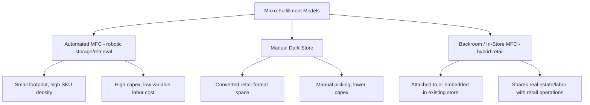

## Urban Logistics and Micro Fulfillment Centers

### Definition and Strategic Context

Urban logistics refers to the planning and operation of freight movement within dense metropolitan environments, addressing the unique constraints of city delivery — congestion, limited loading/parking infrastructure, regulatory access restrictions, and high real estate cost — as distinct from long-haul and suburban/rural distribution. Micro-fulfillment centers (MFCs) are small-footprint, urban-proximate fulfillment nodes designed to bring inventory physically closer to dense demand, compressing delivery time and reducing last-mile travel distance.

**Key Points**

- Urban logistics is driven by a structural tension: cities concentrate the demand density that makes fast, frequent delivery commercially attractive, while simultaneously imposing the highest per-vehicle-mile operating cost (congestion, parking, access restrictions) of any delivery environment.
- Micro-fulfillment centers are a network-design response to this tension — trading a larger number of smaller, more expensive-per-square-foot urban facilities for shorter, denser, faster last-mile routes.
- The category spans a spectrum from fully automated micro-fulfillment (robotic storage/retrieval in a small footprint) to manually operated "dark stores" (a converted retail-format space picked manually for delivery-only orders).

### Urban Logistics Challenges

**Key Points**

- **Congestion and travel-time variability**: dense traffic materially reduces achievable stops-per-hour compared to suburban/rural routes, directly increasing cost-per-delivery.
- **Loading and parking constraints**: limited curb space and loading docks in city centers create delivery-vehicle dwell and double-parking issues, which many cities now actively regulate.
- **Regulatory access restrictions**: low-emission zones (LEZ), vehicle weight/size restrictions, and time-of-day delivery curfews increasingly constrain which vehicles can operate where and when in city centers.
- **Real estate cost and availability**: warehouse-scale space is scarce and expensive within city limits, pushing fulfillment nodes toward smaller footprints or repurposed existing retail/light-industrial space.
- **Noise and community impact regulations**: restrictions on delivery vehicle noise (particularly for off-peak/night delivery) and equipment (e.g., refrigeration unit noise) in residential-adjacent zones.

### Micro-Fulfillment Center (MFC) Models

- **Automated MFC**: uses compact automated storage and retrieval systems (grid-based robotic shuttle systems, vertical lift modules, or similar) to store high-SKU-density inventory in a small footprint and retrieve items to a picking station via robotics rather than human walking — designed for high order-density urban catchments where labor cost and floor space are both constrained.
- **Manual dark store**: a delivery-only facility, often a converted or purpose-built retail-format space, stocked with fast-moving SKUs (particularly common in grocery/convenience "quick commerce"), picked manually by staff for dispatch via bike, scooter, or small vehicle.
- **In-store/backroom MFC**: automated or semi-automated fulfillment capability embedded within or attached to an existing retail store, allowing the store to simultaneously serve walk-in customers and fulfill online orders from shared inventory.

### Network Design Rationale

**Key Points**

- **Delivery radius compression**: MFCs are typically sited to serve a small radius (often a few kilometers) around dense urban demand, enabling delivery windows measured in tens of minutes to a few hours rather than next-day.
- **Inventory assortment strategy**: MFCs generally stock a curated, fast-moving subset of full assortment (commonly grocery, convenience, and high-velocity SKUs) rather than full catalog breadth, since footprint constraints make holding long-tail slow-moving inventory economically inefficient.
- **Density-dependent economics**: MFC viability is highly sensitive to local order density — a given urban catchment needs sufficient order volume per square kilometer to justify the fixed cost of the facility, meaning MFC network expansion is generally prioritized by population/order density ranking rather than uniform geographic coverage.

$$Cost\ per\ order_{MFC} = \frac{C_{facility,fixed} + C_{labor} + C_{automation\_amortization}}{Order\ volume\ per\ period} + C_{last-mile,short}$$

As order density rises, the fixed-cost component per order falls while the (already short) last-mile cost stays low, which is the core economic case for MFCs in sufficiently dense urban catchments; below a density threshold, the fixed-cost burden per order makes the model economically unfavorable compared to fulfilling from a larger, more distant, lower-cost-per-square-foot facility. [Inference] Specific density thresholds at which MFC economics become favorable are highly market- and format-specific (grocery versus general merchandise, automation level, local labor and real estate cost) and are not standardized figures, so any quoted threshold should be treated as illustrative rather than universal.

### Automation Technologies in Micro-Fulfillment

**Key Points**

- **Grid-based robotic storage systems**: robots move across a grid above a dense stack of bins, retrieving and delivering bins to picking ports — a common design pattern for compact, high-density automated grocery MFCs.
- **Vertical lift modules and carousel systems**: goods-to-person storage using vertical space efficiently within a small footprint, reducing the horizontal travel typical of manual picking.
- **Autonomous mobile robots (AMRs)**: mobile robotic units that transport bins/totes to stationary human pickers, reducing pick-travel time within the facility.
- **Order batching and micro-wave planning**: because MFC order volumes are typically many small, frequent orders rather than large batch orders, wave/batch logic is tuned for very short cycle times (minutes) rather than the hours-long wave cycles typical of traditional DCs.

### Integration with Urban Consolidation and Delivery Fleets

**Key Points**

- **Urban Consolidation Centers (UCCs)**: edge-of-city facilities where freight from multiple shippers/carriers is consolidated onto shared last-mile vehicles for final urban delivery — a related but distinct concept from MFCs (UCCs consolidate multi-shipper freight for handoff; MFCs hold single-retailer inventory for direct fulfillment).
- **Micro-mobility last-mile integration**: MFCs are frequently paired with cargo bikes, e-scooters, or small electric vans for the final delivery leg, since short delivery radii make micro-mobility vehicles operationally viable (unlike longer-haul last-mile routes).
- **Fleet right-sizing**: urban logistics operations increasingly match vehicle type to load and access constraints — larger vans for consolidated multi-stop routes into accessible areas, smaller/lighter vehicles (cargo bikes, walking couriers) for dense pedestrian-zone or restricted-access delivery.

### Real Estate and Site Selection Considerations

**Key Points**

- **Repurposed retail/light-industrial space**: many MFC and dark-store deployments use converted existing retail units, parking structures, or light-industrial space rather than purpose-built new construction, given urban real estate scarcity and the desire for rapid network expansion.
- **Proximity-to-demand siting models**: site selection typically uses order-density heatmaps and drive/ride-time isochrones (areas reachable within a target delivery time) rather than simple radial distance, to reflect real street-network and congestion constraints.
- **Zoning and permitting constraints**: light-industrial or commercial zoning classifications, loading-dock requirements, and local permitting processes for delivery-only (non-retail-facing) facility use can materially affect site feasibility and timeline. [Unverified] Specific zoning treatment of dark stores/MFCs (e.g., whether they are classified as retail, warehouse, or a distinct use category) varies by municipality and has been an active area of local regulatory debate in several markets, so current classification should be confirmed against local planning authority guidance.

### Regulatory and Community Considerations

**Key Points**

- **Low-emission zone compliance**: urban fulfillment strategies increasingly require electric or low-emission delivery fleets to operate within city-center LEZ boundaries.
- **Delivery curfews and noise ordinances**: some municipalities restrict delivery vehicle operating hours or noise levels, particularly near residential zones, shaping MFC dispatch scheduling.
- **Community/neighborhood pushback**: dark stores and MFCs sited in mixed-use or residential-adjacent areas have in some markets faced community and municipal scrutiny over traffic, noise, and neighborhood character concerns; [Unverified] the regulatory response to this (e.g., specific operating restrictions or moratoria) is jurisdiction-specific and evolving, and should be checked against current local news/regulatory sources for any specific market being evaluated.

### Key Metrics for Urban Logistics and MFC Performance

- **Order-to-delivery time**: from order placement to customer receipt, the primary competitive metric for quick-commerce MFC models.
- **Cost per order (fully loaded)**: facility fixed cost, automation amortization, labor, and last-mile cost combined.
- **Orders per square foot / per hour**: throughput density metric reflecting facility and automation efficiency.
- **Delivery radius / catchment coverage**: geographic area served within target delivery-time SLA.
- **Vehicle-miles per delivery**: sustainability and congestion-impact metric, generally lower for MFC-served orders than for orders served from distant traditional DCs.
- **Facility utilization rate**: percentage of automated storage/picking capacity actively used relative to installed capacity.

**Related Topics**

- Last-mile delivery models and route density economics
- E-commerce fulfillment network design and node-count cost trade-offs
- Warehouse automation: AS/RS, AMRs, and goods-to-person picking systems
- Urban Consolidation Centers and low-emission zone compliance
- Quick commerce (q-commerce) operating models
- Electric and micro-mobility last-mile fleet transition
- Municipal freight policy and delivery curfew regulation