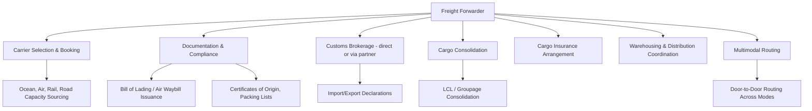

## Freight Forwarders: Roles and Functions

### Definition and Position in the Supply Chain

A freight forwarder is an intermediary that arranges the movement of goods on behalf of a shipper (cargo owner), coordinating across carriers, modes, and jurisdictions without necessarily owning the underlying transport assets (vessels, aircraft, trucks) themselves. The forwarder's core value proposition is expertise, network relationships, and consolidated buying power that individual shippers — particularly small and mid-sized ones — typically cannot replicate on their own.

**Key Points**

- Forwarders are generally classified as **non-vessel-operating common carriers (NVOCCs)** in ocean freight when they issue their own bills of lading while chartering space from actual vessel operators — a common legal/operational structure distinguishing them from asset-owning carriers.
- Forwarders can act as either an **agent** (arranging carriage on the shipper's behalf, shipper bears carrier liability directly) or as a **principal/contracting carrier** (the forwarder itself takes on carrier liability under its own bill of lading, then subcontracts actual carriage) — this distinction has significant legal and liability implications.
- Forwarders sit between the shipper and the underlying asset-based carriers (ocean lines, airlines, rail operators, trucking companies), aggregating volume across multiple shippers to negotiate better rates and secure capacity than any single shipper could obtain independently.

### Core Functional Roles

**Key Points**

- **Carrier selection and booking**: sourcing and booking capacity across ocean, air, rail, and road carriers based on cost, transit time, and reliability, leveraging the forwarder's aggregated volume for preferential rates and space allocation (particularly valuable during capacity-constrained periods).
- **Documentation management**: preparing and processing the substantial paperwork of international shipping — bills of lading, air waybills, commercial invoices, packing lists, certificates of origin, and other trade documents required by carriers and customs authorities.
- **Cargo consolidation (groupage)**: combining multiple shippers' less-than-container-load (LCL) or less-than-truckload (LTL) shipments into full container loads (FCL) or full truckloads, achieving better per-unit shipping economics than any single shipper's partial load could obtain alone.
- **Multimodal/door-to-door routing**: planning and coordinating movement across multiple transport modes and legs (factory to port, ocean/air transit, port to final destination) under a single point of contact, rather than the shipper contracting separately with each mode's carrier.

### Customs Brokerage Function

**Key Points**

- Many freight forwarders offer customs brokerage either as an in-house licensed function or through partnership/affiliation with licensed customs brokers, since customs clearance typically requires specific national licensing (e.g., customs broker licensing regimes administered by national customs authorities).
- Core customs-related tasks include preparing and filing import/export declarations, calculating and facilitating payment of duties and taxes, classifying goods under the applicable tariff nomenclature (e.g., Harmonized System codes), and ensuring compliance with import/export licensing and restricted-goods regulations.
- [Inference] Whether a given forwarder is itself the licensed customs broker of record, or subcontracts this function to a separately licensed partner, varies by company and jurisdiction, and the specific arrangement should be confirmed for any individual forwarder rather than assumed.

### Documentation Instruments Issued or Managed by Forwarders

**Key Points**

- **House Bill of Lading (HBL) / House Air Waybill (HAWB)**: issued by the forwarder to its individual customer, evidencing the contract of carriage between forwarder and shipper, distinct from the **Master Bill of Lading (MBL)/Master Air Waybill (MAWB)** issued by the actual ocean/air carrier to the forwarder covering the full consolidated shipment.
- **FIATA documents**: standardized forwarding documents developed under the International Federation of Freight Forwarders Associations (FIATA) framework, providing internationally recognized document formats (e.g., FIATA Bill of Lading, forwarding certificates) intended to bring consistency to forwarder-issued documentation across markets. [Unverified] The specific FIATA document set in current use and its exact legal standing varies by country and should be verified against current FIATA publications for precise application.
- **Certificates of origin, packing lists, commercial invoices**: prepared or coordinated by the forwarder to support customs clearance and, where applicable, preferential trade-agreement tariff treatment.

### Consolidation Economics (LCL/Groupage)

$$Cost\ per\ CBM_{shipper} = \frac{C_{full\ container} \times \frac{V_{shipper}}{V_{container}}}{V_{shipper}} + C_{handling,CFS}$$

A shipper with a partial container load benefits from consolidation when the forwarder's groupage rate (aggregating multiple shippers' cargo into a shared full container) results in a lower per-cubic-meter cost than the shipper would pay booking a dedicated partial or full container independently — the core economic rationale for LCL/groupage services.

**Example**

A shipper needing to move 8 cubic meters of cargo faces a choice: booking a dedicated 20-ft container (typically holding around 28–30 CBM usable capacity) alone, paying the full container rate for mostly unused space, versus using a forwarder's LCL/groupage service, where the shipper pays only for their 8 CBM share of a full container consolidated with other shippers' cargo (plus CFS handling fees). For partial loads well below full container capacity, groupage consolidation is typically the lower-cost option, though the trade-off is generally longer transit time (waiting for container consolidation) and additional handling at origin/destination CFS facilities.

### Value-Added Services

**Key Points**

- **Cargo insurance arrangement**: forwarders commonly offer or facilitate cargo insurance placement, distinct from the limited liability typically available under standard carrier bills of lading (which are often capped at relatively low per-kg or per-package limits under international carriage conventions).
- **Warehousing and distribution**: some forwarders operate or partner for bonded warehousing, transloading, and inland distribution services, extending their role beyond pure transport arrangement into broader supply chain management.
- **Trade compliance advisory**: guidance on export control regulations, sanctions screening, restricted party checks, and free trade agreement utilization to support duty savings.
- **Technology/visibility platforms**: many forwarders provide online booking, shipment tracking, and documentation portals, with varying degrees of real-time visibility integration across the carriers they book with.

### Forwarder Types and Specializations

**Key Points**

- **Ocean freight forwarders / NVOCCs**: specialize in ocean container and breakbulk cargo movement.
- **Air freight forwarders**: specialize in air cargo booking and consolidation, often holding IATA cargo agent accreditation for direct airline booking relationships.
- **Project cargo/heavy-lift forwarders**: specialize in oversized, overweight, or high-value cargo requiring specialized equipment, routing studies, and permitting (e.g., industrial equipment, wind turbine components).
- **Customs house brokers with forwarding capability**: entities primarily licensed for customs clearance that also offer transportation arrangement services.
- **Digital/tech-enabled forwarders**: forwarders differentiated primarily through online booking platforms and rate transparency tools, layered on the same underlying functional roles as traditional forwarders.

### Liability Framework Considerations

**Key Points**

- Forwarder liability depends heavily on the capacity in which they act: as a pure **agent**, liability for loss/damage generally rests with the underlying carrier under that carrier's terms and applicable international convention (e.g., relevant ocean or air carriage conventions); as a **contracting carrier** (issuing its own house bill of lading), the forwarder typically assumes carrier-level liability to its customer, then seeks recovery from the underlying carrier if a claim arises.
- Standard trading conditions (e.g., national freight forwarder association standard terms) commonly cap forwarder liability at specified limits unless the shipper declares a higher value and pays an applicable premium.
- [Inference] Because liability regimes differ by mode (ocean, air, road, rail each have distinct international conventions governing carrier liability limits) and by the specific contractual terms in use, precise liability exposure in any given shipment should be assessed against the specific bill of lading/contract terms and applicable convention rather than assumed generically.

### Selection Criteria for Shippers

**Key Points**

- **Network coverage and mode expertise**: alignment between the forwarder's geographic and modal strengths and the shipper's specific trade lanes.
- **Customs and compliance capability**: particularly important for shippers dealing with complex regulatory categories (dangerous goods, controlled/dual-use items, food/pharma cold chain).
- **Technology and visibility integration**: API/EDI integration capability with the shipper's own systems for automated booking and status updates.
- **Financial stability and licensing/bonding status**: relevant given the forwarder's role in handling customer funds (duty payments, freight charges) and contractual liability exposure.
- **Rate transparency and total-cost accounting**: ability to itemize base freight, accessorials, and forwarder margin clearly, versus bundled all-in pricing that can obscure cost drivers.

### Key Metrics for Forwarder Performance

- **On-time shipment/booking execution rate**.
- **Documentation accuracy rate**: percentage of shipments processed without customs holds or documentation errors.
- **Cost competitiveness / rate variance versus market benchmarks**.
- **Claims resolution time and rate**.
- **Consolidation efficiency (for LCL/groupage providers)**: container utilization achieved across consolidated shipments.

**Related Topics**

- Non-Vessel-Operating Common Carrier (NVOCC) regulatory framework
- Bill of lading types and international carriage liability conventions
- Customs brokerage licensing and Harmonized System tariff classification
- LCL/groupage consolidation and Container Freight Station (CFS) operations
- Incoterms and their interaction with forwarder-arranged carriage
- Third-party logistics (3PL) and fourth-party logistics (4PL) provider models
- Trade compliance, export controls, and sanctions screening