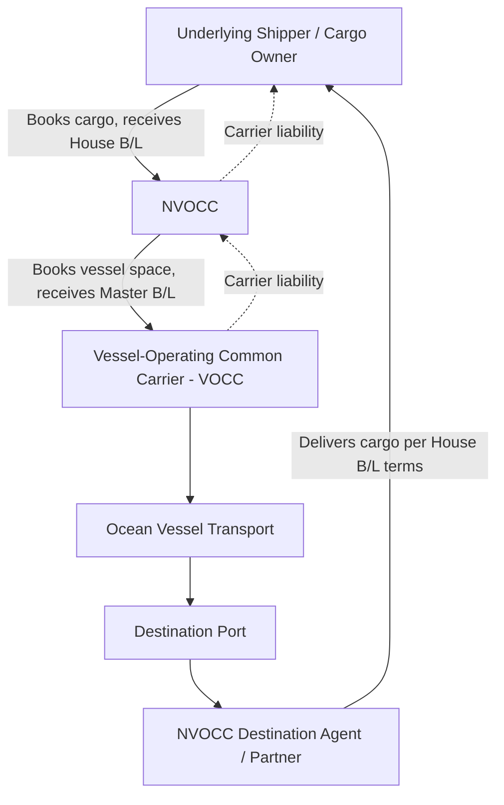

## Non Vessel Operating Common Carriers (NVOCCs)

### Definition and Regulatory Classification

A Non-Vessel-Operating Common Carrier (NVOCC) is an ocean transportation intermediary that acts as a carrier to its customers (shippers) by issuing its own bills of lading and assuming carrier liability, while itself acting as a shipper toward the actual vessel-operating ocean carriers whose ship space it purchases or charters — the NVOCC operates as a carrier without owning or operating vessels.

**Key Points**

- The NVOCC occupies a dual legal position: **carrier** to the underlying shipper (issuing a House Bill of Lading and holding carrier-level responsibility), and **shipper/customer** to the vessel-operating common carrier (VOCC) whose vessel space it books (receiving a Master Bill of Lading).
- This distinguishes NVOCCs from pure **freight forwarders acting as agents**, who arrange carriage on the shipper's behalf without themselves assuming carrier liability under their own bill of lading.
- In many jurisdictions, NVOCC status carries specific regulatory obligations distinct from general freight-forwarding activity, since the NVOCC is legally treated as a common carrier for liability and (in some regimes) tariff-filing purposes. [Unverified] Specific regulatory definitions, licensing/registration requirements, and financial responsibility (bonding) requirements for NVOCCs vary by country and regulatory body and are subject to periodic rule changes, so current requirements should be verified against the applicable national maritime regulatory authority rather than assumed from general industry knowledge.

### Position in the Ocean Freight Contracting Chain

**Key Points**

- The underlying shipper contracts with, and holds a claim against, the NVOCC under the House Bill of Lading terms — the shipper generally has no direct contractual relationship with the vessel-operating carrier.
- The NVOCC, in turn, holds a shipper-side claim against the vessel-operating carrier under the Master Bill of Lading, should cargo loss or damage occur during ocean transit.
- This layered structure allows the NVOCC to consolidate cargo from many individual shippers (LCL/groupage) into container loads booked under a single Master Bill of Lading with the underlying vessel operator.

### Core Functions Performed by NVOCCs

**Key Points**

- **Bill of lading issuance**: the defining NVOCC function — issuing House Bills of Lading as the contracting carrier, assuming carrier-level responsibility to the cargo owner.
- **Space procurement and slot management**: purchasing or contracting ocean container slots from vessel-operating carriers, often through service contracts or space allocation agreements, sometimes at volume-driven preferential rates.
- **LCL consolidation (groupage)**: combining multiple shippers' less-than-container-load cargo into full container loads under a single Master Bill of Lading, a core NVOCC economic function analogous to less-than-truckload consolidation in trucking.
- **Rate and tariff management**: in regulatory regimes requiring tariff publication, filing and maintaining NVOCC service tariffs (or, where deregulated/exempted, operating under service contracts or negotiated rate arrangements instead).
- **Claims handling as carrier of record**: because the NVOCC issues its own bill of lading, it is typically the first point of liability for cargo claims from the underlying shipper, subsequently pursuing recovery from the vessel operator if the loss occurred during the ocean leg.

### NVOCC vs. Related Intermediary Roles — Comparison

| Characteristic | NVOCC | Freight Forwarder (Agent Model) | Vessel-Operating Common Carrier (VOCC) |
| --- | --- | --- | --- |
| Issues own bill of lading | Yes (House B/L) | Generally no (arranges carriage under underlying carrier's terms) | Yes (Master B/L) |
| Assumes carrier liability to shipper | Yes | No (liability generally rests with underlying carrier) | Yes |
| Owns/operates vessels | No | No | Yes |
| Consolidates LCL cargo under own B/L | Yes, commonly | Varies — may arrange but not always consolidate under own B/L | Not typically at the LCL level |
| Regulatory treatment | Often classified as a common carrier for liability/registration purposes | Often classified as an agent/intermediary, distinct regulatory treatment | Vessel-owning common carrier, primary regulatory subject |

[Inference] In practice, many commercial entities operate hybrid businesses performing both NVOCC and agent-forwarder functions depending on the specific shipment and contractual arrangement chosen with each customer, so the classification above describes functional roles rather than mutually exclusive company categories.

### Economic Rationale for the NVOCC Model

**Key Points**

- **Consolidation arbitrage**: by aggregating LCL cargo from many shippers into FCL bookings, NVOCCs access full-container-load ocean freight rates (generally lower per-unit-volume than partial-container rates) while charging shippers a per-CBM/per-weight rate that is profitable relative to the aggregated FCL cost — the core margin source for NVOCC groupage operations.
- **Volume-based rate leverage**: NVOCCs with substantial aggregate volume across many shippers and lanes can negotiate service contracts with vessel operators at rates more favorable than an individual mid-sized shipper could obtain independently.
- **Risk absorption and service differentiation**: by assuming carrier liability directly, NVOCCs offer shippers (particularly smaller ones without in-house trade compliance/claims expertise) a simplified single point of commercial and legal accountability compared to contracting directly with a vessel operator.

$$Margin_{NVOCC} = \left(\sum_i R_i \times V_i\right) - C_{FCL,vessel\ operator} - C_{operating}$$

Where $R_i$ is the per-unit rate charged to shipper $i$, $V_i$ is that shipper's cargo volume, $C_{FCL,vessel\ operator}$ is the NVOCC's own cost of the consolidated full container load booked with the vessel operator, and $C_{operating}$ covers CFS handling, documentation, and overhead.

### Financial Responsibility and Bonding

**Key Points**

- Many regulatory regimes require NVOCCs to maintain a bond, insurance, or other form of financial guarantee as a condition of operating, intended to ensure the NVOCC can meet claims and regulatory obligations (e.g., unpaid freight charges owed to underlying vessel operators, or cargo claims owed to shippers).
- [Unverified] Specific bonding amounts, forms of acceptable financial responsibility instruments, and applicable thresholds vary by jurisdiction and are periodically revised by the relevant regulatory body, so current requirements should be confirmed against the applicable national regulator's current published rules.
- Some regimes distinguish between **licensed/negotiated-rate NVOCCs** (subject to specific registration and tariff obligations) and other intermediary categories with different compliance obligations — the precise regulatory taxonomy is jurisdiction-specific.

### Documentation Instruments

**Key Points**

- **House Bill of Lading (HBL)**: issued by the NVOCC to the underlying shipper; the contractual document governing the shipper–NVOCC relationship, including terms, conditions, and liability limits.
- **Master Bill of Lading (MBL)**: issued by the vessel-operating carrier to the NVOCC, covering the full consolidated container(s) booked; the shipper is typically not a named party on this document.
- **Manifest and cargo declaration filings**: NVOCCs are typically responsible for filing cargo information (shipper, consignee, cargo description) into destination-country customs pre-arrival/manifest systems for the shipments they consolidate, a compliance function tied closely to their carrier-of-record status.

### Liability and Claims Framework

**Key Points**

- Because the NVOCC issues its own House Bill of Lading, cargo claims from the underlying shipper are generally first directed at the NVOCC, under the terms and liability limits stated in that House Bill of Lading (often referencing an applicable international carriage-of-goods-by-sea convention for default liability limits, unless superseded by the NVOCC's own tariff/terms).
- The NVOCC then typically pursues a corresponding claim against the vessel-operating carrier under the Master Bill of Lading terms, if the loss or damage occurred during the ocean carriage leg rather than during NVOCC-controlled handling (e.g., at a CFS).
- This "back-to-back" claims structure means claims resolution timing for the underlying shipper is not necessarily dependent on the NVOCC first resolving its own claim against the vessel operator — the NVOCC's direct liability to its customer under the House Bill of Lading generally stands independently. [Inference] The precise mechanics and timing of claims resolution depend heavily on the specific bill of lading terms and applicable liability convention in force for the shipment, so general statements here should not be relied upon for an actual claims dispute without reviewing the specific contract terms.

### Selection Considerations for Shippers Using NVOCC Services

**Key Points**

- **Financial stability and bonding verification**: confirming the NVOCC maintains adequate financial responsibility coverage, particularly relevant for shippers relying on the NVOCC's carrier-liability assumption.
- **Trade lane coverage and consolidation frequency**: alignment between the shipper's specific origin-destination lanes and the NVOCC's established groupage/consolidation schedule on those lanes.
- **Transit time and consolidation cut-off cycles**: LCL consolidation inherently introduces some schedule dependency (waiting for sufficient volume to fill a container), so shippers with time-sensitive cargo should evaluate typical consolidation cycle times on the relevant lane.
- **Claims handling track record and documented liability terms**: reviewing the NVOCC's standard House Bill of Lading terms and liability limits before contracting, since these define the shipper's actual legal protection.

### Key Metrics for NVOCC Operational Performance

- **Container utilization rate**: achieved fill rate of consolidated containers relative to capacity, reflecting consolidation efficiency.
- **On-time sailing/booking execution rate** against the vessel operator's schedule.
- **Documentation accuracy and manifest filing compliance rate**.
- **Claims frequency and resolution cycle time**.
- **Rate competitiveness relative to direct vessel-operator FCL rates** (net of consolidation value delivered to LCL shippers).

**Related Topics**

- Bill of lading types: House B/L versus Master B/L structures and legal effect
- Freight forwarder roles and agent-versus-principal liability distinctions
- LCL/groupage consolidation economics and Container Freight Station operations
- International carriage-of-goods liability conventions and limitation of liability
- Ocean carrier service contracts and space allocation agreements
- Customs manifest filing and cargo pre-arrival declaration requirements
- Incoterms and their interaction with NVOCC-issued bills of lading