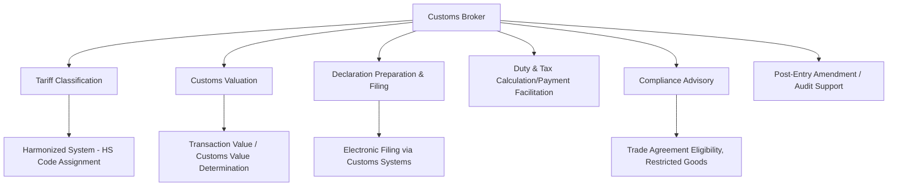

## Customs Brokers

### Definition and Regulatory Position

A customs broker is a licensed intermediary authorized by a national customs authority to prepare and submit import/export declarations and related documentation on behalf of importers and exporters, and to facilitate the payment of duties, taxes, and fees owed to that authority. The licensing requirement distinguishes customs brokerage from general freight forwarding — customs clearance activities in most jurisdictions legally require a specific broker license, whereas arranging transportation generally does not.

**Key Points**

- Customs brokers act as the importer/exporter's authorized agent before the customs authority, meaning their declarations carry legal weight and their errors can create direct compliance liability for their client.
- Licensing regimes (administered by the relevant national customs authority) typically require passing an examination, maintaining a bond or financial guarantee, and ongoing continuing-education or compliance obligations. [Unverified] Specific licensing requirements, examination content, and bonding thresholds vary by country and are periodically revised, so current requirements should be verified against the applicable national customs authority's current published rules rather than assumed from general knowledge.
- Many freight forwarders operate an in-house licensed brokerage function or partner with a separately licensed broker, meaning the "forwarder" and "broker" roles are often bundled commercially even though they are legally and functionally distinct.

### Core Functions

**Key Points**

- **Tariff classification**: assigning the correct Harmonized System (HS) code (and applicable national tariff subheading extensions) to each imported/exported product, which determines the applicable duty rate, regulatory requirements, and statistical reporting category.
- **Customs valuation**: determining the customs value of goods (commonly based on transaction value — the price actually paid or payable for the goods, adjusted per applicable valuation rules) used as the basis for duty and tax calculation.
- **Declaration preparation and electronic filing**: compiling and submitting the formal import/export declaration through the customs authority's electronic filing system, referencing the commercial invoice, packing list, bill of lading/air waybill, and any required permits or certificates.
- **Duty, tax, and fee calculation and payment facilitation**: calculating amounts owed (duties, value-added tax/GST where applicable, excise taxes, and processing fees) and facilitating payment to the customs authority, sometimes through broker-managed duty deferment or periodic payment accounts.
- **Compliance advisory**: guidance on preferential trade agreement eligibility (rules of origin qualification for reduced/zero duty rates), restricted or controlled goods requirements, and licensing needs for regulated product categories.
- **Post-entry correction and audit support**: filing amendments to previously submitted declarations when errors are identified, and supporting the importer during customs audits or post-clearance verification reviews.

### Tariff Classification Mechanics

**Key Points**

- The Harmonized System (HS), maintained under the World Customs Organization framework, provides an internationally standardized 6-digit product classification structure, with individual countries extending it to 8, 10, or more digits for national tariff and statistical purposes.
- Classification determines not just the duty rate but also whether specific non-tariff requirements apply (e.g., anti-dumping/countervailing duties on specific product-origin combinations, quota restrictions, or agency-specific import permits for categories like food, pharmaceuticals, or hazardous materials).
- Misclassification — even unintentional — can result in underpayment or overpayment of duty, and in cases of pattern misclassification, may trigger penalties or audit scrutiny; this is a primary area where customs broker expertise reduces compliance risk for importers.

**Example**

A company importing a product that could plausibly be classified under two different HS subheadings — one carrying a 5% duty rate and another carrying a 12% duty rate — relies on the customs broker's classification expertise (informed by binding rulings, classification precedent, and the product's specific composition/function) to determine the legally correct classification, since choosing the lower-duty classification without proper justification exposes the importer to retroactive duty assessment and penalties if challenged in a post-entry audit.

### Customs Valuation Principles

**Key Points**

- **Transaction value method**: the primary valuation method under the WTO Customs Valuation Agreement framework, based on the price actually paid or payable for the goods when sold for export to the importing country, subject to specified additions (e.g., certain royalties, assists, packing costs) and deductions.
- **Alternative valuation methods**: applied when transaction value cannot be used (e.g., related-party transactions without an arm's-length price, or non-sale transactions) — including methods based on the transaction value of identical or similar goods, deductive value, or computed value, applied in a specified hierarchical order under most national frameworks.
- **Related-party transfer pricing considerations**: intercompany import transactions (common in multinational supply chains) require particular attention to ensure declared customs value reflects an arm's-length price, an area of frequent customs audit focus. [Inference] The interaction between customs valuation rules and corporate transfer pricing policy is a specialized compliance area that often requires coordination between customs brokers, trade compliance counsel, and tax/transfer-pricing specialists rather than being resolved by broker expertise alone.

### Rules of Origin and Preferential Trade Agreements

**Key Points**

- Preferential trade agreements (bilateral or regional free trade agreements) offer reduced or zero duty rates for qualifying goods, but only when the goods meet the agreement's specific rules-of-origin criteria (e.g., minimum regional value content, tariff-shift requirements, or specific processing requirements).
- Customs brokers typically assist importers/exporters in determining rules-of-origin qualification and preparing the required origin documentation (certificates or declarations of origin) to claim preferential treatment.
- [Unverified] Specific rules-of-origin criteria differ substantially across the many bilateral and regional trade agreements in force globally, and eligibility should be verified against the specific agreement text and current implementing regulations for the products and countries involved, rather than generalized.

### Electronic Filing Systems and Data Requirements

**Key Points**

- Most customs authorities now require electronic submission of import/export declarations through a dedicated national single-window or customs automated filing system, rather than paper filing.
- Pre-arrival cargo information requirements (advance electronic manifest/cargo data submitted before vessel/aircraft arrival) are common in many jurisdictions as a security and risk-targeting measure, requiring coordination between the carrier/NVOCC (who typically files manifest-level data) and the customs broker (who files the formal entry/declaration).
- Automated risk-targeting systems used by customs authorities increasingly determine which shipments are selected for physical examination or document review versus expedited release, based on shipper/importer history, product risk category, and declared data consistency.

### Special Program Participation

**Key Points**

- **Trusted trader / authorized economic operator programs**: many customs authorities offer certification programs (conceptually similar across jurisdictions, though under different names — e.g., Authorized Economic Operator (AEO) frameworks in various countries) granting importers with demonstrated security and compliance track records benefits such as reduced inspection rates and expedited clearance; customs brokers often assist clients in achieving and maintaining this certification status.
- **Duty deferment and bonded warehousing programs**: brokers facilitate importer participation in programs allowing duty payment deferral (e.g., periodic payment accounts) or storage of imported goods under customs bond before duty is owed (bonded warehouses, foreign-trade zones/free zones), which can improve importer cash flow and, in free-zone cases, enable value-added processing before duty liability is triggered.
- **Duty drawback programs**: some jurisdictions allow recovery of previously paid import duty when goods are subsequently exported or used in export production; brokers with drawback expertise assist in identifying and filing eligible drawback claims.

### Compliance Risk and Penalty Exposure

**Key Points**

- Customs authorities in most jurisdictions can impose penalties for misdeclaration, misclassification, or undervaluation, with penalty severity generally scaled to the degree of culpability (ranging from simple negligence to fraud) under most national penalty frameworks.
- Reasonable care/due diligence standards typically apply to the importer of record (not solely the broker), meaning importers generally cannot fully outsource compliance responsibility to their broker — importers are commonly expected to provide accurate information and exercise oversight even when using licensed broker services.
- [Inference] The precise allocation of legal liability between an importer of record and its customs broker for declaration errors depends on the specific national legal framework and the terms of the broker engagement, so this allocation should be assessed on a jurisdiction-specific and contract-specific basis rather than assumed uniform.

### Selection Criteria for Choosing a Customs Broker

**Key Points**

- **Licensing status and bonding verification**: confirming current, valid licensing and adequate financial responsibility coverage.
- **Product/industry specialization**: brokers with specific experience in the importer's product category (e.g., food and agriculture, pharmaceuticals, textiles, electronics) bring relevant classification and regulatory-agency-coordination expertise.
- **Port/jurisdiction coverage**: alignment between the broker's operational presence and the importer's actual ports of entry.
- **Technology integration**: EDI/API connectivity with the importer's ERP or trade-management systems for automated data exchange and declaration status visibility.
- **Audit and penalty defense track record**: experience supporting clients through customs audits and post-entry verification processes.

### Key Metrics for Customs Broker Performance

- **Declaration accuracy rate**: percentage of entries filed without error requiring amendment.
- **Clearance time**: average time from declaration filing to customs release.
- **Examination/hold rate**: percentage of shipments selected for physical or documentary examination, often used as an indicator of compliance track record quality.
- **Duty savings achieved**: through correct classification, valuation optimization within legal bounds, and trade agreement/drawback utilization.
- **Penalty/audit exposure incidents**: frequency and severity of compliance issues identified in post-entry review.

**Related Topics**

- Harmonized System tariff classification and binding ruling procedures
- Customs valuation methods and transfer pricing interaction
- Free trade agreement rules of origin and preferential tariff claims
- Authorized Economic Operator / trusted trader certification programs
- Bonded warehousing, foreign-trade zones, and duty deferment programs
- Duty drawback program mechanics
- Freight forwarder and NVOCC roles in the broader trade compliance chain