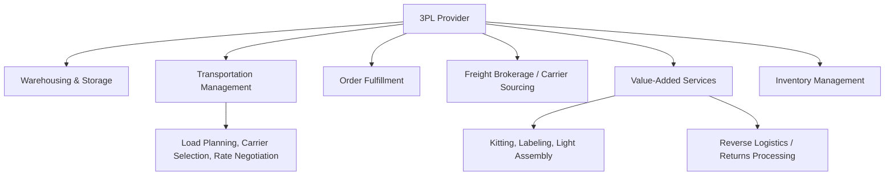

## Third Party and Fourth Party Logistics Providers (3PL and 4PL)

### Definitions and Position in the Logistics Outsourcing Spectrum

A **Third-Party Logistics (3PL) provider** is an outsourced service provider that performs one or more physical or transactional logistics functions on behalf of a shipper — typically warehousing, transportation management, freight brokerage, or distribution — using its own or subcontracted assets and operations. A **Fourth-Party Logistics (4PL) provider** operates at a higher orchestration level, managing and integrating the shipper's entire logistics function (including coordinating multiple 3PLs and other service providers) typically without owning significant transportation or warehousing assets itself.

**Key Points**

- The 3PL/4PL distinction is fundamentally about **scope and asset ownership**: 3PLs execute specific logistics functions (often asset-based or asset-light within a defined scope); 4PLs manage the overall logistics strategy and coordinate the ecosystem of providers (typically asset-free, acting as an integrator/orchestrator).
- The outsourcing spectrum runs from a shipper doing everything in-house (1PL), through using a for-hire carrier (2PL, e.g., simply contracting a trucking company for transport), through 3PL (outsourced execution of one or more functions), to 4PL (outsourced end-to-end logistics management and integration).
- In practice, market usage of "3PL" and "4PL" is not perfectly standardized, and many providers market hybrid capabilities spanning both categories; the terms are best understood as describing a functional scope spectrum rather than strict, mutually exclusive legal categories.

### Outsourcing Spectrum Overview

### 3PL Service Categories

**Key Points**

- **Asset-based 3PLs**: own and operate their own transportation equipment (trucks, trailers) and/or warehouse facilities, providing physical execution capacity directly.
- **Asset-light/non-asset-based 3PLs**: do not own significant transport or warehouse assets themselves, instead managing execution through a network of subcontracted carriers and facility partners — sometimes referred to as **freight brokers** or **transportation management 3PLs** when focused primarily on carrier sourcing and load matching.
- **Warehouse/distribution-focused 3PLs**: specialize in outsourced warehousing, order fulfillment, and value-added services (kitting, labeling, light assembly) on behalf of multiple client shippers, often sharing facility space and infrastructure across clients to achieve scale economies individual shippers could not achieve alone.
- **Specialized/vertical 3PLs**: focus on specific industry verticals with distinct handling requirements — e.g., cold chain/temperature-controlled logistics, hazardous materials, healthcare/pharmaceutical logistics, or e-commerce fulfillment specialists.

### Core 3PL Functions

**Key Points**

- **Warehousing and storage**: providing shared or dedicated warehouse space, typically billed on a per-pallet, per-square-foot, or per-unit-handled basis, allowing shippers to avoid the fixed capital cost of owning facilities.
- **Transportation management**: carrier sourcing, load planning, rate negotiation, and shipment execution across the shipper's transportation needs — often supported by a Transportation Management System (TMS) operated by the 3PL.
- **Order fulfillment**: pick-pack-ship execution on behalf of the shipper, particularly common in e-commerce, where 3PL fulfillment providers offer distributed warehouse networks that a smaller shipper could not economically build independently.
- **Value-added services**: kitting, custom labeling, light assembly, quality inspection, and returns processing bundled with core warehousing/transportation functions.
- **Inventory management support**: some 3PLs offer inventory visibility and replenishment coordination as part of their service, particularly warehouse-focused providers with integrated WMS capability.

### 4PL Role and Orchestration Model

**Key Points**

- A 4PL typically does not execute physical logistics functions directly; instead, it acts as a **lead logistics provider (LLP)** or integrator, designing the overall logistics strategy, selecting and managing a portfolio of 3PLs and carriers on the shipper's behalf, and providing unified visibility and performance management across that provider ecosystem.
- The 4PL model is often adopted by shippers with complex, multi-region, multi-provider logistics networks where the administrative burden of managing many individual 3PL/carrier relationships directly would be substantial, and where the shipper wants a single point of accountability for overall logistics performance rather than for any single function.
- 4PL engagements frequently involve the 4PL taking on **control tower** responsibilities: centralized visibility, exception management, and performance-data aggregation across the shipper's full transportation and warehousing network, regardless of which underlying 3PL or carrier is executing a given shipment.
- [Inference] Because 4PL is fundamentally a management/integration role rather than a defined execution scope, the specific contractual boundaries of a given 4PL engagement (e.g., degree of decision-making authority delegated to the 4PL, performance-risk-sharing arrangements) vary considerably by contract and are generally negotiated case-by-case rather than following a standardized template.

### 3PL vs. 4PL — Comparison

| Characteristic | 3PL | 4PL |
| --- | --- | --- |
| Primary role | Execute specific logistics function(s) | Design, manage, and integrate overall logistics strategy across providers |
| Asset ownership | Often asset-based or asset-light within scope | Typically asset-free (management/integration layer) |
| Scope | Function-specific (warehousing, transport, fulfillment) | End-to-end network management, often across multiple 3PLs |
| Typical client relationship | Operational/execution contract | Strategic partnership, often longer-term and broader in authority |
| Visibility scope | Own operations | Aggregated visibility across the full provider ecosystem |

### Commercial and Contracting Models

**Key Points**

- **Transactional/per-activity pricing**: common in 3PL warehousing (per-pallet-in/out, per-order-fulfilled) and transportation (per-shipment, per-mile) engagements, aligning cost directly to volume.
- **Cost-plus or open-book pricing**: the provider's actual costs are passed through with an agreed management fee or margin, often used in more strategic, longer-term 3PL/4PL relationships requiring greater cost transparency.
- **Gain-sharing/performance-based contracts**: increasingly used in 4PL engagements, where a portion of provider compensation is tied to achieving specific cost-reduction or service-level improvement targets, aligning incentives between shipper and provider around measurable outcomes rather than pure activity volume.
- **Service Level Agreements (SLAs)**: define specific, measurable performance commitments (on-time delivery, order accuracy, inventory accuracy) with associated penalty or incentive structures, forming the operational backbone of most 3PL/4PL contracts regardless of pricing model.

### Selection and Governance Considerations

**Key Points**

- **Scope-fit assessment**: determining whether the shipper's need is best served by outsourcing a specific function (3PL) versus outsourcing overall logistics management and integration (4PL) — generally driven by the complexity of the shipper's provider ecosystem and internal logistics management capability/capacity.
- **Technology and integration capability**: TMS/WMS system compatibility and data-integration capability (EDI/API) between the shipper's systems and the provider's platform, critical for both 3PL execution visibility and 4PL control-tower aggregation.
- **Network fit and geographic coverage**: alignment between the provider's facility/carrier network footprint and the shipper's actual demand geography.
- **Governance structure**: particularly important in 4PL relationships, defining decision rights, escalation processes, and performance review cadence given the broader scope of authority typically delegated to a 4PL.
- **Exit/transition planning**: given the depth of integration in longer-term 3PL/4PL relationships (especially where the provider holds significant operational knowledge or system configuration), contracts commonly address transition assistance obligations in the event of provider change.

### Key Metrics for 3PL/4PL Performance Evaluation

- **On-time delivery/fulfillment rate**: core execution SLA metric for 3PLs, aggregated across providers for 4PL control-tower reporting.
- **Order/inventory accuracy rate**.
- **Cost per unit handled/shipped**, benchmarked against market rates or prior in-house cost baseline.
- **Total logistics cost as a percentage of revenue or cost of goods sold**: a common high-level metric used to evaluate overall 4PL program effectiveness.
- **Provider network performance variance**: for 4PL engagements, the spread in performance across the multiple underlying 3PLs/carriers being managed, used to identify underperforming network segments.
- **Contract compliance/SLA adherence rate**: percentage of defined service commitments met within a reporting period.

**Related Topics**

- Transportation Management Systems (TMS) and Warehouse Management Systems (WMS)
- Control tower architecture and multi-provider visibility platforms
- Freight brokerage and digital freight matching platforms
- Gain-sharing and performance-based logistics contract design
- E-commerce fulfillment outsourcing and 3PL network selection
- Freight forwarders and NVOCCs as specialized intermediary types distinct from 3PL/4PL
- Logistics outsourcing risk management and transition/exit planning