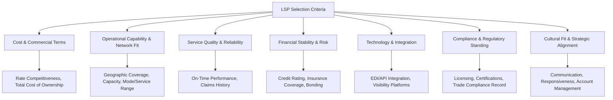

## Criteria for Selecting Logistics Service Providers

### Purpose and Framework Overview

Selecting a logistics service provider (LSP) — whether a carrier, freight forwarder, customs broker, 3PL, or 4PL — is a multi-criteria decision that balances cost, service quality, risk, and strategic fit. Because logistics performance directly affects a shipper's own customer service levels and cost structure, provider selection is generally treated as a structured evaluation process rather than a purely price-driven procurement decision.

**Key Points**

- Selection criteria weighting differs by provider type and by the strategic importance of the outsourced function — a low-value, non-critical spot shipment can reasonably be awarded primarily on price, while a strategic 4PL or dedicated 3PL warehousing relationship typically requires deeper evaluation across operational, financial, and cultural-fit dimensions.
- Most structured selection processes combine **quantitative scoring** (cost, capacity, historical performance data) with **qualitative assessment** (cultural fit, communication quality, strategic alignment), since logistics service quality includes dimensions not easily reduced to a single number.
- Selection criteria are generally most useful when explicitly weighted and documented before evaluating specific providers, reducing the risk that the evaluation process is retroactively shaped to favor a preferred incumbent or the lowest-cost bidder.

### Core Evaluation Dimensions

### Cost and Commercial Terms

**Key Points**

- **Rate competitiveness**: base rate comparison against market benchmarks, but evaluated alongside accessorial/surcharge structures, since a low base rate can be offset by aggressive accessorial fees (fuel surcharges, detention/demurrage, address correction fees).
- **Total cost of ownership (TCO)**: the fully loaded cost of using a given provider, including base rates, accessorials, technology/integration cost, and the cost of managing the relationship — not just the headline quoted rate.
- **Payment terms and billing accuracy**: provider invoicing accuracy and dispute-resolution responsiveness materially affect the administrative cost of the relationship, independent of the underlying rate level.
- **Contract flexibility**: minimum volume commitments, rate lock-in periods, and penalty/exit clauses affect the shipper's ability to adjust volume or exit the relationship if performance or market conditions change.

$$TCO = C_{base\ rate} + C_{accessorials} + C_{technology/integration} + C_{relationship\ management} - Value_{service\ differentiation}$$

**Example**

Two carriers quote similar base linehaul rates for a lane, but Carrier A has significantly higher detention/demurrage fee schedules and a stricter free-time allowance than Carrier B. A shipper with historically variable dock turnaround times may find Carrier B's total cost of ownership lower despite an identical or even slightly higher base rate, illustrating why base-rate comparison alone is an incomplete selection criterion.

### Operational Capability and Network Fit

**Key Points**

- **Geographic coverage**: alignment between the provider's service network (ports served, delivery footprint, terminal locations) and the shipper's actual origin-destination demand pattern.
- **Capacity and scalability**: the provider's ability to absorb the shipper's peak-season or growth-driven volume increases without service degradation, particularly relevant for shippers with seasonal demand concentration.
- **Mode/service range**: whether the provider offers the specific transport modes, service levels (e.g., expedited/standard), and specialized handling capabilities (temperature control, hazardous materials, oversized cargo) the shipper requires.
- **Equipment and asset availability**: for asset-based providers, verified availability of the specific equipment types needed (e.g., refrigerated trailers, specialized container types) rather than general fleet size alone.

### Service Quality and Reliability

**Key Points**

- **On-time performance history**: historical data on the provider's schedule adherence, ideally sourced from independent references or the shipper's own prior experience rather than the provider's self-reported figures alone.
- **Claims and damage history**: frequency and resolution quality of cargo loss/damage claims, often available through references or industry claims-history reporting where such data-sharing mechanisms exist.
- **Communication responsiveness**: speed and quality of response to booking inquiries, exception notifications, and problem resolution — often evaluated through direct interaction during the RFP/evaluation process itself as a leading indicator of ongoing relationship quality.
- **Reference checks**: direct conversations with the provider's existing clients (ideally in a comparable industry/volume profile) regarding actual service experience, since marketed capabilities and delivered performance can diverge.

### Financial Stability and Risk

**Key Points**

- **Financial health assessment**: reviewing credit ratings, financial statements (where available), or industry financial-stability indicators to assess the risk of service disruption due to the provider's own financial distress or insolvency.
- **Insurance coverage adequacy**: confirming the provider carries cargo liability insurance (and, for asset-based providers, appropriate general liability/auto liability coverage) at levels adequate for the shipper's typical cargo value.
- **Bonding and financial responsibility**: particularly relevant for customs brokers and NVOCCs, where regulatory bonding requirements provide a baseline financial-responsibility signal, though shippers may still want to assess whether bonding levels are adequate relative to the shipper's specific volume and value exposure.
- **Business continuity/disaster recovery planning**: evaluating the provider's own contingency planning for disruptions (system outages, facility loss, labor disputes) that could affect service continuity to the shipper.

### Technology and Integration Capability

**Key Points**

- **System integration compatibility**: EDI or API connectivity between the provider's systems and the shipper's ERP, TMS, or WMS, affecting the degree of manual data entry and error risk in the ongoing relationship.
- **Visibility and tracking capability**: real-time shipment status visibility, exception alerting, and reporting capability, increasingly a baseline expectation rather than a differentiator for most shipment categories.
- **Data and reporting capability**: the provider's ability to supply the performance data (on-time metrics, cost detail, claims data) the shipper needs for its own internal reporting and future provider performance review.
- **Cybersecurity posture**: given the data-sharing inherent in system integration, evaluating the provider's data security practices, particularly for shippers in regulated industries or handling sensitive commercial data.

### Compliance and Regulatory Standing

**Key Points**

- **Licensing verification**: confirming current, valid licensing appropriate to the provider's role (customs broker license, NVOCC registration, motor carrier operating authority, as applicable).
- **Industry certifications**: relevant certifications (e.g., security/trade-compliance certification programs, quality management system certifications, industry-specific certifications for regulated cargo categories) as an indicator of process maturity.
- **Trade compliance track record**: for customs brokers and forwarders specifically, historical compliance performance (audit findings, penalty history where discoverable) as an indicator of process rigor.
- **Regulatory standing verification**: [Inference] the specific verification steps and public registries available to check a provider's regulatory standing vary by jurisdiction and provider type, so the shipper should identify and use the applicable national regulator's verification resources for the specific provider category being evaluated, rather than relying solely on the provider's self-attestation.

### Cultural Fit and Strategic Alignment

**Key Points**

- **Communication style and account management model**: alignment between the provider's account management approach (dedicated account team versus shared service center model) and the shipper's expectations for relationship responsiveness.
- **Strategic alignment**: particularly relevant for longer-term 3PL/4PL relationships, assessing whether the provider's growth trajectory, technology investment priorities, and service philosophy align with the shipper's own strategic direction.
- **Sustainability alignment**: increasingly evaluated where the shipper has its own environmental/sustainability commitments that require alignment with provider practices (e.g., fleet emissions profile, packaging practices).
- **Innovation capability**: the provider's demonstrated track record of process improvement and technology adoption, relevant for shippers seeking a longer-term partner rather than a purely transactional vendor.

### Structured Evaluation Process

**Key Points**

- **Request for Information (RFI)**: initial broad outreach to gather baseline capability information from a wider pool of potential providers before narrowing the field.
- **Request for Proposal (RFP)**: detailed, structured solicitation specifying the shipper's requirements, evaluation criteria, and weighting, issued to a shortlisted set of providers for formal, comparable responses.
- **Weighted scoring matrix**: assigning numerical weights to each evaluation dimension (cost, capability, service quality, financial stability, etc.) reflecting their relative importance to the specific sourcing decision, then scoring each provider's proposal against that matrix for an objective, comparable evaluation.
- **Site visits and operational audits**: particularly for warehousing/3PL relationships, physically inspecting the provider's facility, equipment, and operational processes rather than relying solely on written proposals.
- **Pilot/trial period**: for significant or strategic relationships, structuring an initial limited-scope or limited-duration trial period before committing to full volume or a long-term contract, allowing actual performance verification before full commitment.

### Illustrative Weighted Scoring Matrix (svg_diagram)

<svg xmlns="http://www.w3.org/2000/svg" viewBox="0 0 700 320" font-family="Arial, sans-serif">
<text x="350" y="25" text-anchor="middle" font-size="16" font-weight="bold">Illustrative LSP Selection Scoring Matrix (svg_diagram)</text>
<rect x="40" y="50" width="200" height="30" fill="#e8f0fe" stroke="#333" />
<text x="140" y="70" text-anchor="middle" font-size="11">Criterion</text>
<rect x="240" y="50" width="100" height="30" fill="#e8f0fe" stroke="#333" />
<text x="290" y="70" text-anchor="middle" font-size="11">Weight</text>
<rect x="340" y="50" width="100" height="30" fill="#e8f0fe" stroke="#333" />
<text x="390" y="70" text-anchor="middle" font-size="11">Provider A</text>
<rect x="440" y="50" width="100" height="30" fill="#e8f0fe" stroke="#333" />
<text x="490" y="70" text-anchor="middle" font-size="11">Provider B</text>
<rect x="40" y="80" width="200" height="30" fill="#fff" stroke="#333" />
<text x="45" y="100" font-size="10">Cost / TCO</text>
<rect x="240" y="80" width="100" height="30" fill="#fff" stroke="#333" />
<text x="290" y="100" text-anchor="middle" font-size="10">30%</text>
<rect x="340" y="80" width="100" height="30" fill="#fff" stroke="#333" />
<text x="390" y="100" text-anchor="middle" font-size="10">8/10</text>
<rect x="440" y="80" width="100" height="30" fill="#fff" stroke="#333" />
<text x="490" y="100" text-anchor="middle" font-size="10">7/10</text>
<rect x="40" y="110" width="200" height="30" fill="#fff" stroke="#333" />
<text x="45" y="130" font-size="10">Network Fit / Capacity</text>
<rect x="240" y="110" width="100" height="30" fill="#fff" stroke="#333" />
<text x="290" y="130" text-anchor="middle" font-size="10">25%</text>
<rect x="340" y="110" width="100" height="30" fill="#fff" stroke="#333" />
<text x="390" y="130" text-anchor="middle" font-size="10">7/10</text>
<rect x="440" y="110" width="100" height="30" fill="#fff" stroke="#333" />
<text x="490" y="130" text-anchor="middle" font-size="10">9/10</text>
<rect x="40" y="140" width="200" height="30" fill="#fff" stroke="#333" />
<text x="45" y="160" font-size="10">Service Reliability</text>
<rect x="240" y="140" width="100" height="30" fill="#fff" stroke="#333" />
<text x="290" y="160" text-anchor="middle" font-size="10">20%</text>
<rect x="340" y="140" width="100" height="30" fill="#fff" stroke="#333" />
<text x="390" y="160" text-anchor="middle" font-size="10">9/10</text>
<rect x="440" y="140" width="100" height="30" fill="#fff" stroke="#333" />
<text x="490" y="160" text-anchor="middle" font-size="10">6/10</text>
<rect x="40" y="170" width="200" height="30" fill="#fff" stroke="#333" />
<text x="45" y="190" font-size="10">Financial Stability</text>
<rect x="240" y="170" width="100" height="30" fill="#fff" stroke="#333" />
<text x="290" y="190" text-anchor="middle" font-size="10">15%</text>
<rect x="340" y="170" width="100" height="30" fill="#fff" stroke="#333" />
<text x="390" y="190" text-anchor="middle" font-size="10">8/10</text>
<rect x="440" y="170" width="100" height="30" fill="#fff" stroke="#333" />
<text x="490" y="190" text-anchor="middle" font-size="10">8/10</text>
<rect x="40" y="200" width="200" height="30" fill="#fff" stroke="#333" />
<text x="45" y="220" font-size="10">Technology Integration</text>
<rect x="240" y="200" width="100" height="30" fill="#fff" stroke="#333" />
<text x="290" y="220" text-anchor="middle" font-size="10">10%</text>
<rect x="340" y="200" width="100" height="30" fill="#fff" stroke="#333" />
<text x="390" y="220" text-anchor="middle" font-size="10">6/10</text>
<rect x="440" y="200" width="100" height="30" fill="#fff" stroke="#333" />
<text x="490" y="220" text-anchor="middle" font-size="10">8/10</text>
<rect x="40" y="230" width="200" height="30" fill="#d3f9d8" stroke="#333" />
<text x="45" y="250" font-size="10" font-weight="bold">Weighted Total</text>
<rect x="240" y="230" width="100" height="30" fill="#d3f9d8" stroke="#333" />
<text x="290" y="250" text-anchor="middle" font-size="10">100%</text>
<rect x="340" y="230" width="100" height="30" fill="#d3f9d8" stroke="#333" />
<text x="390" y="250" text-anchor="middle" font-size="10" font-weight="bold">7.75</text>
<rect x="440" y="230" width="100" height="30" fill="#d3f9d8" stroke="#333" />
<text x="490" y="250" text-anchor="middle" font-size="10" font-weight="bold">7.45</text>

<text x="350" y="285" text-anchor="middle" font-size="10" font-style="italic">Illustrative weights and scores — actual criteria/weights vary by sourcing decision</text>

</svg>

### Ongoing Performance Management Post-Selection

**Key Points**

- **Quarterly/periodic business reviews**: structured performance review cadence against agreed KPIs, distinct from the initial selection process but essential for validating that selection criteria translated into actual delivered performance.
- **KPI scorecarding**: ongoing tracking of the same or similar metrics used in selection (on-time performance, cost variance, claims rate) to monitor whether performance is sustained over the relationship lifecycle.
- **Continuous improvement clauses**: some contracts formalize expectations for ongoing rate/service improvement over the contract term, particularly in longer-term 3PL/4PL relationships.

**Related Topics**

- Request for Proposal (RFP) process design for logistics sourcing
- Total cost of ownership analysis in transportation procurement
- 3PL and 4PL provider models and outsourcing scope decisions
- Service Level Agreement (SLA) design and performance-based contracting
- Freight forwarder, NVOCC, and customs broker regulatory verification
- Supply chain risk management and provider financial-stability assessment
- Vendor/provider performance scorecarding and quarterly business reviews