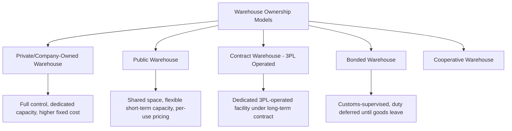
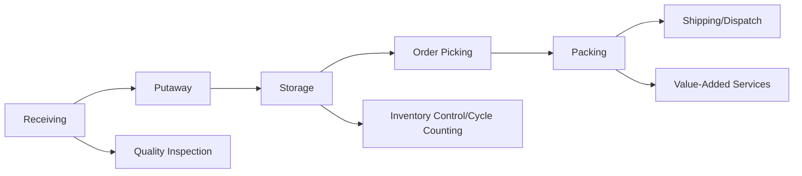

## Warehouse Types and Functions

### Definition and Role in the Supply Chain

A warehouse is a facility used for the receipt, storage, and dispatch of goods, serving as a buffer that reconciles timing and quantity mismatches between supply (production/procurement) and demand (customer orders), while in many modern operations also performing active value-added processing rather than pure static storage.

**Key Points**

- Warehousing exists primarily to manage the economic trade-off between holding inventory (cost of capital, storage, obsolescence risk) and stockout risk (lost sales, production disruption, expedited-shipping cost), rather than as an end in itself.
- Warehouse function has shifted over recent decades from primarily static long-term storage toward increasingly dynamic flow-through operations (cross-docking, rapid fulfillment), driven by inventory-carrying-cost pressure and compressed customer delivery expectations.
- The appropriate warehouse type, location, and design depends heavily on the specific supply chain role it plays (raw material staging, finished goods distribution, e-commerce fulfillment, cross-dock consolidation) rather than a single universal warehouse design.

### Classification by Ownership and Operating Model

**Key Points**

- **Private/company-owned warehouse**: owned and operated directly by the company using it, offering maximum control over operations, layout, and processes, at the cost of higher fixed capital investment and reduced flexibility to scale space up or down with demand.
- **Public warehouse**: independently owned facility offering storage space and basic handling services to multiple unrelated clients on a pay-per-use basis, providing flexibility (short-term, variable capacity) without capital investment, generally at a premium unit cost compared to owned or dedicated contract space.
- **Contract warehouse**: a 3PL-operated facility dedicated to a specific client (or small set of clients) under a longer-term contract, combining some of the flexibility of outsourcing with more dedicated capacity and process customization than a shared public warehouse.
- **Bonded warehouse**: a facility operating under customs supervision where imported goods can be stored without immediate payment of import duties and taxes, with duty becoming payable only when goods are withdrawn for domestic consumption (not if subsequently re-exported), improving importer cash flow and enabling deferred-duty inventory positioning.
- **Cooperative warehouse**: jointly owned or operated by a group of businesses (e.g., agricultural cooperatives) sharing storage infrastructure and costs, common in specific industry contexts such as agricultural commodity storage.

### Classification by Functional Role

**Key Points**

- **Raw material/production warehouse**: stores inputs feeding a manufacturing process, positioned to support production scheduling and buffer against supply variability.
- **Finished goods distribution center (DC)**: stores completed products awaiting distribution to downstream customers, retailers, or further distribution nodes — the most common warehouse type in consumer goods supply chains.
- **Cross-dock facility**: minimal-to-no storage dwell time facility where inbound freight is directly sorted and consolidated for outbound shipment (covered in depth separately under intermodal/multimodal transport).
- **E-commerce fulfillment center**: optimized for high-SKU-count, low-unit-per-order picking and packing, generally with different layout and automation priorities than a traditional pallet-in/pallet-out distribution center.
- **Micro-fulfillment center**: small-footprint, urban-proximate fulfillment node holding a curated fast-moving SKU subset for compressed delivery windows (covered separately under urban logistics).
- **Returns processing/reverse logistics center**: dedicated to receiving, inspecting, and dispositioning returned goods (covered separately under reverse logistics).
- **Cold storage/temperature-controlled warehouse**: maintains specific temperature ranges (chilled, frozen, or climate-controlled ambient) for perishable, pharmaceutical, or temperature-sensitive goods, requiring specialized refrigeration infrastructure and monitoring.

### Classification by Facility Design and Automation Level

**Key Points**

- **Conventional/manual warehouse**: reliance on manual material handling equipment (forklifts, pallet jacks) and human labor for putaway, picking, and loading — lowest capital cost, highest variable labor dependency.
- **Mechanized warehouse**: incorporates conveyor systems, powered pallet handling, and basic automation for material movement, reducing manual travel without full automation of storage/retrieval decisions.
- **Automated Storage and Retrieval System (AS/RS) warehouse**: uses computer-controlled storage/retrieval machines (cranes, shuttles) to store and retrieve palletized or unit-load goods within high-density racking, reducing floor space requirements and labor dependency at higher capital cost.
- **Goods-to-person automated warehouse**: uses robotic systems (e.g., mobile shelving-transport robots, shuttle systems) to bring inventory to stationary human pickers, rather than having pickers travel to inventory — a design pattern increasingly common in high-volume e-commerce fulfillment.
- **Fully automated/"lights-out" facility**: minimal direct human intervention in core storage/retrieval/movement functions, with automation handling most physical material flow; [Unverified] the degree to which any specific facility can be described as truly "lights-out" (versus heavily automated with residual human oversight/exception-handling roles) varies by implementation and vendor claims, so specific facility automation claims should be evaluated individually rather than assumed from marketing terminology alone.

### Core Warehouse Functions

**Key Points**

- **Receiving**: physically accepting inbound goods, verifying quantity and condition against purchase order/advance shipping notice (ASN) documentation, and initiating putaway.
- **Putaway**: moving received goods to their assigned storage location, guided by slotting logic (velocity-based, family-grouping, or random/directed putaway depending on WMS configuration).
- **Storage**: holding inventory in racking, bulk floor storage, or specialized storage systems (e.g., pallet racking, drive-in racking, cold storage chambers) until needed for an order.
- **Order picking**: retrieving specific items/quantities to fulfill customer or internal orders, using picking methodologies suited to order profile (discrete, batch, zone, cluster picking — covered in depth under e-commerce fulfillment).
- **Packing**: consolidating picked items into shipping units (cartons, pallets), including cartonization decisions and protective packaging.
- **Shipping/dispatch**: staging, loading, and manifesting outbound shipments for carrier pickup, including generation of shipping documentation and labels.
- **Inventory control**: ongoing accuracy maintenance through cycle counting, discrepancy investigation, and system reconciliation between physical and recorded inventory.
- **Value-added services (VAS)**: kitting, custom labeling, price-ticketing, light assembly, and quality inspection performed within the warehouse, increasingly common as warehouses take on functions historically performed elsewhere in the supply chain.

### Storage Systems and Layout Configurations

**Key Points**

- **Selective pallet racking**: standard racking allowing direct access to every pallet position, offering high selectivity (any SKU retrievable without moving other pallets) at the cost of lower storage density compared to denser systems.
- **Drive-in/drive-through racking**: high-density storage allowing forklifts to drive into the rack structure, sacrificing selectivity (typically last-in-first-out or first-in-first-out access patterns) for significantly higher storage density, suited to high-volume, low-SKU-variety storage.
- **Push-back and pallet flow (gravity) racking**: uses gravity or mechanical push-back mechanisms to achieve higher density than selective racking while maintaining better selectivity than drive-in systems.
- **Mezzanine and multi-level storage**: adds vertical storage/picking levels within existing facility height, common in e-commerce fulfillment centers handling high SKU counts of smaller items.
- **Bulk/floor storage**: goods stored directly on the floor without racking, typically for large-quantity, low-variety, or oversized items where racking would be inefficient.

### Facility Location and Network Design Considerations

**Key Points**

- **Centralized versus distributed network strategy**: fewer, larger central warehouses reduce inventory-holding cost through pooling (aggregated safety stock covering variable regional demand) but increase average outbound transportation distance/cost and transit time; distributed networks reverse this trade-off (covered in more depth under e-commerce fulfillment network design).
- **Proximity to transportation infrastructure**: warehouse siting near highway interchanges, rail intermodal terminals, or ports reduces inbound/outbound drayage cost and transit time, a primary site-selection factor for high-throughput distribution centers.
- **Labor market access**: availability of a suitable labor pool at the target wage rate is an increasingly significant site-selection factor, particularly for labor-intensive fulfillment operations.
- **Real estate and utility cost/availability**: land cost, taxes, and utility infrastructure (notably power capacity for automated/refrigerated facilities) affect both site feasibility and total occupancy cost.

### Technology Systems Supporting Warehouse Operations

**Key Points**

- **Warehouse Management System (WMS)**: the core software system directing and recording receiving, putaway, storage, picking, packing, and shipping activity, and maintaining real-time inventory location and quantity records.
- **Warehouse Control System (WCS)**: sits between the WMS and physical automation equipment (conveyors, sorters, AS/RS), translating WMS-level instructions into specific automation equipment commands.
- **Labor Management System (LMS)**: tracks and manages workforce productivity, task assignment, and performance standards within the warehouse.
- **Yard Management System (YMS)**: coordinates trailer/container movement and dock scheduling in the facility's yard, particularly important for high-throughput cross-dock and distribution operations.

### Key Metrics for Warehouse Performance

- **Order accuracy rate**: percentage of orders picked/shipped without error.
- **On-time shipment rate**: percentage of outbound orders dispatched within the required window.
- **Inventory accuracy**: agreement between WMS-recorded and physically counted inventory.
- **Storage utilization/cube utilization**: percentage of available storage capacity (or cubic volume) actively used.
- **Throughput**: units, orders, or pallets processed per period, a core capacity/productivity measure.
- **Cost per unit handled/stored**: fully loaded cost including labor, facility, and equipment, used for cost benchmarking and outsourcing decisions.
- **Dock-to-stock time**: elapsed time from inbound receipt to the item becoming available-to-pick inventory.

**Related Topics**

- Warehouse Management System (WMS) architecture and configuration
- E-commerce fulfillment logistics and pick-pack-ship operations
- Automated Storage and Retrieval Systems (AS/RS) and goods-to-person robotics
- Bonded warehousing, foreign-trade zones, and duty deferment programs
- Cross-dock operations and multimodal transfer facilities
- Distribution network design and centralization-versus-distribution trade-offs
- Cold chain logistics and temperature-controlled storage requirements