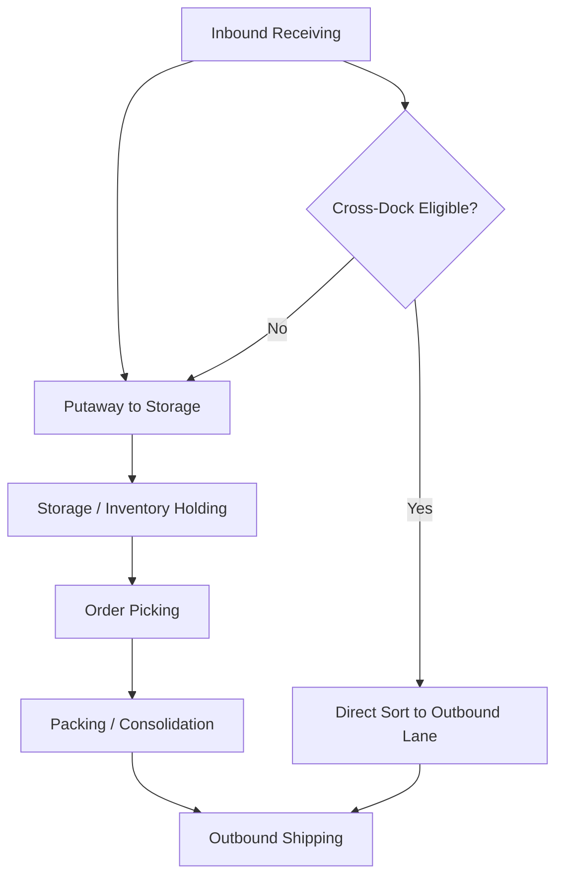
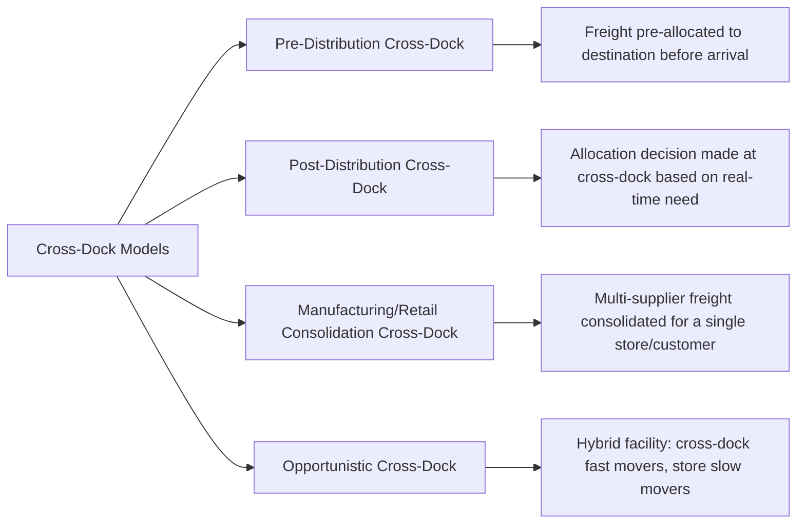

## Distribution Centers and Cross Docking

### Definition and Structural Distinction

A distribution center (DC) is a warehouse-type facility whose primary function is receiving finished goods from suppliers/manufacturing and holding and reallocating them to downstream customers, retail locations, or other distribution nodes — distinguished from a general-purpose storage warehouse by its emphasis on relatively active inventory turnover and outbound distribution rather than long-term static storage. Cross-docking is an operating method (applicable within a DC or as a dedicated facility) where inbound freight is received and immediately sorted for outbound shipment with minimal or no intermediate storage dwell time.

**Key Points**

- A traditional DC holds inventory for a period (days to months) to buffer supply/demand timing mismatches and enable order consolidation; a pure cross-dock facility holds freight for hours, with the building functioning primarily as a sortation and consolidation point rather than a storage repository.
- Many modern facilities operate as **hybrid DC/cross-dock facilities**, storing slower-moving or safety-stock inventory conventionally while flowing high-velocity SKUs through cross-dock lanes with minimal dwell — the facility is not necessarily purely one model or the other.
- The strategic driver for cross-docking is inventory-carrying-cost and cycle-time reduction: bypassing storage reduces holding cost and gets product to the next node faster, at the expense of requiring tighter inbound/outbound schedule synchronization than conventional storage-based operations demand.

### Distribution Center Core Functions and Flow

**Key Points**

- **Inbound receiving**: verification of incoming shipments against purchase orders/advance shipping notices (ASNs), quality/quantity checks, and routing decisions (storage versus direct cross-dock flow).
- **Storage and inventory holding**: retained inventory positioned to support order fulfillment against forecasted or actual downstream demand, using the storage systems and slotting approaches common to general warehousing.
- **Order picking, packing, and consolidation**: assembling outbound shipments — for DCs serving retail store networks, this frequently involves store-specific order consolidation (combining multiple SKUs into a single store-destined shipment).
- **Outbound shipping**: staging, loading, and carrier hand-off, often coordinated against tight outbound delivery windows for retail store replenishment or customer commitments.

### Distribution Center Network Roles

**Key Points**

- **Central/national distribution center**: a single (or few) large-scale facility serving an entire national market, offering inventory pooling efficiency at the cost of longer average outbound transit distance.
- **Regional distribution center (RDC)**: mid-tier facility serving a defined geographic region, replenished from a central DC or directly from suppliers, positioned to reduce outbound transit time/cost to regional stores or customers compared to a single national facility.
- **Forward distribution center**: smaller, demand-proximate facility holding fast-moving inventory to further compress delivery time within a specific sub-region — conceptually related to (and sometimes overlapping with) micro-fulfillment centers in e-commerce contexts.
- **Import distribution center**: positioned near a port or inland rail ramp to receive and process import volume, sometimes performing transload functions (covered separately under intermodal/multimodal transport) before onward distribution.

### Cross-Docking Operating Models

**Key Points**

- **Pre-distribution cross-dock**: inbound freight arrives already labeled/allocated to a specific destination (store, customer) by the supplier or upstream system, so the cross-dock facility's role is purely physical sortation to the correct outbound lane, without making an allocation decision itself.
- **Post-distribution cross-dock**: inbound freight arrives unallocated, and the allocation decision (which destination gets how much of the inbound quantity) is made at the cross-dock itself, based on real-time downstream inventory position or demand signals — operationally more complex but allows more responsive, need-based allocation than pre-distribution.
- **Retail/manufacturing consolidation cross-dock**: freight from multiple suppliers destined for the same downstream customer (e.g., a specific retail store) is consolidated into a single combined outbound shipment at the cross-dock, reducing the number of separate inbound deliveries the destination must receive.
- **Opportunistic cross-dock**: a facility that flow-throughs specific high-velocity SKUs or shipments while conventionally storing and picking the remainder of its inventory — a practical hybrid commonly seen in retail distribution networks with a mix of predictable, high-volume flow items and long-tail inventory.

### Cross-Dock Facility Design Requirements

**Key Points**

- **Elongated, narrow building footprint**: cross-dock facilities are typically designed narrower and longer (relative to floor area) than conventional storage DCs, minimizing the interior travel distance between inbound and outbound dock doors.
- **High door-to-floor-area ratio**: cross-dock facilities require a much higher density of dock doors relative to total building square footage than storage-oriented DCs, since throughput capacity is largely a function of door count and door-cycling speed rather than storage cube.
- **Door configuration layouts**: simpler "I" configurations (inbound doors on one side, outbound directly opposite) suit lower-complexity, few-lane flows; more complex "T," "H," "L," or "X" configurations support higher-complexity, many-destination sortation, at the cost of longer average interior travel distance per unit handled.
- **Minimal or no long-term storage racking**: cross-dock facilities are typically designed with staging lanes and minimal (or no) pallet racking, since the operating model does not require holding inventory for extended periods.

### Synchronization Requirements for Cross-Docking

**Key Points**

- **Inbound-outbound schedule alignment**: successful cross-docking requires tight coordination between inbound arrival timing and outbound departure schedules, since freight arriving without a matching outbound departure window within the target dwell time effectively becomes ad hoc storage, defeating the cross-dock model's purpose.
- **Advance Shipping Notice (ASN) accuracy and timeliness**: accurate, timely ASN data from suppliers is critical so the cross-dock facility can pre-plan sortation and outbound loading before physical arrival, rather than discovering shipment contents only upon receipt.
- **Carrier appointment/dock scheduling systems**: Yard Management Systems (YMS) and dock appointment scheduling are used to sequence inbound and outbound carrier arrivals to match sortation and loading capacity, minimizing both dock congestion and freight dwell time.
- **Real-time visibility and exception management**: because cross-docking has minimal buffer (unlike storage-based DCs, which can absorb some inbound delay via existing inventory), disruptions to inbound arrival timing propagate more directly to outbound schedule risk, making real-time tracking and exception alerting operationally important.

### Cost and Trade-off Comparison

| Dimension | Conventional DC (Storage-Based) | Cross-Dock Facility |
| --- | --- | --- |
| Inventory dwell time | Days to months | Hours (target) |
| Inventory carrying cost | Higher (holds safety stock) | Lower (minimal held inventory) |
| Facility design | Storage-optimized (racking, cube utilization) | Flow-optimized (door density, narrow footprint) |
| Schedule sensitivity | Lower (inventory buffers against timing variance) | Higher (requires tight inbound/outbound synchronization) |
| Suited to | Variable demand, long-tail SKUs, safety stock requirements | Predictable, high-velocity flow, retail replenishment consolidation |
| Risk of disruption propagation | Lower (buffer absorbs delay) | Higher (delay directly threatens outbound schedule) |

$$C_{crossdock} = C_{handling} + C_{sort} + C_{schedule\ risk}\qquad C_{DC} = C_{handling} + C_{storage} + C_{inventory\ carrying}$$

Cross-docking is generally favored when $C_{storage} + C_{inventory\ carrying}$ (avoided) exceeds the incremental $C_{schedule\ risk}$ and coordination cost cross-docking introduces — which tends to hold for high-velocity, predictable-demand SKUs and disfavor low-velocity, high-demand-variability SKUs. [Inference] The precise SKU-level threshold at which cross-docking becomes favorable over conventional storage-based DC flow depends on specific demand variability, supplier reliability, and facility cost structure, and is generally determined through lane/SKU-specific analysis rather than a universal rule.

### Technology Systems Supporting DC and Cross-Dock Operations

**Key Points**

- **Warehouse Management System (WMS) cross-dock module**: manages inbound-to-outbound task assignment without generating a storage put-away instruction, using flow/wave logic tied to outbound trailer load plans and departure schedules.
- **Yard Management System (YMS)**: coordinates trailer/container spotting at dock doors, particularly critical in cross-dock operations where door-cycling speed directly determines throughput capacity.
- **Transportation Management System (TMS) integration**: coordination between inbound carrier ASN data and outbound load planning, especially important for cross-dock facilities where inbound timing directly drives outbound scheduling decisions.
- **Automated sortation and conveyor systems**: used in high-volume cross-dock and DC operations to accelerate physical sortation beyond manual forklift/pallet-jack movement rates.

### Key Metrics for DC and Cross-Dock Performance

- **Dwell time**: average time freight spends at the facility — the primary differentiator metric between DC and cross-dock operating models, and a core cross-dock efficiency measure.
- **Dock-to-dock cycle time**: elapsed time from inbound check-in to outbound departure.
- **Door utilization rate**: percentage of available dock door capacity actively used across the operating period, a key cross-dock throughput/capacity metric.
- **On-time outbound departure rate**: whether cross-dock sortation and loading keep pace with scheduled outbound departures.
- **Inventory turnover** (DC-specific): rate at which held inventory cycles through the facility, reflecting the storage-based operation's inventory efficiency.
- **Order/case fill rate**: percentage of downstream demand met without stockout, relevant to conventional DC storage operations balancing service level against inventory investment.
- **Cost per unit handled**: fully loaded handling cost, useful for comparing cross-dock versus conventional storage-based flow economics for a given SKU/lane.

**Related Topics**

- Warehouse types and functions (broader storage/facility taxonomy)
- Transload and cross-dock operations in multimodal transport chains
- Warehouse Management System (WMS) configuration and wave planning
- Yard Management Systems and dock appointment scheduling
- Retail replenishment and store-consolidation logistics
- E-commerce fulfillment network design and micro-fulfillment centers
- Inventory carrying cost and safety stock optimization