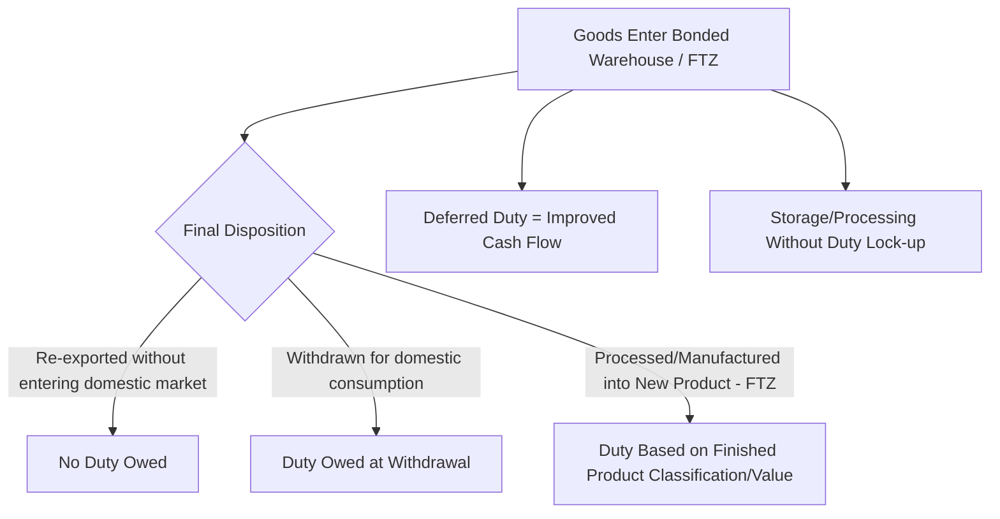

## Free Trade Zones and Bonded Warehouses

### Definitions and Conceptual Distinction

A **bonded warehouse** is a facility, licensed and supervised by a national customs authority, in which imported goods can be stored, and in some regimes processed, without immediate payment of import duties and taxes, with duty becoming payable only if and when the goods are withdrawn for domestic consumption. A **Free Trade Zone (FTZ)** — also called a free zone, foreign-trade zone, or special economic zone depending on jurisdiction — is a broader, typically larger and geographically defined area treated as outside the customs territory for tariff purposes, generally permitting a wider range of activities (storage, manufacturing, assembly, re-export) than a bonded warehouse alone.

**Key Points**

- Both mechanisms share the same core economic logic: **deferring or eliminating duty liability** on goods that have not yet entered the domestic market for consumption, improving importer cash flow and enabling flexible re-export without ever triggering duty payment.
- Bonded warehouses are generally narrower in scope (primarily storage, with limited permitted handling/processing) and more common as a single-facility designation; FTZs are generally broader in scope (frequently permitting manufacturing, assembly, and value-added processing) and often span larger designated geographic areas, sometimes encompassing multiple facilities or an entire industrial park.
- [Unverified] The precise legal distinction, permitted activities, and terminology used for these mechanisms vary considerably by country — the same underlying concept may be called a "foreign-trade zone," "free zone," "bonded zone," or "special economic zone" with materially different permitted-activity scopes, so current terminology and rules should be verified against the specific country's customs/trade authority.

### Core Economic Rationale

**Key Points**

- **Duty deferral**: duty payment is postponed from the moment of import to the moment of domestic withdrawal, meaning capital is not tied up in duty payments on inventory that may sit in storage for an extended period before sale or re-export.
- **Duty avoidance on re-export**: if goods stored in a bonded warehouse or FTZ are subsequently re-exported (never entering the domestic market), duty is generally never owed at all, which is particularly valuable for businesses using the facility as a regional distribution hub serving multiple destination markets.
- **Inverted tariff/duty optimization in FTZ manufacturing**: when an FTZ permits manufacturing/assembly, and the finished product's applicable duty rate is lower than the sum of its imported component duty rates (an "inverted tariff" situation), a manufacturer can import components duty-free into the FTZ, assemble the finished product, and pay duty only on the finished product's (lower) rate when it enters the domestic market — a specific, jurisdiction-dependent optimization opportunity.

### Bonded Warehouse Types and Permitted Activities

**Key Points**

- **Public bonded warehouse**: available for use by multiple unrelated importers, generally offering storage services on a fee basis without requiring the user to hold their own customs bond.
- **Private bonded warehouse**: operated by (or exclusively for) a single company, typically used by importers with sufficiently large or specialized storage needs to justify dedicated bonded facility operation.
- **Permitted activities**: typically limited to storage, and in many regimes some limited handling such as repacking, sorting, labeling, or sampling; more extensive manufacturing or substantial transformation is commonly restricted or prohibited in a standard bonded warehouse (as distinct from an FTZ, which often permits broader processing).
- **Bonded warehouse categories by cargo type**: [Unverified] Many customs regimes further sub-classify bonded warehouses by specific cargo type or activity (e.g., specific categories for general merchandise, duty-free retail stores, distillation/manufacturing bonded facilities), with materially different rules per category — current sub-classification schemes should be verified against the specific national customs regime referenced.

### Free Trade Zone Characteristics and Permitted Activities

**Key Points**

- **Broader geographic scope**: FTZs frequently encompass larger designated areas — sometimes an entire industrial park, port area, or airport zone — rather than a single licensed building.
- **Manufacturing and value-added processing**: a defining feature distinguishing many FTZs from bonded warehouses is the explicit permission for substantial manufacturing, assembly, and value-added transformation activity within the zone under duty-deferred/duty-free status.
- **Employment and investment incentives**: many FTZ programs are established partly as economic development tools, often bundling customs duty benefits with other incentives (tax holidays, streamlined permitting, infrastructure investment) to attract manufacturing investment and employment to a specific region.
- **Domestic market entry mechanics**: when finished goods produced or processed within an FTZ are sold into the domestic market, duty is generally assessed based on the applicable classification and value rules at that point of entry — the specific valuation and classification methodology (e.g., whether based on the finished product or the originally imported components) is a jurisdiction-specific and program-specific determination.

### Comparison Table

| Characteristic | Bonded Warehouse | Free Trade Zone |
| --- | --- | --- |
| Typical scope | Single licensed facility | Larger designated area, sometimes multi-facility |
| Primary permitted activity | Storage, limited handling | Storage, manufacturing, assembly, substantial processing |
| Common use case | Duty-deferred storage, distribution hub | Manufacturing for export or duty-optimized domestic entry |
| Licensing complexity | Generally facility-specific license | Often zone-wide designation plus tenant-level authorization |
| Typical program intent | Trade facilitation, cash-flow improvement | Trade facilitation plus economic development/investment incentive |

### Operational Requirements and Customs Supervision

**Key Points**

- **Licensing and bonding**: operators of bonded warehouses and FTZ facilities typically require specific customs authorization, often including a financial bond or guarantee to cover potential duty liability on goods within the facility.
- **Inventory control and record-keeping**: customs authorities generally require detailed, auditable inventory records tracking goods from entry into the bonded/zone status through to final disposition (domestic withdrawal, re-export, or destruction), since the duty-deferred status depends on demonstrable control over goods movement.
- **Physical security and access control**: bonded facilities and FTZs are typically subject to specific physical security requirements (fencing, surveillance, restricted access) reflecting their customs-supervised status.
- **Periodic customs audits/inspections**: operators are commonly subject to periodic or unannounced customs authority inspection to verify compliance with inventory control and permitted-activity requirements.

### Use Cases and Strategic Applications

**Key Points**

- **Regional distribution hub**: companies use bonded warehouses/FTZs as a duty-deferred staging point for goods destined for multiple downstream markets, paying duty only on the portion ultimately entering the specific domestic market where the facility is located, while goods re-exported elsewhere never incur that duty.
- **Manufacturing for export**: FTZ manufacturing operations importing components duty-free, assembling finished goods, and exporting the finished product without ever incurring the importing country's duty on either the components or (since it's exported, not domestically consumed) the finished product.
- **Inverted tariff optimization**: manufacturers with component duty rates higher than finished-product duty rates using FTZ assembly to pay only the lower finished-product rate on units entering the domestic market.
- **Long-dwell inventory positioning**: businesses with goods that may sit in inventory for extended periods before sale (e.g., due to demand uncertainty or seasonal patterns) using bonded storage to avoid tying up capital in duty payment until the goods are actually sold domestically.
- **Value-added processing before duty assessment**: performing labeling, kitting, quality inspection, or light assembly within a bonded/FTZ facility before goods are classified and dutied upon domestic entry, in some cases affecting the applicable classification or value basis (a jurisdiction- and program-specific effect that requires case-by-case verification). [Inference] The degree to which specific processing activities affect duty classification/value outcomes is technical and program-specific, so this should be assessed with customs compliance expertise for any actual transaction rather than assumed generically.

### Example Illustration

**Example**

A company imports electronic components from multiple countries into an FTZ, where the components are assembled into a finished consumer electronics product. If the finished product's applicable duty rate is lower than the weighted-average duty rate that would have applied to the individual imported components under standard entry, the company benefits from an inverted-tariff structure: duty is calculated based on the finished product's classification and value only when units are withdrawn for the domestic market, while any units subsequently exported to other countries incur no duty in the FTZ's home jurisdiction at all. [Inference] The actual duty-rate differential and resulting savings in any such scenario depend entirely on the specific product classifications and current tariff schedules involved, and would need to be calculated against current, product-specific tariff data rather than assumed from this illustrative pattern.

### Compliance Risk Considerations

**Key Points**

- **Loss of bonded/zone status**: failure to maintain adequate inventory control, security, or record-keeping can result in suspension or revocation of bonded warehouse or FTZ operator authorization, with potentially significant financial consequences given the duty liability that would then apply.
- **Improper withdrawal without duty payment**: goods removed from bonded/zone status into the domestic market without proper duty declaration and payment constitute a customs compliance violation subject to penalty, distinct from ordinary import duty underpayment given the enhanced supervision status of these facilities.
- **Country/program-specific eligibility restrictions**: [Unverified] many programs restrict which types of goods, activities, or company categories may use bonded warehouse or FTZ status (e.g., restrictions on certain sensitive or import-quota-controlled goods), and current eligibility criteria should be confirmed against the specific program's rules before relying on this status for a given product category.

### Key Metrics and Considerations for Program Evaluation

- **Duty deferral cash-flow benefit**: quantified as the time-value-of-money benefit of deferring duty payment from import to withdrawal date, relative to standard immediate-duty-payment import.
- **Re-export percentage**: proportion of goods moving through the facility that are ultimately re-exported (never incurring domestic duty) versus withdrawn domestically, a key driver of the facility's overall value proposition.
- **Compliance audit outcomes**: frequency and severity of findings from customs authority inspections, reflecting operational control quality.
- **Inverted tariff savings realized** (where applicable): actual duty savings achieved through FTZ manufacturing relative to standard-entry duty liability on the same components.

**Related Topics**

- Customs broker roles in bonded warehouse and FTZ compliance
- Harmonized System tariff classification and inverted tariff analysis
- Duty drawback programs as a related but distinct duty-recovery mechanism
- Warehouse types and functions (broader facility taxonomy)
- Transload and cross-dock operations in import distribution
- Trade compliance and customs valuation methodology
- Special economic zones and manufacturing investment incentive programs