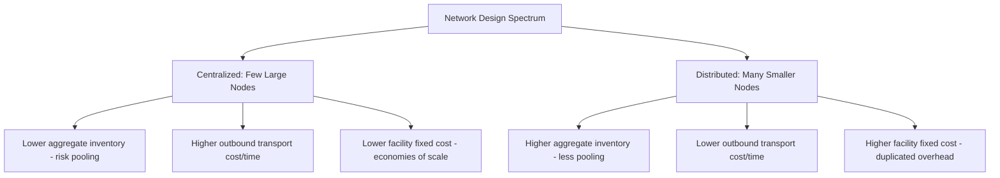

## Inventory Positioning and Network Design

### Definition and Strategic Framework

Inventory positioning and network design is the discipline of determining how many facilities to operate, where to locate them, and how much and what type of inventory to hold at each node, in order to balance the fundamental supply chain trade-off between service level (availability, speed to customer) and total cost (inventory carrying cost, facility fixed cost, and transportation cost). It sits at the intersection of facility location decisions and inventory management policy, since the two are structurally interdependent — the number and location of nodes directly determines the aggregate inventory required to achieve a given service level.

**Key Points**

- Network design and inventory policy cannot be optimized independently: adding more stocking locations generally improves proximity to demand (better service, lower outbound transport cost) but increases aggregate safety stock requirements due to reduced risk-pooling — this coupling is the central analytical challenge of the discipline.
- The overarching objective is typically to minimize total supply chain cost (inventory carrying cost + facility fixed cost + inbound/outbound transportation cost) subject to a target service level constraint, rather than minimizing any single cost component in isolation.
- Network design decisions are generally infrequent, high-capital-commitment decisions (facility investment, long-term leases) compared to inventory policy parameters (safety stock levels, reorder points), which can be adjusted more dynamically — this asymmetry means network design should be based on longer-term demand and strategy forecasts rather than short-term fluctuations.

### The Centralization-Distribution Trade-off

**Key Points**

- **Risk pooling principle**: consolidating inventory for multiple demand points into a single stocking location reduces the aggregate safety stock needed to achieve a given service level, because uncorrelated (or imperfectly correlated) demand variability across the pooled locations partially cancels out — the statistical basis for the general preference toward centralization when transportation cost/time is not a binding constraint.
- **Square-root law of inventory**: a commonly cited approximation stating that aggregate safety stock required scales roughly with the square root of the number of stocking locations (holding total demand and service level constant), meaning consolidating from $n$ locations to a single location can reduce aggregate safety stock by a factor approaching $\sqrt{n}$ under idealized independence assumptions. [Inference] This relationship is a widely used planning heuristic rather than a precise prediction for any specific network, since it assumes independent and identically distributed demand across locations — actual demand correlation structures, lead time differences, and non-normal demand distributions can cause real-world results to deviate from the idealized square-root relationship.
- **Transportation cost and service-time counter-pressure**: centralization's inventory-reduction benefit is countered by increased average distance (and therefore cost and transit time) to serve distant demand points, which is why the optimal network configuration is generally a specific, calculated point along the spectrum rather than an extreme (fully centralized or fully distributed).

### Quantitative Network Design Framework

$$TC_{network} = \sum_{i=1}^{n} \left( C_{facility,i} + C_{inventory,i} \right) + \sum_{i,j} C_{transport,ij} \times D_{ij}$$

Where $n$ is the number of stocking locations, $C_{facility,i}$ and $C_{inventory,i}$ are the fixed and inventory-carrying costs at node $i$, and $C_{transport,ij} \times D_{ij}$ represents outbound transportation cost as a function of distance/lane between node $i$ and demand point $j$. Network design optimization seeks the value of $n$ (and the specific locations) that minimizes $TC_{network}$ subject to service-level constraints — commonly solved using center-of-gravity heuristics, mixed-integer optimization models, or specialized supply-chain network design software for real-world problems with many candidate locations and demand points.

**Example**

A retailer currently operating a single national distribution center is evaluating whether to add two regional DCs. The square-root law suggests that splitting inventory across three locations (from one) would require aggregate safety stock roughly $\sqrt{3} \approx 1.73$ times the single-location baseline, all else equal — an increase in inventory carrying cost. Whether this trade-off is favorable depends on whether the resulting reduction in outbound transportation cost and transit time (from shorter average shipping distances) exceeds the incremental inventory carrying cost and the new facilities' fixed costs. [Inference] The specific breakeven point is highly sensitive to the retailer's actual demand variability, product value (which drives inventory carrying cost per unit), and prevailing freight rates, and would require a lane- and SKU-specific quantitative model rather than the square-root heuristic alone to make an actual investment decision.

### Inventory Positioning Strategies Within a Network

**Key Points**

- **Push-based positioning (forecast-driven)**: inventory is produced/procured and positioned at stocking locations based on demand forecasts before actual customer orders arrive, favored for products with predictable, stable demand where forecast accuracy is reasonably high.
- **Pull-based positioning (order-driven)**: inventory movement/replenishment is triggered by actual downstream demand signals (e.g., point-of-sale data, order receipt) rather than forecast alone, reducing the risk of forecast-driven overstock but generally requiring shorter, more responsive replenishment lead times to maintain service levels.
- **Postponement (delayed differentiation)**: holding inventory in a generic, undifferentiated form as far downstream in the network as feasible, with final product configuration/customization (labeling, packaging, light assembly) delayed until closer to the point of actual demand realization — allowing risk pooling benefits on the generic component while still enabling product variety at the customer-facing stage.
- **Strategic/decoupling inventory**: inventory deliberately held at points where supply chain lead time exceeds acceptable customer lead time, acting as a buffer decoupling upstream (longer-lead-time) processes from downstream (shorter-lead-time) customer expectations.

### Safety Stock and Service Level Interaction

**Key Points**

- **Service level definition**: commonly expressed as either a **cycle service level** (probability of not stocking out during a replenishment cycle) or a **fill rate** (percentage of demand met directly from available stock), which are related but distinct metrics requiring different safety stock calculation approaches.
- **Safety stock as a function of demand and lead time variability**: safety stock requirements generally increase with both demand variability and replenishment lead time variability (and their interaction), meaning network nodes with longer or less-reliable inbound replenishment lead times require proportionally more safety stock to achieve the same service level as nodes with shorter, more reliable lead times.
- **Demand correlation across nodes**: the risk-pooling benefit of centralization is strongest when demand across the pooled locations is weakly or negatively correlated; if demand across locations is highly positively correlated (e.g., driven by a common regional or seasonal factor), the pooling benefit is correspondingly smaller, since aggregate demand variability is not meaningfully reduced by combining highly correlated streams.

### Network Design Methodologies

**Key Points**

- **Center-of-gravity analysis**: a simplified location-optimization heuristic that calculates a weighted geographic center based on demand volume and location of served points, providing a starting reference point for candidate facility locations, though it does not account for actual road/transport network constraints or fixed facility costs directly.
- **Mixed-integer optimization models**: more rigorous mathematical programming approaches that simultaneously determine the number, location, and capacity of facilities, and the assignment of demand points to facilities, minimizing total network cost subject to capacity and service constraints — the standard approach for large-scale, real-world network design studies.
- **Scenario and sensitivity analysis**: given the long-term, high-capital-commitment nature of network design decisions, most rigorous studies test multiple demand growth, cost, and service-level scenarios rather than optimizing against a single point forecast, to assess network design robustness under uncertainty.
- **Simulation modeling**: discrete-event or Monte Carlo simulation used to validate optimization-model outputs against more realistic, stochastic demand and lead-time variability than deterministic optimization models typically capture directly.

### Illustrative Trade-off Diagram (svg_diagram)

<svg xmlns="http://www.w3.org/2000/svg" viewBox="0 0 700 340" font-family="Arial, sans-serif">
<text x="350" y="25" text-anchor="middle" font-size="16" font-weight="bold">Total Network Cost vs. Number of Facilities (svg_diagram)</text>
<line x1="80" y1="290" x2="650" y2="290" stroke="#333" stroke-width="1.5" />
<line x1="80" y1="290" x2="80" y2="50" stroke="#333" stroke-width="1.5" />
<text x="365" y="320" text-anchor="middle" font-size="12">Number of Distribution Facilities</text>
<text x="30" y="170" text-anchor="middle" font-size="12" transform="rotate(-90 30 170)">Total Cost</text>
<path d="M100,270 Q250,235 400,175 T620,90" fill="none" stroke="#c92a2a" stroke-width="2" />
<text x="590" y="80" font-size="11" fill="#c92a2a">Inventory Carrying Cost</text>
<path d="M100,90 Q250,145 400,215 T620,270" fill="none" stroke="#1971c2" stroke-width="2" />
<text x="440" y="235" font-size="11" fill="#1971c2">Transportation Cost</text>
<path d="M100,120 Q200,105 300,110 T500,140 T620,190" fill="none" stroke="#e8590c" stroke-width="2" />
<text x="480" y="130" font-size="11" fill="#e8590c">Facility Fixed Cost</text>
<path d="M100,170 Q220,155 320,150 T480,175 T620,225" fill="none" stroke="#2b8a3e" stroke-width="3" stroke-dasharray="4,2" />
<text x="300" y="130" font-size="11" fill="#2b8a3e">Total Network Cost</text>
<circle cx="330" cy="150" r="5" fill="#2b8a3e" />
<text x="340" y="140" font-size="10">Optimal facility count (illustrative)</text>
</svg>

### Practical Constraints Beyond Pure Cost Optimization

**Key Points**

- **Service-time commitments**: minimum acceptable delivery-time commitments to customers (e.g., same-day, next-day) can impose hard geographic proximity constraints on network design that override pure cost-minimization outcomes, effectively requiring a minimum number of distributed nodes regardless of the resulting inventory cost increase.
- **Regulatory and tax considerations**: facility location decisions can be influenced by tax incentive programs, free trade zone/bonded warehouse availability, and regulatory requirements specific to certain product categories (e.g., pharmaceutical distribution licensing requirements varying by jurisdiction).
- **Labor market and real estate availability**: practical site-selection constraints (labor pool depth, real estate cost/availability, utility infrastructure) can eliminate otherwise cost-optimal theoretical locations identified by network optimization models.
- **Supply chain resilience considerations**: post-disruption planning increasingly incorporates resilience objectives (avoiding excessive geographic concentration, maintaining redundant sourcing/stocking options) that can favor a more distributed network configuration than pure cost optimization alone would suggest — representing a deliberate trade-off of some cost efficiency for reduced disruption risk.

### Key Metrics for Network Design and Inventory Positioning Evaluation

- **Total landed cost per unit**: fully loaded cost including facility, inventory carrying, and transportation cost components, used to compare network configuration alternatives.
- **Inventory turnover and days of supply**: reflecting the efficiency of inventory deployment across the network.
- **Fill rate / service level achieved**: measured against target, both network-wide and by individual node.
- **Average order-to-delivery distance/time**: a proxy for network proximity effectiveness relative to demand geography.
- **Facility utilization rate**: capacity utilization at each node, used to identify over- or under-provisioned locations within the network.
- **Network cost sensitivity to demand growth scenarios**: robustness measure assessing how total network cost and service level respond to demand assumptions deviating from the base-case forecast.

**Related Topics**

- Warehouse types and functions (facility-level design considerations)
- E-commerce fulfillment network design and micro-fulfillment centers
- Safety stock calculation methods and service-level optimization
- Postponement and delayed-differentiation manufacturing strategies
- Distribution centers and cross-docking operational integration
- Supply chain resilience and disruption risk management
- Free trade zones and bonded warehouses as network node options