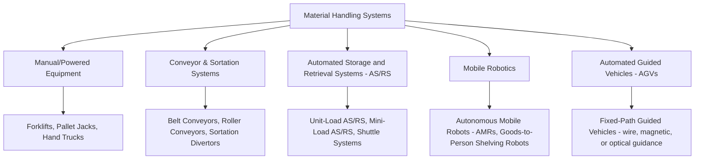
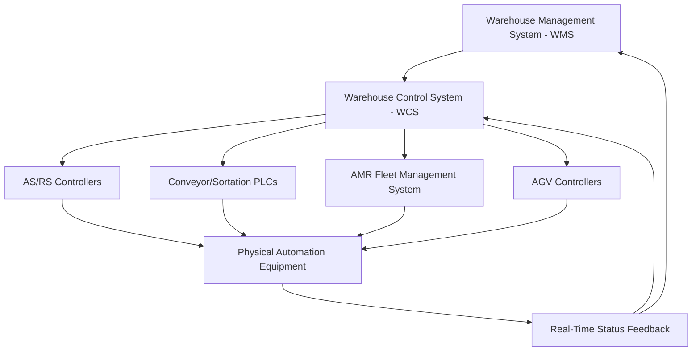

## Warehouse Automation and Material Handling Systems

### Definition and Strategic Drivers

Warehouse automation and material handling systems encompass the mechanical, robotic, and software-controlled equipment used to move, store, retrieve, sort, and process goods within a warehouse or distribution facility, ranging from simple conveyor systems to fully integrated robotic storage and retrieval systems. Adoption is driven primarily by labor cost and availability pressure, throughput and accuracy requirements that manual operations struggle to meet at scale, and the space-efficiency gains achievable through high-density automated storage.

**Key Points**

- Automation investment decisions generally weigh capital expenditure and integration complexity against labor cost savings, throughput/accuracy improvement, and space utilization gains — the appropriate automation level differs substantially by facility type, order profile, and SKU characteristics rather than following a single universal "more automation is better" rule.
- The automation spectrum runs from purely manual material handling (forklifts, pallet jacks, hand-carts) through mechanized assistance (conveyors, powered equipment) to goods-to-person robotics and fully automated storage/retrieval systems, with most real-world facilities operating a blend rather than a single pure automation level.
- [Inference] The optimal automation level for a given facility depends on order profile (unit-level e-commerce picking versus pallet-level distribution), SKU velocity distribution, labor market conditions, and capital availability, so general automation recommendations should be treated as illustrative patterns rather than prescriptive for any specific facility without a facility-specific analysis.

### Material Handling Equipment Taxonomy

### Manual and Powered Material Handling Equipment

**Key Points**

- **Forklifts**: the foundational material handling tool in most conventional warehouses, used for pallet movement, putaway, and retrieval in racking systems; variants include counterbalance forklifts, reach trucks (for narrow-aisle high-bay racking), and order pickers (for person-to-pallet picking at height).
- **Pallet jacks**: manual or powered equipment for short-distance pallet movement at floor level, generally lower cost and lower capability than forklifts, suited to lighter-duty or lower-throughput operations.
- **Narrow-aisle and very-narrow-aisle (VNA) equipment**: specialized forklift/reach-truck variants enabling higher storage density by operating in aisles too narrow for conventional forklifts, trading some maneuverability/speed for space efficiency.

### Conveyor and Sortation Systems

**Key Points**

- **Belt and roller conveyors**: continuous or powered-roller systems moving cartons, totes, or products between fixed points in a facility, reducing manual carrying/travel and enabling continuous flow between process stages (receiving to sortation, packing to shipping).
- **Sortation systems**: automated diverting mechanisms (e.g., tilt-tray sorters, cross-belt sorters, sliding-shoe sorters, pop-up wheel diverters) that route individual items or cartons to the correct destination chute/lane based on barcode or RFID scan data, essential for high-volume parcel and e-commerce operations needing to sort large item volumes to many outbound destinations at speed.
- **Throughput characteristics**: sortation system capacity is typically measured in items or cartons processed per hour, with high-end systems in large-scale parcel/e-commerce hubs commonly cited in the range of several thousand to tens of thousands of units per hour depending on system type and configuration; [Unverified] specific throughput figures are vendor- and configuration-dependent and should be verified against current vendor specifications rather than treated as a fixed industry-wide benchmark.

### Automated Storage and Retrieval Systems (AS/RS)

**Key Points**

- **Unit-load AS/RS**: computer-controlled stacker cranes operating in high-bay racking to store and retrieve full pallets or large unit loads, offering high storage density (tall, narrow-aisle racking inaccessible to conventional forklifts) and reduced labor dependency for pallet-level handling.
- **Mini-load AS/RS**: similar automated crane/shuttle technology scaled for smaller unit loads (totes, cartons, individual cases) rather than full pallets, commonly used to support piece-picking operations by delivering totes to a picking station rather than requiring a person to travel to storage locations.
- **Shuttle-based systems**: automated shuttles operating within racking levels (sometimes combined with elevators/lifts for vertical movement) to retrieve and deliver totes or cartons, offering an alternative architecture to crane-based AS/RS with different throughput and flexibility trade-offs depending on system design.
- **Vertical lift modules (VLMs) and carousels**: compact automated storage systems using vertical space efficiently within a small footprint, delivering stored items to an operator at a fixed access point — commonly used for smaller parts, high-value items, or SKUs requiring high storage density in constrained floor space.

### Mobile Robotics and Goods-to-Person Systems

**Key Points**

- **Autonomous Mobile Robots (AMRs)**: self-navigating robots that transport bins, totes, or shelving units within a facility, using onboard sensors and mapping (rather than fixed physical guides) to navigate dynamically around obstacles and other traffic — offering greater deployment flexibility than fixed-path Automated Guided Vehicles (AGVs) since they do not require dedicated infrastructure like embedded wires or magnetic tape.
- **Goods-to-person (G2P) shelving robots**: a specific AMR application pattern where robots lift and transport entire mobile shelving/rack units to stationary human pickers, eliminating picker travel time within the facility — a design pattern that has become widely associated with modern high-throughput e-commerce fulfillment center automation.
- **Automated Guided Vehicles (AGVs)**: automated material transport vehicles following fixed or semi-fixed paths (historically guided by embedded wires, magnetic tape, or optical markers, though modern systems increasingly use more flexible guidance methods), generally used for repetitive, high-volume point-to-point movement tasks such as pallet transport between fixed zones.
- **Robotic picking arms**: robotic manipulators capable of picking individual items from bins or totes, an area of ongoing technology development where capability varies significantly by item characteristics (uniform, rigid items are generally easier to automate than irregular, deformable, or highly varied items); [Unverified] the current state of robotic piece-picking capability across varied SKU types is an actively evolving area, and specific vendor claims about item-handling versatility should be evaluated against the specific SKU mix in question rather than assumed universally applicable.

### Warehouse Control System (WCS) and Software Architecture

**Key Points**

- **WMS-WCS-equipment hierarchy**: the WMS makes high-level inventory and order-fulfillment decisions (what to pick, where inventory is located); the WCS translates those decisions into specific commands for physical automation equipment and manages real-time equipment coordination and traffic management; the equipment itself executes physical movement and reports status back up the stack.
- **Fleet management software for robotics**: AMR and AGV deployments require dedicated fleet management software to coordinate multiple robots' paths, avoid collisions/congestion, and optimize task assignment across the robot fleet — a distinct software layer from traditional conveyor/sortation PLC (programmable logic controller) control.
- **Integration complexity**: multi-vendor automation environments (combining AS/RS, AMRs, conveyors, and sortation from different suppliers) generally require middleware or integration layers to achieve coordinated operation, a significant practical implementation consideration in large automated facility projects.

### Automation Selection Framework by Order/Facility Profile

**Key Points**

- **Pallet-level distribution (low SKU count, high volume per SKU)**: favors unit-load AS/RS and conventional forklift/racking systems, since storage density and pallet-handling throughput are the primary drivers rather than piece-level picking speed.
- **Piece-level e-commerce fulfillment (high SKU count, low units per order)**: favors goods-to-person robotics, mini-load AS/RS, and automated sortation, since minimizing picker travel time per unit and handling high SKU variety are the dominant operational challenges.
- **Cross-dock/flow-through operations**: favor conveyor and sortation systems over storage-oriented automation (AS/RS), since the operational goal is rapid inbound-to-outbound flow rather than storage density.
- **Cold storage/temperature-controlled facilities**: automation (particularly AS/RS and robotics) is often more strongly favored in cold environments given the additional cost and difficulty of sustained manual labor in extreme temperature conditions, though the automation equipment itself requires cold-rated components adding to capital cost.

### Economic Justification Framework

$$ROI_{automation} = \frac{C_{labor\ savings} + C_{throughput\ gain} + C_{accuracy\ improvement} + C_{space\ savings} - C_{maintenance/operating}}{C_{capital\ investment}}$$

**Example**

A facility evaluating a mini-load AS/RS investment for piece-picking operations estimates annual labor savings from reduced picker travel time, combined with an accuracy improvement reducing costly mis-pick error/return handling, against the AS/RS system's capital cost, installation, and ongoing maintenance. [Inference] Typical payback periods for warehouse automation investments are commonly cited in industry discussion as ranging from several years depending on labor cost, throughput volume, and facility operating hours, but exact payback timelines are highly specific to the facility's actual labor rates, volume, and equipment cost, so any generalized payback-period figure should not be relied upon for an actual investment decision without a facility-specific financial model.

### Implementation and Integration Considerations

**Key Points**

- **Phased implementation versus greenfield automation**: retrofitting automation into an existing operating facility generally requires more careful phased implementation planning (to avoid disrupting ongoing operations) compared to designing automation into a new "greenfield" facility from the outset.
- **Scalability and flexibility**: automation systems with high fixed infrastructure requirements (e.g., fixed-path AGVs, large-scale AS/RS) generally offer less flexibility to accommodate future changes in SKU profile or order volume than more flexible systems (e.g., AMRs, which can be redeployed without new fixed infrastructure).
- **Workforce transition planning**: automation deployment typically requires workforce retraining and role transition planning (e.g., shifting labor from physical picking/travel tasks to equipment oversight, exception handling, and maintenance roles) rather than simple headcount elimination in many real-world deployments, though the degree of net labor reduction varies by implementation.
- **Downtime and redundancy planning**: because automated systems can create single points of failure affecting large portions of facility throughput, resilience planning (backup manual processes, equipment redundancy) is an important practical consideration distinct from the automation system's steady-state performance specifications.

### Key Metrics for Warehouse Automation Performance

- **Throughput (units/orders/pallets per hour)**: core capacity metric used to compare automated system performance against manual baseline and vendor specifications.
- **Pick accuracy rate**: percentage of picks completed without error, often a key automation justification metric given automation's typical accuracy advantage over manual picking at scale.
- **System uptime/availability**: percentage of scheduled operating time the automation system is functioning without unplanned downtime.
- **Space/cube utilization**: storage density achieved relative to available facility footprint, a primary AS/RS and high-density storage justification metric.
- **Cost per unit handled**: fully loaded automated-system cost (capital amortization, maintenance, reduced labor) compared against manual-operation baseline cost per unit.
- **Return on investment (ROI) / payback period**: financial justification metric combining labor savings, throughput gains, and accuracy improvements against capital investment.

**Related Topics**

- Warehouse Management System (WMS) and Warehouse Control System (WCS) architecture
- E-commerce fulfillment logistics and pick-pack-ship operations
- Micro-fulfillment centers and compact automated storage design
- Distribution centers and cross-docking facility design requirements
- Labor management systems and workforce productivity tracking
- Robotics fleet management and multi-vendor automation integration
- Total cost of ownership analysis for capital equipment investment