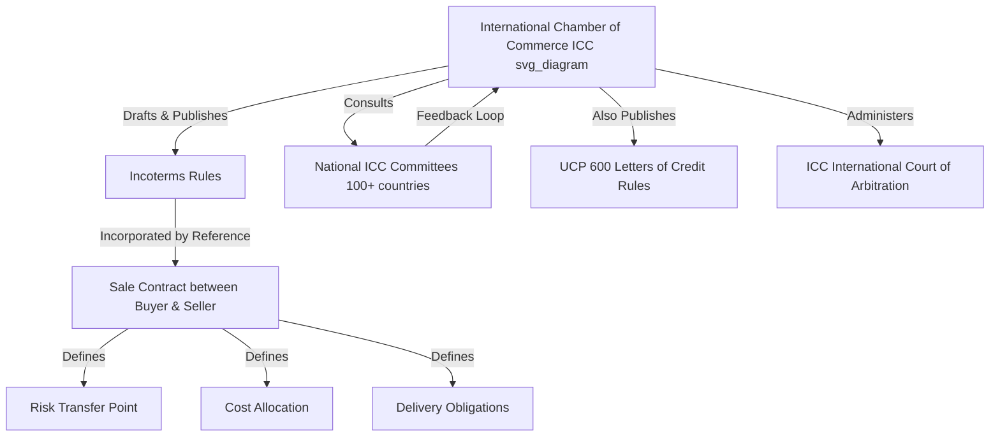

## Role of the International Chamber of Commerce

### Overview

The International Chamber of Commerce (ICC) is the organization responsible for authoring, publishing, revising, and maintaining Incoterms® rules — the globally recognized standard for interpreting trade terms used in international and domestic sale contracts. The ICC does not enforce Incoterms as law; rather, it produces a private set of standardized trade definitions that parties voluntarily incorporate into their contracts by explicit reference.

### Founding and Institutional Background

- The ICC was founded in 1919, in the aftermath of World War I, by a group of businessmen and economists seeking to promote trade, investment, and open markets across borders.
- Headquartered in Paris, France, the ICC operates as a non-governmental, non-profit international organization representing businesses across virtually every sector and region.
- The ICC holds a unique status: it is one of the few business organizations granted "observer status" at the United Nations, allowing it to advocate on behalf of global business interests in intergovernmental discussions.
- The ICC's broader mandate extends beyond Incoterms and includes: promoting international trade and investment, setting voluntary rules and standards for cross-border commerce, providing dispute resolution services, and combating trade barriers and protectionism.

### Core Functions Related to Incoterms

**Rule-Setting Authority**

- The ICC has exclusive authority to publish Incoterms rules. "Incoterms" is a registered trademark of the ICC, meaning no other body can issue rules under this name.
- The ICC assembles a drafting group composed of trade law experts, logistics professionals, insurers, bankers, and representatives from national ICC committees worldwide to draft and revise each edition.

**Periodic Revision Cycle**

- Incoterms rules are revised roughly every 10 years to reflect changes in transport technology, trade practices, security requirements, and electronic documentation standards.
- Key editions issued by the ICC: 1936 (first edition), 1953, 1967, 1976, 1980, 1990, 2000, 2010, and 2020 (current edition as of this writing).
- Each revision is developed through consultation with ICC National Committees (over 100 countries), reflecting real-world feedback from traders, freight forwarders, customs brokers, and legal practitioners.

**Standardization of Trade Terminology**

- Before Incoterms existed, trade terms like "FOB" or "CIF" were interpreted differently depending on jurisdiction, causing disputes over who bore risk, cost, and responsibility for goods in transit.
- The ICC's role is to eliminate this ambiguity by providing a single, internationally recognized definition for each trade term, covering:
  - Point at which risk transfers from seller to buyer
  - Allocation of costs (freight, insurance, customs, loading/unloading)
  - Documentation and delivery obligations

### Relationship to Legal Enforceability

- [Inference] Incoterms rules themselves are not automatically binding law in most jurisdictions; they gain legal effect only when explicitly incorporated into a contract of sale (e.g., "CIF Shanghai Incoterms® 2020").
- The ICC explicitly states that Incoterms rules govern only the relationship between buyer and seller regarding delivery of goods — they do not address transfer of ownership/title, price payment terms, or governing law, which must be specified separately in the contract.
- Because Incoterms are contractual rather than statutory, courts and arbitral tribunals generally uphold them based on the parties' agreement, not because the ICC has government-backed regulatory authority.

### Other ICC Activities Supporting Global Trade

- **ICC International Court of Arbitration**: administers dispute resolution for international commercial disputes, often invoked when Incoterms-related contract disputes arise.
- **Uniform Customs and Practice for Documentary Credits (UCP 600)**: the ICC also publishes UCP 600, the standard rules governing letters of credit, which frequently interact with Incoterms in trade finance transactions.
- **ICC Model Contracts**: standardized contract templates (e.g., ICC Model International Sale Contract) that reference Incoterms rules directly.
- **Trade facilitation advocacy**: the ICC lobbies international bodies (WTO, UN, G20) on behalf of global business to reduce trade barriers and harmonize customs procedures.

### Why the ICC's Role Matters in Practice

**Example**

A seller in Germany and a buyer in Brazil negotiate a contract for machinery parts. Instead of drafting custom clauses to define exactly when risk transfers and who pays for freight, insurance, and customs, both parties simply agree to the term "FCA Hamburg Incoterms® 2020." Because both parties recognize the ICC as the authoritative source, this single reference resolves what would otherwise require pages of negotiated legal language, and both parties' banks, freight forwarders, and customs agents interpret the term identically.

### Diagram: ICC's Position in the Incoterms Ecosystem (svg_diagram)

### Common Misconceptions

- **Misconception**: Incoterms are international law.

  **Clarification**: They are private contractual rules; enforceability depends on the parties' explicit incorporation into the contract and the governing law chosen.
- **Misconception**: The ICC regulates shipping companies or customs authorities.

  **Clarification**: The ICC has no regulatory or enforcement power over carriers, ports, or customs agencies; it only standardizes the interpretation of trade terms between contracting parties.
- **Misconception**: Older Incoterms editions (e.g., 2010) become automatically invalid when a new edition is published.

  **Clarification**: [Inference] Parties may continue using an older edition if explicitly referenced in the contract (e.g., "Incoterms® 2010"), since the ICC does not retroactively void prior editions.

### Key Points

- The ICC is the sole publisher and trademark holder of Incoterms rules.
- Founded in 1919, headquartered in Paris, with UN observer status.
- Revises Incoterms approximately every decade via global consultation with National Committees.
- Incoterms gain legal force only through explicit contractual incorporation, not automatic statutory application.
- The ICC's broader portfolio includes arbitration services (ICC Court of Arbitration) and trade finance rules (UCP 600), both of which intersect with Incoterms in practice.

**Related Topics**

- Structure and Evolution of Incoterms Editions (1936–2020)
- Difference Between Incoterms 2010 and Incoterms 2020
- The Four Categories of Incoterms Rules (E, F, C, D Groups)
- Role of National ICC Committees in Rule Revision
- Incoterms vs. UCC (Uniform Commercial Code) in U.S. Domestic Trade
- ICC International Court of Arbitration: Function and Process
- UCP 600 and Its Interaction with Incoterms in Trade Finance