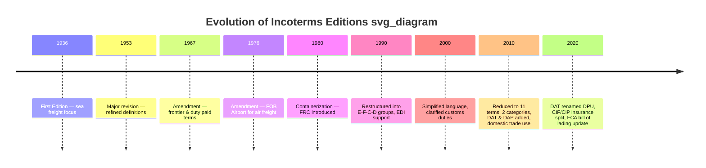

## Evolution of Incoterms Editions from 1936 to 2020

### Overview

Incoterms rules have evolved through nine editions since their inception, each revision responding to changes in transport technology, containerization, electronic documentation, insurance practices, and security requirements. The trajectory reflects a shift from a small set of sea-freight-oriented terms toward a comprehensive, mode-agnostic framework addressing modern multimodal and containerized trade.

### 1936: First Edition

- Published to address the inconsistent interpretation of trade terms across jurisdictions, particularly regarding when risk and cost transferred from seller to buyer.
- Introduced a limited set of foundational terms, primarily oriented toward maritime shipping since sea freight dominated international trade at the time.
- Established the core concept that would persist through all future editions: standardized allocation of cost, risk, and delivery obligations between buyer and seller.

### 1953: First Major Revision

- Refined definitions of the original terms to reduce ambiguity that had emerged from real-world application.
- Continued the sea/waterway focus, as intermodal and air transport were not yet significant factors in global trade.
- Laid groundwork for periodic amendments as trade practices evolved (minor amendments followed in 1967 and 1976, expanding coverage incrementally rather than constituting full new editions).

### 1967 and 1976: Incremental Amendments

- **1967**: Added terms addressing delivery at the frontier and delivery duty paid, reflecting growth in overland and cross-border trade within regions like Europe.
- **1976**: Introduced a term specifically for air transport (FOB Airport), acknowledging air freight's growing role in international trade of higher-value, time-sensitive goods.

### 1980: Introduction of Containerization Adaptations

- Addressed the rise of container shipping and combined transport (multimodal transport combining sea, rail, road, and air).
- Introduced FRC (Free Carrier), a precursor to the modern FCA term, to accommodate situations where goods were handed to a carrier at an inland container yard rather than loaded directly onto a ship at the ship's rail.
- Reflected the industry's shift away from break-bulk cargo (loaded piece by piece) toward containerized cargo.

### 1990: Restructuring and Electronic Data Interchange (EDI)

- Comprehensively restructured the rules into four categories based on the first letter of each term, reflecting the mode of delivery and point of risk transfer:
  - **Group E** (Departure): EXW
  - **Group F** (Main Carriage Unpaid): FCA, FAS, FOB
  - **Group C** (Main Carriage Paid): CFR, CIF, CPT, CIP
  - **Group D** (Arrival): DAF, DES, DEQ, DDU, DDP
- This E-F-C-D grouping structure became the organizing framework carried forward into subsequent editions.
- Explicitly accommodated Electronic Data Interchange (EDI), allowing parties to use electronic messages in place of paper documents where agreed, reflecting early digitization of trade documentation.

### 2000: Simplification and Customs Clarification

- Focused on simplifying and clarifying language rather than structural overhaul.
- Refined customs clearance obligations, particularly around loading and unloading responsibilities under FCA, and clarified obligations related to export/import clearance under terms like DEQ.
- Continued the four-category (E/F/C/D) structure introduced in 1990.

### 2010: Major Restructuring — 11 Terms, Two Categories

- Reduced the term count and reorganized the classification system into two functional categories rather than four:
  - **Rules for Any Mode or Modes of Transport**: EXW, FCA, CPT, CIP, DAT, DAP, DDP
  - **Rules for Sea and Inland Waterway Transport**: FAS, FOB, CFR, CIF
- Eliminated four terms from the 2000 edition (DAF, DES, DEQ, DDU) and introduced two new terms:
  - **DAT** (Delivered at Terminal): delivery when goods are unloaded at a named terminal.
  - **DAP** (Delivered at Place): delivery when goods are ready for unloading at a named destination.
- Extended applicability to domestic trade for the first time, acknowledging usage within customs unions (e.g., the EU) where cross-border formalities were minimal or absent.
- Addressed security-related clearances in response to post-9/11 global supply chain security requirements (e.g., obligations to provide security-related information for customs).
- Explicitly recognized electronic communication as equivalent to paper documentation where the parties agree or custom permits.

### 2020: Current Edition — Refinement and Practical Clarity

- Renamed **DAT** to **DPU** (Delivered at Place Unloaded) and repositioned it after DAP in the rule sequence, clarifying that "place" can be any location, not strictly a "terminal," while retaining the requirement that goods be unloaded.
- Split insurance coverage requirements between **CIF** and **CIP**:
  - CIF retains the historical minimum insurance coverage level (Institute Cargo Clauses C).
  - CIP now requires a higher minimum coverage level (Institute Cargo Clauses A), reflecting CIP's more common use in manufactured goods trade where higher-value cargo warrants broader protection.
- Revised **FCA** to allow for an on-board bill of lading to be issued to the seller before loading is complete, addressing a practical gap where sellers using FCA needed proof of shipment for letter-of-credit purposes.
- Reordered presentation of each rule's provisions (moved delivery and risk transfer to positions A2/B2, ahead of transport arrangements, to emphasize practical relevance for users).
- Incorporated explicit guidance distinguishing Incoterms rules' scope from matters they do not cover (e.g., transfer of title, contract breach remedies, and price), reinforcing that Incoterms govern only delivery, risk, and cost allocation.
- Added allowance for arranging transport using the seller's or buyer's own means (not just third-party carriers), reflecting the practice of some large companies using owned fleets.

### Diagram: Timeline of Incoterms Evolution (svg_diagram)

### Comparative Table: Term Count and Structure by Key Editions

| Edition | Term Count | Classification Structure | Notable Additions/Changes |
| --- | --- | --- | --- |
| 1936 | Limited set | None (sea-freight focus) | Baseline standardization |
| 1980 | Expanded | None formal | FRC (containerization) |
| 1990 | 13 | 4 groups (E/F/C/D) | EDI accommodation |
| 2000 | 13 | 4 groups (E/F/C/D) | Simplified language |
| 2010 | 11 | 2 categories (Any Mode / Sea-Waterway) | DAT, DAP added; DAF, DES, DEQ, DDU removed |
| 2020 | 11 | 2 categories (Any Mode / Sea-Waterway) | DAT→DPU; CIF/CIP insurance split; FCA bill of lading |

### Key Drivers Behind Revisions

- **Transport technology shifts**: containerization (1980), multimodal logistics (1990, 2010).
- **Documentation modernization**: EDI recognition (1990), electronic equivalence (2010, 2020).
- **Security regulation**: post-9/11 customs security data requirements (2010).
- **Insurance market practice**: differentiated coverage standards for bulk commodities (CIF) versus manufactured goods (CIP) in 2020.
- **User feedback and practical gaps**: FCA bill-of-lading solution (2020) addressed a widely reported friction point in letter-of-credit transactions.

### Common Misconceptions

- **Misconception**: Incoterms 2020 completely replaced all older editions.

  **Clarification**: Older editions remain usable if explicitly cited in a contract (e.g., "FOB Incoterms® 2010"); the ICC does not retroactively invalidate prior versions.
- **Misconception**: DAT and DPU are different rules.

  **Clarification**: DPU is simply the renamed and clarified version of DAT from the 2010 edition; the underlying delivery concept (goods unloaded at named place) is continuous.

**Key Points**

- Nine editions/amendments span 1936–2020, moving from sea-freight-only terms to a comprehensive multimodal framework.
- 1990 introduced the enduring E/F/C/D categorization; 2010 restructured this into two functional categories based on transport mode applicability.
- 2020's most substantive changes were the DAT→DPU rename, the CIF/CIP insurance coverage split, and the FCA bill-of-lading accommodation.
- Each revision responds to concrete industry developments: containerization, EDI, security regulation, and insurance market practice.

**Related Topics**

- Detailed Comparison: Incoterms 2010 vs. Incoterms 2020
- The Four Categories of Incoterms Rules (E, F, C, D Groups) Explained
- Incoterms Rules for Sea/Waterway Transport vs. Any Mode of Transport
- CIF vs. CIP: Insurance Coverage Requirements Explained
- FCA and the On-Board Bill of Lading Solution
- Role of the International Chamber of Commerce in Rule Publication
- Practical Guidance for Selecting the Correct Incoterm by Transport Mode