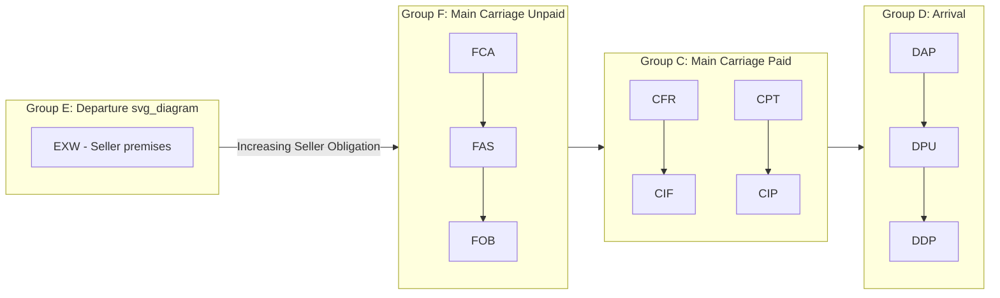

## The Four Incoterms Groups: E, F, C, and D

### Overview

The E/F/C/D grouping was introduced in the 1990 Incoterms edition to organize trade terms by the point at which the seller's delivery obligation is fulfilled and the general cost/risk allocation pattern. Although Incoterms 2010 and 2020 reorganized the *presentation* of rules into two categories (Any Mode of Transport vs. Sea/Waterway Transport), the E/F/C/D letter groupings remain widely used as a conceptual teaching framework because they map directly onto the four fundamental delivery philosophies underlying every rule.

### Group E: Departure

**Key Points**

- Represents the minimum obligation for the seller.
- The seller makes goods available at their own premises (factory, warehouse, or other named place); the buyer bears all subsequent costs and risks from that point forward, including loading, export clearance, and main carriage.
- Only one term belongs to this group: **EXW (Ex Works)**.

**Example**

A furniture manufacturer in Vietnam sells under "EXW Ho Chi Minh City Incoterms® 2020." The buyer's freight forwarder must arrange pickup at the factory, handle export customs clearance in Vietnam, and organize the entire onward journey. The seller's only obligation is to make the goods available and notify the buyer.

- [Inference] EXW is often impractical in strict application because sellers, being local, are typically better positioned to handle export clearance; many contracts modify EXW terms to have the seller assist with loading and export documentation despite the rule's literal minimum obligations.

### Group F: Main Carriage Unpaid

**Key Points**

- The seller delivers goods to a carrier nominated by the buyer, but the seller does not pay for or arrange the main international carriage.
- Risk transfers to the buyer once goods are handed to the carrier (or placed alongside/on board, depending on the specific term).
- The seller is generally responsible for export clearance under all three F-terms.
- Three terms belong to this group:
  - **FCA (Free Carrier)**: seller delivers goods to a carrier named by the buyer at a specified location; usable for any transport mode.
  - **FAS (Free Alongside Ship)**: seller delivers goods alongside the vessel at the named port of shipment; sea/waterway transport only.
  - **FOB (Free On Board)**: seller delivers goods on board the vessel nominated by the buyer; sea/waterway transport only.

**Example**

A chemical exporter in India sells under "FOB Mumbai Incoterms® 2020." The seller handles export clearance and loading onto the vessel nominated by the buyer's shipping line. Once goods pass the ship's rail (in practice, once safely on board), risk transfers to the buyer, who arranges and pays for ocean freight and insurance.

### Group C: Main Carriage Paid

**Key Points**

- The seller arranges and pays for main carriage to the named destination, but risk transfers to the buyer earlier — typically once goods are handed to the first carrier — creating a documented split between where cost and risk transfer occur.
- [Inference] This risk/cost split is one of the most frequently misunderstood aspects of Incoterms among new practitioners, since sellers paying for freight does not mean sellers bear risk for the entire journey.
- The seller handles export clearance; the buyer handles import clearance.
- Four terms belong to this group:
  - **CFR (Cost and Freight)**: seller pays freight to named port of destination; risk transfers once goods are on board; sea/waterway only.
  - **CIF (Cost, Insurance, and Freight)**: same as CFR, plus seller must procure minimum insurance coverage (Institute Cargo Clauses C) for the buyer's benefit; sea/waterway only.
  - **CPT (Carriage Paid To)**: seller pays carriage to named destination; risk transfers once goods are handed to the first carrier; any transport mode.
  - **CIP (Carriage and Insurance Paid To)**: same as CPT, plus seller must procure higher minimum insurance coverage (Institute Cargo Clauses A) as of the 2020 edition; any transport mode.

**Example**

A machinery seller in Germany sells under "CIP Chicago Incoterms® 2020." The seller pays for carriage all the way to Chicago and must purchase broad-coverage insurance (Institute Cargo Clauses A) naming the buyer as beneficiary. However, risk of loss or damage transfers to the buyer as soon as goods are handed to the first carrier in Germany — meaning if goods are damaged mid-transit, the buyer (not the seller) files the insurance claim, even though the seller paid for the policy.

### Group D: Arrival

**Key Points**

- Represents the maximum obligation for the seller among the standard groups.
- The seller bears both cost and risk all the way to the named destination; delivery (and risk transfer) occurs at destination, not at origin.
- This is the only group where cost and risk transfer at the same point (destination), eliminating the cost/risk split seen in Group C.
- Three terms belong to this group under the current (2020) framework:
  - **DAP (Delivered at Place)**: seller delivers when goods are ready for unloading at the named destination; buyer handles unloading and import clearance.
  - **DPU (Delivered at Place Unloaded)**: seller delivers when goods are unloaded at the named destination; the only rule requiring the seller to unload goods.
  - **DDP (Delivered Duty Paid)**: seller delivers goods ready for unloading, having cleared them for import and paid all duties/taxes; represents the maximum seller obligation of any Incoterm.

**Example**

An electronics distributor in China sells under "DDP Los Angeles Incoterms® 2020." The seller arranges and pays for the entire journey, clears goods through U.S. customs, pays import duties, and delivers to the buyer's warehouse ready for unloading. The buyer's only responsibility is unloading the goods.

- [Inference] DDP places significant regulatory and tax-compliance burden on the seller, who must be familiar with the buyer's country's import procedures; sellers unfamiliar with local customs regimes in the destination country often avoid DDP or partner with a local customs broker.

### Diagram: Four Groups — Risk and Cost Transfer Points (svg_diagram)

### Group-Level Comparison Table

| Group | Delivery Point | Risk Transfer | Cost Responsibility | Export Clearance | Import Clearance |
| --- | --- | --- | --- | --- | --- |
| E | Seller's premises | At seller's premises | Buyer pays all | Buyer | Buyer |
| F | Named place/port of origin | At handover to carrier | Seller to handover point; buyer thereafter | Seller | Buyer |
| C | Named place/port of origin | At handover to first carrier | Seller pays main carriage to destination | Seller | Buyer |
| D | Named place of destination | At destination | Seller pays to destination | Seller | Seller (except DAP/DPU) |

### Applicability by Transport Mode

- **Any Mode of Transport** (includes all Group E and D terms, plus FCA, CPT, CIP): EXW, FCA, CPT, CIP, DAP, DPU, DDP.
- **Sea and Inland Waterway Transport Only**: FAS, FOB, CFR, CIF.
- [Inference] Using a sea/waterway-only term (e.g., FOB) for containerized cargo delivered to a carrier's inland facility rather than loaded directly onto a vessel is a common practical error, since risk transfer becomes ambiguous when goods sit in a container yard rather than passing the ship's rail; FCA is the generally recommended alternative for containerized sea freight.

### Common Misconceptions

- **Misconception**: Group C terms mean the seller bears risk until the paid-for destination.

  **Clarification**: Group C terms only obligate the seller to pay for carriage to destination; risk transfers much earlier, at the point of handover to the first carrier.
- **Misconception**: All Group D terms include the seller paying import duties.

  **Clarification**: Only DDP requires the seller to clear goods for import and pay duties; DAP and DPU leave import clearance and duty payment to the buyer.
- **Misconception**: FOB and FCA are interchangeable for container shipments.

  **Clarification**: FOB is legally sea/waterway-only and risk transfers on board the vessel; FCA is mode-neutral and transfers risk upon handover to the carrier, making it more appropriate for containerized cargo.

**Next Steps**

- Detailed breakdown of each individual Incoterm (EXW, FCA, FAS, FOB, CFR, CIF, CPT, CIP, DAP, DPU, DDP)
- Risk Transfer Points: A Term-by-Term Comparison
- Choosing the Correct Incoterm Group by Cargo Type and Transport Mode
- CIF vs. CIP: Insurance Coverage Requirements Explained
- Export and Import Clearance Responsibilities Across the Four Groups
- Common Contract Drafting Errors When Selecting Incoterms Groups