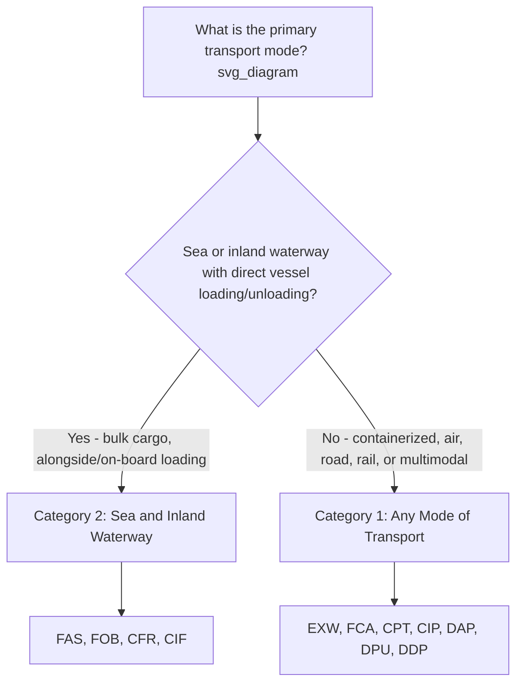

## Classification by Mode of Transport

### Overview

Since the 2010 edition, Incoterms rules are organized into two functional categories based on transport mode applicability rather than the older four-letter (E/F/C/D) grouping. This classification determines which rules are legally and practically appropriate given the physical means by which goods move from seller to buyer — a critical distinction because using a mode-inappropriate term can create ambiguity around the precise moment of risk transfer.

### Category 1: Rules for Any Mode or Modes of Transport

**Key Points**

- Designed to accommodate any transport method, including road, rail, air, sea, inland waterway, or multimodal combinations (e.g., a shipment moving by truck, then rail, then sea, then truck again).
- Risk transfers upon handover of goods to the first carrier (or at another defined point), rather than being tied to loading onto a vessel — making these terms suitable for containerized cargo delivered to inland terminals, container freight stations, or carrier facilities before reaching a port.
- Seven terms fall under this category:
  - **EXW (Ex Works)**
  - **FCA (Free Carrier)**
  - **CPT (Carriage Paid To)**
  - **CIP (Carriage and Insurance Paid To)**
  - **DAP (Delivered at Place)**
  - **DPU (Delivered at Place Unloaded)**
  - **DDP (Delivered Duty Paid)**

**Example**

A furniture manufacturer in Poland ships goods to a buyer in Kazakhstan using a combination of truck and rail. Because the shipment does not move by sea, the parties agree to "CPT Almaty Incoterms® 2020." The seller pays for carriage across the entire multimodal journey, while risk transfers to the buyer once goods are handed to the first carrier (the trucking company) in Poland.

### Category 2: Rules for Sea and Inland Waterway Transport

**Key Points**

- Reserved specifically for shipments where goods are transported by sea or inland waterway, and where the point of delivery, loading, or discharge is tied directly to a vessel.
- Risk transfer is anchored to a vessel-specific event (goods placed alongside the ship, or loaded on board), which only makes practical and legal sense when the cargo is loaded/discharged directly at a ship's side or deck — typically applicable to bulk commodities (grain, oil, ore) rather than containerized general cargo.
- Four terms fall under this category:
  - **FAS (Free Alongside Ship)**
  - **FOB (Free On Board)**
  - **CFR (Cost and Freight)**
  - **CIF (Cost, Insurance, and Freight)**

**Example**

A grain exporter in Argentina sells bulk soybeans under "FOB Rosario Incoterms® 2020." The cargo is loaded directly onto the buyer's chartered vessel at the port. Risk transfers to the buyer the moment the soybeans are loaded on board — a clean, unambiguous point because the cargo moves straight from dock to ship without intermediate container handling.

### Why the Distinction Matters: Containerization Risk

- [Inference] The most consequential practical issue in mode classification is the mismatch between sea/waterway-only terms (FOB, FCA's sea-only predecessors like FOB) and modern containerized shipping practice, where goods are typically delivered to a container yard or container freight station days before actual vessel loading.
- If a seller uses **FOB** for containerized cargo, risk technically does not transfer until the container is loaded onto the vessel — but the seller has already lost physical control of the goods once they are handed over at the container yard. This creates a gap period where the seller bears risk for goods they no longer control.
- **FCA** is the recommended alternative for containerized cargo moving by sea, because risk transfers upon handover to the carrier at the container yard or named place, aligning legal risk transfer with the point of practical control.

### Diagram: Mode Classification Decision Path (svg_diagram)

### Comparative Table: Mode Classification Summary

| Category | Terms | Risk Transfer Point | Typical Cargo Type | Transport Modes |
| --- | --- | --- | --- | --- |
| Any Mode | EXW, FCA, CPT, CIP, DAP, DPU, DDP | Handover to carrier / named place / destination | Containerized general cargo, mixed multimodal shipments | Road, rail, air, sea, multimodal |
| Sea/Waterway Only | FAS, FOB, CFR, CIF | Alongside vessel / on board vessel | Bulk commodities (grain, oil, coal, ore) | Sea, inland waterway |

### Selecting the Correct Category in Practice

- **Step 1**: Identify whether the cargo is containerized or bulk/break-bulk.
- **Step 2**: If containerized (even if moving partly by sea), default to Category 1 terms (typically FCA, CPT, or CIP) to avoid the risk-transfer gap associated with FOB/CFR/CIF.
- **Step 3**: If bulk cargo loaded directly onto/alongside a vessel with no intermediate carrier handover, Category 2 terms (FOB, CIF, etc.) remain appropriate and are standard in commodity trading.
- **Step 4**: For any multimodal shipment involving road, rail, or air at any stage, Category 1 terms must be used, since Category 2 terms are legally undefined for non-vessel-based delivery points.

### Common Misconceptions

- **Misconception**: FOB and CIF can be used for any ocean shipment, including containers.

  **Clarification**: While commonly (and often incorrectly) used this way in practice, the ICC and most trade law practitioners recommend FCA, CPT, or CIP for containerized ocean freight due to the risk-transfer ambiguity created when goods are delivered to a container terminal before vessel loading.
- **Misconception**: "Sea and Inland Waterway" terms cannot be used if any portion of the journey involves trucking to the port.

  **Clarification**: Trucking to the port of origin is normal and expected; the classification concerns the *international carriage leg and risk-transfer point*, not domestic pre-carriage to the port.
- **Misconception**: Any Mode terms are only for air or road shipments.

  **Clarification**: Any Mode terms (e.g., FCA, CIP) are fully valid and commonly used for ocean freight as well, particularly containerized cargo — "any mode" means the rule's definition does not depend on vessel-specific events, not that it excludes sea transport.

**Key Points**

- Incoterms 2010/2020 classify rules into two categories: Any Mode of Transport (7 terms) and Sea/Inland Waterway Transport (4 terms).
- Category 2 terms depend on vessel-specific risk transfer events (alongside ship, on board), making them best suited to bulk cargo with direct vessel loading.
- Category 1 terms transfer risk upon carrier handover, making them appropriate for containerized cargo and multimodal shipments regardless of whether sea transport is involved.
- Misapplying FOB/CIF to containerized shipments is a widely cited practical drafting error; FCA/CPT/CIP are the recommended substitutes.

**Related Topics**

- FCA vs. FOB: Why FCA Is Recommended for Container Shipments
- Risk Transfer Points: A Term-by-Term Comparison Across All 11 Incoterms
- Multimodal Transport and Incoterms Selection
- The Four Incoterms Groups: E, F, C, and D
- Bulk Commodity Trading and the Role of FOB/CIF
- Common Contract Drafting Errors When Selecting Incoterms