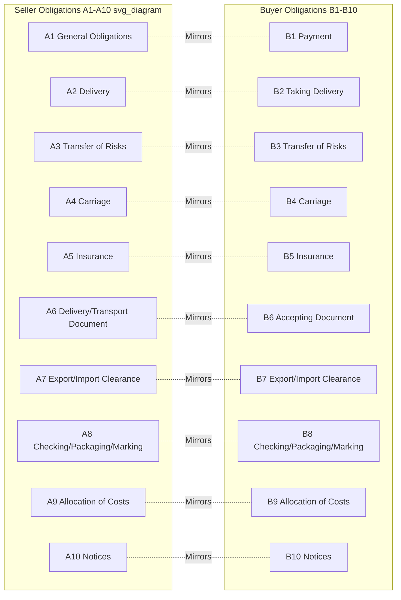

## The Ten Articles of Obligation Framework

### Overview

Every Incoterms rule defines the respective obligations of seller and buyer using a standardized, parallel structure. Since the 2010 edition, this structure was reorganized into ten numbered articles, each split into an "A" side (seller obligations) and a corresponding "B" side (buyer obligations). This parallel A/B numbering allows any two Incoterms to be compared article-by-article, since Article A3 of one rule addresses the same subject matter as Article A3 of any other rule.

### Purpose of the Standardized Structure

- [Inference] Prior to the 1990s restructuring, obligations were described in less consistent prose format, making it harder to compare terms directly; the numbered article framework was developed to let users cross-reference identical obligation categories across all 11 rules without re-reading full narrative text each time.
- The parallel structure means a practitioner familiar with the ten articles for one term (e.g., FOB) can navigate any other term's rule text with the same mental map, since Article 4 always covers delivery, Article 5 always covers risk transfer, and so on.
- The 2020 edition made one structural change: it reordered delivery (A2/B2) and risk (A3/B3) to appear earlier in the sequence, ahead of transport and insurance arrangements, reflecting ICC feedback that these are the provisions users consult most frequently.

### The Ten Articles (2020 Edition Numbering)

**Article 1: General Obligations**

- **Seller (A1)**: Provide goods and commercial invoice in conformity with the contract of sale; provide any other conformity evidence required by the contract.
- **Buyer (B1)**: Pay the price as provided in the contract of sale.

**Article 2: Delivery**

- **Seller (A2)**: Deliver goods by placing them at the buyer's disposal, or handing them to a carrier, at the point and time specified by the applicable rule.
- **Buyer (B2)**: Take delivery of goods once delivered under A2.

**Article 3: Transfer of Risks**

- **Seller (A3)**: Bears risk of loss or damage to goods until delivery occurs per A2.
- **Buyer (B3)**: Bears risk of loss or damage from the point of delivery onward, including risk of premature or late delivery caused by buyer's own failure to nominate a carrier or destination where required.

**Article 4: Carriage**

- **Seller (A4)**: Contract for or arrange carriage as required by the specific rule (varies significantly — EXW requires none; DDP requires full carriage to destination).
- **Buyer (B4)**: Contract for or arrange carriage as required by the specific rule (inverse of seller's obligation under the same rule).

**Article 5: Insurance**

- **Seller (A5)**: Obtain insurance coverage only where required (CIF and CIP mandate this; other terms leave it optional or unaddressed for the seller).
- **Buyer (B5)**: Obtain insurance coverage for any risk not covered by the seller's obligation, or for the full shipment where the seller has no insurance obligation.

**Article 6: Delivery/Transport Document**

- **Seller (A6)**: Provide the buyer with the document(s) evidencing delivery (e.g., bill of lading, waybill, or transport document appropriate to the term and mode).
- **Buyer (B6)**: Accept the delivery/transport document provided it conforms to the contract.

**Article 7: Export/Import Clearance**

- **Seller (A7)**: Handle export clearance formalities, including licenses, security clearances, and pre-shipment inspection where applicable (obligations shift for DDP, which also includes import clearance).
- **Buyer (B7)**: Handle import clearance formalities (except under DDP, where the seller assumes this).

**Article 8: Checking/Packaging/Marking**

- **Seller (A8)**: Pay for checking operations (quality checking, measuring, weighing, counting) necessary to deliver conforming goods; package and mark goods appropriately for transport.
- **Buyer (B8)**: No standard obligation under this article beyond accepting properly packaged goods, though buyer may specify particular packaging requirements in the contract.

**Article 9: Allocation of Costs**

- **Seller (A9)**: Bear all costs until the point of delivery, plus specific costs assigned by the rule (e.g., freight under C-terms, duties under DDP).
- **Buyer (B9)**: Bear all costs from the point of delivery onward, plus specific costs assigned by the rule (e.g., unloading under DAP, import duties except under DDP).

**Article 10: Notices**

- **Seller (A10)**: Provide buyer with sufficient notice to allow buyer to take measures necessary to receive goods (e.g., notice of dispatch, estimated arrival).
- **Buyer (B10)**: Provide seller with sufficient notice regarding matters within buyer's control (e.g., nominating a carrier, specifying a delivery point, or specifying a shipment time window where the rule allows buyer discretion).

### Diagram: Ten Articles — Seller/Buyer Parallel Structure (svg_diagram)

### Example: Applying the Framework to Compare Two Terms

**Example**

Comparing **FCA** and **DDP** using Article 7 (Export/Import Clearance):

- Under **FCA**, A7 requires the seller to handle only export clearance; B7 places import clearance on the buyer.
- Under **DDP**, A7 requires the seller to handle *both* export and import clearance, including payment of import duties; B7 for the buyer is essentially limited to cooperating with clearance formalities, not performing them.

This article-by-article comparison method lets practitioners immediately isolate exactly which obligations shift between any two rules, without needing to reread each term's full narrative description.

### Why the Framework Matters in Contract Drafting

- [Inference] Legal and logistics practitioners often use the ten-article framework as a checklist when drafting or reviewing sale contracts, verifying that no obligation (e.g., insurance under Article 5, or notice requirements under Article 10) has been overlooked or left ambiguous.
- Because Articles 4 and 5 (Carriage and Insurance) vary the most dramatically between terms, these are frequently the source of contract disputes when parties misunderstand which term they selected.
- Article 9 (Allocation of Costs) is often cited as the most commercially significant article, since it directly determines the landed cost calculation for both parties.

### Common Misconceptions

- **Misconception**: All ten articles apply identically regardless of the Incoterm selected.

  **Clarification**: The article *categories* are identical across all rules, but the specific obligations within each article vary substantially — Article 4 (Carriage) under EXW requires no seller action, while under DDP it requires the seller to arrange the entire journey.
- **Misconception**: Article 5 (Insurance) requires all sellers to provide insurance.

  **Clarification**: Only CIF and CIP explicitly require the seller to procure insurance; under all other terms, insurance is either the buyer's responsibility or unaddressed by the rule (left to the contract or the party bearing risk at that stage).
- **Misconception**: The 2020 edition renumbered the articles entirely from 2010.

  **Clarification**: The article categories (1–10) remained substantively the same; the 2020 revision reordered the *sequence* (moving delivery and risk earlier) rather than renumbering or removing categories.

**Key Points**

- Ten standardized articles (A1–A10 for sellers, B1–B10 for buyers) structure every Incoterms rule identically, enabling direct cross-term comparison.
- Key articles: Delivery (A2/B2), Transfer of Risk (A3/B3), Carriage (A4/B4), Insurance (A5/B5), Export/Import Clearance (A7/B7), and Allocation of Costs (A9/B9).
- The 2020 edition reordered delivery and risk to appear earlier, reflecting their practical importance to users.
- Article 9 (Costs) and Article 5 (Insurance) are commonly cited as the most commercially consequential and most frequently disputed articles.

**Related Topics**

- Risk Transfer Points: A Term-by-Term Comparison Across All 11 Incoterms
- Cost Allocation Under Incoterms: Article 9 Deep Dive
- Insurance Requirements Under CIF vs. CIP (Article 5 Comparison)
- Export and Import Clearance Responsibilities by Term (Article 7 Deep Dive)
- Using the Ten-Article Framework for Contract Drafting and Review
- Evolution of Incoterms Editions from 1936 to 2020