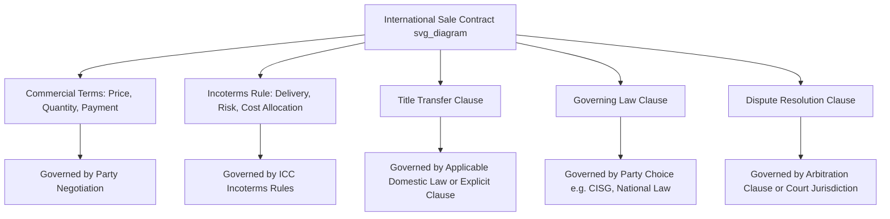

## Incoterms and Their Relationship to the Sales Contract

### Overview

Incoterms rules are frequently misunderstood as standalone contracts or as comprehensive regulators of the buyer-seller relationship. In reality, Incoterms are a narrow, technical component that must be incorporated into a broader contract of sale to have any legal effect. Understanding precisely what Incoterms do and do not govern is essential to drafting a legally complete international sale contract.

### How Incoterms Are Incorporated Into a Contract

- Incoterms rules have no independent legal force; they become binding only when the parties explicitly reference them within their sale contract, typically in the format: **[Incoterm] [Named Place] Incoterms® [Edition Year]** (e.g., "CIP Rotterdam Incoterms® 2020").
- The edition year is a critical component of correct incorporation. [Inference] Omitting the edition year can create interpretive disputes if a conflict arises over which edition's specific obligations apply, particularly given substantive differences like the CIF/CIP insurance split introduced in 2020.
- The "named place" is equally essential — it specifies precisely where delivery, risk transfer, or destination occurs. A term cited without a named place (e.g., simply "FOB" with no port specified) is incomplete and creates ambiguity that can lead to disputes.
- Parties may reference either the current 2020 edition or an earlier edition (e.g., 2010, 2000), and the ICC does not invalidate contracts using older editions provided the edition is explicitly cited.

### What Incoterms Rules Govern

**Key Points**

Incoterms rules address exactly three categories of obligation between buyer and seller:

1. **Delivery**: the specific point and manner in which the seller fulfills its obligation to deliver goods.
2. **Risk transfer**: the precise moment responsibility for loss or damage passes from seller to buyer.
3. **Cost allocation**: which party bears specific costs associated with transport, insurance, customs clearance, loading, and unloading.

### What Incoterms Rules Do NOT Govern

**Key Points**

The ICC explicitly states that Incoterms rules are silent on several matters that must be addressed elsewhere in the sale contract:

- **Transfer of ownership/title**: Incoterms do not determine when legal ownership of goods passes from seller to buyer — this is a separate matter typically governed by the applicable domestic law (e.g., the UCC in the United States, or the CISG for many international transactions) or by explicit contractual title-transfer clauses.
- **Price and payment terms**: Incoterms rules do not specify the purchase price, currency, payment method, or payment timing; these belong in the commercial terms of the sale contract.
- **Breach of contract and remedies**: Incoterms do not address what happens if either party breaches the contract (e.g., late delivery, non-conforming goods) or specify remedies such as damages, termination rights, or specific performance — these are matters of the governing contract law.
- **Governing law and dispute resolution**: Incoterms do not designate which country's law governs the contract, nor do they establish jurisdiction or arbitration procedures; these require separate clauses.
- **Existence or terms of the carriage or insurance contract**: while an Incoterm may specify who must arrange transport or insurance, it does not itself constitute or detail the carriage or insurance contract — a bill of lading, charter party, or insurance policy remains a separate legal instrument.
- **Consequences of a sanctions violation or export/import prohibition**: Incoterms address the general obligation to clear goods for export/import but do not address the contractual consequences if clearance becomes impossible due to sanctions or prohibitions.

### The Interlocking Relationship: A Layered View

- [Inference] A useful mental model is that Incoterms rules function as a "plug-in module" for the delivery, risk, and cost portion of a sale contract, while the remainder of the contract (or applicable background law) supplies title transfer, payment, remedies, and dispute resolution.
- A well-drafted international sale contract typically layers together:
  - **Commercial terms**: price, quantity, description of goods, payment method.
  - **Incoterms rule**: delivery point, risk transfer, cost allocation (via reference to a specific Incoterm and edition).
  - **Title transfer clause**: often tied to payment (e.g., retention of title until full payment) or to delivery, but this must be explicitly stated since Incoterms are silent on it.
  - **Governing law clause**: designates which country's law applies (e.g., CISG, English law, New York law).
  - **Dispute resolution clause**: arbitration (often referencing the ICC International Court of Arbitration) or litigation jurisdiction.

### Diagram: Incoterms as One Layer of the Sale Contract (svg_diagram)

### Example: Incomplete vs. Complete Contract Incorporation

**Example**

**Incomplete**: A contract states simply, "Terms: FOB." This is deficient because it lacks a named port and an edition year, and it says nothing about when title passes or which law governs disputes.

**Complete**: A contract states, "Delivery: FOB Shanghai, Incoterms® 2020. Title to the goods shall pass to Buyer upon Seller's receipt of full payment. This Agreement shall be governed by the laws of Singapore, and any dispute shall be resolved by arbitration under the ICC Rules of Arbitration, seat of arbitration Singapore." This version properly incorporates the Incoterm with its named place and edition, while separately addressing the matters Incoterms do not cover.

### Relationship to the CISG (UN Convention on Contracts for the International Sale of Goods)

- The CISG is a widely adopted international treaty governing formation and substantive rights/obligations in international sale contracts (applicable by default in many jurisdictions unless excluded by the parties).
- [Inference] Incoterms and the CISG are frequently used together and are complementary rather than conflicting: the CISG addresses matters like contract formation, conformity of goods, and remedies for breach, while Incoterms address the narrower logistics-focused matters of delivery, risk, and cost.
- Where a conflict could theoretically arise (e.g., CISG's default risk-transfer rules versus an Incoterm's risk-transfer rule), the explicitly incorporated Incoterms rule generally takes precedence as the parties' negotiated agreement, since the CISG itself permits parties to override its default provisions by contract.

### Common Misconceptions

- **Misconception**: Selecting an Incoterm determines when the buyer becomes the legal owner of the goods.

  **Clarification**: Incoterms govern risk of loss/damage, not title; title transfer must be addressed separately, often through explicit contract language or applicable domestic sales law.
- **Misconception**: An Incoterm reference alone is a complete and enforceable sale contract.

  **Clarification**: An Incoterm reference addresses only delivery, risk, and cost; a legally complete contract still requires price, payment terms, governing law, and typically a dispute resolution mechanism.
- **Misconception**: If goods are damaged after risk has transferred to the buyer per the Incoterm, the seller has no further liability.

  **Clarification**: [Inference] Risk transfer under Incoterms relates to *physical* loss or damage during transit, not to seller liability for *non-conforming* goods (e.g., defective products) discovered after delivery, which remains governed by the contract's conformity and warranty provisions or applicable sales law.

**Next Steps**

- The CISG and Its Interaction with Incoterms Rules
- Title Transfer Clauses in International Sale Contracts
- Governing Law and Dispute Resolution Clauses for Cross-Border Trade
- Drafting a Legally Complete International Sale Contract
- The Ten Articles of Obligation Framework
- Role of the International Chamber of Commerce