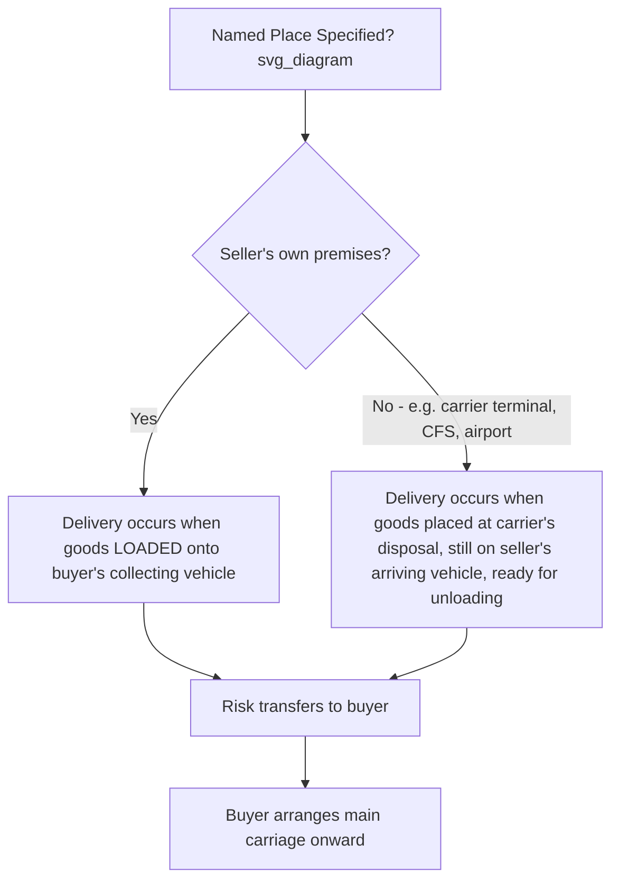

## FCA (Free Carrier)

### Overview

FCA (Free Carrier) requires the seller to deliver goods, cleared for export, to a carrier or another person nominated by the buyer at a named place. FCA is widely regarded as the most flexible and practically important rule in the "Any Mode of Transport" category, and since the 2020 edition, it includes a specific accommodation for on-board bill of lading issuance that addresses a long-standing gap in letter-of-credit transactions.

### Applicable Transport Mode

- FCA belongs to the "Any Mode or Modes of Transport" category and is commonly used for road, rail, air, and — increasingly — containerized sea freight, where it is frequently preferred over FOB.

### Key Points: Obligation Summary

- **Delivery point**: varies depending on the named place specified in the contract, and it materially affects the seller's loading obligation:
  - If the named place is the **seller's premises**, delivery occurs when goods are loaded onto the collecting vehicle arranged by the buyer.
  - If the named place is **any other location** (e.g., a carrier's terminal, container freight station, or airport), delivery occurs when goods are placed at the disposal of the carrier, still loaded on the seller's arriving means of transport and ready for unloading.
- **Risk transfer**: coincides with delivery — i.e., at the point of handover to the carrier as described above.
- **Export clearance**: the seller's responsibility, including licenses and export-related security clearances.
- **Import clearance**: the buyer's responsibility.
- **Carriage**: the buyer arranges and pays for carriage from the named place onward; the seller has no obligation to contract carriage (though the seller may do so at the buyer's request and risk if agreed).
- **Insurance**: neither party is obligated to insure under the rule itself.

### The 2020 On-Board Bill of Lading Accommodation

- **Key Points**
  - Prior to 2020, a documented friction point existed: sellers using FCA for sea freight (e.g., delivering containerized goods to a carrier at an inland terminal) had no straightforward means of obtaining an on-board bill of lading, because the goods had not yet been loaded onto the vessel at the point of FCA delivery.
  - This created problems for sellers needing an on-board bill of lading to satisfy letter-of-credit requirements from their bank, since many documentary credits require proof that goods have been loaded on board a vessel.
  - The Incoterms 2020 edition introduced an optional mechanism: buyer and seller may agree that the buyer will instruct the carrier to issue an on-board bill of lading to the seller after loading is complete, even though the FCA delivery point (and risk transfer) already occurred earlier, upon handover to the carrier.
  - [Inference] This provision does not change the risk-transfer point itself — risk still transfers upon handover to the carrier as under standard FCA — it merely creates a documentary mechanism allowing the seller to satisfy bank documentation requirements without altering the underlying commercial risk allocation.

### Article-by-Article Breakdown (Seller/Buyer)

| Article | Seller Obligation (A) | Buyer Obligation (B) |
| --- | --- | --- |
| 1. General Obligations | Provide goods and invoice per contract | Pay the price |
| 2. Delivery | Deliver to carrier/person nominated by buyer at named place | Take delivery once handed to nominated carrier |
| 3. Transfer of Risk | Ends at handover to carrier | Begins at handover to carrier |
| 4. Carriage | No obligation (may assist at buyer's request/risk) | Contract and pay for carriage from named place |
| 5. Insurance | No obligation | No obligation, but buyer bears transit risk exposure |
| 6. Delivery/Transport Document | Provide proof of delivery; assist with on-board B/L if agreed | Instruct carrier to issue on-board B/L to seller if agreed |
| 7. Export/Import Clearance | Handle export clearance | Handle import clearance |
| 8. Checking/Packaging/Marking | Package and mark goods appropriately | No standard obligation |
| 9. Allocation of Costs | Costs up to delivery to carrier, including export clearance | Costs from delivery onward, including carriage and import clearance |
| 10. Notices | Notify buyer that goods delivered to carrier | Notify seller of chosen carrier/named place |

### Diagram: FCA Delivery Point — Two Scenarios (svg_diagram)

### Example

An auto parts manufacturer in Germany sells to a buyer in the United States under "FCA Hamburg Container Terminal Incoterms® 2020." The seller trucks the containerized goods to the named terminal in Hamburg and hands them to the ocean carrier nominated by the buyer. At that moment, risk transfers to the buyer, even though the container has not yet been loaded onto the vessel. Because the seller's bank requires an on-board bill of lading to release payment under a letter of credit, the parties agree in advance that the buyer will instruct the carrier to issue an on-board bill of lading to the seller once the container is loaded — satisfying the bank's documentary requirement without shifting the risk-transfer point that already occurred at the terminal.

### FCA vs. FOB for Containerized Cargo

- [Inference] FCA is widely recommended over FOB for containerized ocean shipments because FOB's risk transfer is tied to loading on board the vessel — an event that occurs well after the seller has relinquished physical control of the goods at a container yard or terminal, creating a gap where the seller notionally bears risk for cargo it no longer controls.
- Under FCA, this gap is eliminated because risk transfers at the moment of handover to the carrier at the named place, aligning legal responsibility with physical control.

### When FCA Is Typically Used

- Containerized ocean freight, where FCA avoids the risk-transfer ambiguity associated with FOB.
- Air freight and multimodal shipments, where "on board a vessel" concepts under FOB/CIF do not apply.
- Transactions where the seller wants to retain control over export clearance (unlike EXW) while shifting main carriage arrangement and cost to the buyer.
- Letter-of-credit financed transactions requiring an on-board bill of lading, now accommodated by the 2020 edition's documentary mechanism.

### Common Misconceptions

- **Misconception**: FCA can only be used for road or air freight, not sea freight.

  **Clarification**: FCA is explicitly designed for any transport mode, including containerized sea freight, and is frequently recommended as the preferred alternative to FOB for such shipments.
- **Misconception**: The 2020 on-board bill of lading provision changes when risk transfers under FCA.

  **Clarification**: The provision only creates a documentary mechanism for issuing the bill of lading after loading; the risk-transfer point remains the moment of handover to the carrier, as under standard FCA rules.
- **Misconception**: The delivery point under FCA is always the same regardless of location.

  **Clarification**: The delivery/risk-transfer mechanics differ depending on whether the named place is the seller's own premises (delivery upon loading) versus any other location such as a carrier terminal (delivery upon placing goods at the carrier's disposal, still loaded, ready for unloading).

**Key Points**

- FCA requires the seller to deliver goods, export-cleared, to a carrier nominated by the buyer at a named place; applicable to any transport mode.
- Delivery/risk-transfer mechanics differ based on whether the named place is the seller's premises or another location.
- The 2020 edition added an optional on-board bill of lading mechanism to address letter-of-credit documentation needs without altering the risk-transfer point.
- FCA is the generally recommended alternative to FOB for containerized ocean freight due to more accurate risk-transfer alignment with physical control.

**Related Topics**

- FOB (Free On Board): Full Rule Breakdown
- FCA vs. FOB: Detailed Comparison for Containerized Cargo
- Letters of Credit and the On-Board Bill of Lading Requirement
- Export Clearance Responsibilities Across Incoterms Rules
- CPT (Carriage Paid To): Full Rule Breakdown
- The Ten Articles of Obligation Framework