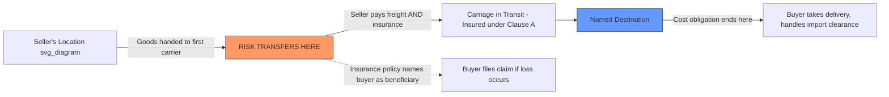

## CIP (Carriage and Insurance Paid To)

### Overview

CIP (Carriage and Insurance Paid To) requires the seller to contract for and pay carriage to a named destination, and additionally to procure cargo insurance for the buyer's benefit covering the transit risk. CIP shares identical delivery and risk-transfer mechanics with CPT, but adds a mandatory insurance obligation. The 2020 edition significantly increased CIP's minimum insurance coverage requirement, distinguishing it sharply from CIF, its sea/waterway-only counterpart.

### Applicable Transport Mode

- CIP belongs to the "Any Mode or Modes of Transport" category, suitable for road, rail, air, sea, or multimodal combinations.

### Key Points: Obligation Summary

- **Delivery/risk transfer point**: when goods are handed over to the first carrier contracted by the seller — identical mechanics to CPT.
- **Cost responsibility**: the seller pays for carriage to the named destination, despite risk having already passed to the buyer earlier in the journey (same cost/risk split as CPT).
- **Insurance obligation**: the seller must procure cargo insurance covering the goods from the point of delivery to at least the named destination, for the buyer's benefit.
- **Export clearance**: the seller's responsibility.
- **Import clearance**: the buyer's responsibility.

### The 2020 Insurance Coverage Change

- **Key Points**
  - Prior to the 2020 edition, CIP (like CIF) required only minimum insurance coverage under Institute Cargo Clauses (C) — a basic, named-perils coverage level.
  - Incoterms 2020 raised CIP's minimum required coverage to **Institute Cargo Clauses (A)**, the broadest standard "all risks" coverage level available under the London/Institute market clauses, subject to standard exclusions (e.g., inherent vice, war, strikes unless separately endorsed).
  - This change reflected the ICC's recognition that CIP is typically used for manufactured or higher-value goods (as opposed to CIF's typical use for bulk commodities), where broader insurance protection is commercially appropriate.
  - The parties may still agree to a different coverage level by explicit contract modification (either higher or lower than Clause A), but Clause A is now the default minimum absent such agreement.

### Article-by-Article Breakdown (Seller/Buyer)

| Article | Seller Obligation (A) | Buyer Obligation (B) |
| --- | --- | --- |
| 1. General Obligations | Provide goods and invoice per contract | Pay the price |
| 2. Delivery | Hand goods to first carrier | Take delivery from carrier at destination |
| 3. Transfer of Risk | Ends at handover to first carrier | Begins at handover to first carrier |
| 4. Carriage | Contract and pay for carriage to named destination | No obligation to contract carriage |
| 5. Insurance | Procure insurance at Institute Cargo Clauses (A) minimum, for buyer's benefit | No obligation, but should verify coverage adequacy |
| 6. Delivery/Transport Document | Provide transport document and insurance policy/certificate | Accept conforming documents |
| 7. Export/Import Clearance | Handle export clearance | Handle import clearance |
| 8. Checking/Packaging/Marking | Package and mark goods appropriately | No standard obligation |
| 9. Allocation of Costs | Costs up to and including carriage and insurance to named destination | Costs from arrival at destination onward, plus import duties |
| 10. Notices | Notify buyer of dispatch, delivery, and insurance details | Notify seller of any buyer-controlled requirements |

### Diagram: CIP Cost/Risk/Insurance Structure (svg_diagram)

### Example

A German machine tool manufacturer sells precision equipment to a buyer in Brazil under "CIP São Paulo Incoterms® 2020." The seller books and pays for multimodal carriage (truck to port, ocean freight, truck to São Paulo) and purchases an all-risks cargo insurance policy meeting Institute Cargo Clauses (A) coverage, naming the buyer as beneficiary. Risk transfers to the buyer as soon as the goods are handed to the first truck carrier in Germany. If the shipment is later damaged during ocean transit, the buyer — not the seller — files the insurance claim, since risk (and the right to claim under the policy) passed to the buyer at the original handover point, even though the seller purchased and paid for the policy.

### CIP vs. CIF: Why the Distinction Matters

| Feature | CIP | CIF |
| --- | --- | --- |
| Transport mode | Any mode | Sea/inland waterway only |
| Risk transfer point | Handover to first carrier | Goods on board the vessel |
| Minimum insurance (2020 edition) | Institute Cargo Clauses (A) — broad "all risks" | Institute Cargo Clauses (C) — basic named-perils |
| Typical cargo | Manufactured/higher-value goods | Bulk commodities |

- [Inference] The 2020 divergence in minimum insurance levels between CIP and CIF was a deliberate ICC policy choice reflecting differing commercial norms: bulk commodity trading (CIF) has long operated with minimum-coverage insurance as an accepted market practice, while manufactured goods buyers (CIP) generally expect and require broader protection given higher per-unit value and damage sensitivity.

### CPT vs. CIP: Choosing Between Them

- CPT and CIP share identical delivery and risk-transfer points; the sole substantive difference is CIP's mandatory insurance obligation.
- Buyers who already maintain a comprehensive corporate cargo insurance program may prefer CPT to avoid duplicate insurance costs; buyers without such coverage typically prefer CIP for the built-in protection.

### Common Misconceptions

- **Misconception**: Under CIP, the seller bears risk until the named destination because the seller pays for both carriage and insurance that far.

  **Clarification**: Risk transfers at handover to the first carrier, identical to CPT; the insurance and carriage payment obligations extending to destination do not change the risk-transfer point.
- **Misconception**: CIP and CIF provide the same level of insurance protection.

  **Clarification**: Since the 2020 edition, CIP requires a substantially higher minimum coverage level (Institute Cargo Clauses A) than CIF (Institute Cargo Clauses C), reflecting their differing typical cargo types.
- **Misconception**: The buyer can rely solely on the seller's insurance policy without reviewing its terms.

  **Clarification**: [Inference] Buyers are generally advised to review the actual policy or certificate provided, since exclusions, deductibles, or claims procedures under Institute Cargo Clauses (A) may still leave certain risks (e.g., war, strikes, unless separately endorsed) uncovered.

**Key Points**

- CIP requires the seller to pay for carriage to a named destination and procure cargo insurance for the buyer, while risk transfers earlier, at handover to the first carrier.
- Applicable to any transport mode; the 2020 edition raised minimum insurance coverage to Institute Cargo Clauses (A), the broadest standard level.
- CIP is typically used for manufactured/higher-value goods, contrasting with CIF's typical use for bulk commodities under lower minimum coverage.
- The buyer, not the seller, holds the right to claim under the insurance policy once risk has transferred, despite the seller having purchased it.

**Related Topics**

- CPT (Carriage Paid To): Full Rule Breakdown
- CIF (Cost, Insurance, and Freight): Full Rule Breakdown
- Institute Cargo Clauses Explained: A, B, and C Coverage Levels
- CIF vs. CIP: Insurance Coverage Requirements Explained
- Filing a Cargo Insurance Claim: Buyer's Process Under C-Terms
- The Four Incoterms Groups: E, F, C, and D