## CFR (Cost and Freight)

### Definition

CFR (Cost and Freight) is an Incoterms 2020 rule applicable exclusively to sea and inland waterway transport. Under CFR, the seller must pay the costs and freight required to bring the goods to the named port of destination, but the risk of loss or damage to the goods, as well as any additional costs due to events occurring after the goods have been delivered on board the vessel, transfers from seller to buyer when the goods are on board the vessel at the port of shipment.

### Key Points

- **Transport modes**: Sea and inland waterway transport only. Not suitable for containerized cargo delivered to a container terminal before loading (FCA/CPT are more appropriate there), since risk transfer is tied to the goods being on board the vessel.
- **Risk transfer point**: When the goods are placed on board the vessel at the port of shipment — not at the destination port.
- **Cost transfer point**: Seller pays cost and freight to the named port of destination; costs after risk transfer (e.g., costs arising from events after loading) fall to the buyer even though the seller is still paying freight.
- **Two critical points, not one**: CFR splits risk and cost at different locations — risk passes at origin (on board), cost of carriage is borne by seller to destination. This divergence is a hallmark of the "C" group of Incoterms (CFR, CIF, CPT, CIP).
- **Insurance**: Not mandatory for the seller under CFR (unlike CIF). Buyer typically arranges own marine insurance to cover the goods from the point of risk transfer.
- **Export/import formalities**: Seller handles export clearance; buyer handles import clearance, duties, and taxes.
- **Named point required**: Must always be qualified with a named port of destination, e.g., "CFR Rotterdam."

### Seller Obligations

- **Delivery**: Deliver goods on board the vessel nominated by the seller (or procure goods so delivered) at the port of shipment.
- **Contract of carriage**: Contract for carriage from the port of shipment to the named port of destination, on usual terms, at seller's own expense.
- **Export clearance**: Obtain export licenses and complete export customs formalities.
- **Loading costs**: Bear costs of loading goods on board.
- **Freight**: Pay freight charges to the named port of destination.
- **Documents**: Provide the buyer with the usual transport document (e.g., bill of lading) enabling the buyer to claim goods from the carrier or sell goods in transit.
- **Notice**: Give the buyer sufficient notice that goods have been delivered on board, and any notice needed to allow the buyer to take measures to receive goods.
- **Packaging and marking**: Provide packaging appropriate for transport, unless otherwise agreed.

### Buyer Obligations

- **Payment**: Pay the price as agreed in the sales contract.
- **Import clearance**: Handle import licenses, customs clearance, and pay import duties/taxes.
- **Risk from loading**: Bear all risks of loss or damage from the point goods are on board the vessel.
- **Costs after risk transfer**: Bear costs arising after delivery, including unloading costs at destination unless already included in the freight contract.
- **Insurance**: Arrange and pay for own insurance (not obligatory under the rule, but commercially prudent).
- **Destination handling**: Receive goods from the carrier at the named port and arrange onward transport if required.

### Cost and Risk Transfer Diagram (svg_diagram)

<svg xmlns="http://www.w3.org/2000/svg" viewBox="0 0 800 260">
<text x="400" y="24" text-anchor="middle" font-size="16" font-weight="bold" fill="#1a1a1a">CFR Cost vs Risk Transfer (svg_diagram)</text>
<line x1="60" y1="140" x2="740" y2="140" stroke="#333" stroke-width="2" />
<circle cx="120" cy="140" r="6" fill="#333" />
<text x="120" y="165" text-anchor="middle" font-size="12">Seller's Premises</text>
<circle cx="300" cy="140" r="6" fill="#c0392b" />
<text x="300" y="165" text-anchor="middle" font-size="12">Port of Shipment</text>
<text x="300" y="182" text-anchor="middle" font-size="12">(On Board Vessel)</text>
<circle cx="620" cy="140" r="6" fill="#2980b9" />
<text x="620" y="165" text-anchor="middle" font-size="12">Named Port</text>
<text x="620" y="182" text-anchor="middle" font-size="12">of Destination</text>
<line x1="120" y1="100" x2="300" y2="100" stroke="#c0392b" stroke-width="4" />
<line x1="300" y1="100" x2="620" y2="100" stroke="#c0392b" stroke-width="4" stroke-dasharray="6,4" />
<text x="210" y="90" text-anchor="middle" font-size="12" fill="#c0392b">Seller Risk</text>
<text x="460" y="90" text-anchor="middle" font-size="12" fill="#2980b9">Buyer Risk</text>
<line x1="120" y1="210" x2="620" y2="210" stroke="#27ae60" stroke-width="4" />
<text x="370" y="200" text-anchor="middle" font-size="12" fill="#27ae60">Seller Pays Cost &amp; Freight</text>
<text x="370" y="230" text-anchor="middle" font-size="12" fill="#555">(to named port of destination)</text>
<line x1="300" y1="115" x2="300" y2="165" stroke="#c0392b" stroke-width="1" stroke-dasharray="3,3" />
<text x="300" y="55" text-anchor="middle" font-size="11" fill="#c0392b">Risk Transfer Point</text>
</svg>

### Process Flow

```mermaid
flowchart LR
    A[Seller: Manufacture & Pack Goods] --> B[Seller: Export Customs Clearance]
    B --> C[Seller: Deliver Goods on Board Vessel at Port of Shipment]
    C -->|Risk Transfers to Buyer Here| D[Seller: Contracts & Pays Freight to Destination Port]
    D --> E[Sea Transit]
    E --> F[Goods Arrive at Named Port of Destination]
    F --> G[Buyer: Import Customs Clearance]
    G --> H[Buyer: Receives Goods & Arranges Onward Transport]

    style C fill:#f9d5d3,stroke:#c0392b
    style D fill:#d6eaf8,stroke:#2980b9
```

### Example

A seller in Shanghai sells 500 units of machinery components to a buyer in Hamburg under terms "CFR Hamburg, Incoterms 2020." The seller books space on a vessel, loads the goods on board at Shanghai port, pays freight to Hamburg, and hands the buyer the bill of lading. Risk transfers to the buyer the moment the goods are on board at Shanghai — if the vessel encounters a storm and cargo is damaged mid-voyage, the buyer bears that loss (typically recoverable via the buyer's own cargo insurance), even though the seller is still contractually paying for the freight to Hamburg.

### CFR vs Related Terms

| Term | Risk Transfer | Insurance Obligation (Seller) | Transport Mode |
| --- | --- | --- | --- |
| CFR | On board vessel at port of shipment | Not required | Sea/inland waterway only |
| CIF | On board vessel at port of shipment | Required (minimum cover, Institute Cargo Clauses C) | Sea/inland waterway only |
| CPT | On handing to first carrier | Not required | Any mode |
| CIP | On handing to first carrier | Required (Institute Cargo Clauses A, all-risk) | Any mode |
| FOB | On board vessel at port of shipment | Not required | Sea/inland waterway only |

### Common Pitfalls

- **Using CFR for containerized cargo**: Containers are usually handed to the carrier at a container yard/terminal before loading, not "on board." This creates a mismatch between the contractual risk point and physical handover point. FCA or CPT is the recommended alternative per ICC guidance.
- **Confusing cost and risk transfer points**: Parties sometimes mistakenly assume risk transfers at destination since seller pays freight there — it does not.
- **Assuming seller must insure**: Unlike CIF, CFR imposes no insurance obligation on the seller. Buyers who fail to independently insure the cargo bear uninsured risk during transit.
- **Unloading cost disputes**: If the freight contract includes unloading charges, disputes can arise over whether these are already covered in the price paid by seller or must be separately borne by buyer at destination.

[Inference] In practice, many shippers still use CFR for containerized trade due to established habit and documentary/banking familiarity (e.g., letters of credit referencing CFR), despite ICC's stated preference for CPT in such cases.

**Related Topics**

- CIF (Cost, Insurance and Freight)
- FOB (Free On Board)
- CPT (Carriage Paid To)
- Bill of Lading as a transport/title document
- Marine cargo insurance and Institute Cargo Clauses (A/B/C)
- Transfer of risk vs. transfer of title in international sales law